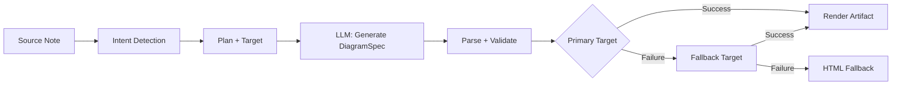
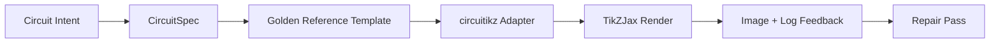

import TLDR from '@site/src/components/TLDR';

# Diagramy

<TLDR>
**Notemd vytváří diagramy z vašich poznámek prostřednictvím pipeline založeného na specifikaci.** LLM vytváří renderer-nezávislý `DiagramSpec` JSON, poté specializované adaptéry jej převádějí na Mermaid, JSON Canvas, Vega-Lite, HTML nebo upravitelný výstup HTML/SVG. Podporuje 8 typů záměrů, automatické řetězce náhrad, živou náhledovou funkci s exportem do SVG/PNG, sémantickou ověřovací funkci a generování rozšířené o místní znalosti.
</TLDR>

Toto je součástí [Obsidian Průvodce AI pro správu znalostí](/docs/pillar-ai-knowledge).

## Architektura: Pipeline založený na specifikaci

Notemd nikdy nežádá LLM, aby vytvořil syntaxi Mermaid/Vega/Canvas přímo. Místo toho:



**Proč architektura založená na specifikaci?** LLM často vytvářejí neplatnou syntaxi určenou k renderování (zejména Mermaid). Strukturovaný `DiagramSpec` lze ověřit před renderováním a stejná specifikace může sloužit jako záloha pro více rendererů.

## Podporované typy diagramů

| Záměr | Hlavní renderer | Náhrady | Použití |
|--------|-----------------|-----------|----------|
| `mindmap` | Mermaid | HTML | Hierarchické rozdělení témat |
| `flowchart` | Mermaid | HTML | Procesní toky, rozhodovací stromy |
| `sequence` | Mermaid | HTML | Interakce klienta a serveru, protokoly |
| `classDiagram` | Mermaid | HTML | Vztahy mezi třídami OOP |
| `erDiagram` | Mermaid | HTML | Schémata databází, vztahy entit |
| `stateDiagram` | Mermaid | HTML | Stroje stavů, modely životního cyklu |
| `canvasMap` | JSON Canvas | Mermaid → HTML | Konceptuální mapy, znalostní grafy |
| `dataChart` | Vega-Lite | Mermaid → HTML | Sloupcové, čarové, plošné, rozptylové, kruhové, tabulkové grafy |

## Detekce záměru

Notemd odhadne nejlepší typ diagramu na základě obsahu vaší poznámky pomocí hodnocení klíčových slov:

| Záměr | Spouštěče | Důvěryhodnost |
|--------|----------|------------|
| `dataChart` | Tabulky, číselné buňky, klíčová slova pro metriky/trendy, procenta | 0.88 |
| `sequence` | Slovník požadavků/odpovědí (4+ shody) nebo značky `->`/`=>` | 0.82 |
| `erDiagram` | Primární klíč, cizí klíč, entita, schéma (2+ shody) | 0.80 |
| `stateDiagram` | Stav, přechod, čekající, běžící, selhalo (3+ shody) | 0.76 |
| `flowchart` | Číslované kroky (2+) nebo slovník if/then/else/workflow | 0.74 |
| `canvasMap` | Konceptuální mapa, graf znalostí, prostorový, shluk | 0.72 |
| `mindmap` | Výchozí náhradní režim | 0.55 |

Přepsat pomocí nastavení **Preferovaný typ diagramu**, výběru v postranním panelu nebo explicitní volby z palety příkazů.

## Výběr cíle renderování

Experimentální pipeline založený na specifikacích nyní má dva nezávislé ovladače:

| Ovladač | Nastavení | Účinek |
|---------|---------|--------|
| Preferovaný typ diagramu | `preferredDiagramIntent` | Určuje sémantickou formu generovaného `DiagramSpec` |
| Preferovaný cíl renderování | `preferredDiagramRenderTarget` | Vybírá renderer artefaktu pro **Vytvořit diagram** a **Náhled diagramu** |

Nastavte **Preferovaný cíl renderování** na **Auto** jako výchozí hodnotu pro plánovač, nebo zvolte explicitně Mermaid, JSON Canvas, Vega-Lite, HTML nebo Editable HTML/SVG. Toto přepsání se vztahuje pouze na příkazy týkající se artefaktů a náhledů. Standardní příkaz **Shrnutí do diagramu Mermaid** zůstává vázán na výstup kompatibilní s Mermaid, aby stávající pracovní postupy s Markdownem nezměnily formát bez upozornění.

Toto oddělení je důležité, protože záměr `flowchart` může být nyní renderován jako Mermaid pro poznámky v Markdownu, jako HTML pro spolehlivou náhradu nebo jako Editable HTML/SVG pro další úpravy. Draw.io a Drawnix zůstávají exportéry artefaktů typu CLI místo renderovacích cílů uvnitř pluginu.

## Použití

### Vytvořit diagram

1. Otevřete poznámku
2. Spusťte **"Notemd: Vytvořit diagram"** z palety příkazů
3. Notemd rozpozná záměr, vytvoří specifikaci, renderuje a uloží artefakt

**Soubory výstupu podle cíle:**

| Cíl | Rozšíření | Vzor názvu souboru |
|--------|-----------|------------------|
| Mermaid | `.md` | `{note}_summ.md` |
| JSON Canvas | `.canvas` | `{note}_diagram.canvas` |
| Vega-Lite | `.json` | `{note}_diagram.json` |
| HTML | `.html` | `{note}_diagram.html` |
| Upravitelné HTML/SVG | `.html` | `{note}_diagram.html` |

### Náhled diagramu

1. Spustit **"Notemd: Náhled diagramu"**
2. Otevře se modální okno s vykresleným diagramem
3. Exportovat jako SVG nebo PNG pomocí tlačítek na panelu nástrojů

**Automatické otevření náhledu** je k dispozici v nastaveních — po generování se modální okno s náhledem spustí automaticky.

Modální okno s náhledem má také panel diagnostiky artefaktů. Renderery a kontrolní testy mohou přidat `RenderArtifact.diagnostics`; okno zobrazuje souhrnnou zprávu s počty chyb/warning/info, poté závažnost, typ diagnostiky, zprávu a doporučení k opravě vedle náhledu. Stejný souhrn se zobrazuje v záznamech historie náhledů, takže lze porovnat opakované pokusy circuitikz bez otevírání každého záznamu. U artefaktů, které mají zdrojový obsah, ale nemohou být vykresleny inline nebo prostřednictvím cesty HTML iframe, se nyní modální okno přepne na náhled pouze ze zdroje místo nutnosti prázdného iframe. To umožňuje circuitikz kontrolu kompilace/vykreslování, SVG kontroly textových tokenů, kontroly prázdných snímků PNG a budoucí zprávy o překrytech s viditelným UI povrchem, aniž by se TikZJax nebo LaTeX staly povinnou závislostí během provozu pluginu nebo se předstíralo, že zdrojový text je ověřené vizuální vykreslení.

### Režim staré verze Mermaid

Když je `enableExperimentalDiagramPipeline` vypnuté, Notemd odešle přímou žádost Mermaid na LLM. Tím se zcela obejde specifický procesní řetězec. Pokud experimentální proces selže, přejde se do tohoto režimu.

## Výkonné prostředí pro vykreslování

### Mermaid

6 adaptérů (mindmap, flowchart, sequence, ER, class, state) převádí `DiagramSpec` na syntaxi Mermaid. Po generování `mermaid.parse()` ověřuje výstup. Pokud ověření selže:

1. **Opakovat LLM** — jeden pokus s chybovou zprávou Mermaid jako kontextem
2. **Minimální náhrada** — jednoduchý diagram Mermaid z ID uzlů specifikace

**Legacy Mermaid Fixer** automaticky opravuje běžné chyby syntaxe LLM: normalizaci direktiv note, escape označení pipe-label, přesunování středníků, chytré uvozovky, šipky se dvojitými drahami, nesrovnalosti tvarů a mnoho dalšího.

### JSON Canvas

Vytváří formát Obsidian JSON Canvas s prostorovou rozvržeností:
- Uzly jsou umístěny podle hloubky (x = hloubka × 420) a indexu (y = index × 170)
- Šířka se odhaduje na základě délky nápisu
- Hrany s `fromSide: 'right'`, `toSide: 'left'`, `toEnd: 'arrow'`

### Vega-Lite

Vytváří kompletní specifikace Vega-Lite v5 JSON s automatickým kódováním:
- **Kartézské grafy** (sloupcové/liniové/plošné/bodové/rozptylové): kanály x + y spolu s barvou pro více řad
- **Kruhový graf**: theta = y (kvantitativní), barva = x (nominální)
- **Tabulka**: řádek = x, text = y + sloupec = řada

Před kompilací se tematické patche tmavé a světlé verze hluboce sloučí.

### HTML

Univerzální náhradní řešení. Samostatný dokument HTML s:
- Meta záhlavími CSP
- Režim světlo/tma prostřednictvím `prefers-color-scheme`
- Lokalizované nápisy UI pro 20 jazykových lokalit
- Sekce: hlavní obraz, struktura (strom uzlů), vztahy, poznámky, tabulky datových řad

### Upravitelný HTML/SVG

Výslovný cíl pro grafické zobrazení v pracovních postupech určených k úpravám. Převádí `DiagramSpec` do deterministického `SemanticFigureModel` a poté vytváří samostatný dokument HTML s vloženými skupinami SVG, které obsahují poznámky ve stylu Draw.io:

- `data-drawio-type`, `data-drawio-id` a `data-drawio-role` na sémantických uzlech
- `data-drawio-source` a `data-drawio-target` na sémantických hranicích
- stabilní identifikátory uzlů/hranic po normalizaci mezer a zpracování kolizí
- žádné skripty, žádné externí písma a žádné vzdálené soubory

Tento cíl záměrně zatím není výchozí trasou plánovače. Je k dispozici jako výslovný cíl pro zobrazení, dokud se neprokáže chování úprav v reálných nástrojích.

### Draw.io a Drawnix Hranice exportu

Současná implementace udržuje podporu třetích stran v rámci hranic artefaktu:

| Cíl | Smlouva | Závislost na běhu |
|--------|----------|--------------------|
| Draw.io | deterministický nekomprimovaný `mxfile` XML z `SemanticFigureModel` | žádné v běhu pluginu ani v CI |
| Drawnix | minimální podmnožina `.drawnix` JSON pomocí prvků `geometry` a `arrow-line` | žádné v běhu pluginu ani v CI |

Tato kompromisní volba je záměrná: Notemd může ověřit viditelné nápisy, stabilní ID a podporovanou pokrytí primitivů, aniž by do pluginu začlenil diagram.net Desktop, Drawnix, Plait nebo stav editoru určený pouze pro prohlížeč.

### circuitikz / TikZJax Směr

Schémy obvodů nejsou stejný problém jako obecné diagramy toku. Správný syntaxový cíl pro elektrické obvody je obvykle **circuitikz**, který je v Obsidian renderován pomocí pluginů, jako je TikZJax. TikZJax může načíst balíčky jako `circuitikz`, `pgfplots`, `tikz-cd` a `chemfig`, což ho činí atraktivním pro poznámky z fyziky, obvodů, chemie a matematiky.

Riziko spočívá v tom, že surový TikZ vygenerovaný pomocí LLM je křehký:

- komplexní topologie obvodu může být elektricky správná, ale vizuálně nečitelná;
- překrývající se dráty a popisky mohou učinit správný netlist nepoužitelným pro studijní poznámky;
- chybějící úvodní části balíčků, nesprávné kotvy nebo neplatná jména součástek mohou zabránit renderování;
- zpětná vazba od rendereru je obvykle na úrovni obrázku, zatímco LLM generuje geometrii na úrovni textu.

Lepší architektura spočívá v tom považovat circuitikz za omezený cíl diagramu, nikoli za volně tvarovaný prompt:



Prvotřídní model by měl popisovat topologii obvodu a rozložení odděleně:

| Vrstva | Odpovědnost | Příklad |
|-------|----------------|---------|
| Topologie | elektrické uzly a spojení součástek | `VDD -> RD -> drain(M1)`, `source(M1) -> GND` |
| Rozložení | umístění v mřížce, orientace, trasy | `M1 at (3,2.2)`, vstup vlevo, výstup vpravo |
| Styl | balíček, konvence napětí, štítky, kotvy | `\begin{circuitikz}[american voltages]` |
| Validace | protokol kompilace, chybějící kotvy, kontroly překrytí/obrázků | TikZJax/Diagnostika LaTeXu spolu s vizuální revizí |

### Aktuální prototyp circuitikz

Notemd nyní zahrnuje první omezený prototyp repozitáře pro tuto směr. Je záměrně offline a vázán na šablonu:

```bash
npm run diagram:export-circuitikz -- --input cmos-inverter.json --output cmos-inverter.tex
```

Prototyp přidává samostatnou hranici `CircuitSpec` a deterministického exportéra pro šest rodin zlatých referencí:

| Druh obvodu | Zlatá referenční hodnota | Záruka proudu |
|--------------|------------------|-------------------|
| `common-source-amplifier` | `common-source-nmos-v1` | validuje `VDD -> R_D -> M1.D`, `vin -> M1.G`, `M1.S -> GND` a `M1.D -> vout` před zápisem do LaTeXu |
| `cmos-inverter` | `cmos-inverter-v1` | validuje topologii PMOS-over-NMOS, sdílený vstup brány, sdílený výstup drainu, `VDD -> MP.S` a `MN.S -> GND` před zápisem do LaTeXu |
| `cmos-buffer` | `cmos-buffer-v1` | validuje dvě kaskádové stupně inverzních obvodů, mezilehlý uzel `vmid`, obnovený `vout` a sdílené vodiče VDD/GND před zápisem do LaTeXu |
| `cmos-transmission-gate` | `cmos-transmission-gate-v1` | validuje paralelní zařízení PMOS/NMOS mezi `vin` a `vout` s komplementárními ovladači `phib` / `phi` před zápisem do LaTeXu |
| `cmos-nand2` | `cmos-nand2-v1` | ověřuje paralelní PMOS pull-up, sériový NMOS pull-down, dvojí vstupy `va` / `vb` a `vout` před zápisem do LaTeXu |
| `cmos-nor2` | `cmos-nor2-v1` | ověřuje sériový PMOS pull-up, paralelní NMOS pull-down, dvojí vstupy `va` / `vb` a `vout` před zápisem do LaTeXu |

Toto zatím není obecný generátor TikZ. Nepřekládá LaTeX, nevolá TikZJax, nekontroluje snímky obrazovky ani neprovádí automatickou opravu na základě obrázků. Tyto funkce zůstávají pro pozdější verze.

Příkaz Preview diagram umožňuje přímo znovu otevřít uložené artefakty zdroje circuitikz, pokud je přípona souboru `.tex` nebo `.tikz` a zdroj obsahuje `\usepackage{circuitikz}` nebo `\begin{circuitikz}`. Tato cesta je preview pouze ze zdroje circuitikz: modální okno zobrazuje zdroj, diagnostiku, ovládací prvky pro kopírování/ukládání a metadaty historie, ale nepřekládá LaTeX ani nevolá TikZJax během provozu pluginu.

Stejná hranice preview pouze ze zdroje nyní pokrývá uložené artefakty Draw.io a Drawnix. Soubory `.drawio` jsou přijímány, pokud vypadají jako Draw.io XML (`mxfile` nebo `mxGraphModel`), a soubory `.drawnix` jsou přijímány, pokud jsou Drawnix JSON s `type: "drawnix"` a maticí `elements`. Plugin stále nezačleňuje diagrams.net ani hostitelské prostředí Drawnix; tyto previewy zobrazují zdroj, diagnostiku a historii artefaktů bez použití vizuálního editoru uvnitř pluginu.

Pro opravu s zachováním topologie předejte specifikaci před opravou jako referenci předtím, než přijmete opravený kandidát:

```bash
npm run diagram:export-circuitikz -- --input repaired-cmos-inverter.json --topology-reference cmos-inverter.json --output cmos-inverter.tex
```

Ochranný mechanismus opravy používá `createCircuitTopologySignature` a `assertCircuitTopologyUnchanged` k porovnání `circuitKind`, `goldenReferenceId`, sítí, identifikátorů komponent/typů/konektorů a neorientovaných konců spojení před výstupem. Označení, název textu, nápovědy k rozložení, pořadí spojení a označení spojení jsou záměrně ignorovány. Kandidát, který přidá krátký prvek nebo přepojí konektor, selže s chybou `Circuit topology drift detected` ještě před zápisem souboru `.tex`.

CLI nyní dokáže analyzovat existující soubor s výstupem LaTeX/TikZJax bez spuštění kompilátoru:

```bash
npm run diagram:export-circuitikz -- --input cmos-inverter.json --output cmos-inverter.tex --compile-log cmos-inverter.log --diagnostics-output cmos-inverter.diagnostics.json
```

Tato diagnostická cesta hlásí chybějící balíčky, jako je `circuitikz.sty`, neznámé klíče TikZ/circuitikz, chyby v syntaxi cesty TikZ, například chybějící středníky, neukončené argumenty z nevyvážených závorek nebo neukončených označení, nedefinované řídicí sekvence, obecné chyby LaTeXu, nouzové zastavení a varovné upozornění na přeplnění `\hbox`. Zůstává založeno na protokolu: místní spouštění LaTeXu/TikZJax a mechanismy pro kvalitu snímků obrazovky jsou stále samostatnými budoucími úkoly.

Pro kontrolu udržovatelů může stejný CLI volitelně spustit výslovně konfigurovaného renderera bez analýzy příkazů shellu:

```bash
npm run diagram:export-circuitikz -- --input cmos-inverter.json --output cmos-inverter.tex --compile-executable pdflatex --compile-arg -interaction=nonstopmode --compile-arg -halt-on-error --compile-arg -output-directory={outputDir} --compile-arg {tex} --expected-artifact {outputDir}/{jobName}.pdf
```

Spouštěč kompilace používá `shell: false`, rozšiřuje placeholdery `{tex}`, `{outputDir}` a `{jobName}` na hodnoty pole argumentů, čte vytvořený soubor `{jobName}.log` a vrací `compileExecution` spolu s `compileDiagnostics` v výstupu CLI JSON. `--compile-executable` je pouze cesta bináře renderera nebo obalu; parametry renderera patří do opakovaných hodnot `--compile-arg`. Prázdné spustitelné soubory selžou jako `compile-executable-invalid`, chybějící bináře selžou jako `compile-executable-not-found` a řetězce spustitelných souborů ve tvaru příkazů shellu dostanou doporučení rozdělit argumenty, aby Windows, Linux a macOS dodržovaly stejnou smlouvu o přímém spuštění. S `--expected-artifact` také hlásí `compileExecution.renderSmoke` a selže při CLI, pokud renderer nevytvoří nenulový artefakt. Stále nezačleňuje LaTeX, nečiní z TikZJax závislost provozu pluginu ani neprovádí vizuální opravu na úrovni snímků obrazovky.

Pokud je očekávaným artefaktem `.svg`, kontrola udržovatelů jde o jeden stupeň hlouběji:

```bash
npm run diagram:export-circuitikz -- --input cmos-inverter.json --output cmos-inverter.tex --compile-executable dvisvgm --compile-arg ... --expected-artifact {outputDir}/{jobName}.svg --expected-svg-text v_{in} --expected-svg-text v_{out}
```

SVG kontrola ověřuje kořen `<svg>`, kladné rozměry nebo `viewBox`, alespoň jeden viditelný výkresový prvek po vyloučení skrytých/průhledných prvků, jakékoli požadované textové tokeny, zjevné prvky mimo `viewBox`, zjevně překrývající se umístěné označení `<text>` / `<tspan>` a zjevně textová označení překrývající výkresové prvky prostřednictvím `render-svg-label-overlap`. Očekávaný text je hledán ve viditelném textu a dekódovány jsou metadaty dostupnosti, jako je `aria-label`, `<title>` a `<desc>`, takže renderery, které zachovávají sémantická označení mimo viditelný `<text>`, mohou stále splnit kontrolu textových tokenů bez potřeby OCR. Geometrická fáze je nyní geometrií citlivou na transformace pro běžné atributy skupin a prvků `transform`, takže přeložené, zmenšené, otočené, zkreslené nebo maticově transformované boxy SVG jsou kontrolovány po kompozici transformací. Pokrývá přesné hranice kruhů pro extrémy kruhů A/a, přesné hranice křivek Bezier pro extrémy křivek C/S/Q/T, hranice SVG citlivé na šířku tahu a kontroly překrytí označení, geometrii kreslení `polyline` / `polygon` a také řeší umístění glyfů pouze z cesty `<use href="#...">`, takže označení převedená na znovupoužitelné glyfické cesty mohou stále selhat při kontrole ohraničeného plátna, pokud geometrie umístěného glyfu překročí `viewBox`. Více umístěných označení `tspan` pod jedním rodičem `<text>` je porovnáváno jako samostatné boxy označení, což zachycuje výstup ve stylu LaTeX SVG, který by jinak sloučil odlišná označení do jednoho textového uzlu. Umístěné boxy SVG `text` a `tspan` respektují hodnoty `text-anchor` `start`, `middle` a `end`, takže centrovaná a vpravo zarovnaná označení mohou spustit diagnostiku překrytí textu/textu a označení versus výkresu, aniž by bylo nutné používat rozvržení textu na úrovni prohlížeče. Glyfické cesty definované pouze pro účely definice uvnitř `<defs>` nejsou počítány jako viditelné výkresové prvky, ale jejich vlastní atributy lokální definice `transform` jsou aplikovány před umístěním `<use>`, takže zmenšené nebo zrcadlené definice glyfů nejsou podpočítávány. Kontrola označení versus výkres používá malou toleranci pro výkresové boxy a deklarované `stroke-width`, takže tenké dráty, tlusté dráty a polygonální obrysy komponent mohou být považovány za potenciální selhání čitelnosti označení, pokud jejich viditelný tah dosáhne označení. Glyfická označení pouze z cesty `<use href="#...">` jsou také porovnávána s výkresovými boxy a selžou s chybou `render-svg-path-glyph-overlap`, pokud znovupoužitelná geometrie glyfu překryje dráty nebo komponenty. Pokud renderer převádí označení na znovupoužitelné glyfické cesty místo vyhledatelných `<text>` a nezachovává metadaty dostupnosti, zpráva o kontrole udržovatelů zaznamenává `pathOnlyGlyphUseCount` a selže u požadovaného textového tokenu prostřednictvím `render-svg-text-path-only`, místo aby předstírala, že označení je jednoduše chybějící. Ostatní selhání jsou hlášena prostřednictvím `render-svg-invalid`, `render-svg-dimension-missing`, `render-svg-no-visible-elements`, `render-svg-text-missing`, `render-svg-out-of-bounds`, `render-svg-text-overlap`, `render-svg-label-overlap` nebo `render-svg-path-glyph-overlap`. Kontroly textových tokenů a překrytí by měly být považovány pouze za strukturální kontrolu u rendererů, které zachovávají označení jako vyhledatelný text SVG nebo metadaty dostupnosti; výstup pouze z cesty SVG stále potřebuje pozdější kontrolu snímku obrazovky/OCR k prokázání čitelnosti vizuálních označení a tato kontrola udržovatelů stále neklade nárok na plné pokrytí cesty SVG.

Skryté skupiny a prvky SVG jsou konzistentně přeskakovány během počítání viditelných prvků a sběru geometrie. Atributy nebo inline styly `display:none`, `visibility:hidden`, `visibility:collapse` a celkový styl `opacity:0` nemohou zajistit, aby jinak prázdný výstup renderingu prošel kontrolou viditelného výstupu.

Glyfické definice pouze z cesty mohou být přímé cesty nebo skupinované/symbolové kontejnery uvnitř `<defs>`. Kontrola udržovatelů řeší geometrii dceřiných cest z `<g id="...">` a `<symbol id="...">` před umístěním `<use>`, takže výstup obalených glyfů stále naplňuje požadavky `pathOnlyGlyphUseCount`, kontrol ohraničeného plátna a `render-svg-path-glyph-overlap`.

Parser cesty také sleduje začátky podcest a resetuje aktuální bod na `Z/z`, takže relativní příkazy po uzavřené podcestě pokračují z správného bodu SVG místo vytváření falešných diagnostik `render-svg-out-of-bounds`.

Stejný průchod geometrií se řídí gramatikou SVG pro desetinná čísla s předchozím tečkou a výslovné plus znaménko, takže kompaktní souřadnice dvisvgm jako `.5`, `-.5` nebo `+.5` zůstávají zlomkové během kontrol hranic místo toho, aby se staly falešně mimo hranice geometrie nebo byly přeskočeny.

Pokud renderer vydá `.png`, stejná cesta očekávaného artefaktu se stane prvním snímkem k ověření: Notemd dekóduje neinterlaced 1/2/4/8-bitové PNG s indexovanou barvou, 1/2/4/8/16-bitové PNG v šedé stupnici a 8/16-bitové PNG v šedé stupnici s alfa/RGB/RGBA kanály. Obrázky s indexovanou barvou a sub-byte šedou stupnicí podporují komprimované vzorky; obrázky s indexovanou barvou také podporují PLTE a volitelná data tRNS; obrázky v šedé stupnici/RGB podporují průhledné vzorky tRNS. 16-bitové přímé vzorky jsou normalizovány do stejného 8-bitového prostoru srovnání RGBA používaného k ověření. Ověření kontroluje kladné rozměry, zaznamenává hranice popředí jako `foregroundBounds`, zaznamenává hustotu popředí uvnitř této oblasti jako `foregroundDensity`, selže s `render-png-blank`, když každý viditelný pixel odpovídá barvě pozadí v levém horním rohu, selže s `render-png-content-clipped`, když obsah popředí dosahuje hranic obrázku, selže s `render-png-foreground-too-small`, když velký snímek má méně než čtyři pixely popředí, a selže s `render-png-foreground-dense`, když jsou pixely popředí neobvykle husté uvnitř nesnadné oblasti. Nepodporované formáty PNG selžou s `render-png-unsupported` a jsou uvedeny specifické pokyny pro Adam7 interlaced PNG nebo nepodporované hloubky barev indexované barvy. To zachycuje prázdné snímky, zjevné ořezání obrazovky, nedostatečně renderované stopy popředí, první selhání kvůli přeplnění na úrovni pixelů a nesprávné nastavení exportu PNG rendereru, aniž by byla potřeba platformově specifická závislost shellu. Nejedná se zatím o rozpoznávání štítků na úrovni OCR, přesné detekci překrytí textu nebo opravu obrázků s zachováním topologie.

Když diagnostika ukáže selhání kompilace nebo render-smoke běhu, CLI může také vytvořit stručný popis opravy s zachováním topologie:

```bash
npm run diagram:export-circuitikz -- --input cmos-inverter.json --topology-reference cmos-inverter.json --output cmos-inverter.tex --compile-log cmos-inverter.log --repair-brief-output cmos-inverter.repair-brief.json
```

Stručný popis opravy používá schéma `notemd.circuitikz.repair-brief.v1` a obsahuje zdroj `CircuitSpec`, podpis topologie, diagnostiku kompilace/renderingu, povolené úpravy, zakázané úpravy topologie, další kroky ověření a strukturovaný `repairPrompt`. Role promptu je `topology-preserving-circuitikz-repair`; jeho seznam `diagnosticFocus` je odvozen z diagnostiky kompilace/renderingu a jeho požadavky `acceptanceCriteria` vyžadují validaci kandidáta spolu s novou kompilací a render-smoke kontrolami. Jedná se o formát pro pozdější cyklus oprav, nikoli tvrzení, že Notemd již provádí autonomní vizuální opravu.

Po vytvoření kandidáta na opravu může stejný CLI ověřit jeho shodu se stručným popisem před vytvořením výstupu:

```bash
npm run diagram:export-circuitikz -- --input repaired-cmos-inverter.json --repair-brief cmos-inverter.repair-brief.json --output repaired-cmos-inverter.tex
```

`--repair-brief` kontroluje podpis topologie kandidáta z popisu a je vzájemně vylučující s `--topology-reference`. Překonání této kontroly dokazuje pouze zachování topologie; kandidát stále potřebuje diagnostiku kompilace a kontroly render-smoke.

Výsledek `--repair-brief` také zahrnuje důkazy `repairAcceptance` se schématem `notemd.circuitikz.repair-acceptance.v1`. Hlásí brány `topology-signature`, `compile-diagnostics` a `render-smoke` jako `passed`, `failed` nebo `missing`; odhaluje `remainingChecks`; a udržuje `readyForVisualAcceptance` na hodnotě false, dokud běh kandidáta nezahrne všechny požadované důkazy.

Použijte `--repair-acceptance-output` s `--repair-brief`, když potřebujete trvalý soubor JSON pro důkazy CI nebo vydání:

```bash
npm run diagram:export-circuitikz -- --input repaired-cmos-inverter.json --repair-brief cmos-inverter.repair-brief.json --output repaired-cmos-inverter.tex --repair-acceptance-output repaired-cmos-inverter.repair-acceptance.json
```

Pro důkazy vydání nebo správce spusťte každou podporovanou zlatou rodinu prostřednictvím agregátního spouštěče fixtureů:

```bash
npm run diagram:smoke-circuitikz -- --output-dir docs/export/circuitikz-smoke --compile-executable pdflatex --compile-arg -interaction=nonstopmode --compile-arg -halt-on-error --compile-arg -output-directory={outputDir} --compile-arg {tex} --expected-artifact {outputDir}/{jobName}.pdf
```

Spouštěč používá `docs/maintainer/fixtures/circuitikz/common-source-nmos-v1.json`, `docs/maintainer/fixtures/circuitikz/cmos-inverter-v1.json`, `docs/maintainer/fixtures/circuitikz/cmos-buffer-v1.json`, `docs/maintainer/fixtures/circuitikz/cmos-transmission-gate-v1.json`, `docs/maintainer/fixtures/circuitikz/cmos-nand2-v1.json` a `docs/maintainer/fixtures/circuitikz/cmos-nor2-v1.json`, volá stejnou cestu exportéru bez shellu pro každý fixture a vrací agregátní zprávu JSON s údaji `compileExecution` a `compileDiagnostics` pro každý fixture. Stále se jedná o příkaz správce, nikoli o závislost na běhu pluginu.

Když počítač správce ještě nemá nakonfigurovaný renderer, spusťte stejný příkaz fixtureu bez `--compile-executable` a výslovně uložte bránu prostředí:

```bash
npm run diagram:smoke-circuitikz -- --output-dir docs/export/circuitikz-smoke --report-output docs/export/circuitikz-smoke/renderer-availability.json
```

Tato cesta stále vytváří deterministické artefakty fixtureu `.tex`, ale vrací `ok: false` s `rendererAvailability.status` nastaveným na `missing-configuration` a diagnostikou `compile-executable-invalid`. Považujte to pouze za důkaz dostupnosti rendereru; nejedná se o kompilaci, render-smoke ani vizuální schválení.

### Tvar zlatého referenčního promptu

Pro krátkodobé použití poskytněte renderovatelnou zlatou referenci před požadavkem na variantu obvodu. Omezený prompt by měl zachovat úvod, měřítko souřadnic, styl kotvení a konvence směrování:

```latex
\usepackage{circuitikz}
\begin{document}
\begin{circuitikz}[american voltages]
\draw
  (3,5) node[vcc]{$V_{DD}$}
  to [R, l=$R_D$] (3,3)
  to [short, *-o] (5,3) node[right]{$v_{out}$}
  (3,3) to [short] (3,2.2)
  node[nmos, anchor=D] (M1) {$M_1$}
  (M1.S) to [short] (3,0.5)
  node[ground]{}
  (M1.G) to [short, -o] (0.8,2.2)
  node[left]{$v_{in}$};
\draw
  (3,0.5) node[below right]{$S$};
\end{circuitikz}
\end{document}
```

U CMOS inverze by prompt měl požadovat explicitní topologii spolu s omezeními rozvržení, nejen „nakreslete CMOS inverzi“:

- uchovejte `VDD` nahoře, `GND` dole, vstup vlevo, výstup vpravo;
- Použijte `pmos` nad `nmos` s sdílenými branami a sdílenými vývody;
- Udržte výstupní uzel na spoji vývodů a označte ho `*-o`;
- Použijte pojmenované kotvy (`PM1.G`, `NM1.G`, `PM1.D`, `NM1.D`) místo vizuálně odvozených souřadnic;
- Vyhýbejte se diagonálním nebo křížícím se vodičům, pokud to není elektricky nutné.

### Současný postup a následující fáze

| Plocha | Aktuální stav | Další krok |
|------|----------------|-----------|
| Obecné diagramy | Implementován pipeline založený na specifikacích pro Mermaid, JSON Canvas, Vega-Lite, HTML | Pokračujte ve rozšiřování pokrytí sémantické kontroly |
| Upravitelné obrázky | Byly implementovány hranice artefaktů `editable-html-svg`, Draw.io XML a Drawnix JSON | Přidávejte bohatší primitivy až poté, co testy prokážou jejich upravitelnost |
| Podpora CLI | `npm run diagram:export-artifact` exportuje upravitelné HTML/SVG, Draw.io a Drawnix z jednoho `DiagramSpec` | Přidat specifické zařízení pro kouřové testy pro nové cíle při jejich doručení |
| circuitikz | `CircuitSpec -> circuitikz` prototyp exportuje společné zdroje, invertor CMOS, `cmos-buffer` / `cmos-buffer-v1`, `cmos-transmission-gate` / `cmos-transmission-gate-v1`, `cmos-nand2` / `cmos-nand2-v1` a `cmos-nor2` / `cmos-nor2-v1` zlaté šablony, projekty `layoutHints.inputSide` a `layoutHints.outputSide` do deterministického umístění vstupních/výstupních portů bez změny topologie, odmítá drift topologie opravami prostřednictvím `--topology-reference`, vydává zprávy o opravách zachovávajících topologii prostřednictvím `--repair-brief-output` a schématu `notemd.circuitikz.repair-brief.v1`, zahrnuje strukturovaný obsah předání `repairPrompt` s `diagnosticFocus`, `acceptanceCriteria` a rolí `topology-preserving-circuitikz-repair`, ověřuje kandidáty na opravu prostřednictvím `--repair-brief`, vrací důkazy o bránách prostřednictvím schématu `notemd.circuitikz.repair-acceptance.v1` s `readyForVisualAcceptance` a `remainingChecks`, uchovává tyto důkazy prostřednictvím `--repair-acceptance-output`, analyzuje protokoly kompilace, může spouštět výslovné lokální renderery plus `--expected-artifact`, SVG `--expected-svg-text`, kontroly metadat dostupnosti prostřednictvím `aria-label`, `<title>` a `<desc>`, vyloučení skrytých/průhledných prvků SVG, klasifikace `render-svg-text-path-only` / `pathOnlyGlyphUseCount` pro nápisy pouze na cestách, kontroly umístění glyfů pouze na cestách pro `<use href="#...">`, diagnostika překrytí glyfů pouze na cestách prostřednictvím `render-svg-path-glyph-overlap`, zpracování aktuálního bodu uzavřených cest pro `Z/z`, přesné hranice oblouků pro extrémy oblouků A/a, přesné hranice křivek Bezier pro extrémy křivek C/S/Q/T, kontroly překrytí s ohledem na šířku tahu SVG a nápisů, kontroly geometrie kreslení `polyline` / `polygon`, geometrie umístěných nápisů `tspan`, geometrie textu umístěného s ohledem na `text-anchor`, geometrie s ohledem na transformaci pro SVG ohraničené plátno/překrytí textu a kouřové testy nápisů vs. kresby prostřednictvím `render-svg-label-overlap`, a kontroly snímků obrazovky PNG neprázdných/ostříhaných/hustě vyplněných s pozadím, včetně alfy indexované palety barev, průhledných vzorků v šedé/grafické RGB tRNS a specifických pokynů `render-png-unsupported` pro interleaved PNG Adam7 a selhání indexované hloubky bitů, prostřednictvím `foregroundBounds`, `foregroundDensity`, `render-png-content-clipped` a `render-png-foreground-dense` bez analýzy shellu, zahrnuje agregovaná zařízení pro testy udržovatelů prostřednictvím `npm run diagram:smoke-circuitikz`, zaznamenává chybějící konfiguraci rendereru prostřednictvím `rendererAvailability.status: "missing-configuration"` a `compile-executable-invalid`, a má obecné diagnostické nástroje, souhrnný počet diagnostik, záznamy historie s ohledem na diagnostiku a náhradu pouze ze zdroje prostřednictvím `RenderArtifact.diagnostics` a modálního přehledu | Přidat rozpoznávání nápisů na úrovni OCR pro vizuální text pouze na cestách, přesné kontroly překrytí na úrovni pixelů, širší pokrytí cest SVG tam, kde je to potřeba, automatickou instalaci/nalezení rendereru pouze tehdy, pokud může zůstat volitelné, a automatizované provedení oprav zachovávajících topologii |
| Integrace TikZJax | Kandidátský host pro renderování na straně Obsidian | Udržet to volitelné; neudělejte z TikZJax povinnou závislost během provozu pluginu |

## Konfigurace

| Nastavení | Výchozí | Účinek |
|---------|---------|--------|
| `enableExperimentalDiagramPipeline` | `false` | Přepínat mezi přístupem zaměřeným na specifikace a starším Mermaid |
| `experimentalDiagramCompatibilityMode` | `'legacy-mermaid'` | `'legacy-mermaid'` = Mermaid pouze; `'best-fit'` = nativní cíle + náhrady |
| `preferredDiagramIntent` | `undefined` (automaticky) | Přepsat automatické detekování záměru |
| `summarizeToMermaidLanguage` | `'en'` | Jazyk cíle pro nápisy diagramů |
| `summarizeToMermaidProvider` / `Model` | DeepSeek | LLM na úrovni úlohy pro generování diagramů |
| `autoMermaidFixAfterGenerate` | (z konstant) | Automaticky spustit starší opravovač na výstupu Mermaid |
| `enableLocalKnowledgeForDiagramGeneration` | `false` | Doplnit zdroj místními znalostmi ze trezoru |

### Lokální doplnění znalostí

Když je aktivováno, Notemd načítá relevantní úryvky kontextu z místní báze znalostí vašeho trezoru (založené na MiniSearch) a přidává je na začátek zdrojového markdownu. Doporučení k doplnění uvádí: "Pouze podpůrná reference; zachovejte primární strukturu věrně ke zdrojové poznámce."

### Režimy kompatibility

- **`legacy-mermaid`**: Všechny záměry jsou směrovány k Mermaid. Záměry, které nejsou typu Mermaid (canvasMap, dataChart), jsou nuceny použít `flowchart` nebo `mindmap`. Žádný záložní řetězec.
- **`best-fit`**: Každý záměr je směrován ke svému nativnímu cíli. Pokud primární cíl selže, proběhne procházka záložním řetězcem (např. Vega-Lite → Mermaid → HTML).

## Náhled a export

| Akce | Metoda |
|--------|--------|
| SVG export | `mermaid.render()` / `vega.View.toSVG()` / SVG builder pro Canvas |
| Export do PNG | SVG → Obraz → Canvas (poměr pixelů zařízení 1x-3x) → PNG ArrayBuffer |
| Uložení zdroje | Obsah surového artefaktu je uložen s koncovou extenzí specifickou pro cíl |
| Náhled pouze zdroje | Nelineární artefakty se zdrojovým obsahem jsou zobrazeny jako kód spolu s diagnostikou, bez renderování iframe |
| Sémantická kontrola | Mermaid, JSON Canvas, Vega-Lite a upravitelný HTML/SVG ověřený `scripts/diagram-semantic-verification.js` |

**Caching**: RenderCache využívá deterministický klíč JSON od `{spec, target, theme}`. Odstranění duplicit během zpracování zabraňuje opakovanému generování.

## Tipy

- **Začněte v režimu `best-fit`** — poskytuje nejlepší vizuální výstup pro každý typ záměru
- **Použijte výkonné modely pro složité diagramy** — diagramy toků a ER diagramy těží z GPT-4o nebo Claude
- **Aktivujte místní znalosti** pro diagramy specifické pro obor — relevantní kontext vault zvyšuje přesnost
- **Nastavte `autoMermaidFixAfterGenerate`** — bez něj jsou běžné syntaxové chyby Mermaid
- **Legací nástroj na opravy je komplexní** — pokud selže náhled Mermaid, ruční spuštění příkazu na opravu to často vyřeší

---

## Další kroky

- 🔗 [Wiki-Links](./wiki-links) — Jak jsou koncepty propojovány v rámci textu
- 📝 [Concept Notes](./concept-notes) — Extrahujte koncepty pro zdrojový materiál diagramů
- 🔍 [Research](./research) — Obohaťte diagramy daty z webu
