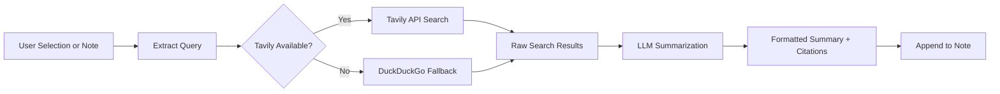

import TLDR from '@site/src/components/TLDR';

# Výzkum a vyhledávání na webu

<TLDR>
**Notemd vyhledává na webu a vkládá LLM shrnuté výsledky přímo do vašich poznámek.** Tavily API je hlavní vyhledávací backend; DuckDuckGo slouží jako nulově konfigurovaná náhrada. Výsledky jsou shrnuty s odkazy na zdroje a přidány pod nadpisem `## Research`. Podporuje výzkum v jedné poznámce, hromadný výzkum v složkách a výběr modelu pro krok shrnutí podle úkolu.

Toto je součástí [Obsidian Průvodce AI pro správu znalostí](/docs/pillar-ai-knowledge).
</TLDR>

## Přehled

Výzkum je jednou z nejmocnějších integrací Notemd: uzavírá smyčku mezi čtením, vyhledáváním a psaním. Místo přechodu do prohlížeče, abyste našli neznámý termín, ho jen označíte a necháte Notemd provést vyhledávání, shrnutí a přidání výsledků – vše uvnitř vašeho úložiště.

Celý proces je plně konfigurovatelný. Vy si můžete vybrat poskytovatele vyhledávání, LLM, které bude psát shrnutí, a také to, zda mají být výsledky přidány do aktuální poznámky nebo uloženy do samostatných souborů. Režim hromadného zpracování umožňuje vyhledat všechny poznámky ve složce jedním kliknutím.

## Jak to funguje

### Pipeline vyhledávání a následného shrnutí



1. **Extrakce dotazu** – Notemd extrahuje vyhledávací termíny z vaší volby nebo z názvu poznámky.
2. **Vyhledávání na webu** – nejprve se pokusí Tavily. Pokud není konfigurován klíč API, použije se automaticky DuckDuckGo (klíč není potřeba).
3. **LLM shrnutí** – surové výsledky vyhledávání jsou odeslány do konfigurovaného LLM, které vytvoří stručné shrnutí s odkazy na zdroje.
4. **Přidání** – formátované shrnutí je přidáno pod nadpisem `## Research` v aktuální poznámce.

### Tavily versus DuckDuckGo

| Aspekt | Tavily | DuckDuckGo |
|--------|--------|------------|
| Klíč API | Požadováno (dostupná bezplatná úroveň) | Nepožadováno |
| Kvalita výsledků | Vyšší (vyvinuto speciálně pro AI) | Dostatečné pro běžné dotazy |
| Limity rychlosti | Štědrá bezplatná úroveň | Podléhá omezování rychlosti |
| Konfigurace | `tavilyApiKey` v nastaveních | Nulová konfigurace – automatický přechod |

### Výzkum ve skupinách souborů

Klikněte pravým tlačítkem na složku a vyberte **"Notemd: Složka pro výzkum"**. Každý soubor `.md` v této složce je zpracován postupně (nebo paralelně až do nastavené konvergenční kapacity). Každá poznámka dostane svůj vlastní souhrn výzkumu.

## Konfigurace

| Nastavení | Výchozí | Účinek |
|---------|---------|--------|
| `tavilyApiKey` | `''` | Klíč Tavily API. Pokud je prázdný, používá se výhradně DuckDuckGo. |
| `researchProvider` / `researchModel` | DeepSeek | LLM na úrovni jednotlivých úloh pro shrnování výsledků vyhledávání |
| `maxResearchContentTokens` | `4000` | Tokenový rozpočet pro obsah odeslaný do LLM. Přebytek je zkrácen. |
| `researchAppendToNote` | `true` | Přidejte souhrn k původní poznámce. Pokud je hodnota false, vytvoří se samostatný soubor. |
| `researchLanguage` | `'en'` | Jazyk výstupu pro shrnutý výzkum |

### Doporučení modelu na úrovni jednotlivých úloh

Výzkum těží z modelu, který zvládá vícejazyčný obsah a vytváří dobře strukturovaný text. Zvažte následující možnosti:

- **DeepSeek** -- standardní verze, dostupná cenově, dobrá kvalita
- **GPT-4o** -- lepší kvalita shrnutí, vyšší cena
- **Gemini Flash** -- rychlý a levný, vhodný pro jednoduché dotazy

## Příklad

Čtete článek o *transformer attention mechanisms* a narazíte na neznámý termín: *relative positional encoding*. Místo toho, abyste nechali Obsidian:

1. Zvýrazněte **"relative positional encoding"**
2. Klikněte pravým tlačítkem --> **"Notemd: Výzkum a shrnutí"**
3. Notemd prohledá web, shrne nejlepší výsledky a přidá:

```markdown
## Research

### Relative Positional Encoding

Relative positional encoding is a method used in transformer models
where positional information is expressed as relative distances between
tokens rather than absolute positions. Introduced by Shaw et al. (2018),
it improves generalization to unseen sequence lengths compared to
absolute encodings (Vaswani et al., 2017).

Sources:
- [Shaw et al., Self-Attention with Relative Position Representations (2018)](https://arxiv.org/abs/1803.02155)
- [Transformer Positional Encoding Overview](https://example.com/transformer-pos-enc)
```

Shrnutí je nyní součástí vašeho úložiště, lze ho vyhledávat, odkazovat na něj a přistupovat k němu i offline.

## Tipy

- **Nastavte klíč Tavily pro lepší výsledky** -- dokonce i bezplatná verze poskytuje lepší relevanci než čisté DuckDuckGo.
- **Použijte schopný model na shrnování** -- levné modely mohou zjednodušit jemné technické obsahy.
- **Proveďte hromadný výzkum** po prvním přečtení, abyste najednou doplnili mezery v mnoha poznámkách.
- **Prozkoumejte přidaná shrnutí** -- LLM mohou vytvářet falešné informace o zdrojích. Ověřte klíčová tvrzení.

---

## Další kroky

- [Concept Notes](./concept-notes) -- Vyextrahujte a uložte klíčové termíny z výsledků výzkumu
- [Wiki-Links](./wiki-links) -- Propojte koncepty získané z výzkumu v rámci vašeho úložiště
- [Translation](./translation) -- Přeložte shrnutí výzkumu do jiného jazyka
- [LLM Poskytovatelé](/docs/providers/overview) -- Nakonfigurovat model používaný pro shrnutí
