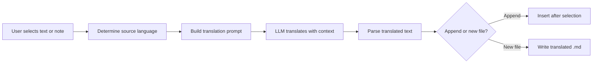

import TLDR from '@site/src/components/TLDR';

# Překlad

<TLDR>
**Notemd překládá texty mezi 21+ jazyky pomocí překladu poháněného LLM.** Podporuje překlad jednotlivých výběrů, překlad celých poznámek a hromadný překlad složek. Každý překladový úkol může využít vlastního poskytovatele a model prostřednictvím nastavení pro konkrétní úkol. Výstupní jazyk lze nezávisle nakonfigurovat od jazyka UI. Výsledky se přidávají pod původní text nebo se zapisují do nového souboru podle vašich preferencí.

Toto je součástí [Obsidian Průvodce AI pro správu znalostí](/docs/pillar-ai-knowledge).
</TLDR>

## Přehled

Překlad v Notemd není hledáním ve slovníku – jedná se o překlad poháněný LLM, který bere v úvahu kontext. Model vidí celý odstavec nebo poznámku a zachovává tón, odbornou terminologii a strukturu vět. To vytváří kvalitnější výsledky než služby překládající věty po větách, zejména u technického, akademického a kreativního psaní.

Tato funkce podporuje tři rozsahy: výběr, aktivní poznámku a celou složku. Spolu s výběrem modelu pro každý úkol můžete použít rychlý model (Gemini Flash) pro běžný překlad a výkonný model (Claude Sonnet) pro obsah citlivý na nuance – aniž byste měnili svého globálního poskytovatele.

## Jak to funguje

### Příkaz Translate



1. **Detekce zdrojového jazyka** – LLM odhadne zdrojový jazyk z obsahu. Nemusíte ho ručně specifikovat.
2. **Vytvoření promptu** – Notemd sestaví prompt, který zahrnuje cílový jazyk, volitelnou nápovědu k oboru a text k překladu.
3. **Překlad LLM** – nakonfigurovaný `translateProvider` / `translateModel` zpracuje požadavek. Model zachovává formátování v markdownu, wiki-odkazy a bloky kódu.
4. **Výstup** – přeložený text se buď přidá pod původní text, nebo se zapisuje do nového souboru ve vaultu.

### Páry jazyků

Notemd podporuje jakoukoli páru jazyků, kterou podporuje základní LLM. Mezi běžné páry patří:

| Zdrojový jazyk | Cíl | Typická kvalita |
|--------|--------|----------------|
| Angličtina | Čínština (zjednodušená) | Vynikající |
| Čínština | Angličtina | Vynikající |
| Angličtina | Japonský | Velmi dobré |
| Angličtina | Němčina / Francouzština / Španělština | Velmi dobré |
| Jakákoli podporovaná | Jakákoli podporovaná | Závisí na modelu |

Nastavení `translateLanguage` řídí **jazyk výstupu**. Zdrojový jazyk je automaticky detekován.

### Výběr modelu pro jednotlivé úlohy

Kvalita překladu se u různých modelů výrazně liší. Notemd vám umožňuje přiřadit speciální model pouze pro překlad:

| Model | Rychlost | Kvalita | Náklady | Nejlepší pro |
|-------|-------|--------|------|----------|
| `gemini-2.0-flash-exp` | Rychlé | Dobré | Nízký | Nevybíravé, vysoký objem |
| `gpt-4o-mini` | Rychlé | Dobré | Nízký | Rychlé vyhledávání |
| `deepseek-chat` | Střední | Dobré | Velmi nízké | Budžetové vícejazyčné |
| `claude-3-5-sonnet` | Střední | Vynikající | Střední | Technický / akademický |
| `gpt-4o` | Střední | Vynikající | Střední | Prosa citlivá na nuance |

### Překlad složky hromadně

Klikněte pravým tlačítkem na složku a vyberte **"Notemd: Přeložit složku"**, abyste přeložili všechny poznámky v této složce. Každý soubor je zpracován nezávisle. Nastavení souběžnosti určuje, kolik souborů se překládá současně.

## Konfigurace

| Nastavení | Výchozí | Účinek |
|---------|---------|--------|
| `translateProvider` / `translateModel` | DeepSeek | Specializovaný poskytovatel pro úkoly překladu |
| `translateLanguage` | `'en'` | Cílový jazyk výstupu |
| `translationAppendToNote` | `true` | Přidejte přeložený text pod původní. Pokud je hodnota false, vytvoří se nový soubor. |
| `batchConcurrency` | `3` | Počet souborů zpracovávaných současně během hromadného překladu |

## Příklad

Čtete čínskou výzkumnou poznámku a chcete její anglickou verzi:

1. Otevřete poznámku
2. Klikněte pravým tlačítkem --> **"Notemd: Přeložit aktuální soubor"**
3. Notemd rozpozná čínštinu, přeloží ji do vašeho nakonfigurovaného cílového jazyka (angličtina) a přidá:

```markdown
## Translation (English)

The experimental results show that the proposed method achieves
a 12% improvement in F1 score compared to the baseline, primarily
due to the enhanced feature extraction module described in Section 3.
```

Původní čínský text zůstane nedotčen nad překladem. Nadpis `## Translation` udržuje obě verze ve stejném souboru pro snadnou referenci.

## Tipy

- **Použijte Gemini Flash pro velké množství** -- je to nejrychlejší a nejlevnější možnost pro hromadný překlad velkých složek.
- **Uchovat odkazy na wiki** -- pokyn Notemd nařizuje LLM ponechat `[[wiki-links]]` beze změny při překladu. Po překladu to ověřte, protože některé modely je občas rozbalí.
- **Jasně nastavit výstupní jazyk** -- automatické detekování funguje u zdrojového textu, ale vždy nakonfigurujte `translateLanguage`, abyste se vyhnuli nejednoznačnosti ohledně cílového jazyka.
- **Hromadný překlad konceptních poznámek** -- pokud je vaše složka s koncepty v jednom jazyce a potřebujete ji v jiném, překlad na úrovni složky to zvládne v jediném kroku.

---

## Další kroky

- [Výzkum](./research) -- Vyhledejte a shrňte v jakémkoli jazyce a poté přeložte výsledky
- [Pracovní postupy](./workflows) -- Spojte překlad s odkazy na wiki nebo extrakcí konceptů
- [Hromadná zpracování](/docs/advanced/batch-processing) -- Konvergenční chování a možnost přepsání při operacích se složkami
- [LLM Poskytovatelé](/docs/providers/overview) -- Vyberte nejlepší model pro váš jazykový pár
