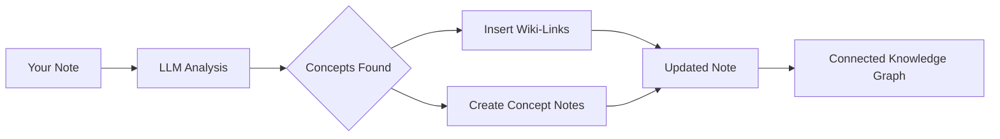

import TLDR from '@site/src/components/TLDR';

# Wiki-Links

<TLDR>
**Notemd automaticky přidává `[[wiki-links]]` ke klíčovým konceptům ve vašich poznámkách.** LLM čte váš obsah, identifikuje důležité termíny v kontextu a vkládá wiki odkazy ve stylu Obsidian u každého výskytu. Volitelně vytváří soubory konceptových poznámek s zpětnými odkazy. Podporuje potlačování synonym, zachování integrity odkazů při přejmenování nebo smazání a režim čisté extrakce (bez úprav souborů). Na rozdíl od Auto Link, který odpovídá pouze stávajícím názvům poznámek, Notemd využívá AI k identifikaci nových konceptů a vytváří odpovídající poznámky. Toto je součástí [Obsidian Průvodce AI řízením znalostí](/docs/pillar-ai-knowledge).
</TLDR>

## Přehled

Vytváření wiki odkazů je základní funkcí Notemd. Převádí běžný text na propojenou grafu znalostí následovně:

1. **Analýza vaší poznámky** pomocí LLM
2. **Identifikace klíčových konceptů** (termínů, osob, metod, teorií)
3. **Vkládání `[[wiki-links]]`** u každého výskytu
4. **Vytváření konceptových poznámek** (volitelně) s zpětnými odkazy

## Jak to funguje

### Proces



### Příklad

**Předtím:**
```markdown
Machine learning models use neural networks to learn patterns from data.
The transformer architecture revolutionized natural language processing.
```

**Poté:**
```markdown
[[Machine learning]] models use [[neural networks]] to learn patterns from data.
The [[transformer architecture]] revolutionized [[natural language processing]].
```

## Použití

### Základní: Přidání odkazů do aktuální poznámky

1. Otevřete poznámku
2. Klikněte pravým tlačítkem v editoru → **"Procesovat soubor (přidat odkazy)"**
3. Počkejte několik sekund
4. Koncepty jsou nyní propojeny!

### Sada: Zpracování více poznámek

1. Klikněte pravým tlačítkem na složku v Průzkumníku souborů
2. Vyberte **"Notemd: Zpracovat složku (přidat odkazy)"**
3. Konfigurace:
   - Souběžnost (kolik souborů najednou)
   - Přepsat stávající odkazy (ano/ne)
4. Klikněte na **Zpracovat**

### Selektivní: Odkazování na konkrétní text

1. Vyberte text k zpracování
2. Klikněte pravým tlačítkem → **"Zpracovat výběr (přidat odkazy)"**
3. Je analyzována pouze vybraná část

## Notemd oproti automatickému odkazování

Obsidian má dva způsoby automatického vytváření wiki odkazů:

| | **Automatické odkazování** | **Notemd** |
|--|---------------|-------------|
| Zdroj odkazu | Názvy stávajících poznámek ve vaultu | Koncepty identifikované LLM v obsahu |
| Lze vytvořit odkazy na nové koncepty | Ne — název musí již existovat | Ano — AI identifikuje koncepty a vytváří poznámky |
| Zpracování synonym | Ne | Ano — potlačení synonym |
| Vytvoření poznámky o konceptu | Ne | Ano — s zpětnými odkazy a odstraněním duplicit |
| Hromadné zpracování | Ne (jeden soubor) | Ano (na úrovni složky) |
| Směrování modelu podle úkolu | Ne | Ano |

**Auto Link** funguje na základě shody názvu: pokud existuje poznámka s názvem "Machine Learning", obalí výskyty do `[[Machine Learning]]`. Pokud poznámka neexistuje, nic se nestane.

**Notemd** je řízeno AI: LLM čte váš obsah, rozumí kontextu, identifikuje koncepty, které *měly* být propojeny — i když ještě žádná poznámka neexistuje — a vytváří jak odkaz, tak poznámku o konceptu.

## Funkce

### Potlačení synonym

**Problém:** "transformer", "transformers", "Transformer architecture" → 3 samostatné koncepty

**Řešení:** Notemd detekuje téměř duplikáty a používá kanonickou formu.

**Konfigurace:**
```
Settings → Advanced → Synonym Suppression
Threshold: 0.8 (0 = off, 1 = aggressive)
```

### Integrita odkazů

**Při přejmenování poznámky k konceptu:**
- Všechny wiki-odkazy se automaticky aktualizují (Obsidian základní funkce)
- Zpětné odkazy zůstávají neporušené

**Při smazání poznámky k konceptu:**
- Odkazy zůstávají, ale zobrazují se jako „nespojené zmínky“
- Můžete ji vytvořit znovu z jakékoli instance

### Režim čistého extrakce

**Extrahujte koncepty bez úprav původního obsahu:**

1. Klikněte pravým tlačítkem → **„Extrahovat koncepty (bez odkazování)“**
2. Vytvoří se poznámky k konceptům
3. Původní soubor zůstane nedotčen

Použití: Zpracování pouze pro čtení obsahu nebo finálních verzí.

## Generování poznámek k konceptům

### Automatické vytvoření

**Při aktivaci (výchozí nastavení) vytvoří Notemd:**

```markdown
---
tags: [concept, auto-generated]
created: 2026-06-13
source: [[Original Note Name]]
---

# Machine Learning

A branch of artificial intelligence that enables computers
to learn from data without explicit programming.

## Occurrences in Your Vault

- [[Original Note Name#Section]]
- [[Another Note#Header]]

## Related Concepts

- [[Neural Networks]]
- [[Deep Learning]]
- [[Supervised Learning]]
```

### Konfigurace

**Složka s výstupem:**
```
Settings → Output → Concept Folder
Default: concepts/
```

**Hierarchická struktura:**
```
Settings → Output → Use Hierarchical Folders
If enabled:
  papers/my-paper.md → papers/concepts/Concept.md
If disabled:
  → concepts/Concept.md
```

**Šablona:**
```
Settings → Output → Concept Template
Customize with variables:
  {{concept}} — Concept name
  {{description}} — LLM-generated description
  {{backlinks}} — List of source notes
  {{date}} — Creation date
```

## Pokročilé možnosti

### Okno kontextu

**Kolik okolního textu odeslat:**

```
Settings → Linking → Context Window
Options: Sentence | Paragraph | Full Note
Default: Paragraph
```

Větší hodnota = lepší přesnost, vyšší náklady.

### Minimální počet výskytů

**Připojit pouze koncepty, které se vyskytují vícekrát:**

```
Settings → Linking → Min Occurrences
Default: 1 (link all)
```

Nastavte na 2 nebo 3 pro zaměření se na opakující se témata.

### Vyloučit vzory

**Přeskočit určitá slova:**

```
Settings → Linking → Exclude List
Example: note, idea, example, thing
```

Zabraňuje nadměrnému propojování obecných termínů.

### Vlastní pokyny

**Přepsat výchozí pokyny LLM:**

```
Settings → Advanced → Custom Linking Prompt
Default:
  "Identify key concepts, theories, methods, and technical
   terms in the following text. Return as a list..."
```

Upravte pro potřeby konkrétní oblasti (např. "Zaměřte se na lékařskou terminologii").

## Tipy a osvědčené postupy

### ✅ DĚLEJTE

- **Zpracovávejte poznámky delší než 100 slov** — Krátké poznámky obsahují málo konceptů
- **Používejte výkonné modely** pro lepší identifikaci konceptů (GPT-4o, Claude)
- **Proveďte revizi před přijetím** — Zkontrolujte, zda navržené odkazy dávají smysl
- **Budujte iterativně** — Zpracovávejte 5–10 poznámek, zkontrolujte graf, upravte nastavení

### ❌ NEDĚLEJTE

- **Příliš mnoho odkazů** — Ne každé podstatné jméno potřebuje odkaz
- **Opakovaně zpracovávejte návrhy** — Koncepty se mohou měnit, počkejte, dokud nebudou stabilní
- **Ignorujte synonyma** — Povolte potlačení, abyste se vyhnuli rozdílům mezi „ML“ a „Machine Learning“

## Výkon

### Rychlost

| Velikost poznámky | GPT-4o-mini | Claude Sonnet | Ollama (lokalně) |
|-----------|-------------|---------------|----------------|
| 500 slov | 2–3 sekundy | 3–5 sekund | 5–10 sekund |
| 2000 slov | 5–8 sekund | 10–15 sekund | 20–40 sekund |
| 5000+ slov | V částech (více volání) | Skládané | Skládané |

### Odhad nákladů

**Příklad: 1000slovná poznámka s GPT-4o-mini**
- Vstup: ~1500 tokenů
- Výstup: ~200 tokenů
- Cena: ~

**Hromadná zpracování 100 poznámek:** ~

## Řešení problémů

### Žádné odkazy přidány nebyly

**Kontrola:**
1. LLM volání úspěšné (Nastavení → Diagnostika)
2. Poznámka obsahuje dostatek obsahu (>50 slov)
3. Koncepty jsou technické/specifické (nejen zájmena).

**Vyzkoušejte:**
- Použijte výkonnější model
- Zvýšit okno kontextu
- Zkontrolujte platnost klíče API

### Příliš mnoho odkazů

**Řešení:**
1. Zvýšit minimální počet výskytů (2 nebo 3)
2. Přidejte běžná slova do seznamu k vyloučení
3. Použijte méně agresivní model

### Chybně přiřazené koncepty

**Opravy:**
1. Použijte vlastní pokyn pro specifickost domény
2. Povolte potlačení synonym
3. Manuálně zkontrolujte a odpojte

### Odkazy se přeruší po přejmenování

**Toto je normální chování Obsidian.**

Chcete-li aktualizovat všechny odkazy:
1. Přejmenujte poznámku k konceptu
2. Obsidian automaticky aktualizuje `[[old]]` na `[[new]]`

---

## Další kroky

- 📖 [Poznámky k konceptům](./concept-notes) — Podrobný náhled na generování poznámek k konceptům
- 🔍 [Integrace výzkumu](./research) — Kombinujte odkazování s webovým výzkumem
- 🎨 [Diagramy](./diagrams) — Vizualizujte svou grafu znalostí
