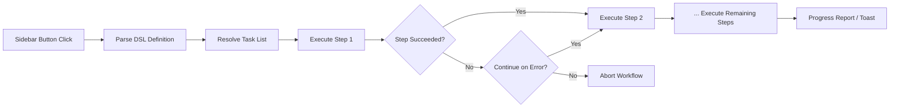

import TLDR from '@site/src/components/TLDR';

# Pracovní postupy

<TLDR>
**Notemd pracovní postupy řetězí více úloh do jediné akce na jedno kliknutí.** Definujte sekvence jako `add-links > extract-concepts > research > diagram` pomocí jednoduchého DSL. Pracovní postupy se zobrazují jako tlačítka v postranním panelu, která spustí celý řetězec v aktuální poznámce nebo složce. Je dodáván s předdefinovanými pracovními postupy; v nastaveních můžete vytvořit vlastní. Každý krok využívá vlastní konfiguraci modelu pro danou úlohu.

Toto je součástí [Obsidian Průvodce AI pro správu znalostí](/docs/pillar-ai-knowledge).
</TLDR>

## Přehled

Pracovní postup odstraňuje potíže spojené s prováděním úloh jednu po druhé. Místo toho, abyste čtyřikrát klikli pravým tlačítkem pro přidání odkazů, extrakci konceptů, vyhledávání neznámých termínů a vytvoření diagramu, stisknete jedno tlačítko v postranním panelu a celý řetězec se spustí. Notemd se stará o sekvenování, šíření chyb a hlášení pokroku.

Pracovní postupy jsou definovány pomocí lehkého DSL (jazyka specifického pro danou oblast). Nacházejí se v nastaveních, zobrazují se jako kliknutelná tlačítka v postranním panelu Obsidian a lze je aplikovat buď na aktuální poznámku, nebo na celou složku.

## Jak to funguje

### Řetězec provádění pracovních postupů



1. **Analýza** -- Řetězec DSL je rozdělen na `>` (nebo `>`) na uspořádaný seznam identifikátorů úloh.
2. **Vyřešení** -- Každý identifikátor se mapuje na vnitřní příkaz (add-links, extract-concepts, research, translate, diagram atd.).
3. **Provedení** -- Kroky se spouštějí postupně. Každý krok využívá konfigurovaného poskytovatele a modelu pro danou úlohu.
4. **Zpracování chyb** -- Pokud selže nějaký krok, pracovní postup buď ukončí, nebo pokračuje k dalšímu kroku v závislosti na vaší politice zpracování chyb.
5. **Ukončení** -- Oznámení typu toast hlásí úspěch nebo uvádí seznam selhavých kroků.

### Formát DSL

Pracovní postupy jsou definovány jako sekvence identifikátorů úloh oddělených `>`:

```
process-current-add-links>extract-concepts-current>research-and-summarize
```

**Dostupné identifikátory úloh:**

| Identifikátor | Akce |
|------------|--------|
| `process-current-add-links` | Přidat odkazy na wiki do aktuální poznámky |
| `extract-concepts-current` | Vytáhnout koncepty z aktuální poznámky |
| `research-and-summarize` | Prozkoumat vybraný text nebo název poznámky |
| `process-current-translate` | Přeložit aktuální poznámku |
| `summarize-to-mermaid` | Vytvořit diagram z aktuální poznámky |
| `generate-from-title` | Vytvořit obsah na základě názvu poznámky |
| `extract-original-text` | Vytáhnout původní text (pro OCR / skenovaný obsah) |

**Varianty na úrovni složky** nahradí `current` v názvu identifikátoru za `folder`.

### Předdefinované vs. vlastní pracovní postupy

Notemd dodává hotové pracovní postupy pro běžné vzory:

| Pracovní postup | Řetězec | Použití |
|----------|-------|----------|
| **Jedno-klikové vytahování** | add-links > extract-concepts > research | Zpracovat výzkumnou práci v jednom kroku |
| **Kompletní pipeline** | add-links > extract-concepty > research > diagram | Úplné extrahování znalostí s vizualizací |
| **Přeložit + Odkázat** | translate > add-links | Přeložit a poté odkázat koncepty v cílovém jazyce |

**Vlastní pracovní postupy** se vytvářejí v nastaveních:

1. Otevřete **Nastavení** --> **Notemd** --> **Pracovní postupy**
2. Klikněte na **"Přidat pracovní postup"**
3. Zadejte řetězec DSL (např. `process-current-add-links>extract-concepts-current`)
4. Dejte mu název pro zobrazení (např. "Rychlý odkaz + extrakce")
5. Nové tlačítko se okamžitě objeví v bočním panelu

## Konfigurace

| Nastavení | Výchozí | Účinek |
|---------|---------|--------|
| `workflows` | Předdefinovaná sada | Sada definic pracovních postupů (název + DSL) |
| `workflowContinueOnError` | `true` | Pokračujte k dalšímu kroku, pokud aktuální krok selže |
| `workflowShowProgress` | `true` | Zobrazte toast s informací o pokroku po dokončení každého kroku |

### Modely na úrovni úkolu v pracovních postupech

Každý krok v pracovním postupu využívá svou **vlastní** konfiguraci modelu pro jednotlivé úkoly. Není nutné specifikovat modely přímo v DSL. Pořadí řešení je následující:

1. Poskytovatel/model pro konkrétní úkol, pokud je `useMultiModelSettings` aktivní
2. Globální `activeProvider` v opačném případě

To znamená, že `add-links` může běžet na DeepSeek zatímco `research` běží na GPT-4o – vše uvnitř stejného pracovního postupu.

## Příklad

Právě jste do svého úložiště importovali PDF z článku o strojovém učení a chcete plné extrakce znalostí:

1. Otevřete importovanou poznámku
2. Klikněte na tlačítko v bočním panelu **"Plný pipeline"**
3. Notemd spustí následující kroky:
   - **Krok 1**: Přidání odkazů na wiki – `[[attention mechanism]]`, `[[transformer]]` atd.
   - **Krok 2**: Extrakce konceptů – vytvoří poznámky s koncepty ve vaší složce s koncepty
   - **Krok 3**: Výzkum – shrne webové zdroje pro klíčové termíny
   - **Krok 4**: Diagram – vytvoří Mermaid myšlenkovou mapu struktury článku
4. Po přibližně 30 sekundách má vaše poznámka odkazy, existují poznámky s koncepty, je přidán výzkum a je uložen soubor s diagramem

Vše za jediné kliknutí.

## Tipy

- **Začněte s předdefinovanými pracovními postupy** – pokrývají nejběžnější vzory. Upravujte je pouze tehdy, když potřebujete jiné pořadí.
- **Povolte `workflowContinueOnError`** – selhání kroku s diagramem by nemělo zastavit celý pipeline.
- **Použijte pracovní postupy pro složky** k hromadnému zpracování – klikněte pravým tlačítkem na složku, vyberte pracovní postup a všechny poznámky budou zpracovány.
- **Jmenujte pracovní postupy jasně** – prostor na boční liště je omezený. Používejte krátké, orientované názvy jako „Rychlé extrahování“ nebo „Přeložit + Odkázat".

---

## Další kroky

- [Výzkum](./research) – Pochopte, co krok výzkumu dělá, než ho přidáte do pracovních postupů
- [Wiki-odkazy](./wiki-links) – Základní funkce odkazování používaná ve většině pracovních postupů
- [Konceptuální poznámky](./concept-notes) – Extrakce konceptů jako krok v pracovním postupu
- [Hromadné zpracování](/docs/advanced/batch-processing) – Souběžnost a hlášení pokroku pro pracovní postupy složek
