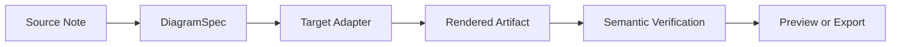
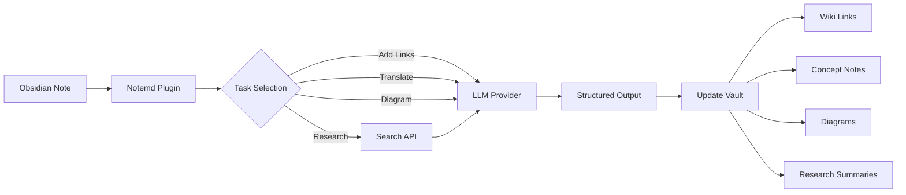

import TLDR from '@site/src/components/TLDR';

# Úvod do Notemd

<TLDR>
**Notemd** (Note + EMD — Enhanced Markdown Documents) je open-source plugin pro Obsidian, který převádí čtení pomocí LLM na trvalé znalosti. Na rozdíl od chatových AI, kde po skončení sesionu informace zmizí, Notemd ukládá výsledky **přímo do vašeho úložiště** ve formě wiki-odkazů, poznámek k konceptům, shrnutí výzkumu, překladů, pracovních postupů a diagramů. Je určen výzkumníkům, studentům a pracovníkům v oblasti znalostí, kteří chtějí, aby jejich čtení, výzkum a vizuální vysvětlení akumulovaly do strukturovaného, vyvíjejícího se grafu znalostí.
</TLDR>

## Co je Notemd?

Notemd integruje **30+ velkých jazykových modelů** (OpenAI, Anthropic, Google, DeepSeek, Qwen, Ollama a další) do vašeho pracovního postupu Obsidian za účelem automatizace extrakce znalostí, jejich organizace, překladu, výzkumu a generování diagramů.

### Klíčový rozdíl: dočasné vs. trvalé znalosti

| Aspekt | Chatové AI (ChatGPT atd.) | Notemd |
|--------|-------------------------------|--------|
| **Kam jdou výsledky** | Historie chatu (zmizí) | Vaše úložiště Obsidian (zůstává) |
| **Formát** | Odpovědi v prostém textu | Strukturované soubory: `[[wiki-links]]`, poznámky k konceptům, diagramy |
| **Dlouhodobá hodnota** | Je nutné se ptát znovu pokaždé | Akumuluje se do grafu znalostí |
| **Přístup offline** | Vyžaduje internet | Funguje plně offline s Ollama |

## Základní funkce

### 1. **Automatické vytváření odkazů na wiki**
- LLM identifikuje klíčové koncepty ve vašich poznámkách
- Vkládá `[[wiki-links]]` při každém výskytu
- Volitelně vytváří odkazované poznámky k konceptům
- Potlačení synonym, aby se zabránilo duplicitám

### 2. **Generování poznámek k konceptům**
- Vytahuje základní koncepty z článků, prací a poznámek
- Generuje speciální soubory s koncepty a zpětnými odkazy
- Nastavitelné cesty výstupu a šablony

### 3. **Integrace webového vyhledávání**
- Vyhledává Tavily nebo DuckDuckGo přímo v Obsidian
- LLM shrnuje výsledky s citacemi zdrojů
- Přidává výsledky výzkumu do aktuální poznámky

### 4. **Vícejazyčný překlad**
- Překládat vybrané části nebo celé poznámky
- Podpora více než 21 UI jazyků
- Nezávislá konfigurace výstupního jazyka
- Podpora hromadného překladu

### 5. **Generování diagramů**
- **Mermaid**: Schématy toků, sekvence, tříd, stavů, ER, Gantt
- **JSON Canvas**: Obsidian nativní rozložení
- **Vega-Lite**: Grafy dat, časové řady,散点图
- **HTML / Editable HTML/SVG**: Samostatné grafické artefakty s sémantickými poznámkami
- **Draw.io / Drawnix hranice artefaktů**: Cesty pro export určené pro správce ze stejného sémantického modelu grafu
- **Plán cestovní mapy obvodových schémat**: Podpora circuitikz/TikZJax je navrhována kolem zlatých referencí, omezených pokynů, zpětné vazby na renderování a ověřování topologie/rozložení namísto surového neomezeného LLM TikZ
- **Diagnostika náhledu**: Renderované artefakty mohou odhalit diagnostiku kompilace/renderování a neinline zdroje lze inspekčně prohlížet bez potřeby LaTeX runtime na straně pluginu
- Automatická oprava syntaxe pro chyby Mermaid

### 6. **Pracovní postupy jedním kliknutím**
- Spojte více akcí do tlačítek v postranním panelu
- Definice pracovních postupů na základě DSL
- Příklad: `add-links > extract-concepts > research > diagram`

## Kdo by měl používat Notemd?

✅ **Výzkumníci**, kteří čtou články a vytvářejí přehledy literatury
✅ **Studenti**, kteří organizují studijní poznámky a vytvářejí mapy konceptů
✅ **Pracovníci v oblasti znalostí**, kteří chtějí, aby jejich čtenářské poznatky zůstaly trvale uloženy
✅ **Dvoujazyční odborníci**, kteří potřebují překlad + propojení s wiki
✅ **Uživatelé dbalí na soukromí**, kteří chtějí místní podporu LLM (Ollama)
✅ **Pokročilí uživatelé**, kteří přizpůsobují výzvy a pracovní postupy

## Proč Notemd + Obsidian?

**Obsidian** je znalostní báze zaměřená na lokální použití a založená na Markdownu. **Notemd** přidává umělou inteligenci s výjimečnými funkcemi:
- Vaše data zůstávají ve vašem úložišti (nikoli v cloudové službě)
- Funguje offline s místními modely
- Je zdarma a open source (licence MIT)
- Integruje se se stávajícími pluginy Obsidian
- Škáluje až na desítky tisíc not

## Úvod

1. **Instalace**: Nastavení → Komunitní pluginy → Procházet → "Notemd"
2. **Konfigurace**: Přidejte klíč svého poskytovatele LLM API (nebo použijte místní Ollama).
3. **Vyzkoušejte to**: Otevřete poznámku → Klikněte pravým tlačítkem → „Zpracovat soubor (přidat odkazy)“
4. **Prozkoumat**: Zkontrolujte boční panel pro pracovní postupy na jedno kliknutí

👉 [Návod k instalaci](./getting-started/installation) | [Návod pro rychlý start](./getting-started/quick-start)

## Diagram směru schopností

Práce s diagramy u Notemd se posouvá od „požádat model, aby napsal jednu syntaktickou řetězec“ k vrstvenému procesu:

Současná implementace již podporuje záložní režimy Mermaid, JSON Canvas, Vega-Lite, HTML, upravitelné prvky HTML/SVG, artefakty Draw.io XML, minimální soubor funkcí Drawnix JSON, diagnostiku náhledu nebo záložní režim pouze se zdrojovým kódem a offline prototyp `CircuitSpec -> circuitikz` pro šablony typu common-source a CMOS inverter. Schémata obvodů představují složitější kategorii: circuitikz dokáže znázornit přesnou elektrickou topologii, ale neomezený výstup typu LLM často vede k nečitelnému uspořádání vedení nebo k LaTeXu, který se nezobrazí. Dalším směrem je udržovat omezení pro circuitikz pomocí šablon zlatého referenčního vzoru, pravidel rozvržení uzlů v mřížce, diagnostiky renderování a zpětnovazebních smyček s snímky obrazovky.

Přečtěte si podrobnosti v [Diagrams](./features/diagrams).

## Architektura

## Notemd oproti ostatním pluginům AI Obsidian

Většina pluginů pro AI typu Obsidian je zaměřena na konverzace (vy se ptáte, AI odpovídá, poznatky zůstávají v chatu). Notemd je naopak zaměřen na psaní: AI zpracuje vaše poznámky a napsá výsledky ve strukturované formě přímo do vašeho úložiště.

| Schopnost | Notemd | Copilot | Smart Connections | Text Generator |
|-----------|--------|---------|-------------------|-----------------|
| Vložení odkazu na wiki automaticky | Ano | Ne | Ne | Ne |
| Generování konceptuálního popisu | Ano (s zpětnými odkazy + odstraněním duplicit) | Ne | Ne | Ne |
| Generování diagramů | Ano (Mermaid, Canvas, Vega-Lite, HTML, upravitelné artefakty) | Ne | Ne | Ne |
| Integrace webového výzkumu | Ano (Tavily + DuckDuckGo) | Ne | Ne | Ne |
| Zpracování složek ve skupinách | Ano | Omezené | Ne | Omezené |
| Směrování modelu podle úkolu | Ano (7 úloh, nezávislé modely) | Ne | Ne | Ne |
| Řetězce pracovních postupů na jedno kliknutí | Ano (DSL) | Ne | Ne | Ne |
| Překlad (ve skupinách) | Ano | Ne | Ne | Ne |
| Konverzace s trezorem | Ne | Ano | Ne | Ne |
| Vyhledávání podle sémantické podobnosti | Ne | Ne | Ano | Ne |
| Generování na základě šablon | Ne | Ne | Ne | Ano |
| LLM poskytovatelé | 36 (cloud + gateway + lokální) | 3-5 | 2-3 | 3-5 |
| Úplně offline | Ano (Ollama) | Částečný | Částečný | Částečný |

**Kdy zvolit Notemd**: Chcete, aby umělá inteligence vytvořila trvalou grafovou strukturu znalostí – nejen diskutovala o vašich poznámkách.

**Kdy zvolit Copilot**: Chcete konverzačního AI asistenta uvnitř Obsidian.

**Kdy zvolit Smart Connections**: Chcete objevit stávající vztahy mezi poznámkami prostřednictvím sémantického vyhledávání.

## Filozofie

**Notemd věří, že umělá inteligence by měla doplňovat lidskou práci spojenou se znalostmi, nikoli ji nahrazovat.** Plugin:
- Udržuje vás v kontrole (prohlédněte si před aplikací změn).
- Uchovává kontext (všechny výsledky odkazují zpět na zdroj)
- Respektuje soukromí (lokální podpora LLM, žádná telemetrie)
- Zůstává rozšiřitelný (otevřené APIs, vlastní pracovní postupy)

<!-- notemd-acknowledgments -->
## Poděkování a referenční projekty

Notemd je udržován nezávisle. Děkujeme open-source projektům a komunitám, které ovlivnily zdokumentovaná návrhová rozhodnutí nebo poskytují základy integrací. Uvedení uznává pouze vliv nebo interoperabilitu; neznamená podporu, přidružení, přibalený kód ani tvrzení o opětovném použití kódu.

- **Referenční projekty:** [cloudy-tech-diagrams-skill](https://github.com/cloudy-liu/cloudy-tech-diagrams-skill), [Drawnix](https://github.com/plait-board/drawnix), [diagrams.net / draw.io](https://www.diagrams.net/), [repo-saga](https://github.com/teee32/repo-saga).
- **Open-source základy:** [Mermaid](https://github.com/mermaid-js/mermaid), [Vega-Lite](https://vega.github.io/vega-lite/), [Slidev](https://github.com/slidevjs/slidev), [CircuitikZ](https://github.com/circuitikz/circuitikz), [Tectonic](https://github.com/tectonic-typesetting/tectonic), [Docusaurus](https://docusaurus.io).
- Každý projekt si zachovává vlastní licenci a podmínky; Notemd je dostupný pod [licencí MIT](https://github.com/Jacobinwwey/obsidian-NotEMD/blob/main/LICENSE).

## Open Source

- **Licence**: MIT
- **Zdroj kódu**: [github.com/Jacobinwwey/obsidian-NotEMD](https://github.com/Jacobinwwey/obsidian-NotEMD)
- **Komunita**: [Discord](https://discord.gg/qnGgsQ9W) | [GitHub Discussions](https://github.com/Jacobinwwey/obsidian-NotEMD/discussions)
- **Přispějte**: Jsou vítány PR, viz [CONTRIBUTING.md](https://github.com/Jacobinwwey/obsidian-NotEMD/blob/main/CONTRIBUTING.md)

---

**Další kroky**: [Installation →](./getting-started/installation)
