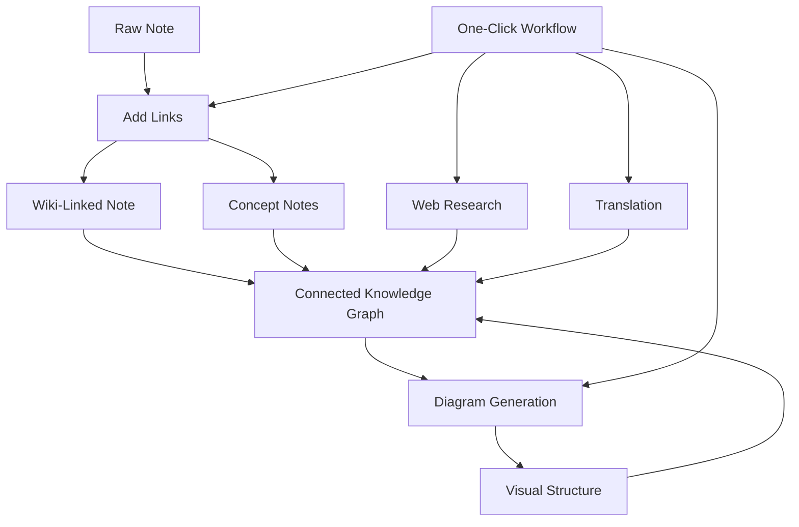

import TLDR from '@site/src/components/TLDR';

# Obsidian Průvodce správou znalostí s AI

<TLDR>
**Notemd převádí čtení poháněné LLM na trvalé znalosti: wiki-odkazy spojují koncepty, poznámky k konceptům vytvářejí vyhledatelnou grafiku, vyhledávání přináší obsah z webu do vaší databáze, překlad odstraňuje jazykové bariéry, diagramy zpřehledňují strukturu a pracovní postupy to vše spojují jedním kliknutím.** Tento průvodce pokrývá celý proces — od surových poznámek až po propojenou, vizuální, vícejazyčnou databázi znalostí.
</TLDR>

## Proč správa znalostí s AI?

Tradiční zápis poznámek vytváří jednoduché soubory. I při ručních wiki-odkazech zůstávají většina poznámek oddělená. Notemd využívá LLM k automatizaci vrstvy spojování:

- **LLMy čtou váš obsah** a identifikují to, co je důležité — termíny, metody, osoby, teorie
- **Odkazy se vkládají automaticky** při každém výskytu konceptu, nejsou ukryty v „viz také“
- **Poznámky k konceptům se generují** jako samostatné vyhledatelné soubory
- **Vyhledávání obohacuje poznámky** kontextem z webu
- **Diagramy zpřehledňují strukturu** — mapy myšlenek, diagramy toků, grafy dat ze stejného obsahu

Výsledkem je graf znalostí, který roste s každou poznámkou, kterou zpracujete, nejen tehdy, když si vzpomenete přidat odkazy.

## Celý proces



Každý krok je nezávislý. Můžete použít jeden nebo všechny. Nejúčinnější sekvence: **Přidání odkazů → Poznámky k konceptům → Diagramy**.

---

## 1. Wiki-odkazy: Vytváření explicitních spojení

Wiki-odkazy tvoří základ grafu znalostí. Notemd využívá LLM k:

1. Přečtěte si obsah poznámky (rozdělte ho na části u delších dokumentů)
2. Identifikujte základní koncepty – upřednostňujte konkrétní technické termíny před obecnými podstatnými jmény
3. Vložte `[[wiki-links]]` při každém výskytu
4. Potlačte synonyma, aby „ML“ a „Machine Learning“ nevytvářely samostatné uzly

### Kdy použít

- **Každá poznámka delší než 100 slov** – kratší poznámky obsahují málo konceptů
- **Výzkumné články, technické dokumenty, zápisy ze schůzek** – bohaté na termíny specifické pro danou oblast
- **Po ustálení obsahu** – neopakovaně zpracovávejte návrhy

### Klíčové nastavení

| Nastavení | Doporučené | Důvod |
|---------|-----------|-----|
| `addLinksProvider` | DeepSeek nebo GPT-4o-mini | Dobrá přesnost za nízkou cenu |
| Potlačení synonym | Ano | Zabraňuje vzniku duplicitních uzlů |
| Okno kontextu | Odstavec | Rovnováha mezi přesností a náklady |

→ [Wiki-Links deep dive](/docs/features/wiki-links)

---

## 2. Konceptuální poznámky: Vyhledatelné znalostní uzly

Wiki-odkazy spojují myšlenky v rámci textu, ale konceptuální poznámky umožňují nezávislé vyhledání každé myšlenky. Každý koncept má svůj vlastní `.md` soubor:

```markdown
# Machine Learning

## Linked From
- [[My Research Notes]]
- [[Neural Networks Explained]]
```

### Proces extrakce

Příkaz LLM je velmi strukturovaný:
- Normalizovat na jednotnou formu
- Upřednostňovat víceslovné koncepty před jednoslovnými („Dielectric Relaxation“ nikoli „Relaxation“)
- Přeskočit části s odkazy/bibliografií
- Výstup v podobě `CONCEPT:` řádků pro jednoznačnou analýzu

Koncepty jsou odstraňovány z duplicit pomocí `Set<string>`. Chyby LLM v jednotlivých částech nezastaví celý proces.

### Zpětné odkazy

Pokud je to povoleno, každá konceptuální poznámka zaznamenává, které zdrojové poznámky ji zmiňují. Vestavěná tabulka zpětných odkazů Obsidian také zobrazuje obrácené spojení.

### Odstranění duplicit

4krokový motor na odstraňování duplicit Notemd zachycuje:
1. **Přesné shody** — srovnání názvů souborů bez ohledu na velikost písmen
2. **Množné čísla** — "Models.md" oproti "Model.md"
3. **Normalizace symbolů** — "A-B.md" oproti "A B.md"
4. **Obsah jednoho slova** — "ML.md" je označeno, pokud existuje "Machine Learning.md"

### Nastavení klíčů

| Nastavení | Doporučené | Důvod |
|---------|-----------|-----|
| `conceptNoteFolder` | `concepts/` nebo `🧠 concepts/` | Udržuje trezor uspořádaný |
| `extractConceptsAddBacklink` | Ano | Umožňuje zpětné vyhledávání |
| `extractConceptsMinimalTemplate` | Ne | Kompletní šablona s odkazy |
| Model na úrovni úkolu | DeepSeek | Extrakce konceptů nevyžaduje nákladné modely |
| Potlačování synonym | Ano | Stejná nastavení ovlivňují jak propojování, tak extrakci |

→ [Concept Notes deep dive](/docs/features/concept-notes)

---

## 3. Výzkum: Začlenění webu

Notemd integruje vyhledávání na webu do vašeho pracovního postupu při psaní poznámek:

1. **Vytváření dotazu** — název nebo výběr poznámky se stane vyhledávacím dotazem
2. **Vyhledávání na webu** — Tavily (doporučeno, vyžaduje klíč API) nebo DuckDuckGo (zdarma, bez klíče)
3. **LLM shrnutí** — výsledky vyhledávání jsou zhuštěny do relevantního shrnutí
4. **Přidání do poznámky** — shrnutí se přidá na pozici kurzoru nebo jako nová sekce

### Kdy použít

- Před zpracováním nového tématu — nejprve získejte webový kontext
- Když potřebujete poznámku o konceptu obohatit — nejprve prověřte informace a poté přidejte odkazy
- Pro přehledy literatury — hromadně vyhledejte složku s poznámkami

### Klíčové nastavení

| Nastavení | Doporučeno | Důvod |
|---------|-----------|-----|
| `researchProvider` | GPT-4o nebo Claude | Výzkum vyžaduje kvalitnější shrnutí |
| Služba pro vyhledávání | Tavily | Lepší relevance, nastavitelná hloubka |
| `maxResearchContentTokens` | 4000 | Rovnováha mezi hloubkou a náklady |

→ [Podrobný průzkum](/docs/features/research)

---

## 4. Překlad: Překonávání jazykových bariér

Notemd překládá poznámky pomocí vašeho nastaveného LLM — ne speciálního překladače API. To znamená:

- **Překlady s pochopením kontextu** — LLM rozumí celému dokumentu, ne jen větám po větách
- **Zpracování odborných termínů** — „gradient descent“ zůstává jako „梯度下降“, nikoli „坡度向下
- **Podpora hromadného překladu** — přeložte celou složku s poznámkami najednou
- **Model pro jednotlivé úkoly** — použijte Gemini Flash k překladu (rychlý, levný, vícejazyčný)

### Jazyková podpora

Notemd sám podporuje 21 UI jazyků. Cílový jazyk překladu lze nastavit pro každý úkol. Běžné páry: EN↔ZH, EN↔JA, EN↔KO, EN↔DE, EN↔FR, EN↔ES.

→ [Podrobný průzkum překladu](/docs/features/translation)

---

## 5. Diagramy: Zviditelnění struktury

Pipeline diagramů Notemd je založen na specifikacích: LLM vytvoří strukturovaný `DiagramSpec` JSON, poté adaptéry jej převedou do cílového formátu. To poskytuje spolehlivější výstup než žádost o surovou Mermaid syntaxi od LLM.

### Detekce záměru

Notemd odhadne nejlepší typ diagramu na základě obsahu:

- **Tabulky s čísly** → graf dat (Vega-Lite)
- **Slovník klienta/serveru** → sekvenční diagram (Mermaid)
- **Entita/hlavní klíč** → ER diagram (Mermaid)
- **Krok/průběh procesu** → diagram toků (Mermaid)
- **Klíčová slova konceptuální mapy** → JSON Canvas (Obsidian nativní)
- **Výchozí** → mind map (Mermaid)

### Řetězec renderování

Hlavní cíl → náhrada → náhrada → HTML. Pokud syntaxe Mermaid selže, pokusí se ještě jednou s kontextem chyby odeslat ji na LLM, poté přejde na minimální diagram.

### Klíčové nastavení

| Nastavení | Doporučené | Důvod |
|---------|-----------|-----|
| `enableExperimentalDiagramPipeline` | Ano | Lepší kvalita prostřednictvím specifikací nejprve |
| `experimentalDiagramCompatibilityMode` | `best-fit` | Nativní cíl podle záměru |
| `summarizeToMermaidProvider` | GPT-4o nebo Claude | Specifikace diagramů vyžadují prostorové uvažování |
| `autoMermaidFixAfterGenerate` | Ano | Automaticky zachycuje chyby syntaxe LLM |
| Rozšíření místních znalostí | Povoleno pro doménově specifické účely | Zlepšuje přesnost s kontextem trezoru |

→ [Podrobný průzkum diagramů](/docs/features/diagrams)

---

## 6. Pracovní postupy: Automatizace jedním kliknutím

Pracovní postupy spojují více úloh do jednoho tlačítka v postranním panelu. Formát DSL je následující:

```
task1 | task2 | task3
```

Příklad: `addLinks | extractConcepts | generateDiagram` — zpracuje poznámku z hrubého textu na plně propojený, vizuální znalostní uzel jedním kliknutím.

### Doporučené pracovní postupy

| Pracovní postup | Řetězec | Použití |
|----------|-------|----------|
| Celý proces | `addLinks \| extractConcepts \| generateDiagram` | Nové poznámky |
| Výzkum nejprve | `research \| addLinks` | Neznámá témata |
| Polyglot | `translate \| addLinks` | Vícejazyčné poznámky |
| Pouze diagram | `generateDiagram` | Rychlá vizualizace |

→ [Podrobný průzkum pracovních toků](/docs/features/workflows)

---

## 7. LLM poskytovatelé: 36 možností od cloudu po lokální zařízení

Notemd podporuje 36 poskytovatelů v 4 typech přenosu. Klíčové skupiny:

- **Mezinárodní cloud**: OpenAI, Anthropic, Google, Mistral, xAI
- **Čínský cloud**: DeepSeek, Qwen, Doubao, Moonshot, GLM, Baidu, SiliconFlow
- **Brány**: OpenRouter, GitHub Models, Hugging Face, Vercel
- **Lokální**: Ollama, LMStudio, OVMS — bez klíče API, žádná data neopouštějí váš počítač

### Strategie modelu podle úlohy

Nejekonomičtější nastavení využívá levné modely pro jednoduché úlohy a výkonné modely pro složité úlohy:

```
extractConcepts  → DeepSeek (fast, cheap, accurate enough)
addLinks          → DeepSeek or GPT-4o-mini
research          → GPT-4o or Claude (needs quality)
generateDiagram   → GPT-4o or Claude (needs spatial reasoning)
translate         → Gemini Flash (fast, multilingual)
```

→ [Přehled LLM poskytovatelů](/docs/providers/overview)

---

## Seznam kontrol při začínání

1. **Nainstalujte Notemd** — [Komunitní pluginy](/docs/getting-started/installation) (doporučeno) nebo ručně
2. **Konfigurujte poskytovatele** — DeepSeek (nejjednodušší), OpenAI, nebo Ollama (zdarma)
3. **Zpracujte svou první poznámku** — klikněte pravým tlačítkem → "Zpracovat soubor (přidat odkazy)"
4. **Nastavit složku konceptů** — Nastavení → Notemd → Výstup → Složka konceptů
5. **Vytáhnout koncepty** — spustit „Vytáhnout koncepty“ na téže poznámce
6. **Vytvořit diagram** — spustit „Vytvořit diagram“, abyste vizualizovali vazby
7. **Vytvořit pracovní postup** — spojit výše uvedené do jednoho tlačítka pro jedno kliknutí

## Doporučené konfigurace

### Student (Budget)

```
Provider: DeepSeek (free tier available)
Concept extraction: DeepSeek
Research: DuckDuckGo (free) + DeepSeek
Diagrams: Off (or legacy Mermaid)
Workflows: addLinks | extractConcepts
```

### Výzkumník (Kvalita)

```
Provider: GPT-4o (primary)
Concept extraction: DeepSeek (cost savings)
Research: GPT-4o + Tavily
Diagrams: best-fit mode, GPT-4o
Workflows: research | addLinks | extractConcepts | generateDiagram
```

### Privacita na prvním místě (pouze lokálně)

```
Provider: Ollama (llama3 or qwen2.5:7b)
All tasks: Ollama
Research: DuckDuckGo (free, no API key)
Diagrams: legacy Mermaid mode
```

### Dvoujazyčný (ZH + EN)

```
Primary: DeepSeek (Chinese queries)
Translation: Google Gemini Flash
Research: Tavily + DeepSeek (Chinese search context)
Language output: per-task (extractConceptsLanguage: zh-CN)
```

---

## Běžné vzory

### Vzor: Zpracování výzkumné práce

1. Importovat obsah PDF (nebo vložit)
2. **Výzkum** — získat webový kontext k tématu
3. **Přidat odkazy** — identifikovat a propojit klíčové koncepty
4. **Vytáhnout koncepty** — vytvořit samostatné poznámky
5. **Vytvořit diagram** — vizualizovat strukturu práce

### Vzor: Obohacení denní poznámky

1. Napište denní poznámku
2. **Přidat odkazy** — spojuje dnešní myšlenky se stávajícími koncepty
3. Poznámky k konceptům se automaticky aktualizují s odkazy zpět

### Vzor: Přehled literatury

1. Vytvořte složku s články/poznámkami
2. **Hromadné přidání odkazů** — zpracujte celou složku
3. **Odstranit duplikované koncepty** — vyčistěte téměř shodné poznámky
4. **Vytvořit diagram** — mapa myšlenek celé literatury

---

*Notemd je open source (MIT) a funguje s Obsidian 0.15.0+ na všech platformách. [Nainstalujte nyní](/docs/getting-started/installation) nebo [zobrazit na GitHubu](https://github.com/Jacobinwwey/obsidian-NotEMD).*
