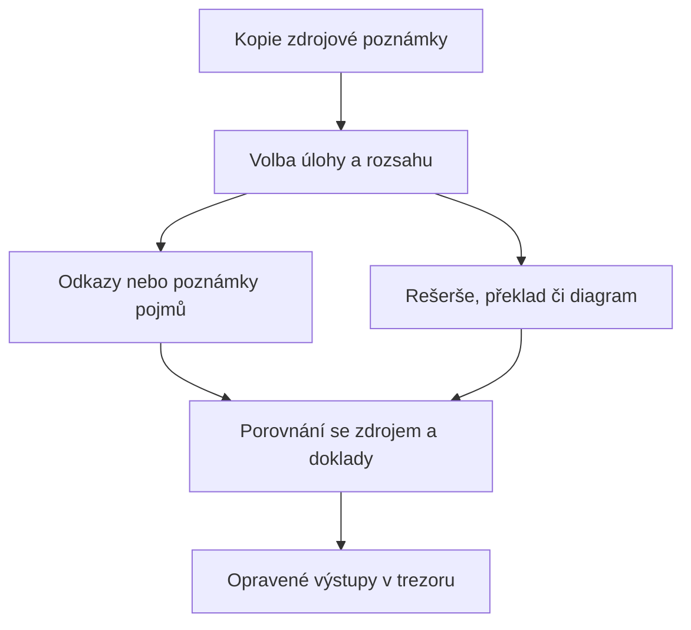

import TLDR from '@site/src/components/TLDR';

# Správa znalostí s AI v Obsidianu

<TLDR>Užitečný znalostní postup rozlišuje zdroj, obsah vytvořený modelem a vaše opravy. Notemd nabízí odkazy, extrakci, rešerši, překlad a diagramy jako kontrolovatelné soubory. Začněte jedním zdrojem, ověřte výsledek a pak automatizujte omezenou složku.</TLDR>

## Určete výsledek

Vyberte propojenou poznámku ke čtení, sadu pojmů, podloženou rešerši, překlad nebo diagram. Více souborů a odkazů automaticky nezlepšuje pochopení ani dohledání. Určete způsob kontroly a pozdějšího nalezení materiálu.

## Celý postup


```mermaid
flowchart TD
    A[Kopie zdrojové poznámky] --> B[Volba úlohy a rozsahu]
    B --> C[Odkazy nebo poznámky pojmů]
    B --> D[Rešerše, překlad či diagram]
    C --> E[Porovnání se zdrojem a doklady]
    D --> E
    E --> F[Opravené výstupy v trezoru]
```

Jde o dostupné úlohy, nikoli o tvrzení, že je všechny vykoná jedno výchozí tlačítko. Před sestavením postupu uchovejte zdroj a prověřte cíl každého kroku.

## 1. Wiki odkazy: výslovné vazby

Spusťte **Process file (add links)** na testovací poznámce. Ověřte sousední `_processed.md`, užitečnost termínů a věrnost citací, kódu a rovnic.

Zaměření a potlačení synonym usměrňují model, ale nevynucují přesnou ekvivalenci ani číselnou podobnost. Potřebujete-li opakovatelné odkazy na existující názvy, zvažte deterministické párování.

[Wiki odkazy](./features/wiki-links)

## 2. Pojmy: oddělte termín a vysvětlení

Před extrakcí vyberte složku pojmů. Samostatná extrakce vytváří pouze názvy a zdroj nemění. Pro `Linked From` v nových samostatných poznámkách povolte zpětné odkazy a vypněte minimální šablonu.

Extrakce a vysvětlování jsou samostatné operace. **Batch generate from titles** může doplnit i existující způsobilé poznámky vybrané složky. Testujte odděleně a prověřte hlášené přesuny do complete. Kontrola duplicit používá názvové heuristiky; podobný název není stejný technický pojem.

[Poznámky pojmů](./features/concept-notes)

## 3. Rešerše: dohledatelné zdroje

Vyberte téma nebo použijte název, nastavte Tavily/DuckDuckGo a spusťte **Research & summarize**. Prázdný klíč Tavily nepřepíná službu. Otevřete zdroje a ověřte hlavní tvrzení připojeného shrnutí.

Volitelné lokální hledání přidává vymezené úryvky. Index je lexikální a text jde vybranému LLM. Lokální indexování neznamená celou rešerši offline ani výhradně na zařízení.

[Rešerše](./features/research)

## 4. Překlad: význam a struktura

Zvolte výstupní jazyk a překlad souboru. Výchozí přípona je `_<language>.md`; existující cíl lze přepsat. Pasáž nejprve vložte do dočasné poznámky.

Porovnejte termíny, čísla, kód, odkazy a matematický zápis. Dlouhé texty se dělí a model může ztratit kontext mezi částmi. 21 jazyků UI a 34 cest webu neprokazuje kvalitu žádného jazykového páru.

[Překlad](./features/translation)

## 5. Diagramy: editovatelný artefakt

Vyberte více typů diagramů pro jeden běh a pro každý typ více výstupních formátů. Zrušení výběru zachová jeho formáty; bez vybraného typu se obsah analyzuje automaticky. Zaškrtávací políčko zahrne typ. Kliknutím na název jej vyberete a upravíte formáty. Přejetí ukazatelem nebo zaměření klávesnicí změní náhled bez uložení nastavení. Escape zavře nabídku a vrátí zaměření.

Používejte podporovaný katalog. CircuitikZ má omezené konstrukce a vlastní kontrolu kompilace. Statické šipky Drawnix mezi větvemi nezaručují připojení po přesunu. Opravy tabulek PowerPointu neruší obrazový fallback pro Mermaid/SVG.

[Diagramy](./features/diagrams)

## 6. Postupy: automatizujte ověřenou sekvenci

Syntaxe používá název, `::` a ID oddělená `>`. Výchozí postup:

```text
One-Click Extract::process-current-add-links>batch-generate-from-titles>batch-mermaid-fix
```

Provádí odkazy, generování ze složky názvů a opravu Mermaid. Nepřidává obecnou rešerši ani generování diagramu. Akce zachovávají předpoklady a výstupy; nejde o libovolnou textovou rouru.

Výchozí politika zastaví na hlášené chybě. Pokračování je vhodné jen tehdy, mohou-li další kroky použít zbývající vstupy. Zrušení zachová hotové soubory, není rollback.

[Postupy](./features/workflows)

## 7. Poskytovatelé: protokol a zátěž

36 profilů pokrývá pět protokolových rodin. Vyberte endpoint, modelová práva a datovou politiku podle úlohy. Před srovnáním rychlosti a ceny testujte stejný zdroj i prompt.

Směrování poskytovatelů/modelů podle úloh je vypnuté. Povolte jej záměrně a před označením postupu za lokální prověřte každou zapnutou cestu.

[Poskytovatelé](./providers/overview)

## Kontrolní seznam pro začátek

1. Nainstalujte plugin a zálohujte zdroje.
2. Nastavte a ověřte konkrétní profil/model.
3. Vyberte složku pojmů a odlišné cíle.
4. Spusťte jednu úlohu na kopii.
5. Porovnejte výstup a uchovejte opravy.
6. Před delším postupem ověřte malou složku a částečné dokončení.

## Běžné vzory

### Výzkumný článek

Převeďte článek externím nástrojem do Markdownu a nejprve ověřte vzorce, tabulky a obrázky. Extrahujte pojmy či původní pasáže, zkoumejte vybrané otázky a vytvořte diagram jen pro vztah, který dokážete ověřit. Uchovejte odkaz na originál i opravy.

### Sbírka pojmů

Použijte vyhrazenou složku, kontrolujte terminologii a vysvětlení generujte pro záměrně vybranou podmnožinu. Před odstraněním duplicit zálohujte. Více pojmů nenahrazuje správné definice a dobrou navigaci.

### Soukromý materiál

Připravte lokální server, modely a závislosti; ověřte směrování úloh a při požadavku offline vynechte síťovou rešerši. Diagnostiku před sdílením zkontrolujte. Výchozí loopback adresa nebrání změně profilu na vzdálený server.

### Přerušená dávka

Vyčkejte na ustálení zrušení či chyby. Čtěte zprávu, prověřte hotové i obnovené výstupy a konflikty a opakujte jen zamýšlenou práci. Zrušený stav neznamená prázdný výsledek. Doprovodné soubory nemažte bez kontroly odkazů.

## Dále

- [Rychlý start](./getting-started/quick-start).
- [Dávky](./advanced/batch-processing).
- [Vývojáři](./developers/overview).
- [Agent](./agents/overview).
