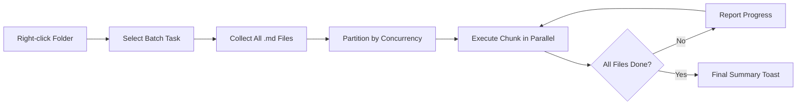

import TLDR from '@site/src/components/TLDR';

# Batchbehandling

<TLDR>
**Notemd bearbejder hele mapper i én handling med konfigurerbar samtidighed og kontrol over overskrivning.** Klik kraftigt på en mappe for at tilføje wiki-linker i batch, extrahere koncepter, gøre research eller oversætte alle notater derinde. Samtidighedsgrænser forhindrer API-fejl ved hastighedsbegrenninger. Fortgangen rapporteres for hver fil. Overskrivningsbehavioren er konfigurerbar: overskride ikke, tilføj til eller ersat. Felsatte filer registreres uden at batch-proceset afbruds.

Dette er en del af [Obsidian AI Knowledge Management Guide](/docs/pillar-ai-knowledge).
</TLDR>

## Översikt

Batchbehandling omvandler en mapp med notater til en enkelt operation. I stedet for at åbne hver notat og køre kommandoen individuelt, klicker du højre på mappen og vælger opgaven. Notemd gennemgår alle `.md` filer, applikerer den valgte handlingen og rapporterer fremgang i realtid.

Dette funktion er essentielt for at extrahere kunnskab fra hele vaultet. Efter at have importert desater af PDFs, f.eks. med batch-add-links følgt af batch-extract-concepts, bygges din knowledge graph på minutter i stedet for timer.

## Hvordan det virker

### Batchudførelsesmodell

1. **Filsamling** -- Notemd gennemgår målmappegen rekursivt (eller kun på toppniveau, afhængigt af indstillingerne) og samler alle `.md` filer.
2. **Konkurrencipartitionering** -- Filerne delges i blokker baseret på `batchConcurrency`-indstillingen. Hver blok kører parallelt; blokkene kører sekventielt.
3. **Udførelse** -- Hver fil behandles med samme logik som kommandoen for enkelt fil. Tillægsindstillinger for opgave og modell respekteres.
4. **Fortskabsrapportering** -- En toast-notifikation opdateres efter hver fil er afsluttet og viser `N / Total` forudsætning.
5. **Fejlhantering** -- Hvis en fil fejler (API fejl, netværkstimeout osv.), registreres fejlen og batchen fortsætter. Den sidste sammenfattelse listar alle fejlfulde filer.
6. **Ferdigstilling** -- En sammanfattende rapport giver information om det totale antal bearbetede elementer, succesfälle og misslyckanden.

### Overskrive betegnelse

Når en fil, der allerede har wiki-linker, konceptnoter eller oversættelser, behandles, afhænger Notemd's betegnelse af overskrivingsindstillingen:

| Modus | Betegnelse |
|------|----------|
| **Skriv forbi** | Den eksisterende indhold bliver lade være. Alleen uændrede filer behandles. |
| **Føj til** (standard) | Nyt indhold bliver tilføjet. De eksisterende wiki-linker, koncepter eller oversættelser bevares. |
| **Erstat** | Filen behandles fuldstændigt på ny. Alle tidligere Notemd-ændringer overskrives. |

Specifikt for wiki-linking: Hvis en note allerede indeholder `[[wiki-links]]`, lader **Skriv forbi**-modusen den være alene, mens **Erstat** sender hele noten til LLM for ny link-indsætning. Brug **Skriv forbi** for inkrementel behandling og **Erstat** for opdatering efter en modellopgradering.

### Konkurrenci-styring

`batchConcurrency`-indstillingen begrænser parallele API-kaller. Det forhindrer rate-limit-fejl (HTTP 429) ved behandling af store mappeler mod tjenester med strikte kvoter.

| Konkurrenci | Anbefales til | Typisk impact på rate-limiter |
|-------------|----------------|---------------------------|
| `1` | Gratis planer, strikte leverandører | Ingen (serial) |
| `3` (standard) | De fleste cloudleverandører | Lav |
| `5` | Ollama (lokalt), generøse planer | Ingen / Lav |
| `10` | Locale modeller med snabb inferens | Ingen |

Hvis du støder på 429-fejl under batchbehandling, reducér konkurrencien til 1 eller 2.

## Konfiguration

| Indstilling | Standard | Effekt |
|---------|---------|--------|
| `batchConcurrency` | `3` | Maximum parallel API anrop under mappoperasjoner |
| `batchOverwriteExisting` | `false` | Skriv over den eksisterende Notemd-indholdet. `false` = append-modus. |
| `batchSkipProcessed` | `false` | Undgå filer, der allerede indeholder Notemd-markører (f.eks. wiki-linker) |
| `batchRecursive` | `true` | Indkludere undermapper ved scanning af mappen |
| `enableStableApiCall` | `false` | Aktiver rettighedslogik (op til 4 forsøg) per fil under batch-proceset |

### Per-Task Models i Batch

Hver batch-operasjon bruger den tilsvarende per-task-model. Batch-add-links bruger `addLinksProvider`, batch-research bruger `researchProvider` osv. Det betyder, at du kan tildele billige modele for operationer med høj volumen og reservere dyre modele for opgaver, der kræver høj kvalitet.

## Eksempel

Du har en mapp `papers/` med 40 importerede forskningsnotater. Du vil tilføje wiki-linker og extrahere koncepter fra dem alle:

1. Klik højre på mappen `papers/`
2. Vælg **"Notemd: Process mappen (tilføj links)"**
3. Notemd skanner mappen, finder 40 `.md` filer og bearbejder 3 på gang (standardkonkurrenci)
4. En progress-tost viser: `12/40 files processed...`
5. Efter ca. 3 minutter rapporterer en sammanfattings-tost: `39 succeeded, 1 failed (API timeout on paper-37.md)`
6. Udgiv det igen med **"Notemd: Process mappen (udvinde koncept)"** for at skabe konceptnoter for alle 40

Den eneste fejlfulde fil registreres. Du kan derefter udføre processen kun på den fil.

## Tips

- **Start med lav konkurrenci** -- Hvis du er usikker på din leverandørs rate-limiter, start med `1` og øg gradvist.
- **Brug overskiftemodus for inkrementelle opdateringer** -- Efter den første fulde batch skift til `batchSkipProcessed: true` så kun nye noter behandles i efterfølgende udførelser.
- **Aktiver stabile API anrop** -- `enableStableApiCall: true` tilfører retry-logik som genoprævner sig fra tidsviske netværksfejl under lange batcher.
- **Udfør igen efter modellupgraderinger** -- Hvis du skifter til en bedre modell, sæt `batchOverwriteExisting: true` og udfør igen for at få bedre links og koncept.

---

## Næste trin

- [Workflows](/docs/features/workflows) -- Koble batch-opgaver til én-klik-sidemenu-knapper
- [Custom Prompts](/docs/advanced/custom-prompts) -- Anpass prompter for batchudvinning
- [Troubleshooting](/docs/advanced/troubleshooting) -- Løs problemer med rate-limiter og forbindelsesfejl under batchudvikling
- [LLM Tjänsteleverantörer](/docs/providers/overview) -- Referens för modellkonfiguration per uppgift
