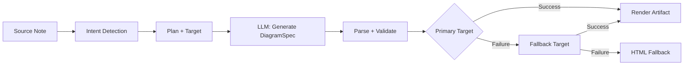
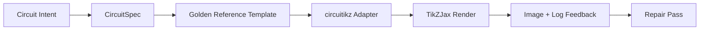

import TLDR from '@site/src/components/TLDR';

# Diagrammer

<TLDR>
**Notemd genererer diagrammer fra dine notater gennem en pipeline, der prioriterer specifikationerne.** LLM-en producerer en renderer-agnostic `DiagramSpec`-JSON-fil, som derefter oversettes til Mermaid, JSON Canvas, Vega-Lite, HTML, redigerbar HTML/SVG, Draw.io, Drawnix eller begrænsete circuitikz-output af speciale adapter. Det støder 9 typiske intentioner, automatiske fallback-kedjer, live-preview med eksport til SVG/PNG/PDF, semantisk verifikation og generering med forstærkning af lokale kunnskaber.
</TLDR>

Dette er en del af [Obsidian AI Knowledge Management Guide](/docs/pillar-ai-knowledge).

## Arkitektur: Spec-First Pipeline

Notemd beder aldrig LLM om at generere Mermaid/Vega/Canvas-syntaks direkte. I stedet:



**Hvorfor specifikation først?** LLM-filer genererer ofte ugyldig renderer-syntaks (særligt Mermaid). En struktureret `DiagramSpec` kan valideres før rendering, og samme specifikation kan bruges af flere renderere som fallback.

## Støttede diagramtyper

| Intent | Hovedrenderer | Fallback-mekanismer | Brugsscenario |
|--------|-----------------|-----------|----------|
| `mindmap` | Mermaid | HTML | Hierarkisk emneudeling |
| `flowchart` | Mermaid | HTML | Processfloder, beslutningstræer |
| `sequence` | Mermaid | HTML | Klient-server-interaktioner, protokoller |
| `classDiagram` | Mermaid | HTML | OOP-klasserelationer |
| `erDiagram` | Mermaid | HTML | Database-schemer, entitetsrelasjoner |
| `stateDiagram` | Mermaid | HTML | Stammaskiner, livscykelmodeller |
| `canvasMap` | JSON Canvas | Mermaid → HTML | Konseptkort, kunnskapsgrupper |
| `dataChart` | Vega-Lite | Mermaid → HTML | Stikker, linjer, arealer, sprølle, pizza, tabeller |
| `circuit` | circuitikz | ingen | Begrænsete circuit-diagrammer fra validerede `CircuitSpec`-data |

## Intent Detection

Notemd inferer den beste diagramtypen fra din beskeds innhold ved bruk av nøkkelordscoring:

| Intent | Triggers | Confidence |
|--------|----------|------------|
| `dataChart` | Tabeller, numeriske celler, metrik/trend-nøkkelord, prosenttilstander | 0.88 |
| `sequence` | Anmodning/svar-vokabular (4+ matcher) eller `->`/`=>`-marker | 0.82 |
| `erDiagram` | Primærknyt, fremmed knyt, entitet, schema (2+ matcher) | 0.80 |
| `stateDiagram` | Sted, overgang, i venting, i gang, feil (3+ matcher) | 0.76 |
| `flowchart` | Nummererte trinn (2+) eller if/then/else/workflow-vokabular | 0.74 |
| `canvasMap` | Konceptkort, kunnskapsgraph, rumlig, kluster | 0.72 |
| `circuit` | circuitikz, TikZJax, circuit, schematic, CMOS, NMOS, PMOS, MOSFET, VDD/GND, `vin`/`vout` | 0.78 |
| `mindmap` | Standardtilbakefall | 0.55 |

Øverstille med **Favoritdiagramtyp**-innstillingen, sidemenuvalgretet eller en eksplisitt kommandovalgmulighet.

## Vælg renderingsmål

Den eksperimentelle spec-first-pipeline-en har nå to uavhengige kontroller:

| Kontroll | Indstilling | Effekt |
|---------|---------|--------|
| Favoritdiagramtyp | `preferredDiagramIntent` | Styrer den semantiske formen for den genererte `DiagramSpec` |
| Favoritrenderingsmål | `preferredDiagramRenderTarget` | Vælger artefaktrendereren for **Generer diagram** og **Vis diagram** |

Stil **Preferred render target** til **Auto** for planlæggers standardvalg, eller vælg eksplisit Mermaid, JSON Canvas, Vega-Lite, HTML, Editable HTML/SVG, Draw.io, Drawnix eller Circuitikz. Denne override gælder kun kommandoen for artefakter og preview. Standardkommandot **Summarise as Mermaid diagram** forbliver fastsat til Mermaid-sykker output, så eksisterende Markdown-arbejdsmetoder ikke stillelt skifter format.

Dette afskillelse er vigtigt, fordi en `flowchart`-intention nu kan genereres som Mermaid for Markdown-notater, som HTML som robust fallback, som redigerbar HTML/SVG til videre editing, eller som Draw.io/Drawnix-kildeartefakter med SVG-review-filer. En `circuit`-intention dirigeres til Circuitikz og kræver en valideret `CircuitSpec`; det er ikke en anmodning om vilkårlig TikZ-text.
## Brug

### Generer et diagram

1. Åbne en note
2. Kør **"Notemd: Generer diagram"** fra kommandovalgmuligheten
3. Notemd oppdager intenten, genererer specifikasjonen, renderer og gemmer artefaktet

**Utdatafiler etter mål:**

| Mål | Ekstensie | Mønster for filnavn |
|--------|-----------|------------------|
| Mermaid | `.md` | `{note}_summ.md` |
| JSON Canvas | `.canvas` | `{note}_diagram.canvas` |
| Vega-Lite | `.json` | `{note}_diagram.json` |
| HTML | `.html` | `{note}_diagram.html` |
| Redigerbar HTML/SVG | `.html` | `{note}_diagram.html` |
| Draw.io | `.drawio` + `.drawio.svg` + `.drawio.md` | `{note}_diagram.drawio` sammen med review-filer |
| Drawnix | `.drawnix` + `.drawnix.svg` + `.drawnix.md` | `{note}_diagram.drawnix` sammen med review-filer |
| Circuitikz | `.tex` + `.tex.svg` + `.tex.md` | `{note}_diagram.tex` sammen med review-filer |

### Vis prøveversion af diagrammet

1. Kør **"Notemd: Vis prøveversion af diagrammet"**
2. En modal opnes med det renderede diagram
3. Ekspor til SVG, PNG eller PDF med hjælp af knapene på værktøjsbaren

**Automatisk åbning af prøveversion** er tilgængeligt i indstillingerne — efter generering starter prøveversionsmodalen automatisk.

Ekspor af preview i PNG og PDF bruger den konfigurerede preview PPI. Standardværdien er 300 PPI, og værdier over 600 PPI begrenses til 600. SVG forbliver vektorbaseret. Kildeartefakter som `.drawio`, `.drawnix` og `.tex` kan provide en `previewSvg`-fil, så Obsidian kan vise og eksportere billeder til review, uden at embede diagram.net, Drawnix, LaTeX eller TikZJax i pluginets kørsel.

Vedvirkningsmodalen har desuden en panel for diagnostic af artefakter. Renderere og smoke-tests kan tilføje `RenderArtifact.diagnostics`; modalen viser en sammanfattelse af diagnostikker med antal fejl/varninger/informationer, samt derefter graviteten, typen af diagnostik, meldingen og reparationstilbud ved siden af vedvirkningen. Sama sammanfattelse vises i historieposte, der understøtter diagnostik, så man kan sammenlægge flere forsøg på circuitikz-smoke-tests uden at åbne hver enkelt post. For artefakter, der har kildemateriale men ikke kan vedvirkes indlægt eller gennem HTML-iframe-paden, vender modalen nu til en vedvirkning kun med kildematerialet istedet for at påtvinge en tom iframe. Dette giver circuitikz-compilering/vedvirkning-smoke-tests, SVG-text-token-checker, PNG-blank-skrænshot-checker, rapporter om overlapp af glypher kun baseret på path, samt fremtidige overlapp-rapporter en synlig brugergrænsen, uden at gøre TikZJax eller LaTeX til en nødvendig plugin-runtime-afhængighet eller at simulere, at kildetekst er en verificeret visuel vedvirkning.

### LegACY Mermaid-modus

Når `enableExperimentalDiagramPipeline` er slået af, sender Notemd en direkte Mermaid-udfordring til LLM. Dette omgår hele specifikationspipelineen. Hvis den eksperimentelle pipeline fejler, falder systemet tilbake til denne modus.

## Rendering-backender

### Mermaid

6 adaptere (mindmap, flowchart, sequence, ER, class, state) oversætter `DiagramSpec` til Mermaid-syntax. Efter generering validerer `mermaid.parse()` udgangsteksten. Hvis valideringen fejler:

1. **LLM gennemfør igen** — en forsøg med Mermaid-fejlmeddelelsen som kontekst
2. **Minimal tilbakefall** — et enkelt Mermaid-diagram baseret på specifikationsnods IDs

**Legacy Mermaid Fixer** reparerer automatisk vanlige LLM syntaxfejl: normalisering af note-directiver, undslip af pipe-label, omposition af semikoloner, smart quotes, dubbelstrich-pilarer, formmismatch og meget mere.

### JSON Canvas

Genererer Obsidian JSON Canvas-format med rumslig layout:
- Nodeer placeres efter dybde (x = dybde × 420) og indeks (y = indeks × 170)
- Bredden bedmes fra labellengden
- Kanter med `fromSide: 'right'`, `toSide: 'left'`, `toEnd: 'arrow'`

### Vega-Lite

Skaber komplette Vega-Lite v5 JSON-specifikationer med automatisk kodning:
- **Cartesian charts** (stange/række/område/punkt/spred): x + y-kanaler + farve for flere serier
- **Pie**: theta = y (kvantitativt), farve = x (nominalt)
- **Table**: række = x, tekst = y + kolonne = serie

Dunkle og lige temaer blandses sammen før kompilering.

### HTML

Universel fallback. Selvstændig HTML-dokument med:
- CSP-meta-headerer
- Ligt/dunkelt modus gennem `prefers-color-scheme`
- Localiserede UI-labeler for 20 lokale språk
- Sektioner: hero, struktur (node-træ), relationer, callouts, data-serie-tabeller

### Redigerbar HTML/SVG

Eksplicit figur mål for redigerbare eksportarbejdsmønster. Det projicerer `DiagramSpec` ind i et deterministisk `SemanticFigureModel`, og renderer derefter en selvstændig HTML dokument med inline SVG grupper, der indeholder Draw.io-stil annoteringer:

- `data-drawio-type`, `data-drawio-id` og `data-drawio-role` på semantiske node'er
- `data-drawio-source` og `data-drawio-target` på semantiske kante'er
- stabile node/kante-identer efter normalisering af mellemrum og hantering af kollisioner
- ingen script'er, ingen eksterne fonter og ingen fjernressourcer

Dette mål er med vilje ikke den standardmæssige planlægningsroute endnu. Det er tilgængeligt som et eksplicit rendermål, mens produktvejen prøver redigeringsbehavior i virkelige værktøjer.

### Draw.io og Drawnix Eksportgrænser

Den nuværende implementeringen holder stødet for tredjeparts-redigeringsverktyg på grænsen til artefaktet, mens den stadig exponerer eksplisite renderingsmål:

| Mål | Kontrakt | Kørtidsafhængighed |
|--------|----------|--------------------|
| Draw.io | deterministisk, ukomprimeret `mxfile`-XML fra `SemanticFigureModel`, plus SVG/PNG/PDF-granskningsfiler | ingen i pluginets kørsel eller CI |
| Drawnix | et minimalt JSON-undermengde af `.drawnix` med elementer som `geometry` og `arrow-line`, plus SVG/PNG/PDF-granskningsfiler | ingen i pluginets kørsel eller CI |

Kompromissen er medveten: Notemd kan verificere synlige labeler, stabile ID'er og støttet primitivoverskydning uden at embede diagrams.net Desktop, Drawnix, Plait eller browser-eksklusive redaktorstat i pluginen.

### circuitikz / TikZJax Retning

Kretsdiagrammer er ikke det samme problem som generelle flødeplaner. Den korrekte syntaxmålet for elektriske kretsler er vanligvis **circuitikz**, renderet i Obsidian gennem pluginer som TikZJax. TikZJax kan lade op pakker som `circuitikz`, `pgfplots`, `tikz-cd` og `chemfig`, hvilket gjør det attraktivt for notater om fysik, kretsler, kemie og matematik.

Risikoen er, at rå LLM-genereret TikZ er brækkelt:

- Komplekse kretstopologier kan være elektrisk korrekte, men visuelt uleselige;
- Overlappende værter og etiketter kan gøre en korrekt netlist ubrugbar for studienotater;
- Faldne pakkepreambler, fejlige anker eller ugyldige komponentnavne kan forhindre rendering;
- Feedback fra rendereren er vanligvis på billedniveau, mens LLM genererer tekstniveau geometri.

Den bedre arkitekturen er at behandle circuitikz som et begrænset diagrammål, ikke som en friform-udfordring:



Modellen i første klasse bør beskrive kretstopologi og layout separat:

| Lager | Ansvar | Eksempel |
|-------|----------------|---------|
| Topologi | elektriske noder og komponentforbindelser | `VDD -> RD -> drain(M1)`, `source(M1) -> GND` |
| Layout | gridplacering, orientering, routingbaner | `M1 at (3,2.2)`, indgang venstre, udgang højre |
| Stil | pakke, spenningkonvention, etiketter, anker | `\begin{circuitikz}[american voltages]` |
| Validering | kompilationslog, manglende anker, overlæg/skærmbildsugnskontroller | TikZJax/LaTeX-diagnostik plus visuel gennemgang |

### Aktuel circuitikz-prototyp

Notemd inkluderer nu den første begrænsete repository-prototyp for denne retning. Den er medvetent offline og bundet til en template:

```bash
npm run diagram:export-circuitikz -- --input cmos-inverter.json --output cmos-inverter.tex
```

Prototypen tilfører en begrænset `CircuitSpec`-grænse samt en deterministisk eksporter for sex guldstandard-familier:

I den eksperimentelle diagramm-pipeline er dette nu også tilgængeligt gennem `intent: "circuit"` og renderingsmål `circuitikz`. Den genererede `DiagramSpec` kan kun embede `circuitSpec` for circuit-intent. `CircuitikzRenderer` skriver samme deterministiske `.tex`-kilde og tilføjer en SVG-forhandsvisning, der er afledt fra den validerede krets-topologi, hvilket muliggør forhandsvisning i Obsidian samt eksport til SVG/PNG/PDF. Denne forhandsvisning er ikke et resultat af en LaTeX/TikZJax-kompilering; den virkelige rendererbevislig information findes stadig i de eksplisite smoke-commander nedenfor.

For de understøttede guldstandard-mallene bliver `layoutHints.inputSide` og `layoutHints.outputSide` kun kontroller til præsentation. De kan flytte den deterministiske placering af ind-/udgangsporten, men de ændrer ikke topologiens signatur eller tillader en reparationsgang for at omkabele kretsen.

| Kretsart | Guldreferens | Strømgaranti |
|--------------|------------------|-------------------|
| `common-source-amplifier` | `common-source-nmos-v1` | validerer `VDD -> R_D -> M1.D`, `vin -> M1.G`, `M1.S -> GND` og `M1.D -> vout` før skrivning af LaTeX |
| `cmos-inverter` | `cmos-inverter-v1` | validerer PMOS-over-NMOS-topologi, delte gate-indgang, delte drain-udgang, `VDD -> MP.S` og `MN.S -> GND` før skrivning af LaTeX |
| `cmos-buffer` | `cmos-buffer-v1` | validerer to kaskerede inverterstager, midlertidig node `vmid`, restaureret `vout` og delte VDD/GND-railer før skrivning af LaTeX |
| `cmos-transmission-gate` | `cmos-transmission-gate-v1` | validerer parallele PMOS/NMOS-pass-enheder mellem `vin` og `vout` med komplementære `phib` / `phi`-styringer før skrivning af LaTeX |
| `cmos-nand2` | `cmos-nand2-v1` | Validerer parallell PMOS pull-up, seriell NMOS pull-down, dobbel indgange `va` / `vb`, og `vout` før skrivning af LaTeX |
| `cmos-nor2` | `cmos-nor2-v1` | Validerer seriell PMOS pull-up, parallell NMOS pull-down, dobbel indgange `va` / `vb`, og `vout` før skrivning af LaTeX |

Dette er ikke en generel TikZ-generator. Den accepterer ikke vilkårlig TikZ-kode, kompilere LaTeX, kalle på TikZJax, undersøge skærmbilder i pluginets kørsel, eller udføre automatiseret reparationsprocess for billeder. Disse funktioner er fortsat planlagt til senere trin.

Kommandoen Preview diagram kan åbne gemte circuitikz-kildeartefakter direkte, når filendelsen er `.tex` eller `.tikz` og kilden indeholder `\usepackage{circuitikz}` eller `\begin{circuitikz}`. Dette er en circuitikz-kilde-eksklusiv preview: modalen viser kilden, diagnostik, kopier/søj-kontroller og historie-metadater, men den kompilerer ikke LaTeX eller kaller ikke TikZJax under plugins kørsel.

Den samme kilde-eksklusive preview-grense omfatter nu gemte Draw.io og Drawnix-artefakter. `.drawio`-filer accepteres, når de ser ud som Draw.io XML (`mxfile` eller `mxGraphModel`), og `.drawnix`-filer accepteres, når de er Drawnix JSON med `type: "drawnix"` og en `elements`-array. Pluginen embedder stadig ikke diagrams.net eller Drawnix-whiteboard-værdigheder; disse previews viser kilden, diagnostik og artefaktshistorie uden at kræve en in-plugin-visuel editor.

For topologibeholderende reparation skal den forreparations-specifikation sendes som referens før en reparerede kandidat accepteres:

```bash
npm run diagram:export-circuitikz -- --input repaired-cmos-inverter.json --topology-reference cmos-inverter.json --output cmos-inverter.tex
```

Reparationsværnet bruger `createCircuitTopologySignature` og `assertCircuitTopologyUnchanged` til at sammenligne `circuitKind`, `goldenReferenceId`, netter, komponentids/typer/terminaler og uorienterede forbindelsesendpunkter før udskrift. Etiketter, titeltekst, layout-hinters, forbindelsesordning og forbindelsesetiketter ignoreres med vilje. En kandidat, der tilføjer noget kort eller omformer en terminal, mistager med `Circuit topology drift detected` før `.tex`-filen skrives.

Den CLI kan nu parse en eksisterende LaTeX/TikZJax-kompilationslog uden at køre en kompilator:

```bash
npm run diagram:export-circuitikz -- --input cmos-inverter.json --output cmos-inverter.tex --compile-log cmos-inverter.log --diagnostics-output cmos-inverter.diagnostics.json
```

Dette diagnostiske felt rapporterer manglende pakker som `circuitikz.sty`, ukendte TikZ/circuitikz-klæder, TikZ-syntaxfejl som manglende semikoler, ukontrollerede argumenter fra ubalancerede parenteser eller uafsluttede etiketter, udefinerede kontrolsekvenser, generelle LaTeX-fejl, nødslutninger og råd om overfuld `\hbox`. Det forbliver log-baseret: lokal LaTeX/TikZJax-udvikling og skærmbildkvalitetsgader er stadig separate fremtidige arbejde.

For vedligeholders smoke-checks kan den samme CLI valgfrit køre en eksplisitt konfigureret renderer uden shell-kommando-parsing:

```bash
npm run diagram:export-circuitikz -- --input cmos-inverter.json --output cmos-inverter.tex --compile-executable pdflatex --compile-arg -interaction=nonstopmode --compile-arg -halt-on-error --compile-arg -output-directory={outputDir} --compile-arg {tex} --expected-artifact {outputDir}/{jobName}.pdf
```

Kompilationskøreren bruger `shell: false`, ekspanderer `{tex}`, `{outputDir}` og `{jobName}`-placeholder til argument-array-værdier, læser den genererede `{jobName}.log` og returnerer `compileExecution` plus `compileDiagnostics` i CLI JSON-udskrift. `--compile-executable` er kun renderer-binaryen eller wrapper-paden; renderer-flag er indlagt i gennemgående `--compile-arg`-værdier. Tomme exekutabler mistager som `compile-executable-invalid`, manglende binaries mistager som `compile-executable-not-found`, og exekutabelstrenger i shell-kommando-format modtager råd til at splitte argumenter så Windows, Linux og macOS følger samme direkte-udviklingskontrakt. Med `--expected-artifact` rapporteres også `compileExecution.renderSmoke` og mistages CLI, hvis rendereren ikke skaber et ikke-tomt artefakt. Den embedder stadig ikke LaTeX, gør ikke af TikZJax en plugin-kørselsafhængighed, eller udfører skærmbildnivås visuel reparation.

Hvis det forventede artefakt er `.svg` går smoke-checken en lag dybere:

```bash
npm run diagram:export-circuitikz -- --input cmos-inverter.json --output cmos-inverter.tex --compile-executable dvisvgm --compile-arg ... --expected-artifact {outputDir}/{jobName}.svg --expected-svg-text v_{in} --expected-svg-text v_{out}
```

SVG smoke verificerer `<svg>`-rotten, positive dimensoner eller `viewBox`, minst én synlig tegningselement efter at have udelagt skjulte/transparente elementer, alle forespurgte teksttokener, tydelige elementer udenfor `viewBox`, tydelige overlappende positionerede `<text>` / `<tspan>`-etiketter, og tydelige tekstetiketter, der overlapper tegningselementer gennem `render-svg-label-overlap`. Forventet tekst søges i synlig tekst og dekoderes tilgænglighedsmetadater som `aria-label`, `<title>` og `<desc>`, så rendererer, der bevarer semantiske etiketter udenfor synlige `<text>`, kan stadig opfylde tekst-token smoke uden at kræve OCR. Geometri-passen er nu transform-beredt geometri for algemene gruppe- og element `transform`-attributter, så oversatte, skalerte, roterte, skevte eller matrix-transformerede SVG-bokser kontrolleres efter transform-komposition. Den omfatter præcise bøgergrænser for A/a-bøgers ekstrema, præcise Bezier-kurvegrænser for C/S/Q/T-kurveekstrema, SVG-grænser med bevaring af strejkbredde og kontroller for etiketteroverlappelse, `polyline` / `polygon`-tegningsgeometri, samt løsning af path-eneste glyph-placering fra `<use href="#...">`-referencer, så etiketter, der konverteres til brugbare glyph-pader, kan stadig mistage bounded-canvas-kontroller, når placerede glyph-geometrien udgår for `viewBox`. Mere positionerede `tspan`-etiketter under en `<text>`-forælder sammenlignes som separate etiketterbokser, hvilket fånger LaTeX-stil SVG-udskrift, der andetvis ville samle forskellige etiketter til én tekstnode. Positionerede SVG `text` og `tspan`-bokser respekterer `text-anchor`-værdier `start`, `middle` og `end`, så centrerede og højre-alignerte etiketter kan triggere tekst/text- og etiketter-vs-tegningsoverlappelse-diagnostik, uden at kræve browsergraden tekstlayout. Definition-eneste glyph-pader indenfor `<defs>` regnes ikke som synlige tegningselementer, men deres egne definition-lokalte `transform`-attributter applies før `<use>`-placering, så skalerte eller spejlret glyph-definitioner underskales ikke. Etiketter-vs-tegningskontrollen bruger en liten toleranse for tegningsboks og den deklarerede `stroke-width`, så tynne værter, tynde værter og polygonale komponentoutliner kan alle betraktes som potentielle etiketterlæsbarhedsfejl, når deres synlige strejk nåer en etikette. Path-eneste glyph-etiketter, løst fra `<use href="#...">`, sammenlignes også med tegningsboksser og mistager med `render-svg-path-glyph-overlap`, hvis brugbare glyph-geometri overlapper værter eller komponenter. Hvis en renderer konverterer etiketter til brugbare path-glyph i stedet for søgbare `<text>` og ikke bevarer tilgænglighedsmetadater, registreres `pathOnlyGlyphUseCount` i smoke-rapporten og mistages den forespurgte teksttoken gennem `render-svg-text-path-only`, istedet for at simule, at etiketten er enkelt afværende. Andere fejl rapporteres gennem `render-svg-invalid`, `render-svg-dimension-missing`, `render-svg-no-visible-elements`, `render-svg-text-missing`, `render-svg-out-of-bounds`, `render-svg-text-overlap`, `render-svg-label-overlap` eller `render-svg-path-glyph-overlap`. Text-token- og overlappelsekontroller skal kun betraktes som strukturel smoke for rendererer, der bevarer etiketter som søgbare SVG-tekst eller tilgænglighedsmetadater; path-eneste SVG-udskrift kræver stadig den senere skærmbild/OCR-gade for at bevisse visuel etiketterlæsbarhed, og denne smoke-pass gør stadig ikke krav på fuld SVG-path-kovering.

Skjulte SVG-grupper og elementer overskues konsekvent under talling af synlige elementer og geometri-samling. Attribut eller inline-stil `display:none`, `visibility:hidden`, `visibility:collapse` og det overgripende `opacity:0` kan ikke gøre en andetvis tom renderartefakt til at klare synlig-output smoke.

Path-eneste glyph-definitioner kan være direkte pather eller grupperet/symbolcontainer indenfor `<defs>`. Smoke-passen løser child-path-geometri fra `<g id="...">` og `<symbol id="...">` før `<use>`-placering, så indpakket glyph-udskrift fedes stadig til `pathOnlyGlyphUseCount`, bounded-canvas-kontroller og `render-svg-path-glyph-overlap`.

Path-parseren følger også subpath-start og resetter den aktuelle punkt på `Z/z`, så relative kommandoer efter en lukket subpath fortsætter fra den korrekte SVG-punkt i stedet for at skabe falske `render-svg-out-of-bounds`-diagnostik.

Den samme geometriprocessen følger SVG nummerregler for decimaltal med først komma og eksplisite plustegn, så kompakte dvisvgm-koordinater som `.5`, `-.5` eller `+.5` forbliver fractionale under grænsekontroller istedet for at blive ugyldige geometrier eller overskudt.

Hvis rendereren udskriver `.png`, bliver den samme forventede-artefakt-påvej en første skærmbildsmoke: Notemd dekoderer ikke-interlaced 1/2/4/8-bit indeksert-farge PNG-filer, 1/2/4/8/16-bit gråskala PNG-filer, og 8/16-bit gråskala-alpha/RGB/RGBA PNG-filer. Indekserte-farve- og sub-byte gråskala-bilder understøtter pakketprover; indekserte-farve-bilder understøtter også PLTE og valgfrit tRNS-data; gråskala/RGB-bilder understøtter tRNS transparente prover. 16-bit direkte prover normaliseres til samme 8-bit RGBA sammenligningsrum brugt af smoke-kontrollene. Smoke-kontrollen overvåger positive dimensoner, registrerer fremgrundsgrænser som `foregroundBounds`, registrerer fremgrundsstyrke indenfor den box som `foregroundDensity`, fejler med `render-png-blank` når hver synlige pixel matcher den øverste venstre baggrundsfarve, fejler med `render-png-content-clipped` når fremgrundsindhold berører billedgrænsen, fejler med `render-png-foreground-too-small` når en stor skærmbild har mindre end fire fremgrundspixel, og fejler med `render-png-foreground-dense` når fremgrundspixel er uvanligt tette indenfor en ikke-triviel bounding box. Ustøttede PNG-format fejler med `render-png-unsupported` og format-specifik råd for Adam7 interlaced PNGs eller ustøttede indekserte-farve-bitdypper. Dette fånger tomme skærmbilder, udelukkende canvas-klipning, underrenderede fremgrundsfootprint, første pixel-nivås overfladefejl, og fejlige renderer PNG-eksportindstillinger uden at tilføje platform-specifik shell-afhængigheder. Det er ikke endnu OCR-niveau label-indfølsning, præcist tekst-overlappingsdetektion, eller topology-bevarende billedreparation.

Når diagnostikken viser en fejlt kompilering eller render-smoke-køring, kan CLI også skrive en topology-bevarende reparationsbeskrivelse:

```bash
npm run diagram:export-circuitikz -- --input cmos-inverter.json --topology-reference cmos-inverter.json --output cmos-inverter.tex --compile-log cmos-inverter.log --repair-brief-output cmos-inverter.repair-brief.json
```

Reparationsbeskrivelsen bruger schema `notemd.circuitikz.repair-brief.v1` og indeholder kilden `CircuitSpec`, topology-signatur, kompilér/render-diagnostik, tillatte ændringer, forbudte topology-ændringer, næste verifiseringsskridt, og en strukturret `repairPrompt`. Prompt-rollen er `topology-preserving-circuitikz-repair`; dess `diagnosticFocus`-liste kommer fra kompilér/render-diagnostikken, og dess `acceptanceCriteria` kræver kandidatvalidering samt nye kompilér- og render-smoke-kontroller. Det er overførselsformatet for en senere reparationsloop, ikke en påståelse om at Notemd allerede kører autonom visuel reparasjon.

Efter at en reparationskandidat er produceret, kan samme CLI valideres mod beskrivelsen før udskrift:

```bash
npm run diagram:export-circuitikz -- --input repaired-cmos-inverter.json --repair-brief cmos-inverter.repair-brief.json --output repaired-cmos-inverter.tex
```

`--repair-brief` kontrollerer kandidats topology-signatur fra beskrivelsen og er uoverensstigende med `--topology-reference`. At klare denne gate beviser kun topology-bevaring; kandidaten behøver stadig kompilér-diagnostik og render-smoke-kontroller.

`--repair-brief` resultatet inkluderer også `repairAcceptance` bevis med schema `notemd.circuitikz.repair-acceptance.v1`. Det rapporterer `topology-signature`, `compile-diagnostics` og `render-smoke` gate som `passed`, `failed` eller `missing`; offentliggør `remainingChecks`; og holder `readyForVisualAcceptance` falskt indtil kandidatkøretagen indeholder alle nødvendige bevis.

Brug `--repair-acceptance-output` med `--repair-brief` når CI eller release-bevis behøver et varigt JSON fil:

```bash
npm run diagram:export-circuitikz -- --input repaired-cmos-inverter.json --repair-brief cmos-inverter.repair-brief.json --output repaired-cmos-inverter.tex --repair-acceptance-output repaired-cmos-inverter.repair-acceptance.json
```

For release- eller maintainer-bevis, kør alle understøttede golden familier gennem den samlede fixture-runner:

```bash
npm run diagram:smoke-circuitikz -- --output-dir docs/export/circuitikz-smoke --compile-executable pdflatex --compile-arg -interaction=nonstopmode --compile-arg -halt-on-error --compile-arg -output-directory={outputDir} --compile-arg {tex} --expected-artifact {outputDir}/{jobName}.pdf
```

Runneren bruger `docs/maintainer/fixtures/circuitikz/common-source-nmos-v1.json`, `docs/maintainer/fixtures/circuitikz/cmos-inverter-v1.json`, `docs/maintainer/fixtures/circuitikz/cmos-buffer-v1.json`, `docs/maintainer/fixtures/circuitikz/cmos-transmission-gate-v1.json`, `docs/maintainer/fixtures/circuitikz/cmos-nand2-v1.json` og `docs/maintainer/fixtures/circuitikz/cmos-nor2-v1.json`, kaller den samme shell-fri exporter-påvej for hver fixture, og returnerer en samlet JSON rapport med per-fixture `compileExecution` og `compileDiagnostics`. Det er stadig en maintainer-kommando, ikke en plugin runtime-afhængighed.

Når en maintainer-maskine har ingen renderer konfigureret endnu, kør den samme fixture-kommando uden `--compile-executable` og gemm den miljøgate eksplisit:

```bash
npm run diagram:smoke-circuitikz -- --output-dir docs/export/circuitikz-smoke --report-output docs/export/circuitikz-smoke/renderer-availability.json
```

Denne påvej skriver stadig den deterministiske fixture `.tex` artefakterne, men returnerer `ok: false` med `rendererAvailability.status` sat til `missing-configuration` og en `compile-executable-invalid` diagnostic. Behandle det som kun evidence for renderer-tilgængelighed; det er ikke kompilér, render-smoke, eller visuel acceptation.

### Golden Reference Prompt Shape

For nær fremtidsbrug, fornøj en renderbar golden reference før du beder om en circuit-variant. En begrænset prompt bør bevare preamblen, koordinatskala, ankerstil og routingskonventioner:

```latex
\usepackage{circuitikz}
\begin{document}
\begin{circuitikz}[american voltages]
\draw
  (3,5) node[vcc]{$V_{DD}$}
  to [R, l=$R_D$] (3,3)
  to [short, *-o] (5,3) node[right]{$v_{out}$}
  (3,3) to [short] (3,2.2)
  node[nmos, anchor=D] (M1) {$M_1$}
  (M1.S) to [short] (3,0.5)
  node[ground]{}
  (M1.G) to [short, -o] (0.8,2.2)
  node[left]{$v_{in}$};
\draw
  (3,0.5) node[below right]{$S$};
\end{circuitikz}
\end{document}
```

For en CMOS inverter skal prompten forespørgse en eksplisit topology plus layout-begrænsninger, ikke kun "draw a CMOS inverter":

- hold `VDD` på toppen, `GND` på bunden, indgang på venstre, udgang på højre;
- Brug `pmos` over `nmos`, med delte gader og delte dræner;
- Hold output-nodeet ved dræn-junctionen og marker det med `*-o`;
- Brug navngiveede ankerpunkter (`PM1.G`, `NM1.G`, `PM1.D`, `NM1.D`) i stedet for visuelt aflede koordinater;
- Undgå diagonale eller krydende værktøjer, så langt som det ikke er nødvendigt elektrisk.

### Aktuel fremgang og næste fase

| Areal | Aktuel status | Næste trin |
|------|----------------|-----------|
| Almene diagrammer | Spec-first pipeline implementeret for Mermaid, JSON Canvas, Vega-Lite, HTML | Hold kontinuerlig udvidelse af semantisk verifikationsomfattelse |
| Redigerbare figurer | `editable-html-svg`, Draw.io XML, og Drawnix JSON artefaktgrænser implementeret | Tilføj mere komplekse primitive kun efter at tester har beviset redigerbarhed |
| CLI-støtte | `npm run diagram:export-artifact` eksporterer redigerbare HTML/SVG-, Draw.io-, Drawnix-, Circuitikz- og SVG/PNG/PDF-filer som bevis for granskning fra en valideret `DiagramSpec` | Tilføj målspesifikke smoke fixtures når nye mål lanceres |
| circuitikz | `DiagramSpec(intent: "circuit", circuitSpec) -> CircuitikzRenderer -> circuitikz` eksporterer guldtempler for common-source, CMOS inverter, `cmos-buffer` / `cmos-buffer-v1`, `cmos-transmission-gate` / `cmos-transmission-gate-v1`, `cmos-nand2` / `cmos-nand2-v1` og `cmos-nor2` / `cmos-nor2-v1`, viser UI-intent og render-target-valgmuligheder, skriver TeX sammen med SVG/PNG/PDF-forhandsvisningsfiler, validerer topologien før udskrift, parserer kompilationslogger, kan køre eksplisite lokale renderer samt `--expected-artifact`, og holder tilbage en fallback med kun kilden samt forhandsvisningsdiagnostik synlig gennem `RenderArtifact.diagnostics` og forhandsvisningsmodalen | Tilføj OCR-niveau labelgenkendelse for visuel tekst, der kun består af pather, præcise pixelnivå-overlappingskontroller, bredere SVG-path-overskydning hvor det er nødvendigt, automatisk installering/udvikling af renderer kun hvis det kan blive valgfrit, samt automatiseret reparationsudførelse for at bevare topologien |
| TikZJax integration | Kandidatrenderingsværksted for Obsidian-side visning | Lad det være valgfrit; gør ikke TikZJax til en hard plugin runtime afhængighed |

## Konfiguration

| Indstilling | Standard | Effekt |
|---------|---------|--------|
| `enableExperimentalDiagramPipeline` | `false` | Vendel mellem spec-first og legacy Mermaid |
| `experimentalDiagramCompatibilityMode` | `'legacy-mermaid'` | `'legacy-mermaid'` = Mermaid kun; `'best-fit'` = nativ mål + fallbacks |
| `preferredDiagramIntent` | `undefined` (auto) | Overrask automatisk intent detection |
| `preferredDiagramRenderTarget` | `undefined` (auto) | Overskrive artefaktrendereren, herunder Draw.io, Drawnix og Circuitikz |
| `summarizeToMermaidLanguage` | `'en'` | Målsspråk for diagramlabeler |
| `summarizeToMermaidProvider` / `Model` | DeepSeek | Per-opgave LLM for diagramgenerering |
| `autoMermaidFixAfterGenerate` | (fra konstanter) | Kør automatisk legacy fixer på Mermaid output |
| `enableLocalKnowledgeForDiagramGeneration` | `false` | Øge kilden med lokal vault-kunnskab |

### Local Knowledge Augmentation

Når det er aktiveret, henter Notemd relevante kontekstudsnit fra vaultens lokale kunnskapsbas (baseret på MiniSearch) og fører dem foran kilden i markdown-formatet. Augmenteringsopmærkelsen lyder: "Kun stødjende referencer; hold den primære strukturen trofast til kilden."

### Samsætningstilstande

- **`legacy-mermaid`**: Alle intenter dirigeres til Mermaid. Intenter, der ikke er Mermaid (canvasMap, dataChart), tvinges til `flowchart` eller `mindmap`. Ingen fallback-kedje.
- **`best-fit`**: Hver intent dirigeres til sin egne naturlige mål. Hvis det primære fejler, gennemgår den fallback-kedjen (f.eks. Vega-Lite → Mermaid → HTML).

## Forskyvning og eksport

| Aktion | Metode |
|--------|--------|
| SVG export | `mermaid.render()` / `vega.View.toSVG()` / SVG builder for Canvas |
| Ekspor til PNG | SVG → Bild → Canvas / preview-rasteriseringsverktyg ved konfigureret PPI → PNG ArrayBuffer |
| Ekspor til PDF | SVG → rasterbild ved konfigureret PPI → enkeltsides PDF |
| Sparing af kilde | Rå artefaktindhold gemmes med extension, specifik for målet |
| Forskyvning kun af kilden | Ikke-inline artefakter med kildematerial vises som kod samt diagnosticer, uden iframe-rendering |
| Semantisk audit | Mermaid, JSON Canvas, Vega-Lite, redigerbar HTML/SVG, Draw.io, Drawnix og begrænset Circuitikz kontrolleres af `scripts/diagram-semantic-verification.js` samt renderer/CLI-tester |

**Caching**: RenderCache bruger en deterministisk JSON-klæde fra `{spec, target, theme}`. Afvikling under bearbejdelse forhindrer dupliske renderinger.

## Tips

- **Start med `best-fit`-modus** — det giver den bedste visuelle output for hver intent-type
- **Brug kraftfulde modeller for komplekse diagrammer** — flødeplaner og ER-planer nyter fordel af GPT-4o eller Claude
- **Aktiver lokal kunnskab** for domænsspecifikke diagrammer — relevant vault-context forbedrer nogenigheden
- **Stil `autoMermaidFixAfterGenerate`** — Mermaid-syntaxfejl er vanlige uden det
- **Den gamle fixer er omfattende** — hvis Mermaid-preview fejler, løser man ofte det ved at køre fixeringskommandoen manuelt

---

## Næste trin

- 🔗 [Wiki-Links](./wiki-links) — Hvordan koncepter kobles indlignende
- 📝 [Concept Notes](./concept-notes) — Extraher koncepter til diagramkildematerial
- 🔍 [Research](./research) — Tilføj data fra web for at forbedre diagrammer
