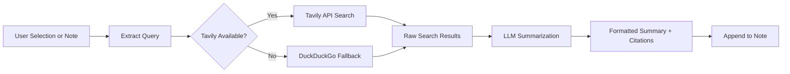

import TLDR from '@site/src/components/TLDR';

# Forskning og websearch

<TLDR>
**Notemd undersøger webben og injicerer LLM-sammanfattede resultater direkte i dine notater.** Tavily API er den primære søgebakendem; DuckDuckGo fungerer som en zero-config fallback. Resultaterne sammanfattas med kilder og tilføjes under en `## Research` overskrift. Støder forskning i enkelt noter, batch-forskning i mapper og valg af modell for sammanfattningsstegen per opgave.

Dette er en del af [Obsidian AI Knowledge Management Guide](/docs/pillar-ai-knowledge).
</TLDR>

## Översikt

Forskning er en af Notemd's mest kraftfulde integreringer: den lukker sikken mellem læsning, søgning og skrivning. I stedet for at skifte til en browser for at finde en ukendt term, markerer du den og lader Notemd søge, sammanfattige og tilføje resultaterne -- alt indenfor din vault.

Processen er fuldstændig konfigurerbar. Du velger søgeudbyderen, den LLM som skriver sammanfattelsen, og hvilket resultat der tilføjes til den aktive note eller skrivs i separate filer. Batch-modus muliggør at forske i alle noter i en mappe med én klik.

## Hvordan det virker

### Søg-og-sammanfattingspipeline



1. **Utdrag af spørgsmål** -- Notemd udtrækker søgeord fra din valg eller notetitlen.
2. **Websearch** -- Tavily forsøges først. Hvis ingen API-klæde er konfigureret, bruges DuckDuckGo automatisk (ingen klæde nødvendig).
3. **LLM-sammanfattning** -- Rå søgeresultater sendes til den konfigurerede LLM, som genererer en kort sammanfattelse med inline-kilder.
4. **Tilføj** -- Den formaterede sammanfattelse tilføjes under en `## Research` overskrift i den aktive note.

### Tavily vs. DuckDuckGo

| Aspekt | Tavily | DuckDuckGo |
|--------|--------|------------|
| API-klæde | Nødigt (fri plan tilgængelig) | Ikke nødvendigt |
| Resultkvalitet | Højere (specielt designet for AI) | Dygtig til almindelige spørgsmål |
| Rate limits | Rigelig gratis plan | Underlagt throttling |
| Konfiguration | `tavilyApiKey` i indstillinger | Nul konfiguration -- automatisk fallback |

### Batch Folder Research

Klik højre på en mapp og vælg **"Notemd: Research folder"**. Hver `.md`-fil i mappen behandles sekventielt (eller parallelt op til den konfigurerede konkurrenci). Hver note modtager sin egen forskningsopsummering.

## Konfiguration

| Indstilling | Standard | Effekt |
|---------|---------|--------|
| `tavilyApiKey` | `''` | Tavily API-klæde. Hvis den er tom, bruges kun DuckDuckGo. |
| `researchProvider` / `researchModel` | DeepSeek | Per-opgave LLM til at opsummere søgeresultater |
| `maxResearchContentTokens` | `4000` | Tokenbudget for indhold sendt til LLM. Overflødigt materiale tronkes af. |
| `researchAppendToNote` | `true` | Føj opsummering til den kilde-note. Hvis det er falskt, skapas en separat fil. |
| `researchLanguage` | `'en'` | Utdragsspråk for den opsummerte forskning |

### Modellanbefaling per opgave

Forskning gør bedre brug af en modell, der kan hantere multilingvalt indhold og generere godt struktureret prosa. Overvej følgende:

- **DeepSeek** -- standard, billig, god kvalitet
- **GPT-4o** -- højere kvalitet på sammanfattelser, højere kost
- **Gemini Flash** -- snabb og billig, godt til enkle spørgsmål

## Eksempel

Du læser en artikel om *transformer attention mechanisms* og støder på en ukendt term: *relative positional encoding*. I stedet for at lade Obsidian:

1. Highlight **"relative positional encoding"**
2. Højreklik --> **"Notemd: Forskning og sammanfattelse"**
3. Notemd søger på webben, sammanfatter de bedste resultaterne og tilføjer:

```markdown
## Research

### Relative Positional Encoding

Relative positional encoding is a method used in transformer models
where positional information is expressed as relative distances between
tokens rather than absolute positions. Introduced by Shaw et al. (2018),
it improves generalization to unseen sequence lengths compared to
absolute encodings (Vaswani et al., 2017).

Sources:
- [Shaw et al., Self-Attention with Relative Position Representations (2018)](https://arxiv.org/abs/1803.02155)
- [Transformer Positional Encoding Overview](https://example.com/transformer-pos-enc)
```

Sammenfattelsen er nu en del af din vault, søgbar, linkbar og tilgængelig uden internet.

## Tips

- **Stil en Tavily-klæde for bedste resultater** -- selv den kostenlose version gir bedre relevans end ren DuckDuckGo.
- **Brug en effektiv sammanfattelsesmodell** -- billige modeller kan forsvække nuancer i teknisk indhold.
- **Gennemgå forskningen i batch** efter en første gennemgang for at fylde tommer i mange notater på en gang.
- **Gennemse de tilføjte sammenfattelser** -- LLM kan lave falske oplysninger om kilder. Kontroller vigtige påståelser.

---

## Næste trin

- [Concept Notes](./concept-notes) -- Extraher og gem vigtige termer fra forskningsresultater
- [Wiki-Links](./wiki-links) -- Link koncepter fra forskningen i din vault
- [Translation](./translation) -- Oversæt forskningssammenfattelser til et andet sprog
- [LLM Tjänsteleverantörer](/docs/providers/overview) -- Konfigurera modellen som används för sammanfattning
