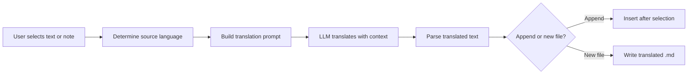

import TLDR from '@site/src/components/TLDR';

# Oversætning

<TLDR>
**Notemd oversætter tekst mellem 21+ sprog med hjælp af LLM-drivet oversættelsestjeneste.** Det støder oversættelse af enkelt udvalgt tekst, hele notes og batchoversættelse af mapper. Hver oversættelsesopgave kan bruge en egen leverandør og modell gennem indstillinger per opgave. Udgangssproget kan konfigureres separat fra UI sproget. Resultaterne tilføjes under den oprindelige tekst eller skrives i en ny fil afhængigt af dine præferencer.

Dette er en del af [Obsidian AI Knowledge Management Guide](/docs/pillar-ai-knowledge).
</TLDR>

## Översikt

Oversættelsen i Notemd er ikke en ordforudsendelsesopgave -- det er LLM-drivet, kontekstbevidst oversættelse. Modellen ser hele paragraphen eller notesen, hvilket bevarer tone, terminologi og sætningstruktur. Dette giver højere kvalitet end tjenester, der oversætter ord for ord, især for teknisk, akademisk og kreativ skrift.

Funktionen støder tre områder: udvalg, aktiv notes og hele mappe. I kombination med modellvalg per opgave kan du bruge en hurtig modell (Gemini Flash) til afslappet oversættelse og en kraftig modell (Claude Sonnet) for indhold, der kræver nysans -- uden at ændre din globale leverandør.

## Hvordan det virker

### Oversættelseskommandoen



1. **Kildeindfølsning** -- LLM konstruerer kilden sprog fra indholdet. Du behøver ikke at specifice det manuelt.
2. **Promptkonstruktion** -- Notemd skaber en prompt, der inkluderer målssproget, valgfri domænshint og den tekst, der skal oversættes.
3. **LLM oversættelse** -- Den konfigurerede `translateProvider` / `translateModel` behandler anmodningen. Modellen bevarer markdown-formatering, wiki-linker og kodblok.
4. **Udgang** -- Den oversatte tekst tilføjes under den oprindelige eller skrives i en ny fil i vaulten.

### Sprogspar

Notemd støder alle sprogspar, som den underliggende LLM understøtter. Algemene par inkluderer:

| Kilde | Mål | Typisk kvalitet |
|--------|--------|----------------|
| Engelsk | Kinesisk (simplificeret) | Udførligt god |
| Kinesisk | Engelsk | Udførligt god |
| Engelsk | Japansk | Mye god |
| Engelsk | Tysk / Fransk / Spansk | Mye god |
| Alle understøttede | Alle understøttede | Modelafhængigt |

Indstillingen `translateLanguage` styrer **udgangsspråket**. Kildespråket detekteres automatisk.

### Modellval per opgave

Oversætningskvaliteten varierer meget afhængigt af modellen. Notemd giver dig mulighed for at tildele en specifik modell kun til oversættelse:

| Modell | Hastighed | Kvalitet | Kost | Bedst til |
|-------|-------|--------|------|----------|
| `gemini-2.0-flash-exp` | Snart | God | Lav | Casual, høj volum |
| `gpt-4o-mini` | Snart | God | Lav | Raske søgninger |
| `deepseek-chat` | Middel | God | Mye lav | Budget med flere sprog |
| `claude-3-5-sonnet` | Middel | Udførligt | Middel | Teknisk / akademisk |
| `gpt-4o` | Middel | Udførligt | Middel | Prosa med nysensitivitet |

### Oversætning af mængdemappe

Højreklik på en mappe og vælg **"Notemd: Oversæt mappe"** for at oversætte alle noter i den mappe. Hver fil behandles separat. Konkurrencinstillingen styrer, hvor mange filer der oversættes parallelt.

## Konfiguration

| Indstilling | Standard | Effekt |
|---------|---------|--------|
| `translateProvider` / `translateModel` | DeepSeek | Eksklusiv tjeneste til oversættelsesopgaver |
| `translateLanguage` | `'en'` | Mål-sprog for udgangstekst |
| `translationAppendToNote` | `true` | Føj den oversatte tekst under den oprindelige. Hvis dette er falskt, skapas en ny fil. |
| `batchConcurrency` | `3` | Antal filer, der behandles parallelt under mængdeoversætning |

## Eksempel

Du læser en kinesisk forskningsnote og ønsker en engelsk version:

1. Åbne noten
2. Højreklik --> **"Notemd: Oversæt aktuel fil"**
3. Notemd opdager kinesisk, oversætter til den konfigurerede målmande spraak (engelsk) og fører til følgende:

```markdown
## Translation (English)

The experimental results show that the proposed method achieves
a 12% improvement in F1 score compared to the baseline, primarily
due to the enhanced feature extraction module described in Section 3.
```

Den oprindelige kinesiske tekst forbliver óændret overfor oversættelsen. `## Translation`-overskriften holder begge versioner i samme fil for enkel referanse.

## Tips

- **Brug Gemini Flash for store mængder** -- det er den hurtigste og billigste muligheden for mængdeoversætning af store mapper.
- **Bevar wiki-linker** -- Notemd's anmodning instruerer LLM til at holde `[[wiki-links]]` uforændret i oversættelsen. Kontroller efter oversættelse, da nogle modeller af og til afpakker dem.
- **Stil specifikt udgangssprog** -- automatisk detection fungerer for kilden, men konfigurér altid `translateLanguage` for at unikke tvivl om målet.
- **Batch-oversæt conceptnoter** -- hvis din konceptmapp er på et sprog og du behøver den på et andet, hanterer oversættelse på mappeniveau det i én trin.

---

## Næste trin

- [Research](./research) -- Søg og sammanfattig på vilkert sprog, så oversæt resultaterne
- [Workflows](./workflows) -- Koble sammen oversættelse med wiki-linking eller konceptudhulling
- [Batch Processing](/docs/advanced/batch-processing) -- Konkurrens og overskrivingsbehavior for mappearbejde
- [LLM Providers](/docs/providers/overview) -- Vælg den bedste modell for dit sprogpar
