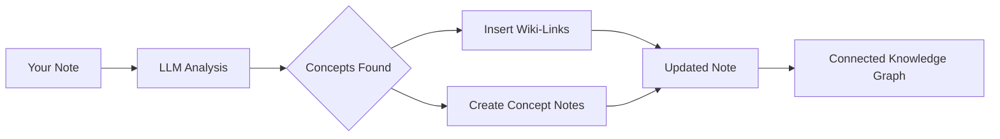

import TLDR from '@site/src/components/TLDR';

# Wiki-Links

<TLDR>
**Notemd tilføjer automatisk `[[wiki-links]]` til de vigtige koncepter i dine notater.** LLM læser din indhold, identificerer vigtige termer i konteksten og indsætter wiki-link i Obsidian-stil ved hver optrædelse. Valgfrit kan det skabe konceptnoter med baklinker. Støder undertrykking af synonymer, link-integritet ved omnavn/affyring og ren udvinningstemper (ingen ændringer i filer). Tillægsvis til Auto Link, som kun matcher eksisterende notetitel, bruger Notemd AI til at identificere nye koncepter og skabe tilsvarende noter. Dette er en del af [Obsidian AI Knowledge Management Guide](/docs/pillar-ai-knowledge).
</TLDR>

## Översikt

Wiki-linking er den kernfunktion for Notemd. Det transformerer ren tekst til en sammenhængende kunstighedsgraph gennem:

1. **At analysere din note** med en LLM
2. **At identificere vigtige koncepter** (termer, personer, metoder, teorier)
3. **At indsætte `[[wiki-links]]`** ved hver optrædelse
4. **At skabe konceptnoter** (valgfrit) med baklinker

## Hvordan det virker

### Process



### Eksempel

**Forud:**
```markdown
Machine learning models use neural networks to learn patterns from data.
The transformer architecture revolutionized natural language processing.
```

**Efter:**
```markdown
[[Machine learning]] models use [[neural networks]] to learn patterns from data.
The [[transformer architecture]] revolutionized [[natural language processing]].
```

## Brug

### Basis: Tilføj link til aktuelle note

1. Åbne en note
2. Højreklik i editor → **"Process file (add links)"**
3. Vente nogle sekunder
4. Koncepterne er nu koblet sammen!

### Batch: Behandle flere noter

1. Højreklik på en mapp i filexploreren
2. Vælg **"Notemd: Process mappen (tilføj links)"**
3. Konfigurér:
   - Konkurrenci (hvor mange filer parallelt)
   - Skriv over eksisterende links (ja/nej)
4. Klik på **Process**

### Selektivt: Link specifik tekst

1. Highlighter tekst til behandling
2. Højreklik → **"Process selection (add links)"**
3. Apenbarligens den highlightede del analyseres

## Notemd vs Auto Link

Obsidian har to metoder for automatisk wiki-linking:

| | **Auto Link** | **Notemd** |
|--|---------------|-------------|
| Linkkilde | Existerende notetitel i vault | LLM-identificerede koncepter i indhold |
| Kan lige til nye koncepte | Nej – titlen må allerede eksistere | Ja – AI identifierer koncepte og skaber notater |
| Hantering af synonymer | Nej | Ja – undertrykking af synonymer |
| Skabning af konceptnotater | Nej | Ja – med baklænker og duplikatkortning |
| Batchbehandling | Nej (enkelt fil) | Ja (mappenivå) |
| Modellrute til hver opgave | Nej | Ja |

**Auto Link** matcher titler: Hvis en note med navnet "Machine Learning" eksisterer, omgiver det forekomsterne i `[[Machine Learning]]`. Hvis noten ikke eksisterer, sker ingenting.

**Notemd** er AI-styrret: LLM læser din indhold, forstår konteksten, identifierer koncepte som *bør* blive lige til – selvom der endnu ikke er en note – og skaber både linken og konceptnotaten.

## Funktioner

### Undertrykking af synonymer

**Problem:** "transformer", "transformers", "Transformer architecture" → 3 separate koncepter

**Løsning:** Notemd opdager nærlige duplikater og bruger den kanoniske formen.

**Konfiguration:**
```
Settings → Advanced → Synonym Suppression
Threshold: 0.8 (0 = off, 1 = aggressive)
```

### Link Integritet

**Når du endrer navn på en konceptnotat:**
- Alle wiki-linker opdateres automatisk (Obsidian kernfunktion)
- Backlinkerne forbliver intakte

**Når du sletter en konceptnotat:**
- Linkerne forbliver, men vises som "unlinked mentions"
- Du kan skabe den på ny fra enhver forekomst

### Ren Extraktionstil

**Ekstraher koncepte uden at ændre det oprindelige:**

1. Højreklik → **"Ekstraher koncepte (ingen linkning)"**
2. Konceptnotater skrives
3. Oprindelige fil forbliver óændret

Brugsscenario: Behandling af read-only-inhold eller endelige udkast.

## Konceptnotat Generering

### Automatisk Skabing

**Når det er aktiveret (standard), skaber Notemd:**

```markdown
---
tags: [concept, auto-generated]
created: 2026-06-13
source: [[Original Note Name]]
---

# Machine Learning

A branch of artificial intelligence that enables computers
to learn from data without explicit programming.

## Occurrences in Your Vault

- [[Original Note Name#Section]]
- [[Another Note#Header]]

## Related Concepts

- [[Neural Networks]]
- [[Deep Learning]]
- [[Supervised Learning]]
```

### Konfiguration

**Utdragsmapp:**
```
Settings → Output → Concept Folder
Default: concepts/
```

**Hierarkisk struktur:**
```
Settings → Output → Use Hierarchical Folders
If enabled:
  papers/my-paper.md → papers/concepts/Concept.md
If disabled:
  → concepts/Concept.md
```

**Mall:**
```
Settings → Output → Concept Template
Customize with variables:
  {{concept}} — Concept name
  {{description}} — LLM-generated description
  {{backlinks}} — List of source notes
  {{date}} — Creation date
```

## Avancerede valg

### Contextvindu

**Hvor meget omgivende tekst skal sendes:**

```
Settings → Linking → Context Window
Options: Sentence | Paragraph | Full Note
Default: Paragraph
```

Større værdi = bedre nøjaktighed, højere kost.

### Minimum antal optrædninger

**Kopiere kun koncepter, der optræder flere gange:**

```
Settings → Linking → Min Occurrences
Default: 1 (link all)
```

Still på 2 eller 3 for at fokusere på repræsenterende temaer.

### Utslutte mønster

**Skel visse ord:**

```
Settings → Linking → Exclude List
Example: note, idea, example, thing
```

Forhindrer overkopiering af generiske termer.

### Egen prompter

**Øverstille standard LLM-instruktioner:**

```
Settings → Advanced → Custom Linking Prompt
Default:
  "Identify key concepts, theories, methods, and technical
   terms in the following text. Return as a list..."
```

Anpass for domænespecifikke behov (f.eks. "Fokuser på medicinsk terminologi").

## Tips og bedste praksis

### ✅ Gør

- **Behandle bemærkninger med >100 ord** — Korte bemærkninger gir få koncepter
- **Brug kraftfulde modeller** for bedre identifikation af koncepter (GPT-4o, Claude)
- **Gå gjennem før du accepterer** — Kontroller, om de foreslåede links er logiske
- **Byg gradvist** — Behandle 5-10 bemærkninger, gå gjennem grafen, juster indstillinger

### ❌ Gør ikke

- **Over-link** — Ikke alle substantiver behøver en link
- **Behandle utkast flere gange** — Koncepter kan skifte sig, vent til de er stabile
- **Ignorer synonyme** — Aktiver suppression for at undgå "ML" vs "Machine Learning"

## Prestande

### Hastighed

| Størrelse på bemærkning | GPT-4o-mini | Claude Sonnet | Ollama (lokalt) |
|-----------|-------------|---------------|----------------|
| 500 ord | 2-3 sekunder | 3-5 sekunder | 5-10 sekunder |
| 2000 ord | 5-8 sekunder | 10-15 sekunder | 20-40 sekunder |
| 5000+ ord | Delvist (mere anrop) | Deltaget | Deltaget |

### Kostudsigt

**Eksempel: 1000-ords not med GPT-4o-mini**
- Indgang: ~1500 tokener
- Output: ~200 tokens
- Kostnad: ~

**Batchbehandling af 100 notater:** ~

## Felsøgning

### Ingen links tilføjet

**Kontrol:**
1. LLM kaldet lykkes (Indstillinger → Diagnostik)
2. Noten har tilstrekkelig indhold (>50 ord)
3. Koncepter er tekniske/spesifikke (ikke bare pronumer)

**Prøv:**
- Brug en mere kraftig modell
- Højst muligt kontekstvindu
- Kontroller dig for gyldighed af API-klæden

### For mange links

**Løsninger:**
1. Højstil minimale forekomster (2 eller 3)
2. Tilføj algemene ord til uundtagelseslisten
3. Brug en mindre aggressiv modell

### Felaktige koncepter koblet

**Løsninger:**
1. Brug en tilpasset prompt for domænespecifikke behov
2. Aktiver synonymsuppression
3. Gennemgå manuelt og afslut forbindelser

### Linker bruges ikke efter omnavn

**Dette er normalt Obsidian beteende.**

For at opdatere alle linker:
1. Omnavn konceptnoten
2. Obsidian opdaterer automatisk `[[old]]` → `[[new]]`

---

## Næste trin

- 📖 [Konceptnoter](./concept-notes) — Dybdegående information om generering af konceptnoter
- 🔍 [Forskning integration](./research) — Kombinér linkning med webforskning
- 🎨 [Diagrammer](./diagrams) — Visualisér din knowledge graph
