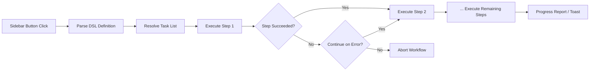

import TLDR from '@site/src/components/TLDR';

# Arbejdsmønster

<TLDR>
**Notemd Arbejdsmønster kopler flere opgaver til en enkelt en-klik-handling.** Definer sekvenser som `add-links > extract-concepts > research > diagram` med en enkel DSL. Arbejdsmønster vises som knapper i sidebaren, der kører hele kedjen på den aktuelle note eller mapp. Det leverer fordefinerte arbejdsmønster; skab egne i indstillingerne. Hver trin bruger sin egen konfiguration for modellen per opgave.

Dette er en del af [Obsidian AI Knowledge Management Guide](/docs/pillar-ai-knowledge).
</TLDR>

## Översikt

Et arbejdsmønster fjerner trængseln ved at køre opgaver en efter en. I stedet for at klikke højre fire gange for at tilføje links, extrahere koncepter, undersøge ukendte termer og generere en diagram, trykker du på en knap i sidebaren og hele kedjen køres. Notemd hanterer sekvenseringen, fejloverførsel og fremgangsrapportering.

Arbejdsmønster defineres med en letvægig DSL (domænespecifik språk). De findes i indstillingerne, vises som klikbare knapper i Obsidian sidebaren og kan tilpasses enten den aktuelle note eller en hel mapp.

## Hvordan det virker

### Kørespipeline for arbejdsmønster



1. **Parse** -- DSL-strengen delses ved `>` (eller `>`) i en ordnet liste over opgavidentifikatorer.
2. **Resolve** -- Hver identifikator mappes til en interner kommando (add-links, extract-concepts, research, translate, diagram osv.).
3. **Execute** -- Trinne køres sekventielt. Hvert trin bruger den konfigurerede leverandør og modellen per opgave.
4. **Error handling** -- Hvis et trin fejler, afbryder arbejdsmønsteret eller fortsætter til det næste trin, afhængigt af din fejlpolitik.
5. **Done** -- En toast-meddelelse rapporterer succes eller listar alle fejlige trin.

### DSL-format

Arbejdsmønster defineres som en `>`-skilt sekvens af opgavidentifikatorer:

```
process-current-add-links>extract-concepts-current>research-and-summarize
```

**Tilgængelige opgavidentifikatorer:**

| Identifikator | Aktion |
|------------|--------|
| `process-current-add-links` | Læg til wiki-linker i den aktive note |
| `extract-concepts-current` | Udtræk koncept fra den aktive note |
| `research-and-summarize` | Undersøg den valgte tekst eller notes titel |
| `process-current-translate` | Oversæt den aktive note |
| `summarize-to-mermaid` | Generer en diagram af den aktive note |
| `generate-from-title` | Generer indhold fra notes titel |
| `extract-original-text` | Udtræk den oprindelige tekst (for OCR / skannet indhold) |

**Varianter på mappenivå**: Erstat `current` med `folder` i identifikationsnavnet.

### Fordefinerte vs. egne arbejdsmetoder

Notemd leverer færdige arbejdsmetoder for algemme mønster:

| Arbejdsmetode | Kedje | Brugsscenario |
|----------|-------|----------|
| **En-klik-udtrækning** | add-links > extract-concepts > research | Behandle en forskningsartikel i én gang |
| **Komplet pipeline** | add-links > extract-concepter > research > diagram | Fuldført kunnskapsutvinning med visualisering |
| **Oversæt + Link** | translate > add-links | Oversæt og link koncepter i målmandskabet |

**Egen arbejdsmetoder** skrives i indstillingerne:

1. Åbne **Indstillinger** --> **Notemd** --> **Arbejdsmetoder**
2. Klik på **"Add Workflow"**
3. Indtast DSL-keden (f.eks. `process-current-add-links>extract-concepts-current`)
4. Giv det en visningsnavn (f.eks. "Snabb Link + Extract")
5. Den nye knap vises umiddelbart i sidemenuet

## Konfiguration

| Indstilling | Standard | Effekt |
|---------|---------|--------|
| `workflows` | Fordefineret set | Array af arbejdsmetodedefinitioner (navn + DSL) |
| `workflowContinueOnError` | `true` | Fortsæt til næste trin hvis det aktuelle trin fejler |
| `workflowShowProgress` | `true` | Vis en progress-tost efter hver trin er fuldført |

### Modeller per opgave i arbejdsmetoder

Hver trin i en arbejdsmetode bruger sin egen modellkonfiguration per opgave. Du behøver ikke at specifice modeller i DSL’en selv. Resolutionstilstanden er:

1. Provider/modell per opgave, hvis `useMultiModelSettings` findes på
2. Global `activeProvider` i anden tilfælde

Det betyder, at `add-links` kan køres på DeepSeek mens `research` køres på GPT-4o – alt indenfor samme arbejdsmetodeklik.

## Eksempel

Du har netop importert en PDF fra en maskininlæringsartikel til din vault og vil have fuld kunstighedsudvinning:

1. Åbne den importerede note
2. Klik på sidemenuknappen **"Full Pipeline"**
3. Notemd udfører:
   - **Trin 1**: Tilføj wiki-linker – `[[attention mechanism]]`, `[[transformer]]` osv.
   - **Trin 2**: Udvinde koncepter – skaber konceptnoter i din konceptmapp
   - **Trin 3**: Forskning – sammanfatter webkilder for nøgleord
   - **Trin 4**: Diagram – genererer en Mermaid mindmap af artiklets struktur
4. Efter ca. 30 sekunder har din note linker, konceptnoter findes, forskningen er tilføjet og en diagramfil er gemt

Alt fra en enkelt klik.

## Tips

- **Start med fordefinerte arbejdsmetoder** – de dekker de mest almindelige mønstre. Anpass kun, når du behøver en ander sekvens.
- **Aktiver `workflowContinueOnError`** – et fejlt diagramtrin bør ikke afbryde hele pipeline’en.
- **Brug mapparbejdsfloder** for massbehandling -- klick med højre på en mappe, vælg en arbejdsflow, og alle noter bliver behandlet.
- **Giv arbejdsfloder klare navne** -- pladsen i sidebaren er begrænset. Brug korte, handlingstilpassede navne som "Snabb udextraktion" eller "Oversæt + Link".

---

## Næste trin

- [Research](./research) -- Forstå, hvad forskningsstegen gør, før du tilføjer den til arbejdsfloder
- [Wiki-Links](./wiki-links) -- Hovedligningsfunktionen, som bruges i de fleste arbejdsfloder
- [Concept Notes](./concept-notes) -- Konceptudextraktion som en arbejdsflodesteg
- [Batch Processing](/docs/advanced/batch-processing) -- Konkurrence og fremgangsrapportering for mapparbejdsfloder
