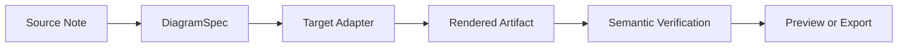
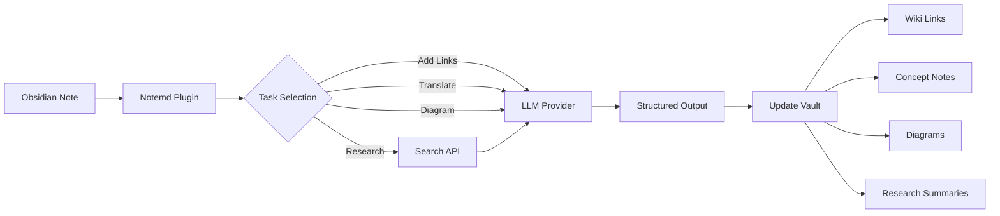

import TLDR from '@site/src/components/TLDR';

# Indførelse til Notemd

<TLDR>
**Notemd** (Note + EMD — Enhanced Markdown Documents) er en open-source Obsidian-plugin, der transformerer LLM-styrret læsning til permanent knowledge. Tillænkses ikke til chat-baseret AI, hvor insikter forsvinder efter sessionen; Notemd skriver resultaterne **direkte i din vault** som wiki-link, konceptnoter, forskningsopsummeringer, oversættelser, arbejdsmuligheder og diagrammer. Den er designet til forskere, studenter og knowledge-worker, der ønsker, at læsning, forskning og visuelle forklaringer opbygges til en strukturered, udviklende knowledgegraph.
</TLDR>

## Hva er Notemd?

Notemd integrerer **30+ store språkmodeller** (OpenAI, Anthropic, Google, DeepSeek, Qwen, Ollama og flere) i din Obsidian-arbejdsmulighed for at automatisere knowledgeudvinning, organisering, oversættelse, forskning og diagramgenerering.

### Afskillelse: Tidsvindende vs. permanent knowledge

| Aspekt | Chat-baseret AI (ChatGPT osv.) | Notemd |
|--------|-------------------------------|--------|
| **Hvor resultaterne bliver gemt** | Chathistorikken (forsvinder) | Din Obsidian vault (bliver bevaret) |
| **Format** | Plaintekstsvare | Strukturerede filer: `[[wiki-links]]`, konceptnoter, diagrammer |
| **Langsigtig værdi** | Må spørge igen hver gang | Opbygges til en knowledgegraph |
| **Udfordret adgang** | Kræver internet | Virker fuldstændigt uden forbindelse med Ollama |

## Kernfunktioner

### 1. **Automatisk Wiki-linking**
- LLM identifierer vigtige koncepte i dine notater
- Indsætter `[[wiki-links]]` ved hver optrædelse
- Skaber valgfrit linkede konceptnotater
- Synonymsuppression for at undgå duplikater

### 2. **Generering af konceptnotater**
- Udtager kernkoncepte fra papirer, artikler og notater
- Genererer speciale konceptfiler med bakligner
- Anpasselige udgangspfade og maller

### 3. **Integration af web-research**
- Søg efter Tavily eller DuckDuckGo indenfor Obsidian
- LLM sammanfatter resultaterne med kilder
- Føriger forskningsresultater til den nuværende note

### 4. **Multilingvæs translation**
- Oversæt udvalgte deler eller hele noter
- Støder over 21+ UI sprog
- Uafhængig konfiguration af udgangssprog
- Støtte for batchoversættelse

### 5. **Diagramgenerering**
- **Mermaid**: Flødediagrammer, sekvens-, klass-, tilstand-, ER- og Gantt-diagrammer
- **JSON Canvas**: Obsidian indbyggede layouter
- **Vega-Lite**: Datacharter, tidsserier og scatterplotter
- **HTML / Redigerbare HTML/SVG**: Selvstændige figurartefakter med semantiske annotationer
- **Draw.io / Drawnix-artefaktgrænser**: Eksporveje til vedligeholdere fra samme semantiske figurmodell
- **Vejmappe for kretsdiagrammer**: Støtte for circuitikz/TikZJax designes omkring guldstandarder, begrænsede prompts, renderingsfeedback og validering af topologi/layout fremfor ukontrolleret LLM TikZ
- **Forsikringsdiagnostik**: Renderartefakter kan vise kompilations- og renderingsfejl, og ikke-inline-kilder kan undersøges uden at kræve en LaTeX-runtime på plugin-side
- Automatisk retning af Mermaid-fejl

### 6. **En-klik-virksomheder**
- Koble flere handlinger sammen til siderbarnsknapper
- Definisjon af arbejdsskema baseret på DSL
- Eksempel: `add-links > extract-concepts > research > diagram`

## Hver bør bruge Notemd?

✅ **Forskere** der læser artikler og opbygger litteraturoversigter
✅ **Studenter** der organiserer studienotater og skaber konceptkort
✅ **Videnstjänstemænd** som ønsker at læsingsinsights gemmes
✅ **Dobbelttalsprofessionelle** der behøver oversættelse + wiki-linking
✅ **Brugere med fokus på privatliv** som ønsker lokal LLM-støtte (Ollama)
✅ **Kraftige brugere** der anpasser prompts og arbejdsskema

## Hvorfor Notemd + Obsidian?

**Obsidian** er en lokal-forstød, markdown-baseret videnbas. **Notemd** tilføjer AI-superkrafter:
- Dina data bliver i din skab (ikke i en cloud-tjeneste)
- Virker offline med lokale modeller
- Gratis og open source (MIT-licens)
- Integreres med eksisterende Obsidian-pluginer
- Skalerer til ti tusinders af noter

## Start med

1. **Installér**: Indstillinger → Community Plugins → Gennemse → "Notemd"
2. **Konfigurér**: Tilføj din LLM-udbyderes API-nyckel (eller brug lokal Ollama)
3. **Prøv det**: Åbne en note → Højreklik → "Process file (add links)"
4. **Udforsk**: Kig på sidebaren for en-klik-virksomheder

👉 [Installation Guide](./getting-started/installation) | [Quick Start Tutorial](./getting-started/quick-start)

## Richtning for diagramfunktioner

Notemd's diagramar beveger sig bort fra at "be modelen om at skrive en syntaksstrang" og mod en lagret pipeline:

Den nuværende implementation understøtter allerede Mermaid, JSON Canvas, Vega-Lite, HTML-fallback, redigerbare HTML/SVG, Draw.io XML-artefakter, en minimal Drawnix JSON-undermengde, forhåndsvisningssdiagnostik/kilde-alene fallback, og en offline `CircuitSpec -> circuitikz`-prototyp for common-source og CMOS inverter golden templates. Kretsdiagrammer er en sværere klas: circuitikz kan fremstille præcise elektriske topologier, men ukontrolleret LLM-udgang producerer ofte ulesbar routning eller ikke-renderende LaTeX. Næste retning er at holde circuitikz begrænset med golden-reference templates, node-grid layout-regler, renderingsdiagnostik og skærmbild-feedbackloop.

Læs detaljerne i [Diagrams](./features/diagrams).

## Arkitektur

## Notemd mod andre Obsidian AI-pluginer

De fleste Obsidian AI-pluginer er konversationsfokuserede (du spørger, AI svarer, insikter bliver i chaten). Notemd er **skriv-fokuseret**: AI processerer dine noter og skriver strukturerede resultater direkte ind i din vault.

| Funktioner | Notemd | Copilot | Smart Connections | Text Generator |
|-----------|--------|---------|-------------------|-----------------|
| Automatisk wiki-link-indsætning | Ja | Nej | Nej | Nej |
| Konceptnoter generering | Ja (med backlinks + deduplikation) | Nej | Nej | Nej |
| Diagrammer generering | Ja (Mermaid, Canvas, Vega-Lite, HTML, redigerbare artefakter) | Nej | Nej | Nej |
| Integration af web-research | Ja (Tavily + DuckDuckGo) | Nej | Nej | Nej |
| Batch-folderbehandling | Ja | Begrænset | Nej | Begrænset |
| Modellrute til hver opgave | Ja (7 opgaver, uafhængige modeller) | Nej | Nej | Nej |
| En-klik-virksomhedskedjer | Ja (DSL) | Nej | Nej | Nej |
| Oversætning (batch) | Ja | Nej | Nej | Nej |
| Chat med vault | Nej | Ja | Nej | Nej |
| Semantisk similaritetssearch | Nej | Nej | Ja | Nej |
| Generering baseret på template | Nej | Nej | Nej | Ja |
| LLM tilbydere | 36 (cloud + gateway + lokal) | 3-5 | 2-3 | 3-5 |
| Fullt offline | Ja (Ollama) | Delvis | Delvis | Delvis |

**Når du skal vælge Notemd**: Du vil, at AI bygger en permanent kunstig intelligens-graf – ikke bare at diskutere dine notater.

**Når du skal vælge Copilot**: Du ønsker en konversationsbaseret AI-assistent i Obsidian.

**Når du skal vælge Smart Connections**: Du vil opdage eksisterende forhold mellem noter gennem semantisk søgning.

## Filosofi

**Notemd anser, at AI bør styrke menneskers kognitive arbejde, ikke ersatte det.** Pluginet:
- Håller dig under kontrolle (gennemgå før du applikerer ændringer)
- Bevarer konteksten (alle resultater refererer tilknytning til kilden)
- Respekterer privatlivet (lokalt LLM-støtte, ingen telemetry)
- Forbliver ekstensibel (åbne APIs, egne arbejdsmetoder)

## Open Source

- **Licens**: MIT
- **Kildekod**: [github.com/Jacobinwwey/obsidian-NotEMD](https://github.com/Jacobinwwey/obsidian-NotEMD)
- **Samfund**: [Discord](https://discord.gg/qnGgsQ9W) | [GitHub Discussions](https://github.com/Jacobinwwey/obsidian-NotEMD/discussions)
- **Bidrag**: PRs er velkomne, se [CONTRIBUTING.md](https://github.com/Jacobinwwey/obsidian-NotEMD/blob/main/CONTRIBUTING.md)

---

**Næste trin**: [Installation →](./getting-started/installation)
