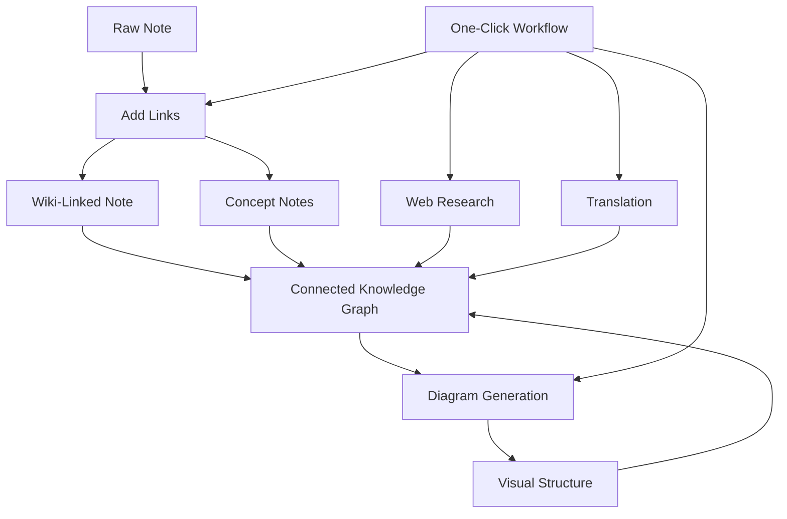

import TLDR from '@site/src/components/TLDR';

# Obsidian AI-videnstyringsguide

<TLDR>
**Notemd omvandler LLM-drivet læsning til permanent viden: wiki-link kobler sammen koncepte, konceptnoter skaber en tilgængelig graf, forskning bringer webben ind i din vault, oversætning bruder språkbarrierer, diagrammer gør strukturen synlig, og arbejdsmuligheder koble alt sammen med én klik.** Dette guide dekker hele processen – fra rå noter til en sammenkobret, visuel, multilingvæl videnbas.
</TLDR>

## Hvorfor AI-videnstyring?

Traditionel notering skaber flat filer. Selv med manuelle wiki-link bliver de fleste noter uforbindt. Notemd bruger LLM for at automatisere forbindelseslaget:

- **LLMs læser din indhold** og identificerer hvad der er vigtigt – termer, metoder, personer, teorier
- **Linker indsættes automatisk** ved hver konceptoptrædelse, ikke begravet i "se også"
- **Konceptnoter genereres** som uafhængige, tilgængelige filer
- **Forskning berikker noterne** med kontekst fra webben
- **Diagrammer gør strukturen synlig** – mindmapper, flødeplaner, datacharte fra samme indhold

Resultatet: en videngraf som vokser med hver note du bearbejder, ikke kun når du husker at tilføje link.

## Helen processen



Hver trin er uafhængigt. Brug én eller alle. Den mest effektive sekvens: **Tilføj link → Konceptnoter → Diagrammer**.

---

## 1. Wiki-link: At gøre forbindelser eksplisite

Wiki-link er ryggraden i en videngraf. Notemd bruger en LLM til:

1. Læs indholdet i din note (del op i deler for lange dokumenter)
2. Identificer kernkoncepte – prioriterer specifikke, tekniske termer over generelle substantiver
3. Indsæt `[[wiki-links]]` ved hver optrædelse
4. Undertryk synonyme så at "ML" og "Machine Learning" ikke skaber separate node'er

### Når man bruger det

- **Alle noter >100 ord** – kortere noter gir få koncepter
- **Forskningsartikler, tekniske dokumenter, mødesnoter** – rige i domænespecifikke termer
- **Efter indholdet er stabilt** – behandle ikke udarbejdelser gennemgående

### Vigtige indstillinger

| Indstilling | Anbefales | Hvorfor |
|---------|-----------|-----|
| `addLinksProvider` | DeepSeek eller GPT-4o-mini | God nøjagtighed til lave kostnader |
| Synonymundertrykking | Aktivt | Forhindrer duplikate node'er |
| Contextvindue | Paragraph | Balancen mellem præcision og kost |

→ [Wiki-Links deep dive](/docs/features/wiki-links)

---

## 2. Konceptnoter: Retterbarhed af kunnskapsnodeer

Wiki-linker forbinde idéer inline, men konceptnoter gør hver idé uafhængigt retterbar. Hver koncept får sin egen `.md` fil:

```markdown
# Machine Learning

## Linked From
- [[My Research Notes]]
- [[Neural Networks Explained]]
```

### Udtagningsprocessen

Prompten for LLM er meget struktureret:
- Normalisér til singularform
- Favoriser multiord-koncepter over enkelte ord ("Dielectric Relaxation" ikke "Relaxation")
- Skriv af referencer/bibliografiske afsnit
- Udgiv som `CONCEPT:` linjer for deterministisk parsing

Koncepter fjernes duplikater mellem blokker gennem `Set<string>`. LLM fejl i enkelte blokker stopper ikke operationen.

### Backlinks

Hvis aktiveret, følger hver konceptnote hvilke kildekoncepter nævner det. Obsidian's indbyggede backlink-panelet viser også omvendte forbindelser.

### Deduplikering

Notemd's 4-trinns dedup-motor finder:
1. **Præcise matcher** — sammenligning af filnavne uafhængigt af store/billede bogstaver
2. **Mangeform** — "Models.md" mod "Model.md"
3. **Symbolnormalisering** — "A-B.md" mod "A B.md"
4. **Enordighedsindhold** — "ML.md" markeres når "Machine Learning.md" eksisterer

### Klædesetningar

| Indstilling | Anbefalet | Hvorfor |
|---------|-----------|-----|
| `conceptNoteFolder` | `concepts/` eller `🧠 concepts/` | Holdt vault-organiseret |
| `extractConceptsAddBacklink` | Aktivt | Muliggør omvendt søgning |
| `extractConceptsMinimalTemplate` | Inaktivt | Komplet modell med Linked From |
| Modell per opgave | DeepSeek | Konceptuddragelse kræver ikke dyre modeller |
| Synonymsuppression | Aktivt | Samme indstilling påvirker både linkning og uddrag |

→ [Concept Notes deep dive](/docs/features/concept-notes)

---

## 3. Forskning: At bringe webben ind

Notemd integrerer websearch i din noteringsworkflow:

1. **Udfordringsoprettelse** — din notetitel eller udvalg bliver en søgeudfordring
2. **Websearch** — Tavily (anbefales, kræver API-klæde) eller DuckDuckGo (gratis, ingen klæde)
3. **LLM sammanfattelse** — søgeresultaterne condenseres til en relevant sammanfattelse
4. **Føj til noten** — sammanfattelsen tilføjes ved markørens position eller som en ny sektion

### Når man bruger det

- Fore før man bearbejder et nyt emne — få webkonteksten først
- Når en konceptnot behøver beregning — forske og tilføj derefter links
- For litteraturoversigter — forske i batch over en mapp med noter

### Vigtige indstillinger

| Indstilling | Anbefales | Hvorfor |
|---------|-----------|-----|
| `researchProvider` | GPT-4o eller Claude | Forskningen kræver en højere kvalitet på sammanfattelser |
| Søgestyrelse | Tavily | Bedre relevans, konfigurerbar dybde |
| `maxResearchContentTokens` | 4000 | Balanc mellem dybde og kost |

→ [Research deep dive](/docs/features/research)

---

## 4. Oversættelse: At bruge bryggerier mellem sprog

Notemd oversætter noter med den konfigurerede LLM du har – ikke en speciel oversættelses API-løsning. Det betyder at.

- **Oversættelser med kontekstforståelse** – LLM forstår hele dokumentet, ikke kun sæt for sæt
- **Hantering af tekniske termer** – "gradient descent" bliver "梯度下降" og ikke "坡度向下"
- **Støtte for batch-oversættelser** – oversæt hele mapp med noter i én gang
- **Modell til hver opgave** – brug Gemini Flash til oversættelse (snabb, billig, multilingual)

### Sprogstøtte

Notemd selv støder 21 UI sprog. Oversættelsesmålet kan konfigureres for hver opgave. Almindelige par: EN↔ZH, EN↔JA, EN↔KO, EN↔DE, EN↔FR, EN↔ES.

→ [Translation deep dive](/docs/features/translation)

---

## 5. Diagrammer: At gøre strukturen synlig

Notemd's diagrampipeline er baseret på specifikationer: LLM genererer en strukturret `DiagramSpec` JSON, som derefter adaptere oversætter til målformatet. Dette gir mer tillidswærdige resultater end at bede LLM om rå Mermaid-syntax.

### Intent Detection

Notemd afleder den bedste diagramtyp fra indholdet:

- **Tabeller med tal** → datachart (Vega-Lite)
- **Klient/server-vokabular** → sekvensdiagramm (Mermaid)
- **Entitet/hovednyckel** → ER-diagramm (Mermaid)
- **Trin/processflød** → flødechart (Mermaid)
- **Konceptkortens nøgleord** → JSON Canvas (Obsidian native)
- **Standard** → mindmap (Mermaid)

### Rendering Chain

Primært mål → fallback → fallback → HTML. Hvis Mermaid-syntaxen fejler, prøver det en gang med fejlkontekst til LLM, og falder deretter tilbake til et minimalt diagram.

### Nyckelindstillinger

| Indstilling | Anbefalt | Hvorfor |
|---------|-----------|-----|
| `enableExperimentalDiagramPipeline` | På | Bedre kvalitet gennem specifikation først |
| `experimentalDiagramCompatibilityMode` | `best-fit` | Native mål for hver intent |
| `summarizeToMermaidProvider` | GPT-4o eller Claude | Diagramspecifikationer kræver rumlig resonans |
| `autoMermaidFixAfterGenerate` | På | Fanger LLM-syntaxfejl automatisk |
| Stærkning af lokalt viden | Aktiveret for domænspecifikke tilfælde | Forbedrer præcision med vault-context |

→ [Diagrams deep dive](/docs/features/diagrams)

---

## 6. Arbejdsmønster: En-klik automatisk handling

Arbejdsmønster kører flere opgaver gennem en enkelt sidebarn-knapp. DSL-formatet er:

```
task1 | task2 | task3
```

Eksempel: `addLinks | extractConcepts | generateDiagram` — bearbejde en note fra rå tekst til en fuldt koblet, visuel videnstegn med en enkelt klik.

### Anbefalede arbejdsmønster

| Arbejdsmetode | Kedje | Brugsscenario |
|----------|-------|----------|
| Helt proces | `addLinks \| extractConcepts \| generateDiagram` | Nye noter |
| Forskning først | `research \| addLinks` | Ukendte emner |
| Polyglot | `translate \| addLinks` | Multilingvale noter |
| Kun diagram | `generateDiagram` | Snabb visualisering |

→ [Workflows deep dive](/docs/features/workflows)

---

## 7. LLM Tjänsteudbydere: 36 valmuligheder fra cloud til lokal

Notemd understøtter 36 tjenesteudbydere over 4 transporttyper. Vigtige grupper:

- **Internationel cloud**: OpenAI, Anthropic, Google, Mistral, xAI
- **Kinesisk cloud**: DeepSeek, Qwen, Doubao, Moonshot, GLM, Baidu, SiliconFlow
- **Gatewayer**: OpenRouter, GitHub Models, Hugging Face, Vercel
- **Lokal**: Ollama, LMStudio, OVMS — ingen API-klave, ingen data leaves your machine

### Strategi for modellbrug per opgave

Den mest kosteffektive indstilling bruger billige modeller for enkle opgaver og kraftfulde modeller for komplekse opgaver:

```
extractConcepts  → DeepSeek (fast, cheap, accurate enough)
addLinks          → DeepSeek or GPT-4o-mini
research          → GPT-4o or Claude (needs quality)
generateDiagram   → GPT-4o or Claude (needs spatial reasoning)
translate         → Gemini Flash (fast, multilingual)
```

→ [LLM Tjänsteudbydere-overblik](/docs/providers/overview)

---

## Checkliste for at starte

1. **Installér Notemd** — [Community Plugins](/docs/getting-started/installation) (anbefales) eller manuelt
2. **Konfigurér en tjenesteudbyder** — DeepSeek (enkeltest), OpenAI, eller Ollama (gratis)
3. **Behandle din første note** — højreklik → "Process file (add links)"
4. **Stil konceptmappen** — Indstillinger → Notemd → Udskrift → Konceptmapp
5. **Udtræk koncepter** — køre "Udtræk koncepter" på samme note
6. **Generer en diagram** — køre "Generer diagram" for at visualisere forbindelserne
7. **Skabe en workflow** — koble de ovenstående til en en-klik-knapp

## Anbefalede konfigurationer

### Student (Budget)

```
Provider: DeepSeek (free tier available)
Concept extraction: DeepSeek
Research: DuckDuckGo (free) + DeepSeek
Diagrams: Off (or legacy Mermaid)
Workflows: addLinks | extractConcepts
```

### Forsker (Kvalitet)

```
Provider: GPT-4o (primary)
Concept extraction: DeepSeek (cost savings)
Research: GPT-4o + Tavily
Diagrams: best-fit mode, GPT-4o
Workflows: research | addLinks | extractConcepts | generateDiagram
```

### Privatliv i førstehand (Local Only)

```
Provider: Ollama (llama3 or qwen2.5:7b)
All tasks: Ollama
Research: DuckDuckGo (free, no API key)
Diagrams: legacy Mermaid mode
```

### To-sproget (ZH + EN)

```
Primary: DeepSeek (Chinese queries)
Translation: Google Gemini Flash
Research: Tavily + DeepSeek (Chinese search context)
Language output: per-task (extractConceptsLanguage: zh-CN)
```

---

## Almindelige mønster

### Mønster: Behandle en forskningsartikel

1. Importér PDF-indhold (eller klippe inn)
2. **Forskning** — hente webkontekst om emnet
3. **Tilføj links** — identificer og lige til nøglekoncepter
4. **Udtræk koncepter** — skabe uafhængige notes
5. **Generer diagram** — visualisere artiklets struktur

### Mønster: Daglig noteforbedring

1. Skriv daglig note
2. **Føj links** — forbinde dagens idéer med eksisterende koncepter
3. Konceptnoter opdateres automatisk med backlinks

### Mønster: Litteraturoversigt

1. Skap et mapp med artikler/noter
2. **Føj links i batch** — bearbejde hele mappen
3. **Fjern duplikate koncepter** — rengør næstændig identiske noter
4. **Generer diagram** — mindmap over hele litteraturen

---

*Notemd er open source (MIT) og virker med Obsidian 0.15.0+ på alle platforme. [Installér nu](/docs/getting-started/installation) eller [se på GitHub](https://github.com/Jacobinwwey/obsidian-NotEMD).*
