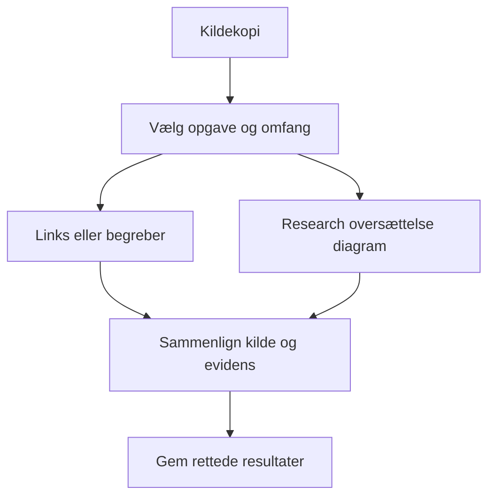

import TLDR from '@site/src/components/TLDR';

# AI-baseret vidensarbejde i Obsidian

<TLDR>En brugbar metode skelner kilder, modelsvar og egne rettelser. Notemd leverer links, begreber, research, oversættelse og diagrammer som gennemgåelige dokumenter. Begynd med én kilde, kontrollér den, og automatisér derefter en afgrænset mappe.</TLDR>

## Vælg resultat

Skal du bruge en linket note, begreber, kildeunderbygget opsummering, oversættelse eller diagram? Flere filer/links garanterer ikke forståelse eller genfinding. Beslut, hvordan indholdet kontrolleres og findes igen.

## Det samlede forløb


```mermaid
flowchart TD
    A[Kildekopi] --> B[Vælg opgave og omfang]
    B --> C[Links eller begreber]
    B --> D[Research oversættelse diagram]
    C --> E[Sammenlign kilde og evidens]
    D --> E
    E --> F[Gem rettede resultater]
```

Dette er mulige opgaver, ikke alle trin i én standardknap. Bevar kilden, og gennemgå output før opbygning af en kæde.

## 1. Links: synliggør relationer

Kør **Process file (add links)**, og kontrollér `_processed.md` for termer, citater, kode og formler. Fagområde-/synonyminstruktioner håndhæver ikke identitet eller numerisk tærskel. Deterministisk matching kan passe bedre til gentagelige links til eksisterende titler. [Links](./features/wiki-links).

## 2. Begreber: adskil term og forklaring

Vælg mappe. Selvstændigt udtræk bevarer kilden og skaber titler. For `Linked From` i nye filer: backlinks til, minimal form fra. **Batch generate from titles** er særskilt og kan medtage tidligere egnede noter. Kontrollér complete-flytning og forskellige betydninger bag samme navn. [Begreber](./features/concept-notes).

## 3. Research: bevar evidens

Vælg emne/titel, Tavily eller DuckDuckGo og **Research & summarize**. Tom Tavily-nøgle skifter ikke. Åbn kilder, og verificér påstande. Valgfri leksikal lokal hentning sender uddrag til valgt LLM; lokalt indeks gør ikke ruten offline. [Research](./features/research).

## 4. Oversættelse: betydning og struktur

Vælg målsprog, og oversæt filen. Standard `_<language>.md` kan erstatte tidligere output. Brug midlertidig note til en passage. Kontrollér termer, tal, kode, links og matematik; opdeling kan tabe kontekst. Antal UI-/websprog beviser ikke et sprogpars kvalitet. [Oversættelse](./features/translation).

## 5. Diagrammer: kilde til videre arbejde

Vælg kompatibel kombination, og gem kilde samt nødvendig SVG/PNG/PDF. Et billede beviser ikke bevarede relationer i en anden editor. CircuitikZ har afgrænset støtte og separat kompilering; Drawnix-grenpile er statiske, og Mermaid/SVG kan blive billeder i PPTX. [Diagrammer](./features/diagrams).

## 6. Arbejdsgange: automatisér afprøvede trin

Navn, `::` og handlinger adskilt af `>` definerer kæden:

```text
One-Click Extract::process-current-add-links>batch-generate-from-titles>batch-mermaid-fix
```

Den indeholder links, titelgenerering og Mermaid-reparation, ikke generel research/diagramhandling. Krav og output gælder pr. trin. Rapporteret fejl stopper normalt; fortsættelse kræver, at senere trin tåler resterende input. Annullering fjerner ikke færdigt output. [Arbejdsgange](./features/workflows).

## 7. Udbydere: opgave og protokol

36 profiler dækker fem familier. Vælg efter adresse, rettigheder, datavilkår og målte resultater. Sammenlign tid/pris med samme kilde/prompt. Opgaverouting er oprindeligt fra; kontrollér alle ruter, før lokal behandling antages. [Udbydere](./providers/overview).

## Første kontroller

1. Installer og gem kildekopier.
2. Konfigurér og test præcis model.
3. Vælg begrebsmappe og forskellige destinationer.
4. Test en kopi.
5. Sammenlign og gem rettelser.
6. Udvid til lille mappe, og se delresultater før lange kæder.

## Praktiske situationer

### Behandl en artikel

Konvertér eksternt til Markdown, og kontrollér tabeller, formler og figurer. Udtræk begreber/passager, undersøg præcise spørgsmål, og tegn kun efterprøvelige relationer. Bevar original og rettelser.

### Vedligehold begreber

Brug separat mappe, vurder termer, og generér forklaringer til et afgrænset udvalg. Tag backup før oprydning. Antal erstatter ikke klare definitioner og nyttig navigation.

### Privat materiale

Forbered lokal server, modeller og afhængigheder. Kontrollér ruter, og undgå webresearch hvor nødvendigt. Gennemgå rapporter før deling. En loopbackstandard forhindrer ikke ekstern konfiguration.

### Genoptag batch

Vent på afslutning efter fejl/annullering, læs rapport, output og genoprettelse, sammenlign konflikter, og gentag målrettet. Annulleret betyder ikke tomt. Kontrollér referencer før sletning af ledsagefiler.

## Næste trin

- [Hurtigstart](./getting-started/quick-start).
- [Batcher](./advanced/batch-processing).
- [Udviklere](./developers/overview).
- [Agenter](./agents/overview).
