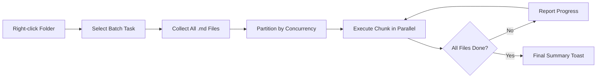

import TLDR from '@site/src/components/TLDR';

# Batchverarbeitung

<TLDR>
**Notemd verarbeitet ganze Ordner in einer Aktion mit einstellbarer Parallelität und Kontrolle über das Überschreiben.** Klicken Sie mit der rechten Maustaste auf einen Ordner, um Wiki-Links in Gruppen hinzuzufügen, Konzepte zu extrahieren, Recherche durchzuführen oder alle darin enthaltenen Notizen zu übersetzen. Parallelitätsbeschränkungen verhindern API-Rate-Limit-Fehler. Der Fortschritt wird pro Datei berichtet. Das Verhalten beim Überschreiben ist einstellbar: bestehende Dateien überspringen, anhängen oder ersetzen. Fehlerhafte Dateien werden protokolliert, ohne dass die Batch-Verarbeitung abgebrochen wird.

Dies ist ein Teil des [Obsidian AI-Know-how-Management-Leitfadens](/docs/pillar-ai-knowledge).
</TLDR>

## Überblick

Die Batchverarbeitung wandelt einen Ordner mit Notizen in eine einzige Operation um. Anstatt jede Notiz einzeln zu öffnen und Befehle nacheinander auszuführen, klicken Sie mit der rechten Maustaste auf den Ordner und wählen die Aufgabe aus. Notemd durchläuft jede `.md`-Datei, wendet die ausgewählte Aktion an und gibt den Fortschritt in Echtzeit an.

Diese Funktion ist unerlässlich für die umfassende Extraktion von Wissen im gesamten Vault. Nach dem Import von Dutzenden von PDFs, beispielsweise durch batch-add-links gefolgt von batch-extract-concepts, wird Ihr Wissensgraph in Minuten statt in Stunden erstellt.

## Wie es funktioniert

### Modell für Batch-Ausführung

1. **Dateisammlung** – Notemd durchsucht den Zielordner rekursiv (oder nur auf Ebene 1, je nach Einstellungen) und sammelt alle `.md`-Dateien ein.
2. **Konkurrenzpartitionierung** – Die Dateien werden je nach Einstellung von `batchConcurrency` in Blöcke aufgeteilt. Jeder Block wird parallel ausgeführt; die Blöcke werden nacheinander ausgeführt.
3. **Ausführung** -- Jedes Datei wird mit derselben Logik wie der Befehl für eine einzelne Datei verarbeitet. Die Einstellungen des Anbieters und des Modells pro Aufgabe werden berücksichtigt.
4. **Fortschrittsberichterstattung** – Eine Toast-Benachrichtigung wird nach Abschluss jeder Datei aktualisiert und zeigt den Fortschritt von `N / Total` an.
5. **Fehlerbehandlung** – Wenn eine Datei fehlschlägt (API Fehler, Netzwerkzeitüberschreitung usw.), wird der Fehler protokolliert und die Batch-Verarbeitung setzt sich fort. Die abschließende Zusammenfassung listet alle fehlgeschlagenen Dateien auf.
6. **Fertigstellung** – Eine Zusammenfassungstafel gibt die Gesamtanzahl der verarbeiteten Elemente sowie die Anzahl der Erfolge und Fehler an.

### Verhalten bei Überschreiben

Wenn eine Datei, die bereits Wiki-Links, Konzeptnotizen oder Übersetzungen enthält, verarbeitet wird, hängt das Verhalten von Notemd von der Überschreibeseinstellung ab:

| Moden | Verhalten |
|------|----------|
| Überspringen | Der vorhandene Inhalt bleibt unverändert. Nur unveränderte Dateien werden verarbeitet. |
| **Append** (Standard) | Neuer Inhalt wird hinzugefügt. Bestehende Wiki-Links, Konzepte oder Übersetzungen bleiben erhalten. |
| **Ersetzen** | Die Datei wurde vollständig neu verarbeitet. Alle vorherigen Notemd Änderungen werden überschrieben. |

Für Wiki-Verlinkungen insbesondere: Wenn eine Notiz bereits `[[wiki-links]]` enthält, lässt der **Skip**-Modus sie unverändert, während der **Replace**-Modus die gesamte Notiz an LLM sendet, um dort neue Verlinkungen einzufügen. Verwenden Sie **Skip** für schrittweises Verarbeiten und **Replace** für eine Neuverarbeitung nach einem Modell-Upgrade.

### Konkurrenzsteuerung

Die Einstellung `batchConcurrency` begrenzt die parallelen API Aufrufe. Dadurch werden Fehler aufgrund von Rate-Limiting (HTTP 429) vermieden, wenn große Ordner bei Anbietern mit strengen Quoten verarbeitet werden.

| Konkurrenz | Empfohlen für | Typischer Einfluss der Geschwindigkeitsbeschränkung |
|-------------|----------------|---------------------------|
| `1` | Kostenlose Tarife, strenge Anbieter | Keines (Seriennummer) |
| `3` (Standard) | Die meisten Cloud-Anbieter | Niedrig |
| `5` | Ollama (lokal), großzügige Tarife | Kein / Niedrig |
| `10` | Lokale Modelle mit schneller Inferenz | Keines |

Wenn Sie während der Batchverarbeitung Fehler 429 erhalten, verringern Sie die Konkurrenz auf 1 oder 2.

## Konfiguration

| Einstellungen | Standard | Effekt |
|---------|---------|--------|
| `batchConcurrency` | `3` | Maximale parallele API Aufrufe während Ordneroperationen |
| `batchOverwriteExisting` | `false` | Überschreiben des vorhandenen Notemd-Inhalts. `false` = Anhängemodus. |
| `batchSkipProcessed` | `false` | Überspringe Dateien, die bereits Notemd-Markierungen enthalten (z. B. Wiki-Links). |
| `batchRecursive` | `true` | Beim Scannen des Verzeichnisses Unterverzeichnisse einbeziehen |
| `enableStableApiCall` | `false` | Aktiviere die Wiederholungslogik (bis zu 4 Versuche) pro Datei während des Batch-Verarbeitens |

### Per-Task Modelle im Batch

Jede Batch-Operation verwendet das entsprechende Modell pro Aufgabe. batch-add-links nutzt `addLinksProvider`, batch-research nutzt `researchProvider` und so weiter. Das bedeutet, dass Sie günstige Modelle für volumenstarke Operationen einsetzen und teure Modelle für qualitätskritische Aufgaben reservieren können.

## Beispiel

Sie haben ein Verzeichnis `papers/` mit 40 importierten Forschungsnotizen. Sie möchten Wiki-Links hinzufügen und Konzepte aus allen Notizen extrahieren:

1. Klicken Sie mit der rechten Maustaste auf den Ordner `papers/`
2. Wählen Sie **„Notemd: Verarbeitung der Ordner (Links hinzufügen)“** aus
3. Notemd scannt den Ordner, findet 40 `.md`-Dateien und verarbeitet jeweils 3 davon gleichzeitig (Standard-Konkurrenz).
4. Ein Fortschritts-Toast zeigt an: `12/40 files processed...`
5. Nach etwa 3 Minuten gibt ein Zusammenfassungstext an: `39 succeeded, 1 failed (API timeout on paper-37.md)`
6. Wiederholen Sie mit **"Notemd: Verarbeitung des Ordners (Konzepte extrahieren)"**, um Konzeptnotizen für alle 40 zu erstellen

Die fehlerhafte Datei wurde protokolliert. Sie können danach die Verarbeitung nur noch für diese Datei erneut ausführen.

## Tipps

- **Beginnen Sie mit geringer Konkurrenz** – Wenn Sie sich nicht sicher sind, wie hoch die Rate Limits Ihres Anbieters sind, starten Sie mit `1` und erhöhen Sie diesen Wert schrittweise.
- **Verwenden Sie den Überspringen-Modus für inkrementelle Aktualisierungen** – Nach der ersten vollständigen Batch-Verarbeitung wechseln Sie auf `batchSkipProcessed: true`, damit bei nachfolgenden Ausführungen nur neue Notizen verarbeitet werden.
- **Stabile API-Anrufe aktivieren** – `enableStableApiCall: true` fügt eine Wiederholungslogik hinzu, die bei langen Batch-Prozessen von vorübergehenden Netzwerkfehlern wiederherstellt.
- **Nach dem Modell-Upgrade erneut ausführen** – Wenn Sie auf ein besseres Modell wechseln, geben Sie `batchOverwriteExisting: true` ein und führen Sie den Vorgang erneut aus, um verbesserte Links und Konzepte zu erhalten.

---

## Nächste Schritte

- [Workflows](/docs/features/workflows) – Verbinde Batch-Aufgaben zu Klick-Buttons in der Seitenleiste
- [Custom Prompts](/docs/advanced/custom-prompts) -- Anpassen von Anfragen für die Batch-Extraktion
- [Problembehebung](/docs/advanced/troubleshooting) -- Behebung von Rate-Limit-Fehlern und Verbindungsfehlern bei Batch-Ausführungen
- [LLM Anbieter](/docs/providers/overview) -- Referenz für die Modellkonfiguration pro Aufgabe
