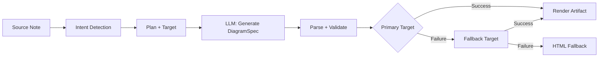
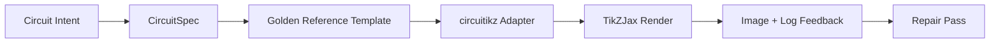

import TLDR from '@site/src/components/TLDR';

# Diagramme

<TLDR>
**Notemd erzeugt Diagramme aus Ihren Notizen über einen auf Spezifikationen basierenden Workflow.** Das LLM erstellt ein renderer-unabhängiges `DiagramSpec`-JSON, wobei spezielle Adapter dieses dann in Mermaid, JSON Canvas, Vega-Lite, HTML, editierbare HTML/SVG-, Draw.io-, Drawnix- oder eingeschränkte circuitikz-Ausgaben umwandeln. Es werden 9 verschiedene Intentionstypen unterstützt, es gibt automatische Fallback-Mechanismen, eine Live-Voransicht mit Export in SVG/PNG/PDF, semantische Überprüfung sowie eine Erstellung unter Verwendung lokaler Informationen.
</TLDR>

Dies ist ein Teil des [Obsidian AI-Know-how-Management-Leitfadens](/docs/pillar-ai-knowledge).

## Architektur: Pipelines mit Fokus auf Spezifikationen

Notemd bittet den LLM niemals darum, direkt die Mermaid/Vega/Canvas-Syntax zu erzeugen. Stattdessen:



**Warum zuerst die Spezifikation?** LLM erzeugen häufig ungültige Renderer-Syntaxen (insbesondere Mermaid). Eine strukturierte `DiagramSpec` kann vor der Darstellung überprüft werden, und dieselbe Spezifikation kann mehreren Renderern als Ersatz dienen.

## Unterstützte Diagrammtypen

| Absicht | Hauptrenderer | Fallbacks | Anwendungsfall |
|--------|-----------------|-----------|----------|
| `mindmap` | Mermaid | HTML | Hierarchische Gliederung der Themen |
| `flowchart` | Mermaid | HTML | Prozessflüsse, Entscheidungsbäume |
| `sequence` | Mermaid | HTML | Kunden-Server-Interaktionen, Protokolle |
| `classDiagram` | Mermaid | HTML | OOP-Klassenzusammenhänge |
| `erDiagram` | Mermaid | HTML | Datenbank-Schemata, Beziehungen zwischen Entitäten |
| `stateDiagram` | Mermaid | HTML | Zustandsmaschinen, Lebenszyklusmodelle |
| `canvasMap` | JSON Canvas | Mermaid → HTML | Konzeptkarten, Wissensgraphen |
| `dataChart` | Vega-Lite | Mermaid → HTML | Stäbe, Linien, Flächen, Punkte, Kreise, Tabellen |
| `circuit` | circuitikz | none | Eingeschränkte circuitikz-Diagramme aus validierten `CircuitSpec`-Daten |

## Intenterkennung

Notemd ermittelt den besten Diagrammtyp anhand des Inhalts Ihrer Notiz mithilfe einer Schlüsselwortbewertung:

| Absicht | Auslöser | Vertrauen |
|--------|----------|------------|
| `dataChart` | Tabellen, numerische Zellen, Schlüsselwörter für Metriken/Trends, Prozentsätze | 0.88 |
| `sequence` | Anfrage/Antwort-Vokabular (mehr als 4 Übereinstimmungen) oder `->`/`=>`-Markierer | 0.82 |
| `erDiagram` | Primärschlüssel, Fremdschlüssel, Entität, Schema (2+ Treffer) | 0.80 |
| `stateDiagram` | Status, Übergang, ausstehend, laufend, fehlgeschlagen (3+ Treffer) | 0.76 |
| `flowchart` | Nummerierte Schritte (2+) oder If/Then/Else/Workflow-Vokabular | 0.74 |
| `canvasMap` | Konzeptkarte, Wissensgraph, räumlich, Cluster | 0.72 |
| `circuit` | circuitikz, TikZJax, circuit, schematic, CMOS, NMOS, PMOS, MOSFET, VDD/GND, `vin`/`vout` | 0.78 |
| `mindmap` | Standard-Fallback | 0.55 |

Überschreiben Sie dies mit der Einstellung „Vorzugiger Diagrammtyp“, dem Seitenleisten-Selektor oder einer expliziten Option in der Befehlspalette.

## Auswahl des Render-Ziels

Der experimentelle spez-zuerst-Pipeline verfügt nun über zwei unabhängige Steuerungen:

Setzen Sie den **Preferred render target** auf **Auto**, um den Standardwert für den Planer zu verwenden, oder wählen Sie explizit Mermaid, JSON Canvas, Vega-Lite, HTML, Editable HTML/SVG, Draw.io, Drawnix oder Circuitikz aus. Diese Änderung gilt nur für die Befehle zur Erstellung von Artefakten und zur Voransicht. Der Standardbefehl **Summarise as Mermaid diagram** bleibt auf eine mermaid-kompatible Ausgabe festgelegt, damit bestehende Markdown-Arbeitsabläufe nicht stillschweigend das Format wechseln.

Diese Trennung ist wichtig, da eine `flowchart`-Intention nun als Mermaid für Markdown-Notizen, als HTML als zuverlässiger Fallback, als Editable HTML/SVG zur weiteren Bearbeitung oder als Draw.io/Drawnix-Quelldateien zusammen mit SVG-Dateien zur Überprüfung dargestellt werden kann. Eine `circuit`-Intention leitet auf Circuitikz um und erfordert eine validierte `CircuitSpec`; es handelt sich dabei nicht um eine Anfrage nach beliebigem TikZ-Text.
## Verwendung

### Erstelle ein Diagramm

1. Eine Notiz öffnen
2. Führen Sie **"Notemd: Diagramm erstellen"** aus der Befehlspalette aus
3. Notemd erkennt die Absicht, erstellt eine Spezifikation, rendernt und speichert das Ergebnis.

**Ausgabe-Dateien nach Ziel:**

| Ziel | Erweiterung | Muster für Dateinamen |
|--------|-----------|------------------|
| Mermaid | `.md` | `{note}_summ.md` |
| JSON Canvas | `.canvas` | `{note}_diagram.canvas` |
| Vega-Lite | `.json` | `{note}_diagram.json` |
| HTML | `.html` | `{note}_diagram.html` |
| Bearbeitbarer HTML/SVG | `.html` | `{note}_diagram.html` |
| Draw.io | `.drawio` + `.drawio.svg` + `.drawio.md` | `{note}_diagram.drawio` zusammen mit den dazugehörigen Überprüfungsdateien |
| Drawnix | `.drawnix` + `.drawnix.svg` + `.drawnix.md` | `{note}_diagram.drawnix` zusammen mit den dazugehörigen Überprüfungsdateien |
| Circuitikz | `.tex` + `.tex.svg` + `.tex.md` | `{note}_diagram.tex` zusammen mit den dazugehörigen Überprüfungsdateien |

### Voransicht eines Diagramms

1. Führen Sie **„Notemd: Vorschau des Diagramms“** aus.
2. Ein Modalfeld öffnet sich mit dem dargestellten Diagramm
3. Exportieren Sie die Datei als SVG, PNG oder PDF über die Schaltflächen in der Leiste.

Die Funktion „Voransicht automatisch öffnen“ ist in den Einstellungen verfügbar – nach der Erstellung wird das Voransichtsfenster automatisch geöffnet.

Beim Export der Voransicht in PNG und PDF wird die konfigurierte Voransichts-PPI verwendet. Der Standardwert beträgt 300 PPI, wobei Werte über 600 PPI auf 600 begrenzt werden. SVG bleibt in seiner vektorbasierten Größe erhalten. Quelldateien wie `.drawio`, `.drawnix` und `.tex` können eine `previewSvg`-Datei bereitstellen, damit Obsidian überprüfbare Bilder anzeigen und exportieren kann, ohne Diagram.net, Drawnix, LaTeX oder TikZJax im Laufzeitumfeld des Plugins einzubetten.

Das Vorschau-Modul verfügt außerdem über ein Diagnose-Panel für Artefakte. Renderer sowie Smoke-Checks können `RenderArtifact.diagnostics` hinzufügen; das Modul zeigt eine Zusammenfassung der Diagnosen mit Zählungen für Fehler, Warnungen und Informationen an, gefolgt von der Schweregradangabe, der Art der Diagnose, der Meldung sowie Ratschlägen zur Behebung direkt neben der Vorschau. Diese gleiche Zusammenfassung wird auch in den diagnostikfähigen Historie-Einträgen angezeigt, sodass wiederholte circuitikz-Smoke-Tests miteinander verglichen werden können, ohne jeden Eintrag einzeln öffnen zu müssen. Für Artefakte, die Quelltext enthalten, aber weder inline noch über den HTML-Iframe-Pfad renderbar sind, wechselt das Modul nun auf eine reinen-Quelltext-Vorschau, anstatt einen leeren Iframe zu erzwingen. Dadurch erhalten circuitikz-Kompilierungs-/Render-Smoke-Tests, SVG-Text-Token-Prüfungen, PNG-Leer-Screenshot-Prüfungen, Berichte über Glyphen-Überlappungen basierend nur auf Pfaden sowie zukünftige Überlappungsberichte eine sichtbare Benutzeroberfläche – ohne dass TikZJax oder LaTeX zu einer strikten Laufzeitabhängigkeit des Plugins werden müssen oder der Quelltext als bereits verifizierte visuelle Darstellung behandelt wird.

### Legacy Mermaid Modus

Wenn `enableExperimentalDiagramPipeline` ausgeschaltet ist, sendet Notemd eine direkte Mermaid-Anfrage an den LLM. Dadurch wird der gesamte Spezifikationspipeline umgangen. Fällt der experimentelle Pipeline fehl, wechselt es auf diesen Modus zurück.

## Rendering-Backends

### Mermaid

6 Adapter (Mindmap, Flussdiagramm, Sequenz, ER, Klassendiagramm, Zustandsdiagramm) – übersetzen `DiagramSpec` in Mermaid-Syntax. Nach der Erstellung prüft `mermaid.parse()` die Ausgabe. Falls die Überprüfung fehlschlägt:

1. **LLM wiederholen** — ein Versuch mit der Fehlermeldung von Mermaid als Kontext
2. **Minimaler Ersatz** – ein schlichtes Mermaid-Diagramm aus den Spezifikations-Node-IDs

**Legacy Mermaid Fixer** behebt automatisch häufige LLM-Syntaxfehler: Normalisierung von Note-Direktiven, Escape von Pipe-Labels, Umschichtung von Semikolons, Smart Quotes, Doppelpunkt-Pfeile, Formunterschiede und vieles mehr.

### JSON Canvas

Erstellt ein Obsidian JSON Canvas-Format mit räumlicher Anordnung:
- Knoten werden nach Tiefe (x = Tiefe × 420) und Index (y = Index × 170) positioniert
- Breite wird aus der Länge des Labels geschätzt
- Kanten mit `fromSide: 'right'`, `toSide: 'left'`, `toEnd: 'arrow'`

### Vega-Lite

Erstellt vollständige Vega-Lite v5 JSON Spezifikationen mit automatischer Kodierung:
- **Kartesische Diagramme** (Stab-/Linien-/Flächen-/Punkts-/Verteilungsdiagramme): x + y-Kanäle + Farbe für mehrere Serien
- **Kreisdiagramm**: Theta = y (quantitativ), Farbe = x (nominal)
- **Tabelle**: Zeile = x, Text = y + Spalte = Serie

Die Patches für das dunkle und helle Theme werden vor der Kompilierung tief verschmolzen.

### HTML

Universeller Ersatz. Selbstständiges HTML-Dokument mit:
- CSP-Meta-Header
- Helle/Dunkle Modus über `prefers-color-scheme`
- Lokalisierte UI-Etiketten für 20 Lokalisierungen
- Abschnitte: Hero, Struktur (Node-Tree), Beziehungen, Hinweise, Tabellen mit Datenserien

### Bearbeitbarer HTML/SVG

Explizites Zielwert für bearbeitbare Export-Arbeitsabläufe. Es projiziert `DiagramSpec` in ein deterministisches `SemanticFigureModel` um und erstellt anschließend ein selbstständiges HTML-Dokument mit eingebetteten SVG-Gruppen, die Annotationen im Draw.io-Stil enthalten:

- `data-drawio-type`, `data-drawio-id` und `data-drawio-role` auf semantischen Knoten
- `data-drawio-source` und `data-drawio-target` auf semantischen Kanten
- Stabile Node/Edge-Identifikatoren nach Normalisierung von Leerzeichen und Behandlung von Kollisionen
- Keine Skripte, keine externen Schriftarten und keine entfernten Ressourcen

Dieses Ziel ist absichtlich noch nicht die Standard-Planer-Route. Es steht als explizites Renderziel zur Verfügung, während der Produktpfad das Bearbeitungsverhalten in echten Tools überprüft.

### Draw.io und Drawnix Exportgrenzen

Die aktuelle Implementierung behält die Unterstützung für Drittanbieter-Editor am Rand des Artefakts bei, während dennoch explizite Render-Ziele bereitgestellt werden:

| Ziel | Vertrag | Laufzeitabhängigkeit |
|--------|----------|--------------------|
| Draw.io | deterministische, unkomprimierte `mxfile`-XML-Dateien aus dem `SemanticFigureModel`, ergänzt durch SVG/PNG/PDF-Dateien zur Überprüfung | Keine Funktionen im Plugin-Laufzeitumfeld oder in CI |
| Drawnix | ein minimales JSON-Untermenge von `.drawnix`, das die Elemente `geometry` und `arrow-line` verwendet, ergänzt durch SVG/PNG/PDF-Dateien zur Überprüfung | Keine Funktionen im Plugin-Laufzeitumfeld oder in CI |

Der Kompromiss ist bewusst gewählt: Notemd kann sichtbare Etiketten, stabile IDs sowie unterstützte primitive Abdeckungsarten überprüfen, ohne Diagram.net Desktop, Drawnix, Plait oder den ausschließlich im Browser verfügbaren Editorzustand in den Plugin einzubinden.

### circuitikz / TikZJax Richtung

Schaltpläne stellen kein identisches Problem wie allgemeine Flussdiagramme dar. Die korrekte Syntax für elektrische Schaltungen ist in der Regel **circuitikz**, wobei sie über Plugins wie TikZJax in Obsidian dargestellt wird. TikZJax kann Pakete wie `circuitikz`, `pgfplots`, `tikz-cd` und `chemfig` laden, was es für Notizen zu Physik, Elektrik, Chemie und Mathematik attraktiv macht.

Das Risiko besteht darin, dass roher TikZ, der von LLM erzeugt wird, anfällig ist:

- Eine komplexe Schalttopologie kann elektrisch korrekt sein, aber visuell unleserlich sein.
- Überlappende Drähte und Beschriftungen können eine korrekte Netzliste für Lernnotizen unbrauchbar machen;
- Fehlende Paketpräambeln, falsche Anker oder ungültige Komponentennamen können die Darstellung verhindern;
- Die Rückmeldung des Renderers erfolgt in der Regel auf Bildebene, während LLM geometrische Daten auf Textebene erzeugt.

Die bessere Architektur besteht darin, circuitikz als ein begrenztes Diagrammziel zu behandeln und nicht als freiformigen Prompt.



Das Erstklass-Modell sollte die Schalttopologie und die Anordnung getrennt beschreiben:

| Schicht | Verantwortung | Beispiel |
|-------|----------------|---------|
| Topologie | elektrische Knoten und Verbindungen von Komponenten | `VDD -> RD -> drain(M1)`, `source(M1) -> GND` |
| Layout | Platzierung im Raster, Ausrichtung, Routenfahrspuren | `M1 at (3,2.2)`, Eingabe links, Ausgabe rechts |
| Stil | Paket, Spannungskonvention, Etiketten, Anker | `\begin{circuitikz}[american voltages]` |
| Validierung | Kompilierungsprotokoll, fehlende Anker, Überlappungs-/Screencast-Prüfungen | TikZJax/LaTeX-Diagnose sowie visuelle Überprüfung |

### Aktuelles circuitikz Prototyp

Notemd enthält nun das erste eingeschränkte Repository-Prototyp für diese Richtung. Es ist absichtlich offline und an ein Template gebunden:

```bash
npm run diagram:export-circuitikz -- --input cmos-inverter.json --output cmos-inverter.tex
```

Das Prototyp-Modul fügt eine eingeschränkte Grenze nach `CircuitSpec` sowie einen deterministischen Exporteur für sechs Standardreferenzfamilien hinzu:

Im experimentellen Diagramm-Pipeline-System ist dies nun auch über `intent: "circuit"` sowie das Render-Ziel `circuitikz` erreichbar. Die generierte `DiagramSpec`-Datei darf `circuitSpec` nur für den Circuit-Zweck enthalten. Der `CircuitikzRenderer` schreibt dieselbe deterministische `.tex`-Quelle und fügt eine SVG-Voransicht hinzu, die aus der validierten Schaltkreistopologie abgeleitet wird; dadurch wird eine Voransicht in Obsidian sowie eine Exportmöglichkeit in SVG/PNG/PDF ermöglicht. Die Voransicht stellt kein Ergebnis einer LaTeX/TikZJax-Kompilierung dar; tatsächliche Render-Ergebnisse stammen weiterhin von den unten aufgeführten expliziten Smoke-Commands.

Für unterstützte Standardvorlagen bleiben `layoutHints.inputSide` und `layoutHints.outputSide` ausschließlich Steuerelemente für die Darstellung. Sie können die Platzierung der deterministischen Eingangs-/Ausgangsports verschieben, ändern jedoch nicht die Topologiesignatur und erlauben keinen Reparaturvorgang zur Umverkabelung des Schaltkreises.

| Art des Schaltkreises | Goldene Referenz | Aktuelle Garantie |
|--------------|------------------|-------------------|
| `common-source-amplifier` | `common-source-nmos-v1` | Überprüft `VDD -> R_D -> M1.D`, `vin -> M1.G`, `M1.S -> GND` und `M1.D -> vout` vor dem Schreiben von LaTeX |
| `cmos-inverter` | `cmos-inverter-v1` | Überprüft die PMOS-over-NMOS-Topologie, den gemeinsamen Gate-Eingang, den gemeinsamen Drain-Ausgang, `VDD -> MP.S` und `MN.S -> GND` vor dem Schreiben von LaTeX |
| `cmos-buffer` | `cmos-buffer-v1` | Überprüft zwei kaskadierte Inverterstufen, den Zwischenknoten `vmid`, den wiederhergestellten Zustand `vout` sowie die gemeinsamen VDD/GND-Leitungen vor dem Schreiben von LaTeX |
| `cmos-transmission-gate` | `cmos-transmission-gate-v1` | Überprüft parallele PMOS/NMOS-Verstärker zwischen `vin` und `vout` unter Verwendung komplementärer `phib` / `phi`-Steuerungen, bevor LaTeX geschrieben wird |
| `cmos-nand2` | `cmos-nand2-v1` | Überprüft vor dem Schreiben in LaTeX den parallelen PMOS-Pull-up, den seriellen NMOS-Pull-down, die doppelten Eingänge `va` / `vb` sowie `vout` |
| `cmos-nor2` | `cmos-nor2-v1` | Überprüft die Serie PMOS-Pull-Up, parallele NMOS-Pull-Down, doppelte Eingänge `va` / `vb` sowie `vout` vor dem Schreiben von LaTeX |

Dies ist kein allgemeiner TikZ-Generator. Er akzeptiert keine beliebigen TikZ-Dateien, kompiliert keinen LaTeX, ruft keinen TikZJax auf, inspiziert keine Screenshots im Plugin-Laufzeitumfeld und führt keine automatisierten Reparaturvorgänge auf Basis von Bildfeedback durch. Solche Funktionen sind weiterhin für spätere Phasen vorgesehen.

Der Befehl „Preview Diagramm“ kann gespeicherte circuitikz Quelldateien direkt wieder öffnen, wenn die Dateierweiterung `.tex` oder `.tikz` ist und der Quellcode `\usepackage{circuitikz}` oder `\begin{circuitikz}` enthält. Dieser Weg ist eine circuitikz rein-Quellen-Voransicht: Das Modalfenster zeigt den Quellcode, Diagnosen, Kontrollen zum Kopieren/Speichern sowie Metadaten zur Historie an, kompiliert aber keinen LaTeX und ruft auch nicht TikZJax während der Laufzeit des Plugins auf.

Die gleiche Voransichtsgrenze, die nur Quellcode betrachtet, umfasst nun auch gespeicherte Draw.io- und Drawnix-Artefakte. `.drawio`-Dateien werden akzeptiert, wenn sie wie Draw.io XML (`mxfile` oder `mxGraphModel`) aussehen, und `.drawnix`-Dateien werden akzeptiert, wenn sie Drawnix JSON mit `type: "drawnix"` sowie einem `elements`-Array sind. Der Plugin integriert weiterhin weder Diagram.net noch den Drawnix-Whiteboard-Host; diese Voransichten zeigen Quellcode, Diagnosedaten und Artefaktgeschichte, ohne einen visuellen Editor im Plugin anzubieten.

Für die topologierelevante Reparatur soll die Spezifikation vor der Reparatur als Referenz übergeben werden, bevor ein reparierter Kandidat akzeptiert wird:

```bash
npm run diagram:export-circuitikz -- --input repaired-cmos-inverter.json --topology-reference cmos-inverter.json --output cmos-inverter.tex
```

Der Reparaturschutz verwendet `createCircuitTopologySignature` und `assertCircuitTopologyUnchanged`, um vor der Ausgabe `circuitKind`, `goldenReferenceId`, Netzwerke, Komponenten-ID/Typ/Anschlüsse sowie ungerichtete Verbindungsendpunkte zu vergleichen. Etiketten, Titeltexte, Layouthinweise, Verbindungsreihenfolge und Verbindungsbezeichnungen werden absichtlich ignoriert. Ein Kandidat, der einen kurzen Anschluss hinzufügt oder einen Anschluss umleitet, scheitert mit `Circuit topology drift detected`, bevor die `.tex`-Datei geschrieben wird.

Der CLI kann nun ein vorhandenes LaTeX/TikZJax-Kompilierungsprotokoll analysieren, ohne einen Compiler auszuführen:

```bash
npm run diagram:export-circuitikz -- --input cmos-inverter.json --output cmos-inverter.tex --compile-log cmos-inverter.log --diagnostics-output cmos-inverter.diagnostics.json
```

Dieser Diagnosepfad meldet fehlende Pakete wie `circuitikz.sty`, unbekannte TikZ/circuitikz-Schlüssel, Syntaxfehler in TikZ-Pfaden wie fehlende Semikolons, fehlerhafte Argumente aufgrund ungleicher Klammern oder ungeschlossener Labels, undefinierte Steuersequenzen, allgemeine LaTeX-Fehler, Notstoppaktionen sowie warnende Meldungen wegen überfüllter `\hbox`-Strukturen. Er bleibt logbasiert: die lokale Ausführung von LaTeX/TikZJax sowie Funktionen in Bildschirmfotosqualität sind weiterhin separate zukünftige Aufgaben.

Für Wartungs-Smoke-Checks kann derselbe CLI optional einen explizit konfigurierten Renderer ausführen, ohne dass Shell-Befehle analysiert werden müssen:

```bash
npm run diagram:export-circuitikz -- --input cmos-inverter.json --output cmos-inverter.tex --compile-executable pdflatex --compile-arg -interaction=nonstopmode --compile-arg -halt-on-error --compile-arg -output-directory={outputDir} --compile-arg {tex} --expected-artifact {outputDir}/{jobName}.pdf
```

Der Kompilierungs-Runner verwendet `shell: false`, erweitert die Platzhalter `{tex}`, `{outputDir}` und `{jobName}` zu Werten eines Argument-Arrays, liest das generierte `{jobName}.log` ein und gibt `compileExecution` zusammen mit `compileDiagnostics` im CLI JSON-Format aus. `--compile-executable` ist nur der Pfad zum Renderer-Binärdatei oder Wrapper; Renderer-Flags gehören zu wiederholten `--compile-arg`-Werten. Leere Ausführbare fehlschlagen als `compile-executable-invalid`, fehlende Binärdateien fehlschlagen als `compile-executable-not-found`, und Ausführbarkeitsstrings in Form von Shell-Befehlen erhalten Hinweise, die Argumente aufzuteilen, damit Windows, Linux und macOS denselben Vertrag für direkte Ausführung einhalten. Mit `--expected-artifact` gibt es außerdem Informationen zu `compileExecution.renderSmoke`, und es tritt ein Fehler bei CLI auf, wenn der Renderer kein nicht-leeres Ergebnis erzeugt. Es wird weiterhin weder LaTeX mitgeliefert, noch wird TikZJax zu einer Laufzeitabhängigkeit für Plugins gemacht, noch werden visuelle Reparaturen auf Ebene von Screenshots durchgeführt.

Wenn das erwartete Artefakt `.svg` ist, geht die Smoke-Prüfung noch einen Schritt weiter:

```bash
npm run diagram:export-circuitikz -- --input cmos-inverter.json --output cmos-inverter.tex --compile-executable dvisvgm --compile-arg ... --expected-artifact {outputDir}/{jobName}.svg --expected-svg-text v_{in} --expected-svg-text v_{out}
```

SVG smoke überprüft den `<svg>`-Wurzelbereich, positive Abmessungen oder `viewBox`, mindestens ein sichtbares Zeichenelement nach Ausschluss versteckter/transparenter Elemente, alle angeforderten Text-Token, offensichtliche Elemente außerhalb von `viewBox`, offensichtlich überschneidende positionierte `<text>` / `<tspan>`-Etiketten sowie offensichtliche Textetiketten, die durch `render-svg-label-overlap` mit Zeichenelementen überschneiden. Der erwartete Text wird im sichtbaren Text sowie in decodierten Zugänglichkeitsmetadaten wie `aria-label`, `<title>` und `<desc>` gesucht, sodass Renderer, die semantische Etiketten außerhalb des sichtbaren Bereichs von `<text>` beibehalten, den Text-Token-Check ohne OCR durchführen können. Der Geometrie-Check berücksichtigt nun transformierbare Geometrien für gängige Gruppen- und Element-`transform`-Attribute, wodurch übersetzte, skalierte, rotierte, verzerrte oder matrix-transformierte SVG-Kästen nach der Transformationskombination überprüft werden. Er umfasst genaue Bogenbegrenzungen für A/a-Bogenextrema, genaue Bezier-Kurvenbegrenzungen für C/S/Q/T-Kurvenextrema, SVG-Begrenzungen, die die Strichstärke berücksichtigen, sowie Überlappungsprüfungen von Etiketten, `polyline` / `polygon`-Zeichengeometrien und löst außerdem die Platzierung von nur-Pfad-Glyphen aus `<use href="#...">`-Referenzen, sodass in wiederverwendbare Glyphenpfade umgewandelte Etiketten trotzdem bei Begrenzungsprüfungen des Canvas scheitern können, wenn ihre Geometrie die `viewBox`-Grenzen überschreitet. Mehrere positionierte `tspan`-Etiketten unter einem `<text>`-Elternelement werden als separate Etikettenkästen verglichen, was LaTeX-stilige SVG-Ausgaben erfasst, die sonst unterschiedliche Etiketten in einen einzigen Textknoten zusammenfassen würden. Positionierte SVG `text`- und `tspan`-Kästen berücksichtigen die Werte `start`, `middle` und `end`, sodass zentrierte und rechts ausgerichtete Etiketten Diagnosen zu Text-/Text-Überlappungen sowie Etikett-Geometrie-Überlappungen auslösen können, ohne eine Browser-niveau Textanordnung vorauszusetzen. Definition-only-Glyphenpfade innerhalb von `<defs>` gelten nicht als sichtbare Zeichenelemente, doch ihre eigenen definition-spezifischen `transform`-Attribute werden vor der `<use>`-Platzierung angewendet, damit skalierte oder gespiegelte Glyphendefinitionen nicht unterschätzt werden. Die Etikett-Geometrie-Überlappungsprüfung verwendet eine geringe Toleranz für Zeichenelementkästen sowie die deklarierten `stroke-width`-Werte, wodurch dünne Leitungen, dicke Leitungen und polygonale Komponentenränder alle als potenzielle Probleme bei der Lesbarkeit von Etiketten gelten können, wenn ihr sichtbarer Strich ein Etikett erreicht. Aus `<use href="#...">`-Referenzen gelöste nur-Pfad-Glyphetiketten werden ebenfalls mit Zeichenelementkästen verglichen und scheitern mit `render-svg-path-glyph-overlap`, wenn wiederverwendbare Glyphengeometrien Leitungen oder Komponenten überschneiden. Wenn ein Renderer Etiketten in wiederverwendbare Pfad-Glyphen umwandelt anstelle von suchbaren `<text>`-Elementen und keine Zugänglichkeitsmetadaten beibehält, protokolliert der Smoke-Report `pathOnlyGlyphUseCount` und führt den angeforderten Text-Token-Check über `render-svg-text-path-only` durch, anstatt vorzutäuschen, das Etikett sei einfach nicht vorhanden. Andere Fehler werden über `render-svg-invalid`, `render-svg-dimension-missing`, `render-svg-no-visible-elements`, `render-svg-text-missing`, `render-svg-out-of-bounds`, `render-svg-text-overlap`, `render-svg-label-overlap` oder `render-svg-path-glyph-overlap` gemeldet. Text-Token- und Überlappungsprüfungen sollten nur als struktureller Smoke-Check für Renderer gelten, die Etiketten als suchbaren SVG-Text oder Zugänglichkeitsmetadaten beibehalten; nur-Pfad-SVG-Ausgaben benötigen weiterhin den späteren Screenshot/OCR-Check, um die visuelle Lesbarkeit der Etiketten nachzuweisen, und dieser Smoke-Check behauptet weiterhin keine vollständige SVG-Pfadabdeckung.

Versteckte SVG-Gruppen und -Elemente werden bei der Zählung sichtbarer Elemente sowie bei der Erfassung der Geometrie konsequent übersprungen. Attribute oder inline-Stile wie `display:none`, `visibility:hidden`, `visibility:collapse` sowie die Gesamtanpassung `opacity:0` können nicht verhindern, dass ein sonst leeres Render-Ergebnis die Prüfung auf sichtbare Ausgabe besteht.

Pfadbasierte Glyphendefinitionen können direkte Pfade oder gruppierte/Symbolcontainer innerhalb von `<defs>` sein. Der Smoke-Check berechnet die Geometrie der Kinderpfade aus `<g id="...">` und `<symbol id="...">` vor der Platzierung in `<use>`, sodass die ausgegebenen Glyphen weiterhin an `pathOnlyGlyphUseCount`, die Prüfungen des begrenzten Canvases sowie an `render-svg-path-glyph-overlap` weitergeleitet werden.

Der Pfadparser verfolgt außerdem den Beginn von Unterpfaden und setzt den aktuellen Punkt auf `Z/z` zurück, sodass relative Befehle nach einem geschlossenen Unterpfad von dem richtigen SVG Punkt aus fortgesetzt werden, anstatt falsche `render-svg-out-of-bounds`-Diagnosen zu erzeugen.

Der gleiche Geometrie-Verarbeitungsschritt folgt der SVG-Nummerierungslogik für Dezimalzahlen mit Vorzeichenpunkt und expliziten Pluszeichen, sodass kompakte dvisvgm-Koordinaten wie `.5`, `-.5` oder `+.5` bei Grenzkontrollen weiterhin bruchartig bleiben, anstatt zu falschen Außengrenzen zu werden oder übersprungen zu werden.

Wenn der Renderer `.png` ausgibt, wird derselbe erwartete Artefaktpfad zum ersten Screenshot-Test: Notemd decodiert nicht-interlasierte 1/2/4/8-Bit-Indexfarben-PNG-Dateien, 1/2/4/8/16-Bit-Graustufen-PNG-Dateien sowie 8/16-Bit-Graustufen-Alpha/RGB/RGBA-PNG-Dateien. Indexfarben- und sub-Byte-Graustufenbilder unterstützen komprimierte Samples; Indexfarbenbilder unterstützen außerdem PLTE sowie optionale tRNS-Daten; Graustufen/RGB-Bilder unterstützen tRNS-transparente Samples. 16-Bit-Direktsamples werden in den gleichen 8-Bit-RGBA-Vergleichsraum normalisiert, der auch bei den Smoke-Checks verwendet wird. Der Smoke-Check überprüft positive Abmessungen, speichert die Grenzen des Vordergrunds als `foregroundBounds`, speichert die Dichte des Vordergrunds innerhalb dieses Rahmens als `foregroundDensity`, scheitert mit `render-png-blank`, wenn jedes sichtbare Pixel die Hintergrundfarbe in der oberen linken Ecke hat, scheitert mit `render-png-content-clipped`, wenn der Vordergrundinhalt die Bildgrenze berührt, scheitert mit `render-png-foreground-too-small`, wenn ein großer Screenshot weniger als vier Vordergrundpixel aufweist, und scheitert mit `render-png-foreground-dense`, wenn die Vordergrundpixel innerhalb eines nicht-trivialen Rahmens ungewöhnlich dicht sind. Nicht unterstützte PNG-Formate führen zu einem Fehler mit `render-png-unsupported` sowie formatbezogenen Anleitungen für Adam7-interlasierte PNGs oder nicht unterstützte Indexfarben-Bitstärken. Dadurch werden leere Screenshots, offensichtliches Ausschneiden des Bildschirms, unterrenderter Vordergrundinhalt, Fehler auf Pixelebene sowie falsche Exporteinstellungen des Renderers erkannt – ohne dass dabei plattformspezifische Abhängigkeiten hinzugefügt werden müssen. Es handelt sich dabei noch nicht um OCR-basierte Etikettenerkennung, präzise Textüberlappungserkennung oder topologierelevante Bildreparatur.

Wenn die Diagnose einen fehlgeschlagenen Kompilierungs- oder Render-Smoke-Versuch anzeigt, kann das CLI ebenfalls einen reparaturbezogenen Bericht erstellen, der die Topologie beibehält:

```bash
npm run diagram:export-circuitikz -- --input cmos-inverter.json --topology-reference cmos-inverter.json --output cmos-inverter.tex --compile-log cmos-inverter.log --repair-brief-output cmos-inverter.repair-brief.json
```

Der Reparaturbrief verwendet das Schema `notemd.circuitikz.repair-brief.v1` und enthält die Quelle `CircuitSpec`, die Topologie-Signatur, Diagnosen zur Kompilierung/Ausgabe, zulässige Änderungen, verbotene Topologie-Änderungen, die nächsten Überprüfungs Schritte sowie ein strukturiertes `repairPrompt`. Die Rolle des Prompts ist `topology-preserving-circuitikz-repair`; seine `diagnosticFocus`-Liste wird aus den Diagnosen zur Kompilierung/Ausgabe abgeleitet, und seine `acceptanceCriteria` erfordern Validierung der Kandidaten sowie neue Kompilier- und Ausgabe-Prüfungen. Es handelt sich um das Übergabeformat für einen späteren Reparaturzyklus, nicht um eine Behauptung, dass Notemd bereits autonome visuelle Reparaturen durchführt.

Nachdem ein Reparaturvorschlag erstellt wurde, kann derselbe CLI ihn vor dem Erstellen der Ausgabe gegen die Anforderungen überprüfen:

```bash
npm run diagram:export-circuitikz -- --input repaired-cmos-inverter.json --repair-brief cmos-inverter.repair-brief.json --output repaired-cmos-inverter.tex
```

`--repair-brief` überprüft die Signatur der Kandidatentopologie aus dem Überblick und ist mit `--topology-reference` gegenseitig ausschließend. Das Bestehen dieser Prüfung beweist lediglich die Erhaltung der Topologie; der Kandidat benötigt weiterhin Kompilierungsdiagnosen sowie Render-Smoke-Prüfungen.

Das `--repair-brief`-Ergebnis enthält außerdem `repairAcceptance`-Beweise im Schema `notemd.circuitikz.repair-acceptance.v1`. Es gibt `topology-signature`, `compile-diagnostics` und `render-smoke`-Gates als `passed`, `failed` oder `missing` an; zeigt `remainingChecks` preis; und hält `readyForVisualAcceptance` für falsch, solange der Kandidatenlauf nicht alle erforderlichen Beweise enthält.

Verwenden Sie `--repair-acceptance-output` zusammen mit `--repair-brief`, wenn Belege für CI oder Veröffentlichungen eine dauerhafte JSON-Datei erfordern:

```bash
npm run diagram:export-circuitikz -- --input repaired-cmos-inverter.json --repair-brief cmos-inverter.repair-brief.json --output repaired-cmos-inverter.tex --repair-acceptance-output repaired-cmos-inverter.repair-acceptance.json
```

Zur Bereitstellung von Nachweisen für die Veröffentlichung oder den Wartungspersonal führen Sie jede unterstützte Gold-Familie mit dem aggregierten Fixture-Runner aus:

```bash
npm run diagram:smoke-circuitikz -- --output-dir docs/export/circuitikz-smoke --compile-executable pdflatex --compile-arg -interaction=nonstopmode --compile-arg -halt-on-error --compile-arg -output-directory={outputDir} --compile-arg {tex} --expected-artifact {outputDir}/{jobName}.pdf
```

Der Runner verwendet `docs/maintainer/fixtures/circuitikz/common-source-nmos-v1.json`, `docs/maintainer/fixtures/circuitikz/cmos-inverter-v1.json`, `docs/maintainer/fixtures/circuitikz/cmos-buffer-v1.json`, `docs/maintainer/fixtures/circuitikz/cmos-transmission-gate-v1.json`, `docs/maintainer/fixtures/circuitikz/cmos-nand2-v1.json` und `docs/maintainer/fixtures/circuitikz/cmos-nor2-v1.json`, ruft für jede Testeinrichtung denselben exportierenden Pfad ohne Shell auf und gibt einen zusammenfassenden JSON-Bericht mit den Werten `compileExecution` und `compileDiagnostics` pro Testeinrichtung zurück. Es handelt sich weiterhin um einen Befehl für den Betreuer, nicht um eine Laufzeitabhängigkeit eines Plugins.

Wenn ein Wartungsmaschine noch keinen Renderer konfiguriert hat, führen Sie den gleichen Fixture-Befehl ohne `--compile-executable` aus und speichern Sie das Umgebungsportal explizit:

```bash
npm run diagram:smoke-circuitikz -- --output-dir docs/export/circuitikz-smoke --report-output docs/export/circuitikz-smoke/renderer-availability.json
```

Dieser Pfad schreibt weiterhin die deterministischen Fixture-Artefakte `.tex` aus, gibt aber `ok: false` zurück, wobei `rendererAvailability.status` auf `missing-configuration` gesetzt ist und ein `compile-executable-invalid`-Diagnosebericht vorliegt. Betrachten Sie dies lediglich als Beweis für die Verfügbarkeit des Renderers; es handelt sich dabei nicht um einen Kompilier-, Render-Smoke- oder visuellen Akzeptanztest.

### Goldene Referenz-Prompt-Form

Für kurzfristige Nutzung soll vor der Anfrage nach einer Schaltungsvariante eine renderbare goldene Referenz bereitgestellt werden. Ein eingeschränkter Prompt muss Präambel, Koordinatenskala, Ankerstil sowie Routing-Regeln beibehalten:

```latex
\usepackage{circuitikz}
\begin{document}
\begin{circuitikz}[american voltages]
\draw
  (3,5) node[vcc]{$V_{DD}$}
  to [R, l=$R_D$] (3,3)
  to [short, *-o] (5,3) node[right]{$v_{out}$}
  (3,3) to [short] (3,2.2)
  node[nmos, anchor=D] (M1) {$M_1$}
  (M1.S) to [short] (3,0.5)
  node[ground]{}
  (M1.G) to [short, -o] (0.8,2.2)
  node[left]{$v_{in}$};
\draw
  (3,0.5) node[below right]{$S$};
\end{circuitikz}
\end{document}
```

Für einen CMOS-Inverter sollte die Anfrage eine explizite Topologie sowie Layout-Beschränkungen vorsehen, und nicht nur „Zeichne einen CMOS-Inverter“.

- Lassen Sie `VDD` oben und `GND` unten, die Eingabe links und die Ausgabe rechts.
- Verwenden Sie `pmos` oberhalb von `nmos`, mit gemeinsamen Eingängen und gemeinsamen Ausgängen;
- Bleiben Sie beim Ausgangsknoten an der Entladeverbindung und kennzeichnen Sie ihn mit `*-o`;
- Verwenden Sie benannte Anker (`PM1.G`, `NM1.G`, `PM1.D`, `NM1.D`) anstelle von visuell abgeleiteten Koordinaten;
- Vermeiden Sie diagonale oder kreuzende Kabel, es sei denn, es ist elektrisch erforderlich.

### Aktueller Fortschritt und nächste Phasen

| Bereich | Aktueller Status | Nächster Schritt |
|------|----------------|-----------|
| Allgemeine Diagramme | Pipeline mit Fokus auf Spezifikationen implementiert für Mermaid, JSON Canvas, Vega-Lite, HTML | Setzen Sie die Erweiterung der Abdeckung der semantischen Überprüfung fort. |
| Bearbeitbare Abbildungen | `editable-html-svg`, Draw.io XML sowie Drawnix JSON – Artefaktgrenzen implementiert | Fügen Sie reichhaltigere Primitiven nur hinzu, nachdem Tests die Bearbeitbarkeit nachgewiesen haben. |
| CLI-Unterstützung | `npm run diagram:export-artifact` exportiert bearbeitbare HTML/SVG-, Draw.io-, Drawnix-, Circuitikz-Dateien sowie SVG/PNG/PDF-Dateien als Nachweise für die Überprüfung aus einer validierten `DiagramSpec` | Beim Veröffentlichen neuer Ziele werden zielbezogene Smoke-Fixtures hinzugefügt |
| circuitikz | `DiagramSpec(intent: "circuit", circuitSpec) -> CircuitikzRenderer -> circuitikz` exportiert Standard-Quellpläne, CMOS-Inverter, `cmos-buffer` / `cmos-buffer-v1`, `cmos-transmission-gate` / `cmos-transmission-gate-v1`, `cmos-nand2` / `cmos-nand2-v1` sowie `cmos-nor2` / `cmos-nor2-v1` als Gold-Template-Dateien, stellt UI-Intent- und Render-Ziel-Einstellungen bereit, erstellt TeX-Dateien zusammen mit SVG/PNG/PDF-Voransichten, prüft die Topologie vor der Ausgabe, analysiert Kompilierungsprotokolle, kann explizite lokale Renderer verwenden sowie den Parameter `--expected-artifact` anwenden und bietet außerdem einen fallback auf reinen Quellcode sowie Diagnosen zu den Voransichten über `RenderArtifact.diagnostics` und das Voransichts-Modul an | Hinzufügen einer OCR-basierten Erkennung von Beschriftungen für rein visuellen Text auf Pfaden, präziser Überlappungsprüfungen auf Pixelebene, erweiterter Abdeckung von SVG-Pfaden bei Bedarf, automatischer Installation/Entdeckung von Renderern nur dann, wenn diese weiterhin optional bleiben können, sowie automatisierter Ausführung von Reparaturvorgängen zur Erhaltung der Topologie |
| TikZJax Integration | Kandidat für den Render-Host zur Anzeige auf der Obsidian-Seite | Lassen Sie es optional – machen Sie TikZJax nicht zu einer zwingenden Laufzeitabhängigkeit des Plugins. |

## Konfiguration

| Einstellungen | Standard | Effekt |
|---------|---------|--------|
| `enableExperimentalDiagramPipeline` | `false` | Wechseln zwischen Spezifikationsvorzeichen und Legacy-Modus Mermaid |
| `experimentalDiagramCompatibilityMode` | `'legacy-mermaid'` | `'legacy-mermaid'` = Mermaid nur; `'best-fit'` = native Ziele + Fallbacks |
| `preferredDiagramIntent` | `undefined` (automatisch) | Automatische Intent-Erkennung überschreiben |
| `preferredDiagramRenderTarget` | `undefined` (automatisch) | Überschreiben des Artefaktrenderers, einschließlich Draw.io, Drawnix und Circuitikz |
| `summarizeToMermaidLanguage` | `'en'` | Zielsprache für Diagrammbeschriftungen |
| `summarizeToMermaidProvider` / `Model` | DeepSeek | Pro Aufgabe LLM zur Erstellung von Diagrammen |
| `autoMermaidFixAfterGenerate` | (von Konstanten) | Automatischer Ausführung des Legacy-Fixers auf der Ausgabe von Mermaid |
| `enableLocalKnowledgeForDiagramGeneration` | `false` | Quelle mit lokalen Vault-Wissen erweitern |

### Erweiterung durch lokales Wissen

Wenn es aktiviert ist, holt Notemd relevante Kontextausschnitte aus der lokalen Wissensdatenbank Ihres Safes (basierend auf MiniSearch) und fügt sie vor den ursprünglichen Markdown-Text ein. Die Anweisung zur Erweiterung besagt: „Nur als unterstützende Referenz; halten Sie die primäre Struktur der Quellennotiz unverändert.“

### Kompatibilitätsmodi

- **`legacy-mermaid`**: Alle Intents werden an Mermaid weitergeleitet. Nicht-Mermaid Intents (canvasMap, dataChart) werden gezwungenermaßen an `flowchart` oder `mindmap` geleitet. Es gibt keine Fallback-Kette.
- **`best-fit`**: Jeder Intent wird an sein natives Ziel weitergeleitet. Wenn der primäre Weg fehlschlägt, wird die Fallback-Kette verwendet (z. B. Vega-Lite → Mermaid → HTML).

## Voransicht und Export

| Aktion | Methode |
|--------|--------|
| SVG exportieren | `mermaid.render()` / `vega.View.toSVG()` / SVG Builder für Canvas |
| PNG-Export | SVG → Bild → Canvas / Rasterisierer bei der konfigurierten PPI → PNG-ArrayBuffer |
| PDF-Export | SVG → Rasterbild bei der konfigurierten PPI → einseitiges PDF |
| Quelle speichern | Inhalt des Rohartefakts wurde mit der für das Ziel spezifischen Erweiterung gespeichert |
| Voransicht nur aus Quelle | Nicht-in-line Artefakte mit als Code angezeigtem Quellinhalt sowie Diagnosen, ohne iframe-Rendering |
| Semantische Überprüfung | Mermaid, JSON Canvas, Vega-Lite, editierbares HTML/SVG, Draw.io, Drawnix sowie eingeschränkter Circuitikz werden von `scripts/diagram-semantic-verification.js` sowie Renderer-/CLI-Tests überprüft |

**Caching**: RenderCache verwendet den deterministischen JSON-Schlüssel von `{spec, target, theme}`. Die Deduplizierung während der Verarbeitung verhindert doppelte Darstellungen.

## Tipps

- **Beginnen Sie im `best-fit`-Modus** – er liefert die beste visuelle Ausgabe für jeden Intent-Typ
- **Nutzen Sie leistungsstarke Modelle für komplexe Diagramme** – Flussdiagramme und ER-Diagramme profitieren von GPT-4o oder Claude
- **Lokales Wissen aktivieren** für domänenspezifische Diagramme – relevanter Vault-Kontext verbessert die Genauigkeit
- **Set `autoMermaidFixAfterGenerate`** — Ohne es kommen häufig Mermaid-Syntaxfehler vor
- **Der Legacy-Fixer ist umfassend** – wenn die Vorschau von Mermaid fehlschlägt, löst das Manuell Ausführen des Fixer-Befehls das Problem oft.

---

## Nächste Schritte

- 🔗 [Wiki-Links](./wiki-links) — Wie Konzepte inline verknüpft werden
- 📝 [Konzeptnotizen](./concept-notes) — Konzepte für das Quellmaterial der Diagramme extrahieren
- 🔍 [Forschung](./research) — Diagramme mit aus dem Web stammenden Daten erweitern
