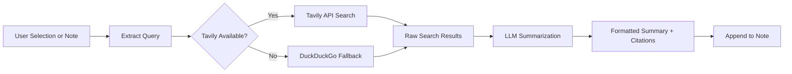

import TLDR from '@site/src/components/TLDR';

# Forschung & Websuche

<TLDR>
**Notemd durchsucht das Internet und fügt die von LLM zusammengefassten Ergebnisse direkt in Ihre Notizen ein.** Tavily API ist der primäre Such-Backend; DuckDuckGo dient als fallback ohne Konfiguration. Die Ergebnisse werden mit Quellenangaben zusammengefasst und unter einem `## Research`-Überschrift eingefügt. Es wird die Forschung in einzelnen Notizen, die Durchsuchung von Ordnern im Batch-Modus sowie die Auswahl eines Modells pro Aufgabe für den Zusammenfassungsschritt unterstützt.

Dies ist ein Teil des [Obsidian AI-Know-how-Management-Leitfadens](/docs/pillar-ai-knowledge).
</TLDR>

## Überblick

Research ist eine der leistungsstärksten Integrationen von Notemd: Sie schließt den Kreislauf zwischen Lesen, Suchen und Schreiben. Anstatt in einen Browser wechseln zu müssen, um einen unbekannten Begriff nachzuschlagen, markieren Sie ihn einfach und lassen Notemd suchen, zusammenfassen und die Ergebnisse hinzufügen – alles direkt in Ihrem Vault.

Der Prozess ist vollständig konfigurierbar. Sie wählen den Suchanbieter, den LLM, der die Zusammenfassung erstellt, sowie aus, ob die Ergebnisse zur aktiven Notiz hinzugefügt oder in separate Dateien geschrieben werden sollen. Im Batch-Modus können Sie mit einem Klick alle Notizen in einem Ordner durchsuchen.

## Wie es funktioniert

### Suchen-dann-Zusammenfassen-Pipeline



1. **Abfrageextraktion** – Notemd extrahiert Suchbegriffe aus Ihrer Auswahl oder dem Notentitel.
2. **Websuche** – Zuerst wird Tavily versucht. Wenn keine API-Einstellung konfiguriert ist, wird automatisch DuckDuckGo verwendet (keine Einstellung erforderlich).
3. **LLM Zusammenfassung** -- Die rohen Suchergebnisse werden an den konfigurierten LLM gesendet, der eine prägnante Zusammenfassung mit eingebetteten Quellenangaben erstellt.
4. **Append** – Die formatierte Zusammenfassung wird unter dem Überschriftspunkt `## Research` in der aktiven Notiz hinzugefügt.

### Tavily gegen DuckDuckGo

| Aspekt | Tavily | DuckDuckGo |
|--------|--------|------------|
| API Schlüssel | Erforderlich (kostenlose Stufe verfügbar) | Nicht erforderlich |
| Qualität des Ergebnisses | Höher (speziell für KI entwickelt) | Ausreichend für allgemeine Anfragen |
| Rate Limits | Großzügige kostenlose Stufe | Unterliegt Drosselung |
| Konfiguration | `tavilyApiKey` in den Einstellungen | Keine Konfiguration -- automatischer Rückfall |

### Forschung zu Batch-Ordnern

Klicken Sie mit der rechten Maustaste auf einen Ordner und wählen Sie **„Notemd: Forschungsordner“** aus. Jedes `.md`-Datei im Ordner wird nacheinander verarbeitet (oder parallel, je nach konfigurierter Parallelität). Jede Notiz erhält ihren eigenen Forschungssammenfassung.

## Konfiguration

| Einstellungen | Standard | Effekt |
|---------|---------|--------|
| `tavilyApiKey` | `''` | Tavily API Schlüssel. Wenn dieser leer ist, wird ausschließlich DuckDuckGo verwendet. |
| `researchProvider` / `researchModel` | DeepSeek | Pro Aufgabe LLM zur Zusammenfassung der Suchergebnisse |
| `maxResearchContentTokens` | `4000` | Token-Budget für den an LLM gesendeten Inhalt. Überschüssige Token werden abgeschnitten. |
| `researchAppendToNote` | `true` | Füge einen Zusammenfassungsteil zur Quellennotiz hinzu. Wenn falsch, wird eine separate Datei erstellt. |
| `researchLanguage` | `'en'` | Ausgabesprache für die zusammengefasste Forschung |

### Empfehlung von Modellen pro Aufgabe

Die Forschung profitiert von einem Modell, das mehrsprachigen Inhalt verarbeiten kann und gut strukturierte Prosa erzeugt. Betrachten Sie:

- **DeepSeek** -- Standard, erschwinglich, gute Qualität
- **GPT-4o** -- höhere Qualität bei der Zusammenfassung, höherer Preis
- **Gemini Flash** – schnell und günstig, geeignet für einfache Anfragen

## Beispiel

Sie lesen einen Artikel über *Transformer-Aufmerksamkeitsmechanismen* und stoßen auf einen unbekannten Begriff: *relative positional encoding*. Anstatt Obsidian:

1. Hervorheben Sie **„relative positional encoding“**
2. Rechtsklick --> **"Notemd: Forschen und zusammenfassen"**
3. Notemd durchsucht das Internet, fasst die wichtigsten Ergebnisse zusammen und fügt hinzu:

```markdown
## Research

### Relative Positional Encoding

Relative positional encoding is a method used in transformer models
where positional information is expressed as relative distances between
tokens rather than absolute positions. Introduced by Shaw et al. (2018),
it improves generalization to unseen sequence lengths compared to
absolute encodings (Vaswani et al., 2017).

Sources:
- [Shaw et al., Self-Attention with Relative Position Representations (2018)](https://arxiv.org/abs/1803.02155)
- [Transformer Positional Encoding Overview](https://example.com/transformer-pos-enc)
```

Die Zusammenfassung ist nun Teil Ihres Tresors – suchbar, verlinkbar und offline zugänglich.

## Tipps

- **Legen Sie einen Tavily-Schlüssel fest für beste Ergebnisse** – selbst die kostenlose Version bietet eine bessere Relevanz als reiner DuckDuckGo.
- **Verwenden Sie ein leistungsstarkes Zusammenfassungsmodell** – günstige Modelle können detaillierten technischen Inhalt vereinfachen.
- **Batch-Forschung** nach einer ersten Durchsicht, um gleichzeitig Lücken in vielen Notizen zu schließen.
- **Überprüfung der angehängten Zusammenfassungen** – LLMs können sich über Details der Quelle irren. Überprüfen Sie die wichtigsten Behauptungen.

---

## Nächste Schritte

- [Concept Notes](./concept-notes) -- Wichtige Begriffe aus Forschungsergebnissen extrahieren und speichern
- [Wiki-Links](./wiki-links) -- Verbinde konzepte, die aus Forschungen stammen, in Ihrem Vault
- [Übersetzung](./translation) -- Übersetzen Sie Forschungszusammenfassungen in eine andere Sprache
- [LLM Anbieter](/docs/providers/overview) -- Konfigurieren des für die Zusammenfassung verwendeten Modells
