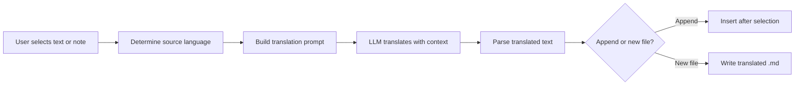

import TLDR from '@site/src/components/TLDR';

# Übersetzung

<TLDR>
**Notemd übersetzt Texte in mehr als 21 Sprachen mithilfe der von LLM angetriebenen Übersetzungstechnologie.** Es werden Einzelübersetzungen, vollständige Dokumentübersetzungen sowie Batch-Übersetzungen von Ordnern unterstützt. Jede Übersetzungsaufgabe kann über Einstellungen pro Aufgabe einen eigenen Anbieter und ein eigenes Modell verwenden. Die Ausgangssprache kann unabhängig von der UI-Sprache konfiguriert werden. Die Ergebnisse werden je nach Ihren Präferenzen entweder angehängt oder in eine neue Datei geschrieben.

Dies ist ein Teil des [Obsidian AI-Know-how-Management-Leitfadens](/docs/pillar-ai-knowledge).
</TLDR>

## Überblick

Die Übersetzung in Notemd erfolgt nicht durch ein Wörterbuchabgleich – sie ist eine kontextbezogene Übersetzung, die von LLM angetrieben wird. Das Modell betrachtet den gesamten Absatz oder die Notiz und behält Tonfall, Fachbegriffe sowie Satzstruktur bei. Dadurch entstehen hochwertigere Ergebnisse als bei servicebasierten Übersetzungen Wort für Wort, insbesondere bei technischen, wissenschaftlichen und kreativen Texten.

Die Funktion unterstützt drei Bereiche: Auswahl, aktive Notiz und ganze Ordner. In Kombination mit der pro-Aufgabe-Modellauswahl können Sie ein schnelles Modell (Gemini Flash) für alltägliche Übersetzungen sowie ein leistungsstarkes Modell (Claude Sonnet) für auf Nuancen anspruchsvollen Inhalt verwenden – ohne Ihren globalen Anbieter zu wechseln.

## Wie es funktioniert

### Der Übersetzen-Befehl



1. **Quellenerkennung** – Der LLM schließt die Quellsprache aus dem Inhalt ab. Sie müssen sie nicht manuell angeben.
2. **Prompt-Erstellung** – Notemd erstellt einen Prompt, der die Zielsprache, eine optionale Domain-Hinweis sowie den zu übersetzenden Inhalt enthält.
3. **LLM Übersetzung** -- Die konfigurierten `translateProvider` / `translateModel` verarbeiten die Anfrage. Das Modell behält die Markdown-Formatierung, Wiki-Links und Code-Blöcke bei.
4. **Ausgabe** -- Der übersetzte Text wird entweder unter den Originaltext eingefügt oder in eine neue Datei im Tresor geschrieben.

### Sprachpaare

Notemd unterstützt jedes Sprachpaar, das von dem zugrunde liegenden LLM unterstützt wird. Häufige Paare sind:

| Quelle | Ziel | Typische Qualität |
|--------|--------|----------------|
| Englisch | Chinesisch (vereinfacht) | Ausgezeichnet |
| Chinesisch | Englisch | Ausgezeichnet |
| Englisch | Japanisch | Sehr gut |
| Englisch | Deutsch / Französisch / Spanisch | Sehr gut |
| Jegliche unterstützte | Jegliche unterstützte | modellabhängig |

Die Einstellung `translateLanguage` steuert die **Ausgabssprache**. Die Quellsprache wird automatisch erkannt.

### Modellauswahl pro Aufgabe

Die Übersetzungsk Qualität variiert stark je nach Modell. Notemd ermöglicht es Ihnen, ein spezielles Modell ausschließlich für Übersetzungen zuzuweisen:

| Modell | Geschwindigkeit | Qualität | Kosten | Am besten geeignet für |
|-------|-------|--------|------|----------|
| `gemini-2.0-flash-exp` | Schnell | Gut | Niedrig | Lässig, hohe Menge |
| `gpt-4o-mini` | Schnell | Gut | Niedrig | Schnelle Abfragen |
| `deepseek-chat` | Mittel | Gut | Sehr niedrig | Budget mehrsprachig |
| `claude-3-5-sonnet` | Mittel | Ausgezeichnet | Mittel | Technisch / akademisch |
| `gpt-4o` | Mittel | Ausgezeichnet | Mittel | Prosa mit Nuancenbeachtung |

### Übersetzung der Batch-Ordner

Klicken Sie mit der rechten Maustaste auf einen Ordner und wählen Sie **"Notemd: Ordner übersetzen"**, um alle Notizen in diesem Ordner zu übersetzen. Jedes Datei wird unabhängig verarbeitet. Die Konkurrenz-Einstellung bestimmt, wie viele Dateien gleichzeitig übersetzt werden.

## Konfiguration

| Einstellungen | Standard | Effekt |
|---------|---------|--------|
| `translateProvider` / `translateModel` | DeepSeek | Spezialisierter Anbieter für Übersetzungsaufgaben |
| `translateLanguage` | `'en'` | Ziel-Sprache der Ausgabe |
| `translationAppendToNote` | `true` | Füge den übersetzten Text unter den Originaltext ein. Wenn falsch, erstellt ein neues Datei. |
| `batchConcurrency` | `3` | Anzahl der parallel verarbeiteten Dateien während der Batch-Übersetzung |

## Beispiel

Sie lesen eine chinesische Forschungsnotiz und möchten eine englische Version davon.

1. Öffne die Notiz
2. Rechtsklick --> **"Notemd: Aktuelles Dokument übersetzen"**
3. Notemd erkennt Chinesisch, übersetzt es in die von Ihnen konfigurierte Zielsprache (Englisch) und fügt hinzu:

```markdown
## Translation (English)

The experimental results show that the proposed method achieves
a 12% improvement in F1 score compared to the baseline, primarily
due to the enhanced feature extraction module described in Section 3.
```

Der ursprüngliche chinesische Text bleibt oberhalb der Übersetzung unverändert. Der `## Translation`-Abschnitt sorgt dafür, dass beide Versionen in derselben Datei vorhanden sind, um leicht zugreifen zu können.

## Tipps

- **Verwenden Sie Gemini Flash für große Mengen** – es ist die schnellste und günstigste Option für die Batch-Übersetzung großer Ordner.
- **Wiki-Links beibehalten** – Die Anweisung von Notemd weist den LLM an, `[[wiki-links]]` in der Übersetzung unverändert zu lassen. Überprüfen Sie nach der Übersetzung, da einige Modelle sie gelegentlich entpacken.
- **Sprache der Ausgabe ausdrücklich festlegen** – die automatische Erkennung funktioniert für die Quelle, aber konfigurieren Sie immer `translateLanguage`, um Unklarheiten bezüglich der ZielSprache zu vermeiden.
- **Batch-Übersetzung von Konzeptnotizen** – wenn Ihre Konzeptordner in einer Sprache vorliegen und Sie sie in einer anderen benötigen, erledigt die Übersetzung auf Ordnerebene dies in einem Schritt.

---

## Nächste Schritte

- [Forschung](./research) -- Suchen und zusammenfassen in jeder Sprache, anschließend Ergebnisse übersetzen
- [Workflows](./workflows) -- Kette der Übersetzung mit Wiki-Verlinkung oder Konzeptextraktion
- [Batchverarbeitung](/docs/advanced/batch-processing) -- Konkurrenzverhalten und Überschreibungsverhalten bei Ordnereingriffen
- [LLM Anbieter](/docs/providers/overview) -- Wählen Sie das beste Modell für Ihr Sprachpaar
