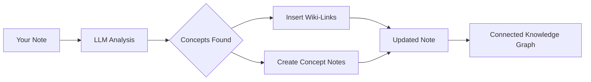

import TLDR from '@site/src/components/TLDR';

# Wiki-Links

<TLDR>
**Notemd fügt automatisch `[[wiki-links]]` zu den Schlüsselbegriffen in Ihren Notizen hinzu.** Der LLM liest Ihren Inhalt, erkennt wichtige Begriffe im Kontext und fügt bei jeder Vorkunft wiki-ähnliche Links im Obsidian-Stil ein. Optional werden Konzeptnotizdateien mit Rückverweisen erstellt. Es wird die Unterdrückung von Synonymen, die Integrität der Links bei Umbenennung/Löschen sowie ein reiner Extraktionsmodus (ohne Dateiänderungen) unterstützt. Im Gegensatz zu Auto Link, das nur bestehende Notentitel abgleicht, nutzt Notemd KI, um neue Konzepte zu erkennen und entsprechende Notizen anzulegen. Dies ist Teil des [Obsidian AI Knowledge Management Guide](/docs/pillar-ai-knowledge).
</TLDR>

## Überblick

Wiki-Verlinkung ist die Kernfunktion von Notemd. Sie wandelt Text in einen vernetzten Wissensgraphen um, indem sie:

1. **Analyse Ihrer Notiz** mit einem LLM
2. **Identifizierung von Schlüsselkonzepten** (Begriffe, Personen, Methoden, Theorien)
3. **Einfügen von `[[wiki-links]]`** bei jedem Vorkommen
4. **Erstellung von Konzeptnotizen** (optional) mit Rückverweisen

## Wie es funktioniert

### Verarbeiten



### Beispiel

**Vorher:**
```markdown
Machine learning models use neural networks to learn patterns from data.
The transformer architecture revolutionized natural language processing.
```

**Nach:**
```markdown
[[Machine learning]] models use [[neural networks]] to learn patterns from data.
The [[transformer architecture]] revolutionized [[natural language processing]].
```

## Verwendung

### Grundlegend: Links zur aktuellen Notiz hinzufügen

1. Eine Notiz öffnen
2. Rechtsklick im Editor → **„Datei verarbeiten (Verlinkungen hinzufügen)“**
3. Warten Sie ein paar Sekunden.
4. Die Konzepte sind jetzt verknüpft!

### Batch: Mehrere Notizen verarbeiten

1. Klicken Sie mit der rechten Maustaste auf einen Ordner im Datei-Explorer
2. Wählen Sie **„Notemd: Verarbeitung der Ordner (Links hinzufügen)“** aus
3. Konfigurieren:
   - Konkurrenz (wie viele Dateien parallel)
   - Bestehende Links überschreiben (ja/nein)
4. Klicken Sie auf **Process**

### Selektiv: Link zu spezifischem Text

1. Hervorheben des zu verarbeitenden Textes
2. Rechtsklick → **„Prozess auswählen (Verknüpfungen hinzufügen)“**
3. Nur der hervorgehobene Teil wird analysiert

## Notemd gegen Auto Link

Obsidian bietet zwei Ansätze für die automatische Wiki-Verlinkung:

| | **Auto-Link** | **Notemd** |
|--|---------------|-------------|
| Quelllink | Bestehende Notentitel im Vault | LLM-identifizierte Konzepte im Inhalt |
| Kann neue Konzepte verknüpfen | Nein – der Titel muss bereits existieren. | Ja – KI erkennt Konzepte und erstellt Notizen |
| Synonymverarbeitung | Nein | Ja – Synonymunterdrückung |
| Erstellung einer Konzeptnote | Nein | Ja – mit Backlinks und Deduplizierung |
| Batchverarbeitung | Nein (eine Datei) | Ja (Ebenenübersicht) |
| Modell-Routing pro Aufgabe | Nein | Ja |

**Auto Link** führt eine Titelübereinstimmung durch: Wenn eine Notiz mit dem Namen „Machine Learning“ existiert, umschließt es die Vorkommen mit `[[Machine Learning]]`. Wenn die Notiz nicht existiert, passiert nichts.

**Notemd** wird von KI gesteuert: Der LLM liest Ihren Inhalt, versteht den Kontext, erkennt Konzepte, die *verknüpft* werden sollten – selbst wenn es noch keine Notiz gibt – und erstellt sowohl die Verlinkung als auch die Konzeptnotiz.

## Funktionen

### Synonymunterdrückung

**Problem:** „transformer“, „transformers“, „Transformer architecture“ → 3 getrennte Konzepte

**Lösung:** Notemd erkennt nahezu identische Elemente und verwendet die kanonische Form.

**Konfiguration:**
```
Settings → Advanced → Synonym Suppression
Threshold: 0.8 (0 = off, 1 = aggressive)
```

### Link-Integrität

**Wenn Sie eine Konzeptnotiz umbenennen:**
- Alle Wiki-Links werden automatisch aktualisiert (Obsidian Kernfunktion)
- Die Backlinks bleiben unverändert.

**Wenn Sie eine Konzeptnotiz löschen:**
- Die Links bleiben erhalten, werden aber als „unverknüpfte Erwähnungen“ angezeigt.
- Sie können von jedem Vorkommen neu erstellen.

### Reiner Extraktionsmodus

**Konzepte extrahieren, ohne den Originaltext zu verändern:**

1. Rechtsklick → **„Konzepte extrahieren (ohne Verlinkung)“**
2. Konzeptnotizen werden erstellt
3. Die ursprüngliche Datei unberührt.

Anwendungsfall: Verarbeitung von nur zum Lesen bestimmtem Inhalt oder Endentwürfen.

## Erstellung einer Konzeptnote

### Automatische Erstellung

**Wenn es aktiviert ist (Standard), erstellt Notemd:**

```markdown
---
tags: [concept, auto-generated]
created: 2026-06-13
source: [[Original Note Name]]
---

# Machine Learning

A branch of artificial intelligence that enables computers
to learn from data without explicit programming.

## Occurrences in Your Vault

- [[Original Note Name#Section]]
- [[Another Note#Header]]

## Related Concepts

- [[Neural Networks]]
- [[Deep Learning]]
- [[Supervised Learning]]
```

### Konfiguration

**Ausgabeverzeichnis:**
```
Settings → Output → Concept Folder
Default: concepts/
```

**Hierarchische Struktur:**
```
Settings → Output → Use Hierarchical Folders
If enabled:
  papers/my-paper.md → papers/concepts/Concept.md
If disabled:
  → concepts/Concept.md
```

**Vorlage:**
```
Settings → Output → Concept Template
Customize with variables:
  {{concept}} — Concept name
  {{description}} — LLM-generated description
  {{backlinks}} — List of source notes
  {{date}} — Creation date
```

## Erweiterte Optionen

### Kontextfenster

**Wie viel Umtext soll gesendet werden:**

```
Settings → Linking → Context Window
Options: Sentence | Paragraph | Full Note
Default: Paragraph
```

Größer = höhere Genauigkeit, höherer Preis.

### Mindestanzahl der Vorkommen

**Nur Konzepte verlinken, die mehrfach auftauchen:**

```
Settings → Linking → Min Occurrences
Default: 1 (link all)
```

Stellen Sie es auf 2 oder 3 ein, um sich auf wiederkehrende Themen zu konzentrieren.

### Muster ausschließen

**Bestimmte Wörter überspringen:**

```
Settings → Linking → Exclude List
Example: note, idea, example, thing
```

Verhindert das Überverknüpfen allgemeiner Begriffe.

### Benutzerdefinierte Anfragen

**Überschreiben der Standard-Anweisungen für LLM:**

```
Settings → Advanced → Custom Linking Prompt
Default:
  "Identify key concepts, theories, methods, and technical
   terms in the following text. Return as a list..."
```

Anpassen für domänenspezifische Anforderungen (z. B. „Fokus auf medizinische Terminologie“).

## Tipps & Best Practices

### ✅ OK

- **Prozessnotizen mit >100 Wörtern** – Kurze Notizen liefern nur wenige Konzepte
- **Nutzen Sie leistungsstarke Modelle** für eine bessere Konzeptidentifizierung (GPT-4o, Claude)
- **Überprüfung vor Annahme** – Überprüfen Sie, ob die vorgeschlagenen Links sinnvoll sind
- **Iterativ bauen** – Verarbeiten Sie 5–10 Notizen, überprüfen Sie das Diagramm und passen Sie die Einstellungen an

### ❌ NICHT

- **Over-link** – Nicht jedes Substantiv benötigt einen Link
- **Entwürfe wiederholt verarbeiten** – Die Konzepte können sich ändern, warten Sie, bis sie stabil sind
- **Synonyme ignorieren** – Aktiviere die Unterdrückung, um „ML“ und „Machine Learning“ zu vermeiden

## Leistung

### Geschwindigkeit

| Notengröße | GPT-4o-mini | Claude Sonnet | Ollama (lokal) |
|-----------|-------------|---------------|----------------|
| 500 Wörter | 2-3 Sekunden | 3-5 Sekunden | 5-10 Sekunden |
| 2000 Wörter | 5-8 Sekunden | 10-15 Sekunden | 20-40 Sekunden |
| 5000+ Wörter | In Blöcken (mehrere Aufrufe) | In Blöcken | In Blöcken |

### Kostenabschätzung

**Beispiel: 1000-Wort-Memo mit GPT-4o-mini**
- Eingabe: ~1500 Tokens
- Ausgabe: ~200 Token
- Kosten: ~0,001 $

**Batchverarbeitung von 100 Notizen:** ~0,10 $

## Fehlerbehebung

### Keine Links hinzugefügt

**Überprüfung:**
1. LLM Aufruf erfolgreich (Einstellungen → Diagnose)
2. Die Notiz enthält ausreichend Inhalt (>50 Wörter).
3. Konzepte sind technisch/spezifisch (nicht nur Pronomen).

**Ausprobieren:**
- Verwende ein leistungsstärkeres Modell
- Contextfenster erweitern
- Überprüfe die Gültigkeit der API-Einstellung

### Zu viele Links

**Lösungen:**
1. Mindestanzahl der Vorkommen erhöhen (2 oder 3)
2. Hinzufügen von häufigen Wörtern zur Ausklusionsliste
3. Verwenden Sie ein weniger aggressives Modell

### Falsche Konzepte verknüpft

**Verbesserungen:**
1. Verwenden Sie einen benutzerdefinierten Prompt für Domänen-Spezifität
2. Synonymunterdrückung aktivieren
3. Manuell überprüfen und trennen

### Die Links brechen nach dem Umbenennen.

**Dies ist ein normales Obsidian Verhalten.**

Um alle Links zu aktualisieren:
1. Den Konzeptbrief umbenennen
2. Obsidian aktualisiert `[[old]]` automatisch auf `[[new]]`

---

## Nächste Schritte

- 📖 [Concept Notes](./concept-notes) — Einführung in die Erstellung von Konzeptnotizen
- 🔍 [Forschungsintegration](./research) — Kombination von Verlinkungen mit Webrecherche
- 🎨 [Diagramme](./diagrams) — Visualisieren Sie Ihren Wissensgraphen
