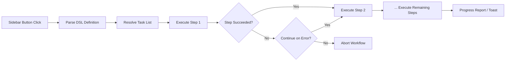

import TLDR from '@site/src/components/TLDR';

# Workflows

<TLDR>
**Notemd Workflows verknüpfen mehrere Aufgaben zu einer einzigen Aktion mit einem Klick.** Definieren Sie Sequenzen wie `add-links > extract-concepts > research > diagram` mithilfe einer einfachen DSL. Workflows erscheinen als Schaltflächen im Seitenbereich, die die gesamte Kette in der aktuellen Notiz oder dem Ordner ausführen. Es werden vorgefertigte Workflows mitgeliefert; erstellen Sie eigene in den Einstellungen. Jeder Schritt verwendet seine eigene, pro-Aufgabe angepasste Konfiguration.

Dies ist ein Teil des [Obsidian AI-Know-how-Management-Leitfadens](/docs/pillar-ai-knowledge).
</TLDR>

## Überblick

Ein Workflow beseitigt die Hindernisse, die entstehen, wenn Aufgaben nacheinander ausgeführt werden müssen. Anstatt viermal mit der rechten Maustaste zu klicken, um Links hinzuzufügen, Konzepte zu extrahieren, unbekannte Begriffe zu recherchieren und ein Diagramm zu erstellen, genügt es, einen Knopf in der Seitenleiste zu drücken – dann wird die gesamte Abfolge ausgeführt. Notemd kümmert sich um die Sequenzierung, die Fehlerverbreitung sowie den Fortschrittsbericht.

Workflows werden in einer leichten DSL (domain-spezifischen Sprache) definiert. Sie befinden sich in den Einstellungen, erscheinen als klickbare Schaltflächen im Obsidian-Bereich und können entweder auf die aktuelle Notiz oder auf einen ganzen Ordner angewendet werden.

## Wie es funktioniert

### Workflow-Ausführungspipeline



1. **Parse** – Der DSL-String wird an `>` (oder `>`) in eine geordnete Liste von Task-Identifikatoren aufgeteilt.
2. **Resolve** -- Jeder Identifikator wird auf einen internen Befehl abgebildet (add-links, extract-concepts, research, translate, diagram usw.).
3. **Ausführen** -- Die Schritte werden nacheinander ausgeführt. Jeder Schritt verwendet seinen konfigurierten Provider und Modell pro Aufgabe.
4. **Fehlerbehandlung** – Wenn ein Schritt fehlschlägt, wird der Workflow entweder abgebrochen oder geht zum nächsten Schritt über, je nach Ihrer Fehlerpolitik.
5. **Erledigt** -- Eine Toast-Benachrichtigung meldet den Erfolg oder listet alle fehlgeschlagenen Schritte auf.

### DSL-Format

Workflows werden als eine durch `>` getrennte Abfolge von Aufgabenerkennern definiert:

```
process-current-add-links>extract-concepts-current>research-and-summarize
```

**Verfügbare Aufgabenerkennungscodes:**

| Identifikator | Aktion |
|------------|--------|
| `process-current-add-links` | Füge Wiki-Links zur aktiven Notiz hinzu |
| `extract-concepts-current` | Konzepte aus der aktiven Notiz extrahieren |
| `research-and-summarize` | Forschen Sie den ausgewählten Text oder die Notizüberschrift. |
| `process-current-translate` | Übersetze die aktive Notiz |
| `summarize-to-mermaid` | Erstelle ein Diagramm aus der aktiven Notiz |
| `generate-from-title` | Erstelle Inhalte aus dem Titel der Notiz |
| `extract-original-text` | Ursprünglicher Text extrahieren (für OCR/gescannte Inhalte) |

**Varianten auf Ordnerebene** ersetzen `current` durch `folder` im Identifikationsnamen.

### Vordefinierte versus benutzerdefinierte Workflows

Notemd wird mit vorgefertigten Workflows für gängige Muster geliefert:

| Workflow | Kette | Anwendungsfall |
|----------|-------|----------|
| **Einzuklick-Extrahieren** | add-links > extract-concepts > Forschung | Ein Forschungspapier in einem Durchlauf verarbeiten |
| **Vollständiger Pipeline** | add-links > extract-concepts > research > Diagramm | Vollständige Wissensextraktion mit Visualisierung |
| **Übersetzen + Link** | Übersetzen > Links hinzufügen | Übersetzen Sie dann die Konzepte des Links in der Zielsprache |

**Benutzerdefinierte Workflows** werden in den Einstellungen erstellt:

1. Öffnen Sie **Einstellungen** --> **Notemd** --> **Workflows**
2. Klicken Sie auf **„Workflow hinzufügen“**
3. Geben Sie die DSL-Kette ein (z. B. `process-current-add-links>extract-concepts-current`)
4. Geben Sie einem einen Anzeigennamen (z. B. „Schneller Link + Extrahieren“).
5. Die neue Schaltfläche erscheint sofort im Seitenbereich.

## Konfiguration

| Einstellungen | Standard | Effekt |
|---------|---------|--------|
| `workflows` | Vordefinierter Satz | Array von Workflow-Definitionen (Name + DSL) |
| `workflowContinueOnError` | `true` | Gehen Sie zum nächsten Schritt über, wenn der aktuelle Schritt fehlschlägt |
| `workflowShowProgress` | `true` | Zeige eine Fortschrittsbenachrichtigung nach Abschluss jeder Schritt. |

### Per-Aufgabe-Modelle in Workflows

Jeder Schritt in einem Workflow verwendet seine **eigene** Modellkonfiguration pro Aufgabe. Sie müssen die Modelle nicht direkt im DSL angeben. Die Auflösungsreihenfolge ist:

1. Provider/Modell pro Aufgabe, falls `useMultiModelSettings` aktiv ist
2. Global `activeProvider` ansonsten

Das bedeutet, dass `add-links` auf DeepSeek laufen kann, während `research` auf GPT-4o läuft – alles innerhalb derselben Workflow-Klickaktion.

## Beispiel

Sie haben gerade einen PDF eines Machine-Learning-Papiers in Ihren Tresor importiert und möchten eine vollständige Wissensextraktion.

1. Öffnen Sie die importierte Notiz
2. Klicken Sie auf die Schaltfläche „Full Pipeline“ im Seitenbereich.
3. Notemd führt aus:
   - **Schritt 1**: Fügen Sie Wiki-Links hinzu -- `[[attention mechanism]]`, `[[transformer]]` usw.
   - **Schritt 2**: Konzepte extrahieren – erstellt Konzeptnotizen in Ihrer Konzeptordner
   - **Schritt 3**: Recherche – fasst Webquellen zu Schlüsselbegriffen zusammen
   - **Schritt 4**: Diagramm – erzeugt eine Mermaid-Mindmap der Struktur des Papers
4. Nach etwa 30 Sekunden enthält Ihre Notiz Links, es gibt Konzeptnotizen, die Forschungsergebnisse werden hinzugefügt und eine Diagrammdatei wird gespeichert

Alles mit nur einem Klick.

## Tipps

- **Beginnen Sie mit vorgefertigten Workflows** – sie umfassen die häufigsten Muster. Passen Sie sie nur an, wenn Sie eine andere Abfolge benötigen.
- **Aktiviere `workflowContinueOnError`** – ein fehlgeschlagener Diagramm-Schritt sollte den gesamten Pipeline-Prozess nicht abbrechen.
- **Verwenden Sie Ordner-Arbeitsabläufe** für die Massenverarbeitung – klicken Sie mit der rechten Maustaste auf einen Ordner, wählen Sie einen Arbeitsablauf aus, und jede Notiz wird verarbeitet.
- **Benennen Sie Workflows klar** – der Platz im Seitenbereich ist begrenzt. Verwenden Sie kurze, handlungsorientierte Namen wie „Schnelles Extrahieren“ oder „Übersetzen + Link“.

---

## Nächste Schritte

- [Forschung](./research) -- Erkennen Sie, was der Forschungsschritt leistet, bevor Sie ihn in Workflows einfügen
- [Wiki-Links](./wiki-links) -- Kernfunktion zur Verlinkung, die in den meisten Workflows verwendet wird
- [Concept Notes](./concept-notes) -- Konzeptextraktion als Arbeitsablaufschritt
- [Batch Processing](/docs/advanced/batch-processing) -- Konkurrenzverarbeitung und Fortschrittsberichterstattung für Ordnerarbeitsabläufe
