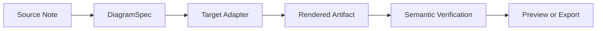
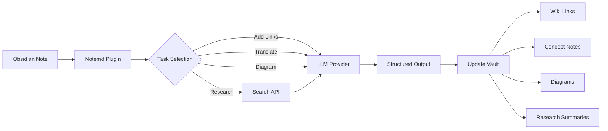

import TLDR from '@site/src/components/TLDR';

# Einführung in Notemd

<TLDR>
**Notemd** (Note + EMD — Enhanced Markdown Documents) ist ein Open-Source-Obsidian-Plugin, das das mit LLM betriebene Lesen in dauerhaftes Wissen umwandelt. Im Gegensatz zu chatbasierten KI-Systemen, bei denen Erkenntnisse nach der Sitzung verschwinden, schreibt Notemd die Ergebnisse **direkt in Ihren Schatzkasten** als Wiki-Links, Konzeptnotizen, Forschungsübersichten, Übersetzungen, Workflows und Diagramme. Es ist für Forscher, Studenten und Wissensarbeiter konzipiert, die möchten, dass ihr Lesen, ihre Forschung und visuelle Erklärungen zu einem strukturierten, sich weiterentwickelnden Wissensgraphen zusammengefasst werden.
</TLDR>

## Was ist Notemd?

Notemd integriert **mehr als 30 große Sprachmodelle** (OpenAI, Anthropic, Google, DeepSeek, Qwen, Ollama und weitere) in Ihren Obsidian Workflow, um die Extraktion, Organisation, Übersetzung, Forschung sowie die Erstellung von Diagrammen automatisch zu gestalten.

### Wesentlicher Unterschied: Vorübergehendes Wissen vs. Dauerhaftes Wissen

| Aspekt | KI basierend auf Chat (ChatGPT usw.) | Notemd |
|--------|-------------------------------|--------|
| **Wohin die Ergebnisse gehen** | Chatverlauf (verschwindet) | Ihr Obsidian Vault (bleibt bestehen) |
| **Format** | Einfache Textantworten | Strukturierte Dateien: `[[wiki-links]]`, Konzeptnotizen, Diagramme |
| **Langfristiger Wert** | Muss jedes Mal erneut fragen | Sammelt sich zu einem Wissensgraphen. |
| **Offline-Zugriff** | Erfordert Internetverbindung | Funktioniert vollständig offline mit Ollama |

## Kernfähigkeiten

### 1. **Automatische Wiki-Verlinkung**
- LLM identifiziert die wichtigsten Konzepte in Ihren Notizen
- Fügt `[[wiki-links]]` bei jedem Vorkommen ein
- Erstellt optional verknüpfte Konzeptnotizen
- Synonymunterdrückung zur Vermeidung von Duplikaten

### 2. **Erstellung einer Konzeptnotiz**
- Zentrale Konzepte aus Artikeln, Aufsätzen und Notizen extrahieren
- Erstellt spezielle Konzeptdateien mit Rückverweisen
- Anpassbare Ausgabepfade und Vorlagen

### 3. **Integration der Web-Recherche**
- Abfrage von Tavily oder DuckDuckGo aus Obsidian heraus
- LLM fasst die Ergebnisse mit Quellenangaben zusammen
- Fügt Forschungsergebnisse zur aktuellen Notiz hinzu

### 4. **Mehrsprachige Übersetzung**
- Übersetzen Sie Auswahlen oder ganze Notizen
- Unterstützt mehr als 21 UI Sprachen
- Unabhängige Konfiguration der Ausgabessprache
- Unterstützung für Batch-Übersetzung

### 5. **Diagrammgenerierung**
- **Mermaid**: Flussdiagramme, Sequenz-, Klassen-, Zustands-, ER-, Gantt-Diagramme
- **JSON Canvas**: Obsidian native Layouts
- **Vega-Lite**: Datendiagramme, Zeitreihen, Streudiagramme
- **HTML / Bearbeitbare HTML/SVG**: Selbstständige Abbildungsobjekte mit semantischen Anmerkungen
- **Draw.io / Drawnix Artefaktgrenzen**: Exportpfade für den Betreiber aus demselben semantischen Figurmodell
- **Roadmap für Schaltpläne**: Die Unterstützung für circuitikz/TikZJax wird anhand von Gold-Referenzen, eingeschränkten Anfragen, Render-Bestätigungen sowie Validierungen der Topologie und des Layouts entwickelt, anstatt auf unbeschränkte LLM TikZ-Dateien zurückzugreifen.
- **Vorab-Diagnose**: Render-Fehler können Diagnosen zu Kompilierungs- oder Render-Problemen anzeigen, und nicht-in-line-Quellen können ohne eine LaTeX-Laufzeit auf Plugin-Seite überprüft werden.
- Syntax-Autokorrektur für Mermaid-Fehler

### 6. **Einst-Klick-Abläufe**
- Mehrere Aktionen in Seitenleisten-Buttons verknüpfen
- Workflow-Definition basierend auf DSL
- Beispiel: `add-links > extract-concepts > research > diagram`

## Wer sollte Notemd verwenden?

✅ **Forscher**, die Artikel lesen und Literaturübersichten erstellen
✅ **Studenten**, die Lernnotizen organisieren und Konzeptkarten erstellen
✅ **Wissensarbeiter**, die möchten, dass Lese-Erkenntnisse erhalten bleiben
✅ **Zweisprachige Fachleute**, die Übersetzung + Wiki-Verlinkung benötigen
✅ **Datenschutzbewusste Nutzer**, die lokale LLM-Unterstützung wünschen (Ollama)
✅ **Power-Anwender**, die Anfragen und Arbeitsabläufe anpassen

## Warum Notemd + Obsidian?

**Obsidian** ist eine lokal ausgerichtete, auf Markdown basierende Wissensdatenbank. **Notemd** fügt künstliche Intelligenz-Fähigkeiten hinzu:
- Ihre Daten bleiben in Ihrem Tresor (nicht in einem Cloud-Dienst).
- Funktioniert offline mit lokalen Modellen
- Kostenlos und Open Source (MIT-Lizenz)
- Integriert sich mit bestehenden Obsidian-Plugins
- Skaliert auf Zehntausende von Noten

## Einführung

1. **Installieren**: Einstellungen → Community-Plugins → Durchsuchen → "Notemd"
2. **Konfigurieren**: Fügen Sie Ihren LLM-Anbieter-API-Schlüssel hinzu (oder verwenden Sie den lokalen Ollama).
3. **Ausprobieren**: Öffnen Sie eine Notiz → Rechtsklick → „Datei verarbeiten (Verlinkungen hinzufügen)“
4. **Erkunden**: Überprüfen Sie die Seitenleiste nach Workflows zum Ein-Klick-Ausführen

👉 [Installationsanleitung](./getting-started/installation) | [Kurzstart-Tutorial](./getting-started/quick-start)

## Diagramm-Funktionalitätsrichtung

Die Diagrammgenerierung von Notemd weicht zunehmend davon ab, das Modell zu bitten, einen einzigen Syntax-String zu schreiben, und orientiert sich stattdessen an einem schichtweisen Pipeline-Ansatz:

Die aktuelle Implementierung unterstützt bereits die Fallback-Möglichkeiten Mermaid, JSON Canvas, Vega-Lite, HTML, editierbare HTML/SVG, Draw.io XML Artefakte, ein minimales Drawnix JSON-Subset, Vorschau-Diagnosen sowie einen Offline-`CircuitSpec -> circuitikz`-Prototyp für gängige Quellcode- und CMOS-Inverter-Golden-Template. Schaltpläne sind eine schwierigere Kategorie: circuitikz kann eine genaue elektrische Topologie darstellen, doch ungehinderte LLM-Ausgaben erzeugen oft unlesbaren Routing-Code oder LaTeX, der nicht dargestellt werden kann. Der nächste Schritt besteht darin, circuitikz durch Golden-Reference-Template, Regeln für das Knoten-Gitter-Layout, Render-Diagnosen sowie Feedbackschleifen über Screenshots weiter einzuschränken.

Lesen Sie die Details in [Diagrams](./features/diagrams).

## Architektur

## Notemd im Vergleich zu anderen Obsidian AI-Plugins

Die meisten Obsidian AI-Plugins arbeiten konversationsbasiert (Sie stellen eine Frage, die KI antwortet, und die Erkenntnisse bleiben im Chat). Notemd hingegen arbeitet **schreibbasiert**: Die KI verarbeitet Ihre Notizen und schreibt die strukturierten Ergebnisse direkt in Ihr Archiv.

| Fähigkeit | Notemd | Copilot | Smart Connections | Text Generator |
|-----------|--------|---------|-------------------|-----------------|
| Einfügen eines Auto-Wiki-Links | Ja | Nein | Nein | Nein |
| Erstellung einer Konzeptnote | Ja (mit Backlinks + Deduplizierung) | Nein | Nein | Nein |
| Diagrammgenerierung | Ja (Mermaid, Canvas, Vega-Lite, HTML, bearbeitbare Artefakte) | Nein | Nein | Nein |
| Integration der Web-Recherche | Ja (Tavily + DuckDuckGo) | Nein | Nein | Nein |
| Batch-Verarbeitung von Ordnern | Ja | begrenzt | Nein | begrenzt |
| Modell-Routing pro Aufgabe | Ja (7 Aufgaben, unabhängige Modelle) | Nein | Nein | Nein |
| Einst-Klick-Workflow-Ketten | Ja (DSL) | Nein | Nein | Nein |
| Übersetzung (Batch) | Ja | Nein | Nein | Nein |
| Mit Vault chatten | Nein | Ja | Nein | Nein |
| Suche nach semantischer Ähnlichkeit | Nein | Nein | Ja | Nein |
| Template-basierte Erstellung | Nein | Nein | Nein | Ja |
| LLM Anbieter | 36 (Cloud + Gateway + lokal) | 3-5 | 2-3 | 3-5 |
| Vollständig offline | Ja (Ollama) | Teilweise | Teilweise | Teilweise |

**Wann Sie Notemd wählen sollten**: Wenn Sie möchten, dass die KI einen dauerhaften Wissensgraphen erstellt – und nicht nur über Ihre Notizen spricht.

**Wann Copilot wählen?**: Sie möchten einen konversationalen KI-Assistenten innerhalb von Obsidian haben.

**Wann Smart Connections wählen?**: Wenn Sie bestehende Beziehungen zwischen Notizen über eine semantische Suche erkunden möchten.

## Philosophie

**Notemd ist der Ansicht, dass KI die wissensbasierte Arbeit von Menschen erweitern sollte, statt sie zu ersetzen.** Der Plugin:
- Hält Sie im Griff (Überprüfung vor Anwendung von Änderungen)
- Kontext beibehalten (alle Ergebnisse verweisen auf die Quelle)
- Schützt die Privatsphäre (lokaler LLM-Support, keine Telemetrie)
- Bleibt erweiterbar (offene APIs, benutzerdefinierte Workflows)

<!-- notemd-acknowledgments -->
## Danksagungen und Referenzprojekte

Notemd wird unabhängig gepflegt. Wir danken den Open-Source-Projekten und Communities, die dokumentierte Entwurfsentscheidungen geprägt haben oder Integrationsgrundlagen bereitstellen. Die Nennung würdigt ausschließlich Einfluss oder Interoperabilität; sie bedeutet keine Befürwortung, Zugehörigkeit, gebündelten Code oder Behauptung einer Code-Wiederverwendung.

- **Referenzprojekte:** [cloudy-tech-diagrams-skill](https://github.com/cloudy-liu/cloudy-tech-diagrams-skill), [Drawnix](https://github.com/plait-board/drawnix), [diagrams.net / draw.io](https://www.diagrams.net/), [repo-saga](https://github.com/teee32/repo-saga).
- **Open-Source-Grundlagen:** [Mermaid](https://github.com/mermaid-js/mermaid), [Vega-Lite](https://vega.github.io/vega-lite/), [Slidev](https://github.com/slidevjs/slidev), [CircuitikZ](https://github.com/circuitikz/circuitikz), [Tectonic](https://github.com/tectonic-typesetting/tectonic), [Docusaurus](https://docusaurus.io).
- Jedes Projekt behält seine eigene Lizenz und Bedingungen; Notemd steht unter der [MIT-Lizenz](https://github.com/Jacobinwwey/obsidian-NotEMD/blob/main/LICENSE).

## Open Source

- **Lizenz**: MIT
- **Quelle**: [github.com/Jacobinwwey/obsidian-NotEMD](https://github.com/Jacobinwwey/obsidian-NotEMD)
- **Community**: [Discord](https://discord.gg/qnGgsQ9W) | [GitHub Discussions](https://github.com/Jacobinwwey/obsidian-NotEMD/discussions)
- **Beitragen**: Pull Requests sind willkommen, siehe [CONTRIBUTING.md](https://github.com/Jacobinwwey/obsidian-NotEMD/blob/main/CONTRIBUTING.md)

---

**Nächstes**: [Installation →](./getting-started/installation)
