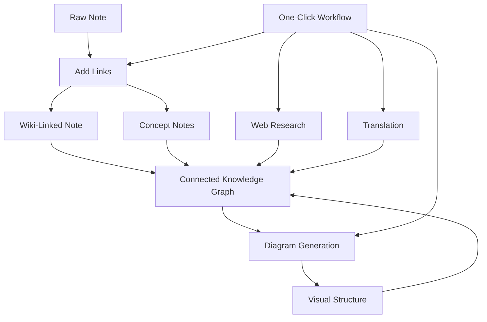

import TLDR from '@site/src/components/TLDR';

# Obsidian Leitfaden zur KI-basierten Wissensverwaltung

<TLDR>
**Notemd verwandelt das mit LLM angetriebene Lesen in dauerhaftes Wissen: Wiki-Verlinkungen verbinden Konzepte, Konzeptnotizen erstellen ein abrufbares Netzwerk, Forschung bringt das Internet in Ihren Schatzkasten, Übersetzungen beseitigen sprachliche Barrieren, Diagramme machen die Struktur sichtbar, und Workflows verknüpfen alles mit nur einem Klick.** Dieser Leitfaden behandelt den gesamten Prozess – von Rohnotizen bis hin zu einer vernetzten, visuellen, mehrsprachigen Wissensdatenbank.
</TLDR>

## Warum KI-basiertes Wissensmanagement?

Traditionelles Notieren erzeugt flache Dateien. Selbst mit manuellen Wiki-Verknüpfungen bleiben die meisten Notizen unvernetzt. Notemd verwendet LLMs, um die Verbindungslogik zu automatisieren:

- **LLMs lesen Ihren Inhalt** und ermitteln, was wichtig ist – Begriffe, Methoden, Personen, Theorien
- **Verlinkungen werden automatisch** bei jedem Vorkommen eines Konzepts eingefügt, nicht in „siehe auch“ versteckt.
- **Konzeptnotizen werden** als eigenständige, abrufbare Dateien erzeugt
- **Forschung bereichert Notizen** mit aus dem Web stammendem Kontext
- **Diagramme machen die Struktur sichtbar** – Mind Maps, Flussdiagramme, Datencharts aus demselben Inhalt

Das Ergebnis: Ein Wissensgraphen, der mit jeder bearbeiteten Notiz wächst – und nicht nur dann, wenn man daran denkt, Links hinzuzufügen.

## Der gesamte Pipeline



Jeder Schritt ist unabhängig. Verwenden Sie einen oder alle. Die wirksamste Reihenfolge: **Add Links → Concept Notes → Diagrams**.

---

## 1. Wiki-Links: Verbindungen explizit herstellen

Wiki-Links bilden das Rückgrat eines Wissensgraphen. Notemd verwendet ein LLM, um:

1. Lesen Sie den Inhalt Ihrer Notiz (in Abschnitte aufgeteilt für lange Dokumente)
2. Identifizieren Sie die Kernkonzepte – indem Sie spezifische, technische Begriffe vor allgemeinen Substantiven priorisieren
3. Fügen Sie `[[wiki-links]]` bei jedem Vorkommen ein.
4. Unterdrücke Synonyme, damit „ML“ und „Machine Learning“ keine separaten Knoten erzeugen.

### Wann verwenden

- **Jede Notiz >100 Wörter** – kürzere Notizen liefern nur wenige Konzepte
- **Forschungsarbeiten, technische Dokumentationen, Meeting-Notizen** – reich an fachspezifischen Begriffen
- **Nachdem der Inhalt stabil ist** – verarbeiten Sie Entwürfe nicht wiederholt.

### Einstellungen der Schlüssel

| Einstellungen | Empfohlen | Warum |
|---------|-----------|-----|
| `addLinksProvider` | DeepSeek oder GPT-4o-mini | Gute Genauigkeit zu niedrigem Preis |
| Synonymunterdrückung | Eingeschaltet | Verhindert doppelte Knoten |
| Kontextfenster | Absatz | Ausgleich zwischen Genauigkeit und Kosten |

→ [Einsatz von Wiki-Links im Detail](/docs/features/wiki-links)

---

## 2. Konzeptnotizen: Abrufbare Wissensknoten

Wiki-Links verbinden Ideen direkt im Text, während Konzeptnotizen es ermöglichen, jede Idee unabhängig abzurufen. Jedes Konzept erhält seine eigene `.md`-Datei:

```markdown
# Machine Learning

## Linked From
- [[My Research Notes]]
- [[Neural Networks Explained]]
```

### Der Extraktionsprozess

Der LLM-Prompt ist stark strukturiert:
- In die Singularform normalisieren
- Bevorzugen Sie mehrwortige Begriffe vor Einzelwörtern („Dielektrische Entspannung“ statt „Entspannung“)
- Überspringen Sie die Abschnitte mit Referenzen/Bibliografie
- Geben Sie den Ausgang als `CONCEPT:` Zeilen für deterministische Parsing aus

Konzepte werden über die einzelnen Blöcke hinweg mittels `Set<string>` dedupliziert. Fehler bei einzelnen Blöcken durch LLM führen nicht zum Abbruch der Operation.

### Backlinks

Wenn es aktiviert ist, verfolgt jede Konzeptnotiz, welche Quellennotizen sie erwähnen. Das eingebaute Backlink-Panel von Obsidian zeigt außerdem umgekehrte Verbindungen an.

### Deduplizierung

Der 4-Schritte-Deduplizierungsmechanismus von Notemd erkennt:
1. **Genaue Übereinstimmungen** – unabhängige von Groß-/Kleinschreibung Vergleich der Dateinamen
2. **Mehrzahlformen** — „Models.md“ gegenüber „Model.md“
3. **Symbolnormalisierung** — „A-B.md“ gegenüber „A B.md“
4. **Einzelwort-Enthaltung** – „ML.md“ wird markiert, wenn „Machine Learning.md“ vorhanden ist

### Einstellungen der Schlüssel

| Einstellungen | Empfohlen | Warum |
|---------|-----------|-----|
| `conceptNoteFolder` | `concepts/` oder `🧠 concepts/` | Hält das Tresor-Verzeichnis organisiert |
| `extractConceptsAddBacklink` | Eingeschaltet | Ermöglicht die umgekehrte Abfrage |
| `extractConceptsMinimalTemplate` | Aus | Vollständiges Template mit „Von“-Verlinkung |
| Modell pro Aufgabe | DeepSeek | Konzeptextraktion benötigt keine teuren Modelle |
| Synonymunterdrückung | Eingeschaltet | Die gleiche Einstellung beeinflusst sowohl das Verknüpfen als auch das Extrahieren. |

→ [Einsatz von Konzeptnotizen im Detail](/docs/features/concept-notes)

---

## 3. Forschung: Die Einbeziehung des Webs

Notemd integriert die Websuche in Ihren Notizmanagement-Prozess:

1. **Abfragen erstellen** – der Titel oder die Auswahl Ihrer Notiz wird zu einer Suchabfrage
2. **Websuche** — Tavily (empfohlen, Schlüssel API erforderlich) oder DuckDuckGo (kostenlos, kein Schlüssel)
3. **LLM Zusammenfassung** – Die Suchergebnisse werden zu einer relevanten Zusammenfassung gekürzt
4. **Anmerkung hinzufügen** – Zusammenfassung wird an die Cursorposition eingefügt oder als neuer Abschnitt.

### Wann verwenden

- Bevor ein neues Thema verarbeitet wird – holen Sie zunächst den Web-Kontext.
- Wenn eine Konzeptnote erweitert werden muss – fügen Sie dann Forschungslinks hinzu.
- Für Literaturübersichten – durchführen Sie eine Batch-Forschung in einem Ordner mit Notizen

### Einstellungen der Schlüssel

| Einstellungen | Empfohlen | Warum |
|---------|-----------|-----|
| `researchProvider` | GPT-4o oder Claude | Forschung benötigt eine hochwertigere Zusammenfassung |
| Suchdienst | Tavily | Bessere Relevanz, konfigurierbare Tiefe |
| `maxResearchContentTokens` | 4000 | Ausgleich zwischen Tiefe und Kosten |

→ [Erforschung im Detail](/docs/features/research)

---

## 4. Übersetzung: Sprachbarrieren überwinden

Notemd übersetzt Notizen mithilfe Ihrer konfigurierten LLM – es handelt sich dabei nicht um eine spezielle Übersetzungsmaschine API. Das bedeutet:

- **kontextbezogene Übersetzungen** – der LLM versteht den gesamten Dokument, nicht nur Satz für Satz
- **Umgang mit technischen Begriffen** – „gradient descent“ bleibt als „梯度下降“ und nicht als „坡度向下“.
- **Batch-Unterstützung** – Übersetzen Sie einen ganzen Ordner mit Notizen in einer einzigen Operation
- **Per-Task-Modell** – verwenden Sie Gemini Flash für Übersetzungen (schnell, günstig, mehrsprachig)

### Sprachunterstützung

Notemd selbst unterstützt 21 UI Sprachen. Die Zielsprache der Übersetzung kann pro Aufgabe konfiguriert werden. Häufige Paare: EN↔ZH, EN↔JA, EN↔KO, EN↔DE, EN↔FR, EN↔ES.

→ [Einsatz von Übersetzungen im Detail](/docs/features/translation)

---

## 5. Diagramme: Die Struktur sichtbar machen

Der Diagramm-Pipeline von Notemd basiert auf einer spezifizierungsgestützten Vorgehensweise: Der LLM erzeugt ein strukturiertes `DiagramSpec` JSON, wobei Adapter es anschließend in das Zielformat übersetzen. Dadurch entsteht zuverlässigeres Ergebnis als wenn man vom LLM eine rohe Mermaid-Syntax anfordert.

### Intenterkennung

Notemd ermittelt den besten Diagrammtyp aus dem Inhalt:

- **Tabellen mit Zahlen** → Datengrafik (Vega-Lite)
- **Client/Server-Vokabular** → Sequenzdiagramm (Mermaid)
- **Entität/Primärschlüssel** → ER-Diagramm (Mermaid)
- **Schritt/Ablauffluss** → Flussdiagramm (Mermaid)
- **Schlüsselwörter für Konzeptkarten** → JSON Canvas (Obsidian native)
- **Standard** → Mindmap (Mermaid)

### Renderkette

Primäres Ziel → Ersatz → Ersatz → HTML. Wenn die Syntax von Mermaid fehlschlägt, versucht es einmal erneut mit dem Fehlerkontext an LLM, bevor es auf ein minimales Diagramm zurückgreift.

### Einstellungen der Schlüssel

| Einstellungen | Empfohlen | Warum |
|---------|-----------|-----|
| `enableExperimentalDiagramPipeline` | Eingeschaltet | Bessere Qualität durch vordefinierte Spezifikationen |
| `experimentalDiagramCompatibilityMode` | `best-fit` | Natives Ziel pro Intent |
| `summarizeToMermaidProvider` | GPT-4o oder Claude | Die Spezifikationen für Diagramme erfordern räumliches Denken. |
| `autoMermaidFixAfterGenerate` | Eingeschaltet | Fängt automatisch Syntaxfehler von LLM ab |
| Erweiterung des lokalen Wissens | Eingeschaltet für domänenspezifisch | Verbessert die Genauigkeit im Vault-Kontext |

→ [Einsatz von Diagrammen im Detail](/docs/features/diagrams)

---

## 6. Workflows: Ein-Klick-Automatisierung

Workflows verknüpfen mehrere Aufgaben zu einem einzigen Schaltflächen-Button in der Seitenleiste. Das DSL-Format lautet:

```
task1 | task2 | task3
```

Beispiel: `addLinks` | Konzepte extrahieren | generateDiagram` – wandelt eine Notiz aus Rohtext in einem Klick in einen voll vernetzten, visuellen Wissensknoten um.

### Empfohlene Arbeitsabläufe

| Workflow | Kette | Anwendungsfall |
|----------|-------|----------|
| Vollständiger Prozess | `addLinks \| extractConcepts \| generateDiagram` | Neue Notizen |
| Zuerst Forschung betreiben | `research \| addLinks` | Unbekannte Themen |
| Polyglott | `translate \| addLinks` | Mehrsprachige Notizen |
| Nur Diagramm | `generateDiagram` | Schnelle Visualisierung |

→ [Einsatz von Workflows im Detail](/docs/features/workflows)

---

## 7. LLM Anbieter: 36 Optionen von Cloud bis lokal

Notemd unterstützt 36 Anbieter in 4 Transporttypen. Schlüsselgruppen:

- **Internationale Cloud**: OpenAI, Anthropic, Google, Mistral, xAI
- **China Cloud**: DeepSeek, Qwen, Doubao, Moonshot, GLM, Baidu, SiliconFlow
- **Gateways**: OpenRouter, GitHub Models, Hugging Face, Vercel
- **Lokal**: Ollama, LMStudio, OVMS — keine API-Einstellung, keine Daten verlassen Ihren Rechner

### Strategie des Modells pro Aufgabe

Die kostengünstigste Konfiguration verwendet günstige Modelle für einfache Aufgaben und leistungsstarke Modelle für komplexe Aufgaben:

```
extractConcepts  → DeepSeek (fast, cheap, accurate enough)
addLinks          → DeepSeek or GPT-4o-mini
research          → GPT-4o or Claude (needs quality)
generateDiagram   → GPT-4o or Claude (needs spatial reasoning)
translate         → Gemini Flash (fast, multilingual)
```

→ [Überblick über LLM Anbieter](/docs/providers/overview)

---

## Checkliste zum Einstieg

1. **Installieren von Notemd** — [Community Plugins](/docs/getting-started/installation) (empfohlen) oder manuell
2. **Anbieter konfigurieren** — DeepSeek (am einfachsten), OpenAI oder Ollama (kostenlos)
3. **Erstes Notiz bearbeiten** – Rechtsklick → „Datei bearbeiten (Verlinkungen hinzufügen)“
4. **Konzeptordner festlegen** — Einstellungen → Notemd → Ausgabe → Konzeptordner
5. **Konzepte extrahieren** — führen Sie „Konzepte extrahieren“ auf derselben Notiz aus
6. **Diagramm erstellen** – führen Sie „Diagramm erstellen“ aus, um die Verbindungen zu visualisieren
7. **Einen Workflow erstellen** – verknüpfe die obigen Schritte zu einem Klick-Button

## Empfohlene Konfigurationen

### Student (Budget)

```
Provider: DeepSeek (free tier available)
Concept extraction: DeepSeek
Research: DuckDuckGo (free) + DeepSeek
Diagrams: Off (or legacy Mermaid)
Workflows: addLinks | extractConcepts
```

### Forscher (Qualität)

```
Provider: GPT-4o (primary)
Concept extraction: DeepSeek (cost savings)
Research: GPT-4o + Tavily
Diagrams: best-fit mode, GPT-4o
Workflows: research | addLinks | extractConcepts | generateDiagram
```

### Datenschutz voran (nur lokal)

```
Provider: Ollama (llama3 or qwen2.5:7b)
All tasks: Ollama
Research: DuckDuckGo (free, no API key)
Diagrams: legacy Mermaid mode
```

### Zweisprachig (ZH + EN)

```
Primary: DeepSeek (Chinese queries)
Translation: Google Gemini Flash
Research: Tavily + DeepSeek (Chinese search context)
Language output: per-task (extractConceptsLanguage: zh-CN)
```

---

## Gängige Muster

### Muster: Ein Forschungspapier verarbeiten

1. Importieren Sie den Inhalt von PDF (oder kopieren Sie ihn ein).
2. **Forschung** – erhalte Web-Kontext zum Thema
3. **Verknüpfungen hinzufügen** – identifizieren und verknüpfen Sie Schlüsselkonzepte
4. **Konzepte extrahieren** – eigenständige Notizen erstellen
5. **Diagramm erstellen** – die Struktur des Papers visualisieren

### Muster: Erweiterung der Tagesnotiz

1. Tägliche Notiz schreiben
2. **Links hinzufügen** – verbindet die heutigen Ideen mit bestehenden Konzepten
3. Konzeptnotizen aktualisieren sich automatisch mit Rückverweisen

### Muster: Literaturübersicht

1. Erstelle einen Ordner mit papers/notes
2. **Batch Add Links** – gesamte Ordner verarbeiten
3. **Konzepte duplizieren** – überflüssige, nahezu identische Notizen entfernen
4. **Diagramm erstellen** – Mindmap der gesamten Literatur

---

*Notemd ist Open Source (MIT) und funktioniert mit Obsidian 0.15.0+ auf allen Plattformen. [Jetzt installieren](/docs/getting-started/installation) oder [auf GitHub ansehen](https://github.com/Jacobinwwey/obsidian-NotEMD).*
