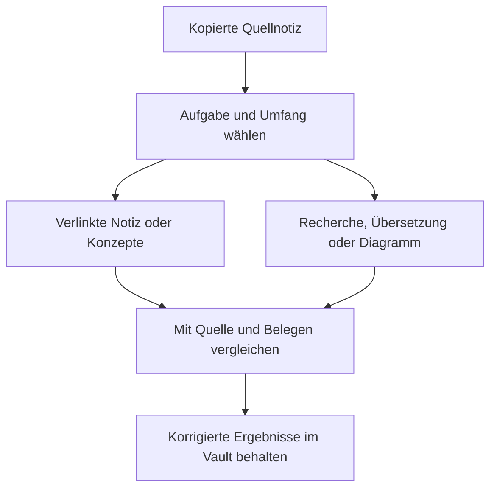

import TLDR from '@site/src/components/TLDR';

# KI-Wissensarbeit in Obsidian

<TLDR>
Nützliche Wissensarbeit hält Quellen, Modellausgaben und eigene Korrekturen unterscheidbar. Notemd bietet Links, Extraktion, Recherche, Übersetzung und Diagramme als überprüfbare Dateien. Erst eine Quelle prüfen, dann einen begrenzten Ordner automatisieren.
</TLDR>

## Ergebnis festlegen

Wähle die benötigte Ausgabe: verlinkte Lesenotiz, Konzepte, belegte Recherche, Übersetzung oder Diagramm. Mehr Dateien und Links verbessern Verständnis oder Suche nicht automatisch. Lege Prüfung und späteres Wiederfinden fest.

## Gesamtablauf


```mermaid
flowchart TD
    A[Kopierte Quellnotiz] --> B[Aufgabe und Umfang wählen]
    B --> C[Verlinkte Notiz oder Konzepte]
    B --> D[Recherche, Übersetzung oder Diagramm]
    C --> E[Mit Quelle und Belegen vergleichen]
    D --> E
    E --> F[Korrigierte Ergebnisse im Vault behalten]
```

Dies sind verfügbare Aufgaben, keine vollständige Standard-Schaltfläche. Quelle bewahren und Ziele jeder Aktion vor der Verkettung prüfen.

## 1. Wiki-Links: Beziehungen ausdrücken

**Datei verarbeiten (Links hinzufügen)** an einer Testnotiz starten und `_processed.md` prüfen. Nützliche Navigationsbegriffe sowie Zitate, Code und Formeln mit der Quelle vergleichen.

Lerndomäne und Synonymanweisungen garantieren keine begriffliche Gleichheit oder numerischen Schwellen. Für reproduzierbare bestehende Namen deterministischen Titelabgleich erwägen. [Wiki-Links](./features/wiki-links).

## 2. Konzepte: Begriffe und Erklärungen trennen

Konzeptordner wählen. Eigenständige Extraktion erzeugt standardmäßig nur Titel und lässt die Quelle unverändert. Für `Linked From` in neuen Notizen Rücklinks an- und Minimalvorlage ausschalten.

**Stapelweise aus Titeln generieren** ist eine eigene Operation und kann bestehende geeignete Konzepte bearbeiten. Testordner nutzen und complete-Verschiebung prüfen. Namensähnlichkeit beweist keine fachliche Gleichheit; Dubletten bestätigen. [Konzeptnotizen](./features/concept-notes).

## 3. Recherche: Nachweise behalten

Thema oder Titel sowie Tavily/DuckDuckGo wählen und **Recherchieren & zusammenfassen** ausführen. Leerer Tavily-Schlüssel wechselt nicht automatisch. Original-URLs und Aussagen prüfen.

Optionale lokale Suche ist lexikalisch und sendet Auszüge an das gewählte LLM. Lokal indiziert bedeutet nicht vollständig offline oder nur auf dem Gerät verarbeitet. [Recherche](./features/research).

## 4. Übersetzung: Bedeutung und Struktur prüfen

Zielsprache und Dateiaktion wählen. Standard ist `_<language>.md`, vorhandene Ziele können überschrieben werden. Einzelne Passage zuerst in eine temporäre Notiz kopieren.

Terminologie, Zahlen, Code, Links und Formeln prüfen. Abschnittsgrenzen begrenzen Kontext. 21 UI-Sprachen und 34 Website-Routen belegen keine Sprachpaarqualität. [Übersetzung](./features/translation).

## 5. Diagramme: Bearbeitbare Quellen wählen

Typ und kompatible Quelle wählen, Vorschau prüfen und Quelle samt benötigten SVG/PNG/PDF sichern. Ein Bild garantiert keinen vollständigen Erhalt semantischer Beziehungen im anderen Editor.

CircuitikZ ist begrenzt und verlangt eigene native Umgebungsprüfung. Drawnix-Astpfeile sind statisch nach Umordnung. PowerPoint-Tabellen sind verbessert, Mermaid/SVG können Bilder bleiben. [Diagramme](./features/diagrams).

## 6. Workflows: Geprüfte Folgen automatisieren

Name, `::` und durch `>` getrennte IDs definieren die Kette:

```text
One-Click Extract::process-current-add-links>batch-generate-from-titles>batch-mermaid-fix
```

Sie ergänzt Links, generiert Ordnerinhalte aus Titeln und repariert Mermaid, ohne allgemeine Recherche oder Diagrammgenerierung. Aktionen behalten Voraussetzungen und Ziele; kein beliebiges Text-Pipelining.

Fehler stoppen standardmäßig. Fortsetzen nur, wenn verbleibende Eingaben genügen. Abbruch behält fertige Ausgaben. [Workflows](./features/workflows).

## 7. Anbieter: Protokoll und Aufgabe abstimmen

36 Profile decken fünf Protokolle ab. Endpoint, Modellrechte, Datenregeln und gemessene Ausgabe vergleichen. Für Tempo und Kosten gleiche Quelle und Prompt nutzen.

Aufgabenrouting ist standardmäßig aus. Nur bei gewünschter Trennung aktivieren und alle Profile prüfen, bevor der Ablauf als lokal gilt. [Anbieter](./providers/overview).

## Startprüfung

1. Installieren und Quellen sichern.
2. Exakten Anbieter und Modell testen.
3. Konzeptordner und getrennte Ziele wählen.
4. Eine Aufgabe an einer Kopie ausführen.
5. Ergebnis vergleichen und korrigieren.
6. Kleinen Ordner samt Teilabschlüssen prüfen, bevor die Kette wächst.

## Häufige Abläufe

### Fachartikel bearbeiten

Extern nach Markdown konvertieren und Formeln, Tabellen, Bilder prüfen. Konzepte oder Originalpassagen extrahieren, gezielte Fragen recherchieren und Diagramme nur für überprüfbare Beziehungen erzeugen. Original und Korrekturen verlinken.

### Konzeptbestand pflegen

Eigenen Ordner verwenden, Terminologie prüfen und ausgewählte Teilmenge erklären lassen. Vor Dublettenbereinigung sichern. Menge ersetzt keine genauen Definitionen und nützlichen Links.

### Private Quellen

Server, Modelle und Abhängigkeiten lokal vorbereiten, Aufgabenrouten prüfen und netzabhängige Recherche vermeiden, wenn Offline-Verarbeitung nötig ist. Diagnosen vor Teilen prüfen. Loopback-Voreinstellung verhindert keine später konfigurierte entfernte Adresse.

### Unterbrochene Stapel fortsetzen

Abbruch/Fehler abwarten. Bericht, fertige Ausgaben und Wiederherstellung prüfen, Konflikte vergleichen, nur Gewünschtes erneut ausführen. Abgebrochen bedeutet nicht leer; Begleiter erst nach Referenzprüfung entfernen.

## Weitere Schritte

- [Schnellstart](./getting-started/quick-start).
- [Stapelverarbeitung](./advanced/batch-processing).
- [Entwickler](./developers/overview).
- [Agents](./agents/overview).
