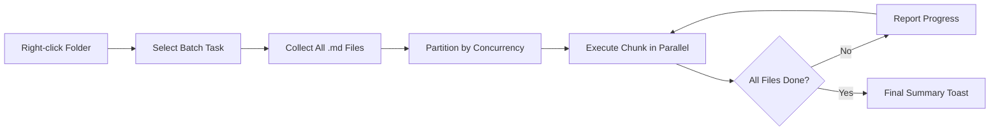

import TLDR from '@site/src/components/TLDR';

# Μαζική επεξεργασία

<TLDR>
**Notemd επεξεργάζεται ολόκληρους τους φάκελους σε μία ενέργεια, με δυνατότητα ρύθμισης της συγχρονιστικότητας και ελέγχου αντικατάστασης.** Κάντε δεξί κλικ σε έναν φάκελο για να προσθέσετε μαζικά συνδέσμους wiki, να εξαγάγετε έννοιες, να κάνετε έρευνα ή να μεταφράσετε όλες τις σημειώσεις που υπάρχουν μέσα του. Οι όρια συγχρονισμού αποτρέπουν σφάλματα περιορισμού ταχύτητας API. Η πρόοδος αναφέρεται για κάθε αρχείο. Η συμπεριφορά αντικατάστασης είναι ρυθμίσιμη: παραλείψιμο των υπάρχοντων, προσθήκη ή αντικατάσταση. Τα αποτυχημένα αρχεία καταγράφονται χωρίς να διακόπτεται η μαζική επεξεργασία.

Αυτό αποτελεί μέρος του [Obsidian Οδηγού Διαχείρισης Γνώσης AI](/docs/pillar-ai-knowledge).
</TLDR>

## Επισκόπηση

Η μαζική επεξεργασία μετατρέπει έναν φάκελο με σημειώσεις σε μία μόνη ενέργεια. Αντί να ανοίγετε κάθε σημείωση και να εκτελείτε εντολές ξεχωριστά, κάνετε δεξί κλικ στον φάκελο και επιλέξτε την εργασία. Notemd περνάει μέσα από κάθε `.md` αρχείο, εφαρμόζει την επιλεγμένη ενέργεια και αναφέρει την πρόοδο σε πραγματικό χρόνο.

Αυτή η δυνατότητα είναι απαραίτητη για την εξαγωγή γνώσης σε ολόκληρο το vault. Μετά την εισαγωγή δεκάδων PDF, για παράδειγμα, η μαζική προσθήκη συνδέσμων ακολουθούμενη από μαζική εξαγωγή έννοιων δημιουργεί το γράφο γνώσης σας σε λεπτά και όχι σε ώρες.

## Πώς λειτουργεί

### Μοντέλο μαζικής εκτέλεσης

1. **Συλλογή αρχείων** -- Notemd σάρωνει τον στόχο φάκελο ρητικά (ή μόνο στο επίπεδο του κορυφαίου, ανάλογα με τις ρυθμίσεις) και συλλέγει όλα τα `.md` αρχεία.
2. **Χωρισμός συγχρονισμού** -- Τα αρχεία διαιρούνται σε μπλοκ κατά βάση της `batchConcurrency` ρύθμισης. Κάθε μπλοκ εκτελείται παράλληλα· τα μπλοκ εκτελούνται σε αλληλουχία.
3. **Εκτέλεση** -- Κάθε αρχείο επεξεργάζεται χρησιμοποιώντας την ίδια λογική με την εντολή για μόνο αρχείο. Σέβονται οι ρυθμίσεις του πάροχου και του μοντέλου ανά εργασία.
4. **Αναφορά προόδου** -- Μία ειδοποίηση toast ενημερώνεται μετά από κάθε ολοκληρωμένο αρχείο, δείχνοντας την `N / Total` πρόοδο.
5. **Διαχείριση σφαλμάτων** -- Αν ένα αρχείο αποτύχει (σφάλμα API, χρονική παραμόνη συνδέσμου κ.λπ.), το σφάλμα καταγράφεται και η μαζική επεξεργασία συνεχίζεται. Η τελική σύνοψη περιλαμβάνει όλα τα αποτυχημένα αρχεία.
6. **Ολοκλήρωση** -- Μία σύνοψη toast αναφέρει το συνολικό αριθμό των επεξεργασμένων, τα επιτυχή και τα αποτυχημένα.

### Συμπεριφορά Αντικατάστασης

Κατά την επεξεργασία αρχείου που έχει ήδη wiki-λίνκ, σημειώσεις έννοιας ή μεταφράσεις, η συμπεριφορά του Notemd εξαρτάται από τη ρύθμιση αντικατάστασης:

| Μοδός | Συμπεριφορά |
|------|----------|
| **Διαχέωση** | Το υπάρχον περιεχόμενο παραμένει αμετάβλητο. Επεξεργάζονται μόνο τα μη τροποποιημένα αρχεία. |
| **Προσθήκη** (προεπιλογή) | Προστίθεται νέο περιεχόμενο. Οι υπάρχουσες wiki-λίνκ, έννοιες ή μεταφράσεις διατηρούνται. |
| **Αντικατάσταση** | Το αρχείο επεξεργάζεται πλήρως ξανά. Όλες οι προηγούμενες τροποποιήσεις του Notemd αντικαθίστανται. |

Συγκεκριμένα για wiki-λίνκ: αν μια σημείωση έχει ήδη `[[wiki-links]]`, ο μοδός **Διαχέωσης** την αφήνει άμεσα, ενώ ο μοδός **Αντικατάστασης** στέλνει ξανά ολόκληρη τη σημείωση στο LLM για νέα ενσωμάτωση λίνκ. Χρησιμοποιήστε **Διαχέωση** για διαδοχική επεξεργασία και **Αντικατάσταση** για επανεπεξεργασία μετά από αναβάθμιση μοντέλου.

### Ελέγχος Συγχρονισμού

Η ρύθμιση `batchConcurrency` περιορίζει τις παράλληλες κλήσεις API. Αυτό αποτρέπει σφάλματα περιορισμού ταχύτητας (HTTP 429) κατά την επεξεργασία μεγάλων φακέλων με πάροχους που έχουν αυστηρούς περιορισμούς.

| Συγχρονισμός | Συνιστώμενο για | Τυπική επίδραση περιορισμού ταχύτητας |
|-------------|----------------|---------------------------|
| `1` | Δωρεάν επίπεδα, αυστηροί πάροχοι | Κανένα (σειριακό) |
| `3` (προεπιλογή) | Οι περισσότεροι πάροχοι σύνδρομων | Χαμηλό |
| `5` | Ollama (τοπικό), φιλόξενα επίπεδα | Κανένα / Χαμηλό |
| `10` | Τοπικά μοντέλα με γρήγορη εκτίμηση | Κανένα |

Αν συναντήσετε σφάλματα 429 κατά την παραγωγική επεξεργασία, μειώστε την ταυτόχρονη εκτέλεση σε 1 ή 2.

## Ρυθμίσεις

| Παράμετρος | Προεπιλογή | Επίδραση |
|---------|---------|--------|
| `batchConcurrency` | `3` | Μέγιστες παράλληλες API κλήσεις κατά τις επιχειρήσεις φακέλων |
| `batchOverwriteExisting` | `false` | Αντικατάσταση του υπάρχοντος περιεχομένου Notemd. `false` = λειτουργία προσθήκης. |
| `batchSkipProcessed` | `false` | Διαψήφιση των αρχείων που έχουν ήδη σημεία Notemd (π.χ., συνδέσμους wiki) |
| `batchRecursive` | `true` | Συμπερίληψη υποκαταλόγων κατά την ανιχνεύση του φολδέρα |
| `enableStableApiCall` | `false` | Ενεργοποίηση λογικής επαναπροσπάθειας (έως 4 προσπάθειες) ανά αρχείο κατά τη διαδικασία μπάτσ |

### Μοντέλα ανά εργασία σε μπάτσ

Κάθε επιχείρηση μπάτσ χρησιμοποιεί το αντίστοιχο μοντέλο ανά εργασία. Η διαδικασία batch-add-links χρησιμοποιεί `addLinksProvider`, η batch-research χρησιμοποιεί `researchProvider` κ.λπ. Αυτό σημαίνει ότι μπορείτε να αναθέσετε φθηνά μοντέλα για επιχειρήσεις μεγάλου όγκου και να διατηρήσετε ακριβά μοντέλα για εργασίες που ζητούν υψηλή ποιότητα.

## Παράδειγμα

Έχετε έναν φολδέρα `papers/` που περιέχει 40 εισαγόμενες σημειώσεις έρευνας. Θέλετε να προσθέσετε συνδέσμους wiki και να εξαγάγετε έννοιες από όλες αυτές:

1. Κάντε δεξί κλικ στον φάκελο `papers/`
2. Επιλέξτε **"Notemd: Process folder (add links)"**
3. Το Notemd εξετάζει τον φάκελο, βρίσκει 40 αρχεία `.md` και επεξεργάζεται 3 ταυτόχρονα (προεπιλεγμένη συγχρονισμότητα)
4. Μια παράθυρο πρόοδος δείχνει: `12/40 files processed...`
5. Μετά από περίπου 3 λεπτά, ένα παράθυρο σύνοψης αναφέρει: `39 succeeded, 1 failed (API timeout on paper-37.md)`
6. Επαναλάβετε με **"Notemd: Process folder (extract concepts)"** για να δημιουργήσετε σημειώσεις έννοιας για όλα τα 40

Το αποτυχημένο αρχείο καταγράφεται.Μπορείτε να το εκτελέσετε ξανά μόνο σε αυτό το αρχείο αργότερα.

## Συμβουλές

- **Ξεκινήστε με χαμηλή συγχρονισμότητα** -- Αν δεν είστε σίγουροι για τα όρια ταχύτητας του πάροχή σας, ξεκινήστε με `1` και αυξήστε την σταδιακά.
- **Χρησιμοποιήστε λειτουργία διαχείρισης παραλείψεων για επιπλέον ενημέρωσεις** -- Μετά την πρώτη πλήρη μερίδα, μεταβείτε σε `batchSkipProcessed: true` ώστε μόνο νέες σημειώσεις να επεξεργάζονται στις επόμενες εκτελέσεις.
- **Ενεργοποιήστε σταθερές κλήσεις API** -- `enableStableApiCall: true` προσθέτει λογική επαναπροσπάθειας που ανακαταστρέφει τα προσωρινά σφάλματα δικτύου κατά τη διάρκεια μεγάλων μεριδών.
- **Εκτελέστε ξανά μετά από ενημέρωσες μοντέλων** -- Αν μεταβείτε σε ένα καλύτερο μοντέλο, ρυθμίστε `batchOverwriteExisting: true` και εκτελέστε ξανά για να πάρετε βελτιωμένους συνδέσμους και έννοιες.

---

## Επόμενα βήματα

- [Workflows](/docs/features/workflows) -- Συνδέστε τις εργασίες μερίδας σε κουμπιά πλευρικού παράθυρου με μία κλικ
- [Custom Prompts](/docs/advanced/custom-prompts) -- Προσαρμόστε τις εντολές για εξαγωγή μερίδας
- [Troubleshooting](/docs/advanced/troubleshooting) -- Λύστε σφάλματα όριων ταχύτητας και αποτυχίες σύνδεσης κατά τη διάρκεια εκτέλεσης μεριδών
- [LLM Πάροχοι](/docs/providers/overview) -- Αναφορά διαμόρφωσης μοντέλου ανά εργασία
