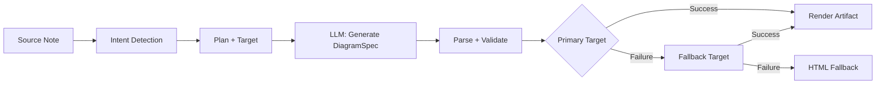
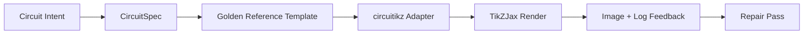

import TLDR from '@site/src/components/TLDR';

# Διαγράμματα

<TLDR>
**Notemd παράγει διαγράμματα από τις σημειώσεις σας μέσω μίας αρχιτεκτονικής βασισμένης σε προδιαγραφές.** Το LLM δημιουργεί ένα `DiagramSpec` JSON αδιάφορο στον εκπομπέα, και στη συνέχεια ειδικοί προσαρμογείς το μετατρέπουν σε Mermaid, JSON Canvas, Vega-Lite, HTML ή επεξεργασίμα αποτελέσματα HTML/SVG. Υποστηρίζει 8 τύπους προθέσεων, αυτόματες αλλακτικές αλυσίδες, ζωντανή προβολή με εξάγωση SVG/PNG, σημασιολογική επαλήθευση και παραγωγή ενισχυμένη με τοτεινό γνώση.
</TLDR>

Αυτό αποτελεί μέρος του [Obsidian Οδηγού Διαχείρισης Γνώσης AI](/docs/pillar-ai-knowledge).

## Αρχιτεκτονική: Αρχιτεκτονική Βασισμένη σε Προδιαγραφές

Notemd δεν ζητά ποτέ από το LLM να παράγει απευθείας σύνταξη Mermaid/Vega/Canvas. Αντ’ αυτού:



**Γιατί προδιαγραφές πρώτα;** Τα LLM παράγουν συχνά μη έγκυρη σύνταξη εκπομπέα (ιδιαίτερα Mermaid). Μία δομημένη `DiagramSpec` μπορεί να επαληθευτεί πριν την εκπομπή, και η ίδια προδιαγραφή μπορεί να χρησιμοποιηθεί ως αλλακτική για πολλούς εκπομπείς.

## Υποστηριζόμενοι Τύποι Διαγράμματος

| Πρόθεση | Βασικός Εκπομπέας | Αλλακτικές | Χρήση |
|--------|-----------------|-----------|----------|
| `mindmap` | Mermaid | HTML | Ιεραρχική διάκλιση θεμάτων |
| `flowchart` | Mermaid | HTML | Πορείες επεξεργασίας, δένδρα αποφάσεων |
| `sequence` | Mermaid | HTML | Αλληλεπιδράσεις πελάτη-σερβιτού, πρωτόκολλα |
| `classDiagram` | Mermaid | HTML | Σχέσεις κλάσεων OOP |
| `erDiagram` | Mermaid | HTML | Σχήματα βάσεων δεδομένων, σχέσεις οντοτήτων |
| `stateDiagram` | Mermaid | HTML | Μηχανές κατάστασης, μοντέλα διαδικασίας ζωής |
| `canvasMap` | JSON Canvas | Mermaid → HTML | Χάρτες έννοιας, γραφές γνώσης |
| `dataChart` | Vega-Lite | Mermaid → HTML | Μπαρ, γραμμή, περιοχή, σκέτσαρ, πίτα, πίνακες |

## Ανίχνευση προθέσεων

Notemd εξαγάγει τον καλύτερο τύπο διαγράμματος από το περιεχόμενο της σημείωσής σας χρησιμοποιώντας βαθμολόγηση λέξεων-κλειδιών:

| Πρόθεση | Ενεργοποιητές | Αυτοπεποίθηση |
|--------|----------|------------|
| `dataChart` | Πίνακες, αριθμητικά κελιά, λέξεις-κλειδιά μετρικών/τάσεων, ποσοστά | 0.88 |
| `sequence` | Λεξιλόγιο αιτήματος/απάντησης (4+ έμφασεις) ή σημείωσεις `->`/`=>` | 0.82 |
| `erDiagram` | Πρωταρχικό κλειδί, εξωτερικό κλειδί, οντότητα, σχήμα (2+ έμφασεις) | 0.80 |
| `stateDiagram` | Κατάσταση, μετάβαση, περιμένον, εκτέλεση, αποτυχία (3+ έμφασεις) | 0.76 |
| `flowchart` | Αριθμημένα βήματα (2+) ή λεξιλόγιο if/then/else/workflow | 0.74 |
| `canvasMap` | Χάρτης έννοιας, γραφή γνώσεων, χωρικό, σμήνος | 0.72 |
| `mindmap` | Προεπιλεγμένη εναλλακτική λύση | 0.55 |

Επικαλύψτε την με τη ρύθμιση **Προτιμώμενος τύπος διάγραμματος**, τον επιλέκτη πλευρικής γραμμής ή μία ρητή επιλογή παλέτας εντολών.

## Επιλογή στόχου απεικόνισης

Ο πειραματικός διαδικασιακός μοντέλος spec-first έχει τώρα δύο ξεχωριστές ελέγχους:

| Ελέγχος | Παράμετρος | Επίδραση |
|---------|---------|--------|
| Προτιμώμενος τύπος διάγραμματος | `preferredDiagramIntent` | Οδηγεί το σημασιολογικό σχήμα του δημιουργούμενου `DiagramSpec` |
| Προτιμώμενος στόχος απεικόνισης | `preferredDiagramRenderTarget` | Επιλέγει τον εκπομπέα αρτικλίων για **Δημιουργία διάγραμματος** και **Προβολή διάγραμματος** |

Ρυθμίστε τον **Προτιμώμενος στόχος απεικόνισης** σε **Auto** για την προεπιλεγμένη λειτουργία του σχεδιαστή, ή επιλέξτε ρητά Mermaid, JSON Canvas, Vega-Lite, HTML ή Editable HTML/SVG. Η επικάλυψη ισχύει μόνο για τις εντολές αρτικλίων και προβολής. Η στανδαρδισμένη εντολή **Συνοπτικοποίηση ως διάγραμμα Mermaid** παραμένει συνδεδεμένη με έξοδο συμβατό με Mermaid, ώστε τα υπάρχοντα προσεγγίσματα Markdown να μην αλλάξουν αθόρυβα το μορφότυπο.

Αυτή η διαχωριση είναι σημαντική, διότι μία πρόθεση `flowchart` μπορεί τώρα να απεικονιστεί ως Mermaid για σημειώσεις Markdown, ως HTML για αξιόπιστη εναλλακτική λύση, ή ως Editable HTML/SVG για μεταγενέστερη επεξεργασία. Τα Draw.io και Drawnix παραμένουν εξαγωγείς αρτικλίων CLI αντί να είναι στόχοι απεικόνισης μέσα στο πρόσθετο.

## Χρήση

### Δημιουργία διάγραμματος

1. Ανοίξτε μία σημείωση
2. Εκτελέστε **"Notemd: Δημιουργία διάγραμματος"** από την παλέτα εντολών
3. Το Notemd ανιχνεύει την πρόθεση, δημιουργεί το spec, απεικονίζει και αποθηκεύει το αρτικλίο

**Αρχεία έξοδου ανά στόχο:**

| Στόχος | Επέκταση | Μοτίβο Όνομα Αρχείου |
|--------|-----------|------------------|
| Mermaid | `.md` | `{note}_summ.md` |
| JSON Canvas | `.canvas` | `{note}_diagram.canvas` |
| Vega-Lite | `.json` | `{note}_diagram.json` |
| HTML | `.html` | `{note}_diagram.html` |
| Εδιτέλευτο HTML/SVG | `.html` | `{note}_diagram.html` |

### Προεπισκόπηση Διάγραμματος

1. Εκτέλεση **"Notemd: Προεπισκόπηση διάγραμματος"**
2. Ανοίγει μία παράθυρο προεπισκόπησης με το αποτελέσματο του διάγραμματος
3. Εξαγωγή ως SVG ή PNG με τα κουμπιά του πίνακα εργαλείων

Η λειτουργία **Αυτόματη ανοίξη προεπισκόπησης** είναι διαθέσιμη στις ρυθμίσεις — μετά την παραγωγή, το παράθυρο προεπισκόπησης ξεκινά αυτόματα.

Το παράθυρο προεπισκόπησης διαθέτει επίσης ένα πάνελ διαγνώσης αρτιφάκτων. Οι μηχανισμοί απεικόνισης και οι ελέγχοι smoke μπορούν να προσθέσουν `RenderArtifact.diagnostics`· το παράθυρο δείχνει έναν σύνοψη διαγνώσης με αριθμούς σφαλμάτων/προειδοποιήσεων/πληροφοριών, στη συνέχεια τη σοβαρότητα, τον τύπο διαγνώσης, το μήνυμα και συμβουλές επιδιόρθωσης δίπλα στην προεπισκόπηση. Ο ίδιος σύνοψης εμφανίζεται στις εγγραφές ιστορικής προεπισκόπησης, ώστε να μπορούν να συγκριθούν επαναλαμβανόμενες circuitikz προσπάθειες smoke χωρίς να ανοίγονται κάθε εγγραφή. Για αρτιφάκτα που έχουν πηγαίο περιεχόμενο αλλά δεν μπορούν να απεικονιστούν ενσωματωμένα ή μέσω του μοντέλου HTML, το παράθυρο τώρα υποχωρεί σε προεπισκόπηση μόνο πηγαίου περιεχομένου αντί να αναγκάζει ένα κενό iframe. Αυτό παρέχει circuitikz ελέγχους συνταξισμού/απεικόνισης smoke, SVG ελέγχους τεκστού-τοκέν, ελέγχους κενής στιγμιότυπης PNG και μελλοντικές αναφορές παράλληλωσης μία ορατή UI επιφάνεια, χωρίς να κάνει το TikZJax ή το LaTeX σε απαραίτητη εξάρτηση εκτέλεσης πλαγινών εργαλείων ή να προσποιείται ότι το πηγαίο κείμενο είναι επαληθευμένη οπτική απεικόνιση.

### Παλαιότερος Κύκλος Mermaid

Όταν το `enableExperimentalDiagramPipeline` είναι απενεργοποιημένο, το Notemd στέλνει άμεσα μία Mermaid πρόταση στο LLM. Αυτό παρακάμπει εντελώς τη διαδικασία των προτύπων. Αν η πειραματική διαδικασία αποτύχει, υποχωρεί σε αυτόν τον κύκλο.

## Βάσεις Απεικόνισης

### Mermaid

6 προσαρμογές (mindmap, flowchart, sequence, ER, class, state) μεταφράζουν το `DiagramSpec` σε σύνταξη Mermaid. Μετά την παραγωγή, το `mermaid.parse()` επαληθεύει το αποτέλεσμα. Αν η επαλήθευση αποτύχει:

1. **Επανάπροσπάθεια LLM** — μία προσπάθεια με το μήνυμα σφάλματος Mermaid ως πλαισίο
2. **Μινιμαλή υποχώρηση** — ένα απλό διάγραμμα Mermaid από τα αναγνωριστικά κόμβων του προτύπου

**Παράδοσιος Mermaid Fixer** επισκευάζει αυτόματα τα συνηθισμένα σφάλματα σύνταξης LLM: κανονικοποίηση οδηγιών note, αποφυγή pipe-label, επανατοποθέτηση κόμματος, έξυπνα εισαγωγικά, στρέλες διπλού διαστήματος, ανωμαλίες σχήματος και πολλά άλλα.

### JSON Canvas

Παράγει μορφή Obsidian JSON Canvas με χωρική διάταξη:
- Τα κόμβια τοποθετούνται ανάλογα με το βάθος (x = βάθος × 420) και τον δείκτη (y = δείκτης × 170)
- Η πλάτος εκτιμάται από το μήκος του ετικέτας
- Εδέσεις με `fromSide: 'right'`, `toSide: 'left'`, `toEnd: 'arrow'`

### Vega-Lite

Δημιουργεί πλήρεις προσδιορισμούς Vega-Lite v5 JSON με αυτόματη κωδικοποίηση:
- **Καρτεσιανές διαγράμματα** (μπαρ/γραμμή/περιοχή/τίπος/σκέτσ): κανάλια x + y + χρώμα για πολλαπλές σειρές
- **Πίρουγα**: theta = y (ποσοτικό), χρώμα = x (νομιναλό)
- **Πίνακας**: γραμμή = x, κείμενο = y + στήλη = σειρά

Τα πρόσθετα στυλ σκούρο και φωτεινό ενωνούνται βαθιά πριν τη συνταξή.

### HTML

Συνολικός εναλλακτικός ρέψος. Αυτόνομο έγγραφο HTML με:
- Μετα-κεφάλαια CSP
- Λευκό/σκούρο λειτουργία μέσω `prefers-color-scheme`
- Τοποθετημένες ετικέτες UI για 20 τοπικοτήτες
- Ενότητες: hero, δομή (δέντρο κόμβων), σχέσεις, επισημασίες, πίνακες σειρών δεδομένων

### Επιδιορθώσιμο HTML/SVG

Ειδικός στόχος αριθμού για διαδικασίες εξάγωγης που μπορούν να τροποποιηθούν. Αυτός προβλέπει το `DiagramSpec` σε έναν αποφασιστικό `SemanticFigureModel`, στη συνέχεια παράγει ένα αυτόνομο δокумент HTML με ενσωματωμένες ομάδες SVG που περιέχουν σημειώσεις στυλ Draw.io:

- `data-drawio-type`, `data-drawio-id` και `data-drawio-role` στα σημαντικά κόμβους
- `data-drawio-source` και `data-drawio-target` στα σημαντικά άκρα
- σταθεροί αναγνωριστικοί κόμβων/ακρών μετά την κανονικοποίηση κενών χαρακτήρων και τη διαχείριση συγκρούσεων
- χωρίς σκρίπτ, χωρίς εξωτερικά φόντα και χωρίς απομακρυσμένα περιουσιακά

Αυτός ο στόχος δεν είναι σκόπιμα η προεπιλεγμένη διαδρομή του πλάνερ. Είναι διαθέσιμος ως ειδικός στόχος απεικόνισης καθώς η διαδρομή του προϊόντος αποδεικνύει τη συμπεριφορά επεξεργασίας σε πραγματικά εργαλεία.

### Draw.io και Drawnix Όρια Εξάγωσης

Η τρέχουσα υλοποίηση διατηρεί την υποστήριξη τρίτων επεξεργαστών στα ορία του αρτικλίου:

| Στόχος | Συμβόλαιο | Εξάρτηση Εκτέλεσης |
|--------|----------|--------------------|
| Draw.io | αποφασιστικό μη αποπυκνωμένο `mxfile` XML από το `SemanticFigureModel` | κανένα στην εκτέλεση του πρόσθετου ή στο CI |
| Drawnix | λιγότερος υποσύνολος `.drawnix` JSON με χρήση στοιχείων `geometry` και `arrow-line` | κανένα στην εκτέλεση του πρόσθετου ή στο CI |

Η συμβιβασμός είναι σκόπιμη: το Notemd μπορεί να επαληθεύσει τα ορατά ετικέτες, τους σταθερούς αναγνωριστικούς και την κάλυψη των υποστηριζόμενων πρωτοτύπων, χωρίς να ενσωματώνει το diagrams.net Desktop, το Drawnix, το Plait ή την κατάσταση επεξεργαστή μόνο για περιηγητές στο πρόσθετο.

### circuitikz / TikZJax Κατεύθυνση

Τα διαγράμματα κυκλωμάτων δεν αποτελούν το ίδιο πρόβλημα με τα γενικά διαγράμματα ροής. Ο σωστός σύνταξης στόχος για ηλεκτρικά κυκλώματα είναι συνήθως **circuitikz**, που απεικονίζεται σε Obsidian μέσω πρόσθετων όπως TikZJax. TikZJax μπορεί να φορτώσει πακέτα όπως `circuitikz`, `pgfplots`, `tikz-cd` και `chemfig`, γεγονός που το καθιστά ελκυστικό για σημειώσεις φυσικής, κυκλωμάτων, χημείας και μαθηματικών.

Το κίνδυνο είναι ότι το ακατέργαστο TikZ που παράγεται από LLM είναι εύθραυστο:

- μια πολύπλοκη τοπολογία κυκλωμάτου μπορεί να είναι ηλεκτρικά σωστή αλλά οπτικά αδιαβάσιμη;
- τα παρασυρόμενα σύρματα και ετικέτες μπορούν να κάνουν μια σωστή λίστα δίκτυου μη χρησιμοποιήσιμη για σημειώσεις μελέτης;
- λείποντα πρόλογα πακέτων, λάθος αγκύρες ή μη έγκυρα ονόματα εξαρτημάτων μπορούν να εμποδίσουν την απεικόνιση;
- η ανατροφοδότηση από τον απεικονιστή είναι συνήθως σε επίπεδο εικόνας, ενώ το LLM παράγει γεωμετρία σε επίπεδο κειμένου.

Η καλύτερη αρχιτεκτονική είναι να θεωρήσουμε το circuitikz ως έναν περιορισμένο στόχο διαγράμματος, όχι ως μία ελεύθερη φόρμα παραγγελίας:



Το μοντέλο πρώτης κλάσης θα πρέπει να περιγράφει την τοπολογία και τη διάταξη του κυκλωμάτου ξεχωριστά:

| Στρώμα | Ευθύνη | Παράδειγμα |
|-------|----------------|---------|
| Τοπολογία | ηλεκτρικά κόμβια και συνδέσεις εξαρτημάτων | `VDD -> RD -> drain(M1)`, `source(M1) -> GND` |
| Διάταξη | τοποθέτηση σε δίαγραμμα, προσανατολισμός, μονοπάτια διαδρομής | `M1 at (3,2.2)`, εισόδιο αριστερά, έξοδος δεξιά |
| Στυλ | πακέτο, σύμβαση τάσης, ετικέτες, κόλα | `\begin{circuitikz}[american voltages]` |
| Επαλήθευση | γραφή λογαριασμού μεταγλώττισης, έλλειψη κόλων, ελέγχοι συντάσεως/στιγμιότυπου | TikZJax/Διαγνώσεις LaTeX πλús οπτική ανασκόπηση |

### Τρέχον πρωτότυπο circuitikz

Notemd περιλαμβάνει τώρα το πρώτο πρωτότυπο περιοχής περιορισμού για αυτήν την κατεύθυνση. Είναι σκόπιμα εκτός λειτουργίας και περιοριζόμενο από πρότυπα:

```bash
npm run diagram:export-circuitikz -- --input cmos-inverter.json --output cmos-inverter.tex
```

Το πρωτότυπο προσθέτει ένα ξεχωριστό όριο `CircuitSpec` και έναν δετερμινιστικό εξαγωγέα για έξι οικογένειες χρυσών αναφορών:

| Τύπος κυκλώματος | Χρυσή αναφορά | Εγγύηση τάσης |
|--------------|------------------|-------------------|
| `common-source-amplifier` | `common-source-nmos-v1` | επαληθεύει `VDD -> R_D -> M1.D`, `vin -> M1.G`, `M1.S -> GND` και `M1.D -> vout` πριν γράψει LaTeX |
| `cmos-inverter` | `cmos-inverter-v1` | επαληθεύει τοπολογία PMOS-over-NMOS, κοινή είσοδος πόρτας, κοινό έξοδος δρέιν, `VDD -> MP.S` και `MN.S -> GND` πριν γράψει LaTeX |
| `cmos-buffer` | `cmos-buffer-v1` | επαληθεύει δύο στάδια αντιστροφέων σε σειρά, ενδιάμεσο κόμβο `vmid`, αποκατασταλέν ο `vout`, και κοινές γραμμές VDD/GND πριν γράψει LaTeX |
| `cmos-transmission-gate` | `cmos-transmission-gate-v1` | επαληθεύει παράλληλα συσκευές PMOS/NMOS μεταξύ `vin` και `vout` με συμπληρωματικούς ελέγχους `phib` / `phi` πριν γράψει LaTeX |
| `cmos-nand2` | `cmos-nand2-v1` | επαληθεύει τον παράλληλο PMOS pull-up, τον σειριακό NMOS pull-down, τα διπλά εισόδια `va` / `vb` και `vout` πριν γράψει LaTeX |
| `cmos-nor2` | `cmos-nor2-v1` | επαληθεύει τον σειριακό PMOS pull-up, τον παράλληλο NMOS pull-down, τα διπλά εισόδια `va` / `vb` και `vout` πριν γράψει LaTeX |

Αυτό δεν είναι ακόμη ένας γενικός TikZ generator. Δεν μεταγλωττίζει LaTeX, δεν καλεί TikZJax, δεν εξετάζει στιγμιότυπα οθόνης ούτε εκτελεί αυτοματοποιημένη επιδιόρθωση εικόνας. Αυτά παραμένουν μελλοντικά στάδια.

Η εντολή Preview diagram μπορεί να ανοίξει ξανά τα αποθηκευμένα αρτικά circuitikz πηγής απευθείας όταν η επέκταση αρχείου είναι `.tex` ή `.tikz` και η πηγή περιλαμβάνει `\usepackage{circuitikz}` ή `\begin{circuitikz}`. Αυτή η διαδρομή είναι μια προβολή μόνο πηγής circuitikz: το modal δείχνει την πηγή, τις διαγνώσεις, τα ελέγχους αντιγραφής/αποθήκευσης και τα μεταδεδομένα ιστορίας, αλλά δεν μεταγλωττίζει LaTeX ούτε καλεί TikZJax εντός του χρόνου εκτέλεσης του προσθήκου.

Τα ίδια όρια προβολής μόνο πηγής καλύπτουν τώρα τα αποθηκευμένα αρτικά Draw.io και Drawnix. Τα αρχεία `.drawio` δέχονται όταν μοιάζουν με Draw.io XML (`mxfile` ή `mxGraphModel`), ενώ τα αρχεία `.drawnix` δέχονται όταν είναι Drawnix JSON με `type: "drawnix"` και ένα `elements` πίνακα. Ο προσθήκης δεν ενσωματώνει ακόμη το diagrams.net ούτε τον φορέα whiteboard Drawnix· αυτές οι προβολές εκθέτουν την πηγή, τις διαγνώσεις και την ιστορία των αρτικών χωρίς να ισχυρίζονται ότι υπάρχει ενδοπροσθήκους οπτικός επεξεργαστής.

Για επιδιόρθωση που διατηρεί την τοπολογία, περάστε το προ-επιδιόρθωσης σύνοψη ως αναφορά πριν αποδεχτείτε ένα επιδιορθωμένο υποψήφιο:

```bash
npm run diagram:export-circuitikz -- --input repaired-cmos-inverter.json --topology-reference cmos-inverter.json --output cmos-inverter.tex
```

Ο φρουρός επιδιόρθωσης χρησιμοποιεί `createCircuitTopologySignature` και `assertCircuitTopologyUnchanged` για να συγκρίνει `circuitKind`, `goldenReferenceId`, δίκτυα, αναγνώριση/τύπους/τερμινάλια εξαρτημάτων και τα ακατευθυνόμενα άκρα συνδέσεων πριν την έξοδο. Οι ετικέτες, ο κείμενος τίτλου, οι υποδείξεις διάταξης, η σειρά συνδέσεων και οι ετικέτες συνδέσεων αγνοούνται σκόπιμα. Ένας υποψήφιος που προσθέτει κάτι σύντομο ή επανασυνδέει έναν τερμινάλιο αποτυγχάνει με `Circuit topology drift detected` πριν γραφτεί το αρχείο `.tex`.

Ο CLI μπορεί τώρα να αναλύσει ένα υπάρχοντα LaTeX/TikZJax λογ ανάλυσης χωρίς να εκτελέσει μεταγλωττιστή:

```bash
npm run diagram:export-circuitikz -- --input cmos-inverter.json --output cmos-inverter.tex --compile-log cmos-inverter.log --diagnostics-output cmos-inverter.diagnostics.json
```

Αυτή η διαγνωστική διαδρομή αναφέρει λείποντα πακέτα όπως `circuitikz.sty`, άγνωστες TikZ/circuitikz κλειδιά, συνταξικές αποτυχίες TikZ όπως λείποντα κόμματα, ανεξέλεγκτα ορίσματα από μη ισορροπημένα παρενθέσματα ή μη ολοκληρωμένες ετικέτες, άνευ ορισμούς ελέγχου, γενικές σφάλματα LaTeX, επείγουσες σταμάτησεις και προειδοποιήσεις για υπερπληρωμένο `\hbox`. Παραμένει βασισμένο σε λογ: το τοπικό εκτέλεση LaTeX/TikZJax και τα στάδια ποιότητας στιγμιοτύπων είναι ακόμη ξεχωριστή μελλοντική δουλειά.

Για τις ελέγχους smoke των συντηρητών, το ίδιο CLI μπορεί προαιρετικά να εκτελέσει έναν ρητά διαμορφωμένο renderer χωρίς ανάλυση εντολών shell:

```bash
npm run diagram:export-circuitikz -- --input cmos-inverter.json --output cmos-inverter.tex --compile-executable pdflatex --compile-arg -interaction=nonstopmode --compile-arg -halt-on-error --compile-arg -output-directory={outputDir} --compile-arg {tex} --expected-artifact {outputDir}/{jobName}.pdf
```

Ο εκτελεστής ανάλυσης χρησιμοποιεί `shell: false`, επεκτείνει τα `{tex}`, `{outputDir}` και `{jobName}` μέρη αντικατάστασης σε τιμές πίνακα ορίσματος, διαβάζει το παραγόμενο `{jobName}.log` και επιστρέφει `compileExecution` μαζί με `compileDiagnostics` στην έξοδο CLI JSON. Το `--compile-executable` είναι μόνο η δυαδική ή ο δρόμος του wrapper· τα σημάδια renderer περιλαμβάνονται σε επαναλαμβανόμενες τιμές `--compile-arg`. Τα κενά εκτελέσιμα αρχεία αποτυγχάνουν ως `compile-executable-invalid`, τα λείποντα δυαδικά αρχεία αποτυγχάνουν ως `compile-executable-not-found`, και οι συμβολοσειρές εκτελέσιμων σε μορφή shell λαμβάνουν συμβουλές για τον διαχωρισμό ορίσματος ώστε Windows, Linux και macOS να ακολουθήσουν την ίδια συμβάση άμεσης εκτέλεσης. Με `--expected-artifact`, αναφέρει επίσης `compileExecution.renderSmoke` και αποτυγχάνει το CLI αν ο renderer δεν δημιουργήσει μη κενό αρτικό. Ο προσθήκης δεν ενσωματώνει ακόμη LaTeX, δεν κάνει το TikZJax εξαρτησία χρόνου εκτέλεσης προσθήκους ούτε εκτελεί επιδιόρθωση εικόνας σε στάδιο στιγμιοτύπου.

Αν το αναμενόμενο αρτικό είναι `.svg`, ο ελέγχος smoke πηγαίνει μία στρώση βαθύτερα:

```bash
npm run diagram:export-circuitikz -- --input cmos-inverter.json --output cmos-inverter.tex --compile-executable dvisvgm --compile-arg ... --expected-artifact {outputDir}/{jobName}.svg --expected-svg-text v_{in} --expected-svg-text v_{out}
```

Ο ελέγχος smoke SVG επαληθεύει τον ρίζα `<svg>`, θετικές διαστάσεις ή `viewBox`, τουλάχιστον ένα ορατό στοιχείο σχεδίασης μετά από αποκλεισμό κρυφών/διαφανών στοιχείων, οποιεσδήποτε ζητηθείσες τεκστικές μερίδες, προφανή στοιχεία εκτός του `viewBox`, προφανή υπερπληκτικά τοποθετημένα `<text>` / `<tspan>` ετικέτες και προφανής τεκστικές ετικέτες που υπερπληκτίζονται με στοιχεία σχεδίασης μέσω `render-svg-label-overlap`. Ο αναμενόμενος τεκστ έχει αναζητηθεί στον ορατό τεκστ και αποκωδικοποιηθεί η προσβασιμότητας μεταδεδομένα όπως `aria-label`, `<title>` και `<desc>`, οπότε οι renderer που διατηρούν σημασιολογικές ετικέτες εκτός του ορατού `<text>` μπορούν ακόμη να ικανοποιήσουν τον ελέγχο τεκστικών μερίδων χωρίς να απαιτούν OCR. Η διαδικασία γεωμετρίας είναι τώρα γεωμετρία που λαμβάνει υπόψη μετατροπές για συνηθισμένα ομάδες και στοιχεία `transform` χαρακτηριστικά, οπότε τα μεταφρασμένα, κλιμακωμένα, περιστραμμένα, παραμορφωμένα ή matrix-μετατραπέντα SVG πλαίσια ελέγχονται μετά τη σύνθεση μετατροπών. Καλύπτει τα ακριβή όρια κύματος για A/a κύματα εξτρέματα, τα ακριβή όρια καμπύλων Bezier για C/S/Q/T κύματα εξτρέματα, τα SVG όρια που λαμβάνουν υπόψη το πάχος γραμμής και ελέγχους υπερπληκτικών ετικέτων, τη `polyline` / `polygon` γεωμετρία σχεδίασης και επίσης επιλύει την τοποθέτηση γλυφών μόνο διαδρομής από `<use href="#...">` αναφορές, οπότε οι ετικέτες που μετατρέπονται σε επαναχρησιμοποιήσιμες γλυφικές διαδρομές μπορούν ακόμη να αποτύχουν στους ελέγχους περιορισμένου πίνακα όταν η γεωμετρία της τοποθετημένης γλυφής φύγει από το `viewBox`. Πολλές τοποθετημένες `tspan` ετικέτες κάτω από ένα `<text>` γονέα συγκρίνονται ως ξεχωριστά πλαίσια ετικέτων, που πιάνουν τη LaTeX-στυλ SVG έξοδο που αλλιώς θα συμπίεσε διαφορετικές ετικέτες σε έναν τεκστικό κόμβο. Οι τοποθετημένες SVG `text` και `tspan` πλαίσια σέβονται τις τιμές `start`, `middle` και `end`, οπότε οι κεντρωμένες και δεξιά ευθυγραμμισμένες ετικέτες μπορούν να προκαλέσουν διαγνώσεις τεκστ/ετικέτας-σε-σχεδία χωρίς να ισχυρίζονται βραウザ-στεπέν της διάταξης τεκστού. Οι γλυφικές διαδρομές μόνο ορισμούς εντός `<defs>` δεν λέγονται ως ορατά στοιχεία σχεδίασης, αλλά τα δικά τους ορισμούς-τοπικά `transform` χαρακτηριστικά εφαρμόζονται πριν την `<use>` τοποθέτηση, οπότε οι κλιμακωμένες ή αντανακλασμένες γλυφικές ορισμούς δεν υπολογίζονται λιγότερο. Η ελέγχος ετικέτας-σε-σχεδία χρησιμοποιεί μια μικρή ανοχή για πλαίσια σχεδίασης και τα δηλωμένα `stroke-width`, οπότε λεπτές συνδέσεις, παχιές συνδέσεις και πολυγώνια εξαρτημάτα μπορούν όλα να θεωρηθούν πιθανές αποτυχίες αναγνωσιμότητας ετικέτων όταν η ορατή γραμμή τους φτάνει σε μια ετικέτα. Οι γλυφικές ετικέτες μόνο διαδρομής που επιλύονται από `<use href="#...">` συγκρίνονται επίσης με πλαίσια σχεδίασης και αποτυγχάνουν με `render-svg-path-glyph-overlap` όταν η επαναχρησιμοποιήσιμη γεωμετρία γλυφής υπερπληκτίζεται συνδέσεις ή εξαρτημάτα. Αν ένας renderer μετατρέπει ετικέτες σε επαναχρησιμοποιήσιμες γλυφικές διαδρομές αντί για αναζητήσιμο `<text>` και δεν διατηρεί τα μεταδεδομένα προσβασιμότητας, ο ελέγχος smoke καταγράφει `pathOnlyGlyphUseCount` και αποτυγχάνει το ζητηθείς τεκστικό μέρος μέσω `render-svg-text-path-only` αντί να προσποιείται ότι η ετικέτα απλώς απουσιάζει. Άλλες αποτυχίες αναφέρονται μέσω `render-svg-invalid`, `render-svg-dimension-missing`, `render-svg-no-visible-elements`, `render-svg-text-missing`, `render-svg-out-of-bounds`, `render-svg-text-overlap`, `render-svg-label-overlap` ή `render-svg-path-glyph-overlap`. Οι ελέγχοι τεκστικών μερίδων και υπερπληκτικών θα πρέπει να θεωρηθούν μόνο δομικές smoke για renderer που διατηρούν ετικέτες ως αναζητήσιμο SVG τεκστ ή μεταδεδομένα προσβασιμότητας· η διαδρομή μόνο διαδρομής SVG χρειάζεται ακόμη το μελλοντικό στάδιο στιγμιοτύπου/OCR για να αποδείξει την οπτική αναγνωσιμότητα ετικέτων, και αυτής η διαδρομή smoke δεν ισχυρίζεται πλήρη SVG κάλυψη διαδρομής.

Οι κρυφές SVG ομάδες και στοιχεία παραλείπονται συστηματικά κατά την μετρήση ορατών στοιχείων και συλλογή γεωμετρίας. Τα χαρακτηριστικά ή inline-style `display:none`, `visibility:hidden`, `visibility:collapse` και το συνολικό `opacity:0` δεν μπορούν να κάνουν ένα αλλιώς κενό αρτικό επιδιόρθωσης να περάσει τον ελέγχο ορατής έξοδου smoke.

Οι γλυφικές ορισμοί μόνο διαδρομής μπορούν να είναι άμεσες διαδρομές ή ομάδες/σύμβολα περιβάλλοντας εντός `<defs>`. Η διαδρομή smoke επιλύνει τη γεωμετρία παιδιών διαδρομής από `<g id="...">` και `<symbol id="...">` πριν την `<use>` τοποθέτηση, οπότε η γλυφική έξοδος που περιβάλλεται συνεχίζει να τροφοδοτεί `pathOnlyGlyphUseCount`, ελέγχους περιορισμένου πίνακα και `render-svg-path-glyph-overlap`.

Ο αναλυτής διαδρομής παρακολουθεί επίσης τις αρχές υποδιαδρομών και επαναφέρει το τρέχον σημείο στο `Z/z`, οπότε οι σχετικές εντολές μετά από ένα κλειστό υποδιάδρομο συνεχίζουν από το σωστό SVG σημείο αντί να δημιουργήσουν ψεύτικες `render-svg-out-of-bounds` διαγνώσεις.

Η ίδια διαδικασία γεωμετρίας ακολουθεί τη γραμματική SVG για δεκαδικούς αριθμούς με πρόδρομο κόμμα και ρητά σύμβολα πλuses, οπότε οι συμπαγές συντεταγμένες dvisvgm όπως `.5`, `-.5` ή `+.5` παραμένουν κλασματικές κατά τις ελέγχους όριων αντί να γίνουν ψευδής εκτός-όριος γεωμετρία ή να παραλειφθούν.

Αν ο εκπομπέας εκπέμπει `.png`, το ίδιο πορτάλι του αναμενόμενου προϊόντος γίνεται η πρώτη στιγμιότυπη εικόνα smoke: Notemd αναλύει αρχεία PNG με δείκτη χρωμάτων 1/2/4/8-bit χωρίς διασταύρωση, αρχεία PNG σε γραζουλί 1/2/4/8/16-bit, και αρχεία PNG σε γραζουλί-alpha/RGB/RGBA 8/16-bit. Τα αρχεία με δείκτη χρωμάτων και υπο-βάιτ γραζουλί υποστηρίζουν συμπιεσμένα δείγματα· τα αρχεία με δείκτη χρωμάτων υποστηρίζουν επίσης PLTE και προαιρετικά δεδομένα tRNS· τα αρχεία γραζουλί/RGB υποστηρίζουν διαφανή δείγματα tRNS. Τα δείγματα 16-bit επικανονίζονται στο ίδιο χώρο σύγκρισης 8-bit RGBA που χρησιμοποιείται από τους ελέγχους smoke. Ο ελέγχος smoke επαληθεύει θετικές διαστάσεις, καταγράφει τα όρια του προσκήνιου ως `foregroundBounds`, καταγράφει την πυκνότητα του προσκήνιου μέσα σε αυτό το πλαίσιο ως `foregroundDensity`, αποτυγχάνει με `render-png-blank` όταν κάθε ορατό πικσέλ έχει το χρώμα του προσκήνιου στην αριστερά-πάνω, αποτυγχάνει με `render-png-content-clipped` όταν το περιεχόμενο του προσκήνιου αγγίζει τα όρια της εικόνας, αποτυγχάνει με `render-png-foreground-too-small` όταν μια μεγάλη στιγμιότυπη εικόνα έχει λιγότερα από τέσσερα πικσέλ του προσκήνιου, και αποτυγχάνει με `render-png-foreground-dense` όταν τα πικσέλ του προσκήνιου είναι ασυνήθως πυκνά μέσα σε ένα μη απλό πλαίσιο όριων. Τα μη υποστηριζόμενα μορφάτα PNG αποτυγχάνουν με `render-png-unsupported` και υπάρχουν συγκεκριμένες οδηγίες για Adam7 διασταυρωμένα PNG ή μη υποστηριζόμενες βάθους δεικτών χρωμάτων. Αυτό ανιχνεύει κενές στιγμιότυπες εικόνες, προφανή κόπηση του πίνακα, υποεκπομπές του προσκήνιου, αποτυχίες στο επίπεδο του πρώτου πικσέλ και λάθος ρυθμίσεις εξαγωγής PNG του εκπομπέα, χωρίς να προσθέτει εξαρτήσεις shell συγκεκριμένης πλατφόρμας. Δεν είναι ακόμη αναγνώριση ετικετών σε επίπεδο OCR, ακριβής ανίχνευση παράστασης κειμένου ή επιδιώκηση εικόνας με διατήρηση τοπολογίας.

Όταν οι διαγνώσεις δείχνουν αποτυχημένη κατασκευή ή εκτέλεση render-smoke, το CLI μπορεί επίσης να γράψει ένα σύντομο αναφορικό έγγραφο με διατήρηση τοπολογίας:

```bash
npm run diagram:export-circuitikz -- --input cmos-inverter.json --topology-reference cmos-inverter.json --output cmos-inverter.tex --compile-log cmos-inverter.log --repair-brief-output cmos-inverter.repair-brief.json
```

Το αναφορικό έγγραφο χρησιμοποιεί σχήμα `notemd.circuitikz.repair-brief.v1` και περιλαμβάνει την πηγή `CircuitSpec`, το υπογράμμα τοπολογίας, τις διαγνώσεις κατασκευής/εκτέλεσης, τις επιτρεπόμενες τροποποιήσεις, τις απαγορευμένες τροποποιήσεις τοπολογίας, τα επόμενα βήματα επαλήθευσης και ένα δομημένο `repairPrompt`. Ο ρόλος του προμπτ είναι `topology-preserving-circuitikz-repair`· η λίστα `diagnosticFocus` του προέρχεται από τις διαγνώσεις κατασκευής/εκτέλεσης, και οι απαιτήσεις `acceptanceCriteria` απαιτούν επικύρωση υποψηφίου συν νέες διαγνώσεις κατασκευής και render-smoke. Είναι το μορφάτο παράδοσης για μια μεταγενέστερη βρόχη επιδιώκησης, όχι ισχυρισμός ότι Notemd έχει ήδη εκτελέσει αυτόνομη οπτική επιδιώκηση.

Μετά την παραγωγή ενός υποψηφίου επιδιώκησης, το ίδιο CLI μπορεί να τον επαληθεύσει σε σχέση με το αναφορικό έγγραφο πριν γράψει την έξοδο:

```bash
npm run diagram:export-circuitikz -- --input repaired-cmos-inverter.json --repair-brief cmos-inverter.repair-brief.json --output repaired-cmos-inverter.tex
```

`--repair-brief` ελέγχει το υπογράμμα τοπολογίας του υποψηφίου από το αναφορικό έγγραφο και είναι αμφίσυγκροτητικό με `--topology-reference`. Η περάση αυτής της φράγματος αποδεικνύει μόνο διατήρηση τοπολογίας· ο υποψηφίος χρειάζεται ακόμη διαγνώσεις κατασκευής και ελέγχους render-smoke.

Το αποτέλεσμα `--repair-brief` περιλαμβάνει επίσης αποδεικτικά στοιχεία `repairAcceptance` με σχήμα `notemd.circuitikz.repair-acceptance.v1`. Αναφέρει τις φράγματα `topology-signature`, `compile-diagnostics` και `render-smoke` ως `passed`, `failed` ή `missing`· αποκαλύπτει το `remainingChecks`· και διατηρεί το `readyForVisualAcceptance` ψευδό μέχρι να περιλαμβάνει ο υποψηφίος όλα τα απαιτούμενα αποδεικτικά στοιχεία.

Χρησιμοποιήστε `--repair-acceptance-output` με `--repair-brief` όταν οι αποδεικτικές πληροφορίες CI ή κυκλοφορίας χρειάζονται ένα μόνιμο αρχείο JSON:

```bash
npm run diagram:export-circuitikz -- --input repaired-cmos-inverter.json --repair-brief cmos-inverter.repair-brief.json --output repaired-cmos-inverter.tex --repair-acceptance-output repaired-cmos-inverter.repair-acceptance.json
```

Για αποδεικτικές πληροφορίες κυκλοφορίας ή συντήρησης, εκτελέστε κάθε υποστηριζόμενη «golden family» μέσω του συνολικού εκτελεστή fixture:

```bash
npm run diagram:smoke-circuitikz -- --output-dir docs/export/circuitikz-smoke --compile-executable pdflatex --compile-arg -interaction=nonstopmode --compile-arg -halt-on-error --compile-arg -output-directory={outputDir} --compile-arg {tex} --expected-artifact {outputDir}/{jobName}.pdf
```

Ο εκτελεστής χρησιμοποιεί `docs/maintainer/fixtures/circuitikz/common-source-nmos-v1.json`, `docs/maintainer/fixtures/circuitikz/cmos-inverter-v1.json`, `docs/maintainer/fixtures/circuitikz/cmos-buffer-v1.json`, `docs/maintainer/fixtures/circuitikz/cmos-transmission-gate-v1.json`, `docs/maintainer/fixtures/circuitikz/cmos-nand2-v1.json` και `docs/maintainer/fixtures/circuitikz/cmos-nor2-v1.json`, καλεί τον ίδιο μονό-shell εξαγωγέα για κάθε fixture και επιστρέφει ένα συνολικό αναφορικό JSON με `compileExecution` και `compileDiagnostics` για κάθε fixture. Είναι ακόμη ένας διατάγματος συντήρησης, όχι εξαρτήσεις runtime πλαγινών.

Όταν το μηχάνημα συντήρησης δεν έχει ακόμη διαμορφωθεί renderer, εκτελέστε τον ίδιο διατάγματο fixture χωρίς `--compile-executable` και διατηρήστε ρητά το φράγμα περιβάλλοντος:

```bash
npm run diagram:smoke-circuitikz -- --output-dir docs/export/circuitikz-smoke --report-output docs/export/circuitikz-smoke/renderer-availability.json
```

Αυτός ο μοντέλος γράφει ακόμη τα διαπιστωτικά artifact του fixture `.tex`, αλλά επιστρέφει `ok: false` με `rendererAvailability.status` ορίζονται σε `missing-configuration` και έναν διαγνωστικό `compile-executable-invalid`. Θεωρήστε το ως αποδεικτικό μόνο για τη διαθεσιμότητα renderer· δεν είναι κατασκευή, render-smoke ή οπτική αποδοχή.

### Σχήμα πρόμπτ για χρυσή αναφορά

Για βραχυπρόθεσμη χρήση, παράσχετε μία εκτελέσιμη χρυσή αναφορά πριν ζητήσετε μία μεταβλητή κύκλωσης. Ένα περιορισμένο πρόμπτ πρέπει να διατηρεί το πρόλογο, την κλίμακα συντεταγμένων, το στυλ ανκρώσεων και τις συμβάσεις διανομής:

```latex
\usepackage{circuitikz}
\begin{document}
\begin{circuitikz}[american voltages]
\draw
  (3,5) node[vcc]{$V_{DD}$}
  to [R, l=$R_D$] (3,3)
  to [short, *-o] (5,3) node[right]{$v_{out}$}
  (3,3) to [short] (3,2.2)
  node[nmos, anchor=D] (M1) {$M_1$}
  (M1.S) to [short] (3,0.5)
  node[ground]{}
  (M1.G) to [short, -o] (0.8,2.2)
  node[left]{$v_{in}$};
\draw
  (3,0.5) node[below right]{$S$};
\end{circuitikz}
\end{document}
```

Για έναν CMOS inverter, το πρόμπτ πρέπει να ζητά ρητά τοπολογία και περιορισμούς διατάξεων, όχι απλώς «σχεδιάστε έναν CMOS inverter»:

- το `VDD` στην κορυφή, το `GND` στο πάτο, είσοδος στα αριστερά, έξοδος στα δεξιά;
- χρησιμοποιήστε `pmos` πάνω από `nmos`, με κοινές πύλες και κοινές απορροές;
- διατηρήστε τον κόμβο εξόδου στο σημείο απορροής και σημειώστε τον με `*-o`;
- χρησιμοποιήστε ονομασμένα αγκύρωματα (`PM1.G`, `NM1.G`, `PM1.D`, `NM1.D`) αντί για συντελεστές που εξακριβώνονται οπτικά;
- αποφύγετε διαγωνικά ή διασχίζοντα σύρματα εκτός αν είναι απαραίτητα από την ηλεκτρική λειτουργία.

### Τρέχον πρόοδος και επόμενες φάσεις

| Εμβαδόν | Τρέχων στάτος | Επόμενη κίνηση |
|------|----------------|-----------|
| Γενικά διαγράμματα | Υλοποιήθηκε παイプλάιν με προτείνες πρώτα για Mermaid, JSON Canvas, Vega-Lite, HTML | Συνεχίστε να επεκτείνετε την κάλυψη σημασιολογικής επαλήθευσης |
| Επεξεργασιμά διαγράμματα | Υλοποιήθηκαν ορία αρτικλών `editable-html-svg`, Draw.io XML και Drawnix JSON | Προσθέστε πιο πλούσιες πρωτότυπες μόνο αφού οι δοκιμές αποδείξουν επεξεργασιμότητα |
| Υποστήριξη CLI | `npm run diagram:export-artifact` εξάγει επεξεργασιμά HTML/SVG, Draw.io και Drawnix από ένα `DiagramSpec` | Προσθήκη συσκευών καπνού που απευθύνονται σε συγκεκριμένους στόχους όταν αποστέλλονται νέοι στόχοι |
| circuitikz | `CircuitSpec -> circuitikz` πρωτότυπο εξάγει common-source, CMOS inverter, `cmos-buffer` / `cmos-buffer-v1`, `cmos-transmission-gate` / `cmos-transmission-gate-v1`, `cmos-nand2` / `cmos-nand2-v1`, και `cmos-nor2` / `cmos-nor2-v1` χρυσά πρότυπα, έργα `layoutHints.inputSide` και `layoutHints.outputSide` σε προσδιορισμένη τοποθέτηση εισόδου/εξόδου χωρίς να αλλάζει η τοπολογία, απορρίπτει την απόκλιση της τοπολογίας των επιδιορθώσεων μέσω `--topology-reference`, εκπέμπει σύντομα επιδιορθώσεων που διατηρούν την τοπολογία μέσω `--repair-brief-output` και του σχήματος `notemd.circuitikz.repair-brief.v1`, περιλαμβάνει δομημένο περιεχόμενο μεταβίβασης `repairPrompt` με `diagnosticFocus`, `acceptanceCriteria`, και τον ρόλο `topology-preserving-circuitikz-repair`, επαληθεύει τους υποψήφιους επιδιορθωτές μέσω `--repair-brief`, επιστρέφει αποδείξεις πύλης `repairAcceptance` μέσω του σχήματος `notemd.circuitikz.repair-acceptance.v1` με `readyForVisualAcceptance` και `remainingChecks`, διατηρεί αυτές τις αποδείξεις μέσω `--repair-acceptance-output`, αναλύει λογαριασμούς συνταξής, μπορεί να εκτελέσει ρητούς τοπικούς απεικονιστές καθώς και `--expected-artifact`, SVG `--expected-svg-text`, ελέγχους μεταδεδομένων προσβασιμότητας μέσω `aria-label`, `<title>`, και `<desc>`, αποκλεισμός κρυφών/διαφανών στοιχείων SVG, ταξινόμηση `render-svg-text-path-only` / `pathOnlyGlyphUseCount` για ετικέτες μόνο δρόμου, ελέγχοι τοποθέτησης γλυφών μόνο δρόμου για `<use href="#...">`, διαγνώσεις συντονισμού γλυφών μόνο δρόμου μέσω `render-svg-path-glyph-overlap`, χειρισμός σημείου ρεύματος για κλειστούς δρόμους για `Z/z`, ακριβείς όρια κύματος για τα ακρά κύματος A/a, ακριβείς όρια καμπύλων Bezier για τα ακρά καμπύλων C/S/Q/T, όρια SVG που λαμβάνουν υπόψη το πάχος γραμμής και ελέγχοι συντονισμού ετικετών, ελέγχοι γεωμετρίας σχεδίασης `polyline` / `polygon`, γεωμετρία ετικετών σε θέση `tspan`, γεωμετρία κειμένου σε θέση που λαμβάνει υπόψη `text-anchor`, γεωμετρία που λαμβάνει υπόψη μετατροπές για SVG bounded-canvas/text-overlap και label-vs-drawing smoke μέσω `render-svg-label-overlap`, καθώς και ελέγχοι στιγμιότυπων PNG nonblank / clipped / dense-foreground smoke, περιλαμβανομένης αльφά του παλέτας χρωμάτων με ευρεσιτεχνία ευρεσικτών, διαφανείς δείγματα grayscale/RGB tRNS, και συγκεκριμένων οδηγιών `render-png-unsupported` για Adam7 interlaced PNGs και αποτυχίες ευρεσικτών βίτ, μέσω `foregroundBounds`, `foregroundDensity`, `render-png-content-clipped`, και `render-png-foreground-dense` χωρίς ανάλυση σελίδας, περιλαμβάνει συλλογικές συσκευές επιδιορθώσεων διατήρησης μέσω `npm run diagram:smoke-circuitikz`, καταγράφει απουσιά διαμόρφωσης απεικονιστή μέσω `rendererAvailability.status: "missing-configuration"` και `compile-executable-invalid`, και διαθέτει γενικές διαγνωστικές διαγνώσεις προεπισκόπησης, μετρήσεις σύνοψης διαγνώσεων, εγγραφές ιστορίας που λαμβάνουν υπόψη διαγνώσεις, και επικατάσταση μόνο από πηγή μέσω `RenderArtifact.diagnostics` και του προεπισκοπητικού μοντάλου | Προσθήκη αναγνώρισης ετικετών σε επίπεδο OCR για οπτικό κείμενο μόνο δρόμου, ακριβείς ελέγχοι συντονισμού σε επίπεδο πικσέλ, ευρύτερη κάλυψη δρόμου SVG όπου απαιτείται, αυτόματη εγκατάσταση/ανακάλυψη απεικονιστή μόνο αν μπορεί να παραμείνει προαιρετική, και αυτόματη εκτέλεση επιδιορθώσεων που διατηρούν την τοπολογία |
| Ενσωμάτωση TikZJax | Υπολογιστής επιδόσεων υποψήφιου για απεικόνιση στην πλευρά Obsidian | Να παραμείνει προαιρετικό· μην κάνετε το TikZJax απαραίτητη εξάρτηση εκτέλεσης πλαγινών |

## Ρυθμίσεις

| Παράμετρος | Προεπιλογή | Επίδραση |
|---------|---------|--------|
| `enableExperimentalDiagramPipeline` | `false` | Μεταβολή μεταξύ σχεδίου-πρώτο και παλιού Mermaid |
| `experimentalDiagramCompatibilityMode` | `'legacy-mermaid'` | `'legacy-mermaid'` = Mermaid μόνο· `'best-fit'` = φυσικοί στόχοι + επικατάστασεις |
| `preferredDiagramIntent` | `undefined` (αυτόματο) | Επαναλήψη αυτόματης ανίχνευσης σκοπού |
| `summarizeToMermaidLanguage` | `'en'` | Γλώσσα στόχου για ετικέτες διαγράμματος |
| `summarizeToMermaidProvider` / `Model` | DeepSeek | LLM ανά μиссия για παραγωγή διαγράμματος |
| `autoMermaidFixAfterGenerate` | (από σταθερές) | Αυτόματη εκτέλεση παλιού επιδιορθωτή στην έξοδο Mermaid |
| `enableLocalKnowledgeForDiagramGeneration` | `false` | Ενίσχυση πηγής με τοπικές γνώσεις αποθήκης |

### Τοπική ενίσχυση γνώσεων

Όταν ενεργοποιείται, Notemd ανακτά σχετικά αποσπάσματα πληροφοριών από την τοπική βάση γνώσεων του vault σας (βασισμένη στο MiniSearch) και τα προθέτει μπροστά από το αρχικό markdown. Η εντολή ενίσχυσης αναφέρει: "Μόνο ως υποστηρικτική αναφορά· διατηρήστε την πρωταρχική δομή πιστή στην αρχική σημείωση."

### Λειτουργίες συμβατότητας

- **`legacy-mermaid`**: Όλες οι προτάσεις διοχετεύονται προς Mermaid. Οι προτάσεις που δεν είναι Mermaid (canvasMap, dataChart) αναγκάζονται να πάνε στο `flowchart` ή `mindmap`. Δεν υπάρχει αλληλούπηξη.
- **`best-fit`**: Κάθε πρόταση διοχετεύεται προς τον φυσικό στόχο της. Αν ο πρωταρχικός στόχος αποτύχει, γίνεται περάσματος μέσω της αλληλούπηξης (π.χ., Vega-Lite → Mermaid → HTML).

## Προεπισκόπηση & Εξάγωση

| Δραστηριότητα | Μέθοδος |
|--------|--------|
| SVG export | `mermaid.render()` / `vega.View.toSVG()` / SVG builder για Canvas |
| Εξάγωση σε PNG | SVG → Image → Canvas (σχέση πικσέλων συσκευής 1x-3x) → PNG ArrayBuffer |
| Αποθήκευση πηγής | Το ακατέργαστο περιεχόμενο του artifact αποθηκεύεται με εκτέλεση που είναι συγκεκριμένη για τον στόχο |
| Προεπισκόπηση μόνο πηγής | Τα μη inline artifacts με περιεχόμενο πηγής δείχνονται ως κώδικας μαζί με διαγνώσεις, χωρίς απεικόνιση iframe |
| Σημασιολογική επιθεώρηση | Mermaid, JSON Canvas, Vega-Lite, και το επεξεργασιμό HTML/SVG ελέγχεται από `scripts/diagram-semantic-verification.js` |

**Caching**: Το RenderCache χρησιμοποιεί αποφασιστικό JSON κλειδί του `{spec, target, theme}`. Η απομνημονεύσεις κατά την εκτέλεση προλαμβάνει διπλότυπες εκτελέσεις.

## Συμβουλές

- **Ξεκίνηστε με τη λειτουργία `best-fit`** — παράγει το καλύτερο οπτικό αποτέλεσμα για κάθε τύπο σκοπού
- **Χρησιμοποιήστε ισχυρά μοντέλα για πολύπλοκα διαγράμματα** — τα διαγράμματα ροής και ER ωφελούνται από το GPT-4o ή το Claude
- **Ενεργοποιήστε τις τοπικές γνώσεις** για διαγράμματα ειδικής περιοχής — ο σχετικός πληροφοριακός περιβάλλονς βελτιώνει την ακρίβεια
- **Ρυθμίστε το `autoMermaidFixAfterGenerate`** — τα Mermaid συντακτικά σφάλματα είναι συχνά χωρίς αυτό
- **Ο παλαιότερος διορθωτής είναι ολοκληρωμένος** — αν η προβολή Mermaid αποτύχει, η χειροκίνητη εκτέλεση της εντολής διορθωτή συχνά το λύνει

---

## Επόμενα βήματα

- 🔗 [Wiki-Links](./wiki-links) — Πώς οι έννοιες συνδέονται ενσωματωμένα
- 📝 [Concept Notes](./concept-notes) — Ανάκτηση έννοιων για υλικό πηγής διαγράμματος
- 🔍 [Research](./research) — Ενίσχυση διαγράμματος με δεδομένα από το Διαδίκτυο
