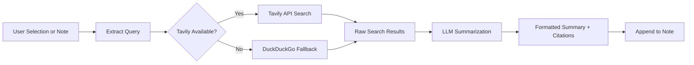

import TLDR from '@site/src/components/TLDR';

# Έρευνα & Αναζήτηση στο Διαδίκτυο

<TLDR>
**Notemd ερωτά το διαδίκτυο και εισάγει αποτελέσματα που έχουν συνοψιστεί με LLM απευθείας στις σημειώσεις σας.** Tavily API είναι το κύριο πίσωχωρο αναζήτησης· DuckDuckGo λειτουργεί ως εναλλακτικό χωρίς ρυθμίσεις. Τα αποτελέσματα συνοψίζονται με πηγές και προστίθενται κάτω από τίτλο `## Research`. Υποστηρίζει έρευνα σε μία σημείωση, έρευνα σε συνόλα φακέλων και επιλογή μοντέλου για το βήμα σύνοψης ανά εργασία.

Αυτό αποτελεί μέρος του [Obsidian Οδηγού Διαχείρισης Γνώσης AI](/docs/pillar-ai-knowledge).
</TLDR>

## Επισκόπηση

Η έρευνα είναι μία από τις πιο ισχυρές ενσωμάτωσεις του Notemd: κλείνει τον κύκλο μεταξύ ανάγνωσης, αναζήτησης και γραφής. Αντί να μεταβείτε σε έναν περιηγητή για να αναζητήσετε έναν άγνωστο όρο, επισημάνετε τον και αφήστε το Notemd να αναζητήσει, να συνοψίσει και να προσθέσει τα αποτελέσματα – όλα μέσα στο vault σας.

Η διαδικασία είναι πλήρως ρυθμίσιμη. Επιλέγετε τον πάροχο αναζήτησης, το LLM που γράφει τη σύνοψη και αν τα αποτελέσματα προστίθενται στην ενεργή σημείωση ή γράφονται σε ξεχωριστά αρχεία. Ο λειτουργικός τρόπος συνόλων σας επιτρέπει να έρευνετε κάθε σημείωση σε έναν φάκελο με μία κλικ.

## Πώς λειτουργεί

### Παύλη Αναζήτησης-Συνόψησης



1. **Απόμαχη ερωτήσεων** -- Notemd ανακαλύπτει όρους αναζήτησης από την επιλογή σας ή τον τίτλο της σημείωσης.
2. **Αναζήτηση στο διαδίκτυο** -- Πρώτα προσπαθείται το Tavily. Αν δεν έχει ρυθμιστεί κλειδί API, χρησιμοποιείται αυτόματα το DuckDuckGo (δεν απαιτείται κλειδί).
3. **Σύνοψη με LLM** -- Τα ακατέργαστα αποτελέσματα αναζήτησης στέλνονται στο ρυθμισμένο LLM, το οποίο παράγει μία σύντομη σύνοψη με ενσωματωμένες πηγές.
4. **Προσθήκη** -- Η μορφοποιημένη σύνοψη προστίθεται κάτω από τίτλο `## Research` στην ενεργή σημείωση.

### Tavily έναντι DuckDuckGo

| Ασπέκτος | Tavily | DuckDuckGo |
|--------|--------|------------|
| Κλειδί API | Απαιτείται (διαθέσιμη δωρεάν επιπέδηση) | Δεν απαιτείται |
| Ποιότητα αποτελέσματος | Υψηλή (σχεδιασμένη ειδικά για AI) | Αρκετή για συνήθεις ερωτήσεις |
| Περιορισμοί ταχύτητας | Πλούσιο δωρεάν επίπεδο | Υπόκειται σε περιορισμούς ροής |
| Ρυθμίσεις | `tavilyApiKey` στις ρυθμίσεις | Μηδέν ρυθμίσεις -- αυτόματη επικατάσταση |

### Έρευνα φακέλων σε ομάδες

Κάντε δεξί κλικ σε έναν φάκελο και επιλέξτε **"Notemd: Φάκελος έρευνας"**. Κάθε αρχείο `.md` στον φάκελο επεξεργάζεται σε σειρά (ή παράλληλα μέχρι την καθορισμένη ταυτόχρονη εκτέλεση). Κάθε σημείωμα λαμβάνει το δικό του σύνοψη έρευνας.

## Ρυθμίσεις

| Παράμετρος | Προεπιλογή | Επίδραση |
|---------|---------|--------|
| `tavilyApiKey` | `''` | Κλειδί Tavily API. Όταν είναι κενό, χρησιμοποιείται αποκλειστικά DuckDuckGo. |
| `researchProvider` / `researchModel` | DeepSeek | LLM ανά μиссия για τη σύνοψη των αποτελεσμάτων αναζήτησης |
| `maxResearchContentTokens` | `4000` | Μερίδιο τόκεν για το περιεχόμενο που στέλνεται στο LLM. Το υπερβολικό κόπτεται. |
| `researchAppendToNote` | `true` | Προσθήκη σύνοψης στο αρχικό σημείωμα. Αν είναι false, δημιουργείται ξεχωριστό αρχείο. |
| `researchLanguage` | `'en'` | Γλώσσα εξόδου για τη συνοπτική έρευνα |

### Συστάσεις μοντέλου ανά μиссия

Η έρευνα ωφελείται από ένα μοντέλο που διαχειρίζεται πολυγλωσσικό περιεχόμενο και παράγει καλά δομημένο κείμενο. Σκεφτείτε:

- **DeepSeek** -- προεπιλεγμένο, φθηνό, καλή ποιότητα
- **GPT-4o** -- υψηλότερη ποιότητα συνοπτικοποίησης, υψηλότερο κόστος
- **Gemini Flash** -- γρήγορο και φθηνό, κατάλληλο για απλές ερωτήσεις

## Παράδειγμα

Διαβάζετε ένα άρθρο σχετικά με τις *μηχανισμούς προσοχής transformer* και συναντάτε έναν άγνωστο όρο: *relative positional encoding*. Αντί να αφήσετε Obsidian:

1. Επισημάνετε **"relative positional encoding"**
2. Κλικ δεξί --> **"Notemd: Έρευνα και σύνοψη"**
3. Notemd αναζητά στο Διαδίκτυο, συνοπτίζει τα κορυφαία αποτελέσματα και προσθέτει:

```markdown
## Research

### Relative Positional Encoding

Relative positional encoding is a method used in transformer models
where positional information is expressed as relative distances between
tokens rather than absolute positions. Introduced by Shaw et al. (2018),
it improves generalization to unseen sequence lengths compared to
absolute encodings (Vaswani et al., 2017).

Sources:
- [Shaw et al., Self-Attention with Relative Position Representations (2018)](https://arxiv.org/abs/1803.02155)
- [Transformer Positional Encoding Overview](https://example.com/transformer-pos-enc)
```

Η σύνοψη είναι τώρα μέρος του αρχείου σας, έρευνασιμή, δυνατή σε σύνδεση και προσβάσιμη χωρίς σύνδεση.

## Συμβουλές

- **Ορίστε μία Tavily κλειδί για καλύτερα αποτελέσματα** -- ακόμη και η δωρεάν επιλογή παρέχει καλύτερη σχετικότητα σε σύγκριση με το ακατέργαστο DuckDuckGo.
- **Χρησιμοποιήστε ένα ικανό μοντέλο συνοπτικοποίησης** -- φθηνά μοντέλα μπορεί να εξομαλύνουν το λεπτομερές τεχνικό περιεχόμενο.
- **Εκτελέστε μαζική έρευνα** μετά από πρώτη ανάγνωση για να καλύψετε κενά σε πολλές σημειώσεις ταυτόχρονα.
- **Επανεξετάστε τις προσθετημένες συνοπτικές** -- τα LLM μπορεί να δημιουργήσουν ψεύδεις λεπτομέρειες πηγής. Επαληθεύστε τις βασικές ισχυρίσεις.

---

## Επόμενα βήματα

- [Concept Notes](./concept-notes) -- Ανακάλυψτε και διατηρήστε βασικούς όρους από τα αποτελέσματα της έρευνας
- [Wiki-Links](./wiki-links) -- Συνδέστε τις έννοιες που προέρχονται από την έρευνα σε όλο το αρχείο σας
- [Translation](./translation) --Μεταφράστε τις συνοπτικές της έρευνας σε άλλη γλώσσα
- [LLM Πάροχοι](/docs/providers/overview) -- Ρυθμίστε το μοντέλο που χρησιμοποιείται για σύνοψη
