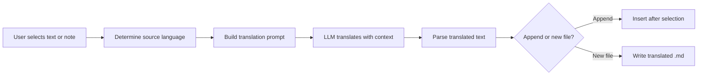

import TLDR from '@site/src/components/TLDR';

# Μετάφραση

<TLDR>
**Notemd μεταφράζει κείμενα μεταξύ 21+ γλωσσών χρησιμοποιώντας μεταφραση βασισμένη στο LLM.** Υποστηρίζει μετάφραση με μία επιλογή, μετάφραση ολόκληρων σημειώσεων και μετάφραση πακέτων φακέλων. Κάθε εργασία μετάφρασης μπορεί να χρησιμοποιήσει έναν ειδικό πάροχο και μοντέλο μέσω ρυθμίσεων ανά εργασία. Η γλώσσα εξόδου μπορεί να ρυθμιστεί ξεχωριστά από τη γλώσσα UI. Τα αποτελέσματα προστίθενται ή γράφονται σε ένα νέο αρχείο ανάλογα με τις προτιμήσεις σας.

Αυτό αποτελεί μέρος του [Obsidian Οδηγού Διαχείρισης Γνώσης AI](/docs/pillar-ai-knowledge).
</TLDR>

## Επισκόπηση

Η μετάφραση στη Notemd δεν είναι αναζήτηση σε λεξικό – είναι μεταφραση βασισμένη στο LLM, που λαμβάνει υπόψη το πλαίσιο. Το μοντέλο βλέπει ολόκληρο το παράγραφο ή τη σημείωση, διατηρώντας τον τόνο, την ορολογία του τομέα και τη δομή των προτάσεων. Αυτό παράγει πιο υψηλής ποιότητας αποτελέσματα σε σύγκριση με υπηρεσίες μετάφρασης φράσης προς φράση, ιδιαίτερα για τεχνικό, ακαδημαϊκό και δημιουργικό κείμενο.

Η λειτουργία υποστηρίζει τρεις επιπέδα: επιλογή, ενεργή σημείωση και ολόκληρο τον φάκελο. Σε συνδυασμό με την επιλογή μοντέλου ανά εργασία, μπορείτε να χρησιμοποιήσετε ένα γρήγορο μοντέλο (Gemini Flash) για απλές μεταφράσεις και ένα ισχυρό μοντέλο (Claude Sonnet) για περιεχόμενο που απαιτεί λεπτομέρειες – χωρίς να αλλάξετε τον παγκόσμιο πάροχό σας.

## Πώς λειτουργεί

### Η Εντολή Μετάφρασης



1. **Ανίχνευση πηγής** – Η LLM εξαγωγεί τη γλώσσα πηγής από το περιεχόμενο. Δεν χρειάζεται να την καθορίσετε χειροκίνητα.
2. **Δημιουργία προϋποδοχής** – Η Notemd δημιουργεί μία προϋποδοχή που περιλαμβάνει την επιθυμητή γλώσσα, προαιρετική υποδείξη τομέα και το περιεχόμενο που θα μεταφραστεί.
3. **Μετάφραση LLM** – Η ρυθμισμένη `translateProvider` / `translateModel` επεξεργάζεται την αίτηση. Το μοντέλο διατηρεί τη μορφή markdown, τους σύνδεσμους wiki και τα μπλόκ κώδικα.
4. **Εξόδος** – Το μεταφρασμένο κείμενο προστίθεται κάτω από το αυθεντικό ή γράφεται σε ένα νέο αρχείο στο αποθετήριο.

### Ζεύγη Γλωσσών

Η Notemd υποστηρίζει οποιοδήποτε ζεύγος γλωσσών που υποστηρίζει το βασικό LLM. Συνηθισμένα ζεύγη περιλαμβάνουν:

| Πηγή | Στόχος | Τυπική Ποιότητα |
|--------|--------|----------------|
| Αγγλικά | Κινεζικά (Απλοποιημένο) | Εξαιρετική |
| Κινεζικά | Αγγλικά | Εξαιρετικό |
| Αγγλικά | Ιαπωνικά | Πολύ καλό |
| Αγγλικά | Γερμανικά / Γαλλικά / Ισπανικά | Πολύ καλό |
| Οποιαδήποτε υποστηρίζεται | Οποιαδήποτε υποστηρίζεται | Ανάλογα με το μοντέλο |

Η ρύθμιση `translateLanguage` ελέγχει τη **γλώσσα έξοδου**. Η πηγαία γλώσσα ανιχνεύεται αυτόματα.

### Επιλογή μοντέλου ανά εργασία

Η ποιότητα της μετάφρασης ποικίλλει σημαντικά ανάλογα με το μοντέλο. Notemd σας επιτρέπει να αναθέσετε ένα ειδικό μοντέλο μόνο για μετάφραση:

| Μοντέλο | Γραμμή Ταχύτητας | Ποιότητα | Κόστος | Αποδεικτικό Χρήσης |
|-------|-------|--------|------|----------|
| `gemini-2.0-flash-exp` | Γρήγορο | Καλό | Χαμηλό | Ανεπίσημο, υψηλή ποσότητα |
| `gpt-4o-mini` | Γρήγορο | Καλό | Χαμηλό | Μεταχειρισμοί γρήγορα |
| `deepseek-chat` | Μέτριο | Καλό | Πολύ χαμηλό | Μικρόβουδζετ πολυγλωσσικό |
| `claude-3-5-sonnet` | Μέτριο | Εξαιρετικό | Μέτριο | Τεχνικό / ακαδημαϊκό |
| `gpt-4o` | Μέτριο | Εξαιρετικό | Μέτριο | Προσωποποιημένη προζή |

### Μετάφραση φακέλων σε σειρά

Κάντε δεξί κλικ σε έναν φάκελο και επιλέξτε **"Notemd: Translate folder"** για να μεταφράσετε κάθε σημείωμα σε αυτόν τον φάκελο. Κάθε αρχείο επεξεργάζεται ανεξάρτητα. Η ρύθμιση συγχρονισμού ελέγχει πόσα αρχεία μεταφράζονται ταυτόχρονα.

## Ρυθμίσεις

| Παράμετρος | Προεπιλογή | Επίδραση |
|---------|---------|--------|
| `translateProvider` / `translateModel` | DeepSeek | Ειδικός πάροχος για εργασίες μετάφρασης |
| `translateLanguage` | `'en'` | Στόχευτη γλώσσα εξόδου |
| `translationAppendToNote` | `true` | Προσθέστε το μεταφρασμένο κείμενο κάτω από το αυθεντικό. Αν είναι false, δημιουργείται ένα νέο αρχείο. |
| `batchConcurrency` | `3` | Αριθμός των αρχείων που επεξεργάζονται ταυτόχρονα κατά τη μετάφραση σε σειρά |

## Παράδειγμα

Διαβάζετε ένα κινεζικό ερευνητικό σημείωμα και θέλετε μία Αγγλική έκδοση:

1. Ανοίξτε το σημείωμα
2. Κάντε δεξί κλικ --> **"Notemd: Translate current file"**
3. Το Notemd ανιχνεύει τα κινεζικά, μεταφράζει τα στην ρυθμισμένη σας στόχουσα γλώσσα (Αγγλικά) και προσθέτει:

```markdown
## Translation (English)

The experimental results show that the proposed method achieves
a 12% improvement in F1 score compared to the baseline, primarily
due to the enhanced feature extraction module described in Section 3.
```

Το αυθεντικό κινεζικό κείμενο παραμένει άλλαξτο πάνω από τη μετάφραση. Το πλαισίο `## Translation` διατηρεί και τις δύο εκδόσεις στο ίδιο αρχείο για ευκολή αναφορά.

## Συμβουλές

- **Χρησιμοποιήστε Gemini Flash για μεγάλες ποσότητες** -- είναι η ταχύτερη και φθηνότερη επιλογή για μετάφραση σε σειρά μεγάλων φακέλων.
- **Κατασκευή wiki-λινκών** -- η εντολή του Notemd οδηγεί το LLM να διατηρήσει το `[[wiki-links]]` ακέραιο στη μετάφραση. Επαληθεύστε μετά τη μετάφραση, καθώς ορισμένα μοντέλα μερικές φορές τα αποσυρρίπτουν.
- **Ορισμός της γλώσσας εξόδου ρητά** -- η αυτόματη ανίχνευση λειτουργεί για το πηγαίο κείμενο, αλλά πρέπει πάντα να ρυθμίσετε το `translateLanguage` για να αποφύγετε ασαφείες σχετικά με τον στόχο.
- **Μαζική μετάφραση σημειώσεων έννοιας** -- αν η φάκελος των έννοιών σας είναι σε μία γλώσσα και χρειάζεται να είναι σε μία άλλη, η μετάφραση σε επίπεδο φάκελου το λύνει σε μία βήμα.

---

## Επόμενα βήματα

- [Research](./research) -- Αναζήτηση και σύνοψη σε οποιαδήποτε γλώσσα, στη συνέχεια μετάφραση των αποτελεσμάτων
- [Workflows](./workflows) -- Αλυσίδα μεταφράσεων με wiki-λινκς ή εξαγωγή έννοιας
- [Batch Processing](/docs/advanced/batch-processing) -- Συγχρονισμός και συμπεριφορά αντικατάστασης για λειτουργίες φακέλων
- [LLM Providers](/docs/providers/overview) -- Επιλογή του καλύτερου μοντέλου για το ζευγάρι γλωσσών σας
