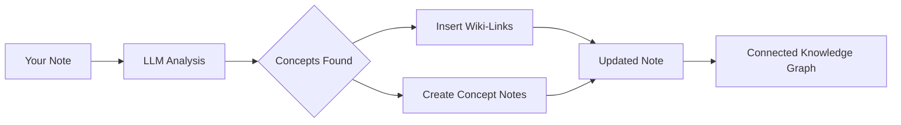

import TLDR from '@site/src/components/TLDR';

# Συνδέσμοι Wiki

<TLDR>
**Notemd προσθέτει αυτόματα `[[wiki-links]]` στις βασικές έννοιες των σημειώσεών σας.** Το LLM διαβάζει το περιεχόμενό σας, εντοπίζει σημαντικές λέξεις στο πλαίσιο και ενσωματώνει συνδέσμους Wiki στυλ Obsidian σε κάθε εμφάνιση. Προαιρετικά δημιουργεί αρχεία σημειώσεων έννοιας με αντίστροφους συνδέσμους. Υποστηρίζει την καταστολή συνώνυμων, την ακεραιότητα συνδέσμων κατά τη μετονομασία/αφαίρεση και τρόπο καθαρής εξαγωγής (χωρίς τροποποίηση αρχείων). Σε αντίθεση με το Auto Link που ταιριάζει μόνο με υπάρχοντα τίτλους σημειώσεων, το Notemd χρησιμοποιεί AI για να εντοπίσει νέες έννοιες και να δημιουργήσει αντίστοιχες σημειώσεις. Αυτό αποτελεί μέρος του [Obsidian Οδηγού Διαχείρισης Γνώσης AI](/docs/pillar-ai-knowledge).
</TLDR>

## Επισκόπηση

Η δημιουργία συνδέσμων Wiki είναι η βασική λειτουργία του Notemd. Μετατρέπει απλό κείμενο σε ένα συνδεδεμένο γράφο γνώσης μέσω των εξής βήματων:

1. **Ανάλυση της σημείωσής σας** με ένα LLM
2. **Εντοπισμός βασικών εννοιών** (λέξεις, άτομα, μέθοδοι, θεωρίες)
3. **Ενσωμάτωση `[[wiki-links]]`** σε κάθε εμφάνιση
4. **Δημιουργία σημειώσεων έννοιας** (προαιρετικά) με αντίστροφους συνδέσμους

## Πώς λειτουργεί

### Διαδικασία



### Παράδειγμα

**Πριν:**
```markdown
Machine learning models use neural networks to learn patterns from data.
The transformer architecture revolutionized natural language processing.
```

**Μετά:**
```markdown
[[Machine learning]] models use [[neural networks]] to learn patterns from data.
The [[transformer architecture]] revolutionized [[natural language processing]].
```

## Χρήση

### Βασικό: Προσθήκη συνδέσμων στην τρέχουσα σημείωση

1. Ανοίξτε μία σημείωση
2. Κλικ δεξί στον επεξεργαστή → **"Διαδικάσεις αρχείου (προσθήκη συνδέσμων)"**
3. Περιμένετε μερικές δευτερόλεπτα
4. Οι έννοιες έχουν τώρα συνδεθεί!

### Μερίδα: Επεξεργασία πολλών σημειώσεων

1. Κάντε δεξί κλικ σε έναν φάκελο στο File Explorer
2. Επιλέξτε **"Notemd: Process folder (add links)"**
3. Ρυθμίσεις:
   - Συγχρονισμός (πόσα αρχεία παράλληλα)
   - Επαναγράφηση υπάρχοντων συνδέσμων (ναι/όχι)
4. Κάντε κλικ στο **Process**

### Επιλεκτική: Σύνδεση συγκεκριμένου κειμένου

1. Επισημάνωση κειμένου για επεξεργασία
2. Κάντε δεξί κλικ → **"Process selection (add links)"**
3. Αναλύεται μόνο το επισημασμένο τμήμα

## Notemd έναντι Auto Link

Obsidian διαθέτει δύο προσεγγίσεις για αυτόματη σύνδεση σε wiki:

| | **Auto Link** | **Notemd** |
|--|---------------|-------------|
| Πηγή σύνδεσης | Τίτλοι υπάρχουσων σημειώσεων στο vault | Καταλόγους LLM που έχουν εντοπιστεί στο περιεχόμενο |
| Μπορεί να συνδέσει νέους όρους | Όχι — ο τίτλος πρέπει ήδη να υπάρχει | Ναι — η Τεχνητή Νοημοσύνη εντοπίζει όρους και δημιουργεί σημειώσεις |
| Διαχείριση συνώνυμων | Όχι | Ναι — καταστολή συνώνυμων |
| Δημιουργία σημειώσεων όρων | Όχι | Ναι — με παλινδρόμους και απομνημόνευση διπλασιασμών |
| Μαζική επεξεργασία | Όχι (μόνο ένα αρχείο) | Ναι (σε επίπεδο φάκελου) |
| Διαχείριση μοντέλων ανά εργασία | Όχι | Ναι |

**Auto Link** είναι βασισμένο στην ένταξη τίτλου: αν υπάρχει σημείωση με το όνομα "Machine Learning", περιβάλλει τις εμφανίσεις της σε `[[Machine Learning]]`. Αν η σημείωση δεν υπάρχει, δεν συμβαίνει τίποτα.

**Notemd** είναι καθοδηγούμενο από Τεχνητή Νοημοσύνη: το LLM διαβάζει το περιεχόμενό σας, κατανοεί το πλαίσιο, εντοπίζει όρους που *πρέπει* να συνδεθούν — ακόμη και αν δεν υπάρχει ακόμη σημείωση — και δημιουργεί τόσο τον σύνδεσμο όσο και τη σημείωση όρου.

## Ιδιότητες

### Καταστολή συνώνυμων

**Μέλη πρόβλημα:** "transformer", "transformers", "Transformer architecture" → 3 ξεχωριστοί όροι

**Λύση:** Notemd εντοπίζει σχεδόν διπλασιασμούς και χρησιμοποιεί την κανονική μορφή.

**Σύνθεση:**
```
Settings → Advanced → Synonym Suppression
Threshold: 0.8 (0 = off, 1 = aggressive)
```

### Ακεραιότητα Συνδέσμων

**Όταν αλλάζετε το όνομα μιας σημειώσης έννοιας:**
- Όλοι οι συνδέσμοι wiki ενημερώνονται αυτόματα (Obsidian βασική λειτουργία)
- Οι αντίστροφοι συνδέσμοι παραμένουν άλλαντοι

**Όταν διαγράφετε μια σημειώση έννοιας:**
- Οι συνδέσμοι παραμένουν αλλά εμφανίζονται ως "ανεσυνδεδεμένες αναφορές"
- Μπορείτε να την δημιουργήσετε ξανά από οποιαδήποτε εμφάνιση

### Καθαρός Τρόπος Απομάκρυνσης

**Απομάκρυνση έννοιων χωρίς τροποποίηση του αρχικού:**

1. Κλικ δεξί → **"Απομάκρυνση έννοιων (βία απομάκρυνσης)"**
2. Δημιουργούνται σημειώσεις έννοιας
3. Το αρχικό αρχείο παραμένει αλλαγής χωρίς

Χρήση: Διαχείριση μόνο διαβάσιμου περιεχομένου ή τελικών σχεδίων.

## Δημιουργία Σημειώσεων Έννοιας

### Αυτόματη Δημιουργία

**Όταν είναι ενεργοποιημένο (προεπιλογή), Notemd δημιουργεί:**

```markdown
---
tags: [concept, auto-generated]
created: 2026-06-13
source: [[Original Note Name]]
---

# Machine Learning

A branch of artificial intelligence that enables computers
to learn from data without explicit programming.

## Occurrences in Your Vault

- [[Original Note Name#Section]]
- [[Another Note#Header]]

## Related Concepts

- [[Neural Networks]]
- [[Deep Learning]]
- [[Supervised Learning]]
```

### Ρυθμίσεις

**Πапκάς έξοδου:**
```
Settings → Output → Concept Folder
Default: concepts/
```

**Ιεραρχική δομή:**
```
Settings → Output → Use Hierarchical Folders
If enabled:
  papers/my-paper.md → papers/concepts/Concept.md
If disabled:
  → concepts/Concept.md
```

**Πρότυπο:**
```
Settings → Output → Concept Template
Customize with variables:
  {{concept}} — Concept name
  {{description}} — LLM-generated description
  {{backlinks}} — List of source notes
  {{date}} — Creation date
```

## Προχωρημένες επιλογές

### Χώρος πλαισίου

**Πόσο περιβάλλον κείμενο να στείλεται:**

```
Settings → Linking → Context Window
Options: Sentence | Paragraph | Full Note
Default: Paragraph
```

Μεγαλύτερο = καλύτερη ακρίβεια, υψηλότερο κόστος.

### Ελάχιστες εμφανίσεις

**Μόνο να συνδέονται έννοιες που εμφανίζονται πολλές φορές:**

```
Settings → Linking → Min Occurrences
Default: 1 (link all)
```

Ρυθμίστε σε 2 ή 3 για να επικεντρωθείτε σε επαναλαμβανόμενα θέματα.

### Αποκλεισμός προτύπων

**Να παραλείψετε ορισμένα λέξεις:**

```
Settings → Linking → Exclude List
Example: note, idea, example, thing
```

Μεταφράζει την αποφυγή υπερσύνδεσης γενικών όρων.

### Προσαρμοσμένες Απαγγελίες

**Να αντικαταστήσετε τις προεπιλεγμένες οδηγίες LLM:**

```
Settings → Advanced → Custom Linking Prompt
Default:
  "Identify key concepts, theories, methods, and technical
   terms in the following text. Return as a list..."
```

Μεταβάλετε για ειδικές ανάγκες του τομέα (π.χ., "Επικέντρωση στην ιατρική ορολογία").

## Συμβουλές & Καλύτερες Πρακτικές

### ✅ ΝΑ ΚΑΝΟΥΜΕ

- **Επεξεργαστείτε σημειώσεις με >100 λέξεις** — Μικρές σημειώσεις παράγουν λίγες έννοιες
- **Χρησιμοποιήστε ισχυρά μοντέλα** για καλύτερη αναγνώριση έννοιων (GPT-4o, Claude)
- **Επανεξετάστε πριν δεχτείτε** — Ελέγξτε αν τα προτεινόμενα συνδέσμους έχουν νόημα
- **Δημιουργήστε διαδοχικά** — Επεξεργαστείτε 5-10 σημειώσεις, επανεξετάστε το γράφο, προσαρμόστε τις ρυθμίσεις

### ❌ ΜΗΝ ΚΑΝΟΥΜΕ

- **Περισσότεροι συνδέσμοι** — Δεν χρειάζεται σύνδεσμος για κάθε ουσιαστικό
- **Επεξεργαστείτε προσχέδια επανειλημμένα** — Οι έννοιες μπορεί να αλλάξουν, περιμένετε μέχρι να γίνουν σταθερές
- **Αγνοήστε τους συνώνυμους** — Ενεργοποιήστε την καταστολή για να αποφύγετε τη διαφορά μεταξύ "ML" και "Machine Learning"

## Απόδοση

### Γραμμή Ταχύτητας

| Μέγεθος Σημειώσεων | GPT-4o-mini | Claude Sonnet | Ollama (lokalό) |
|-----------|-------------|---------------|----------------|
| 500 λέξεις | 2-3 δευτερόλεπτα | 3-5 δευτερόλεπτα | 5-10 δευτερόλεπτα |
| 2000 λέξεις | 5-8 δευτερόλεπτα | 10-15 δευτερόλεπτα | 20-40 δευτερόλεπτα |
| 5000+ λέξεις | Με κομμάτια (πολλές κλήσεις) | Μονάδες δεδομένων | Μονάδες δεδομένων |

### Εκτίμηση Κόστους

**Παράδειγμα: Σημείωμα 1000 λέξεων με το GPT-4o-mini**
- Εισόδιο: ~1500 τόκεν
- Αποτέλεσμα: ~200 τόκεν
- Κόστος: ~

**Ανάλυση σε παρτίδες για 100 σημειώσεις:** ~

## Αντιμετώπιση προβλημάτων

### Κανένας σύνδεσμος δεν προστέθηκε

**Ελέγχος:**
1. LLM η κλήση επιτύχησε (Ρυθμίσεις → Διαγνώση)
2. Η σημειώση περιέχει αρκετό περιεχόμενο (>50 λέξεις).
3. Οι έννοιες είναι τεχνικές/συγκεκριμένες (όχι απλώς αντωνύμια).

**Δοκιμάστε:**
- Χρησιμοποίηστε ένα πιο ισχυρό μοντέλο
- Αύξηση παράθυρου συντεκста
- Ελέγξτε την έγκυρητα του κλειδιού API

### Πάρα πολλοί σύνδεσμοι

**Λύσεις:**
1. Αύξηση των ελάχιστων εμφανίσεων (2 ή 3)
2. Προσθέστε συνηθισμένα λέξεις στη λίστα αποκλεισμού
3. Χρησιμοποιήστε ένα λιγότερο επιθετικό μοντέλο

### Λάθος έννοιες συνδεδεμένες

**Λύσεις:**
1. Χρησιμοποίηση προσαρμοσμένου πρόμπτ για ειδικότητα του δομέα
2. Ενεργοποίηση καταστολής συνώνυμων
3. Επανεξέταση χειροκίνητα και αποσύνδεση

### Οι σύνδεσμοι σπάνουν μετά τη μετονομασία

**Αυτή είναι φυσιολογική Obsidian συμπεριφορά.**

Για ενημέρωση όλων των συνδέσμων:
1. Μετονομάστε την σημειώση έννοιας
2. Obsidian ενημερώνεται αυτόματα `[[old]]` → `[[new]]`

---

## Επόμενα βήματα

- 📖 [Σημειώσεις Έννοιας](./concept-notes) — Διεξοδική εξέταση της δημιουργίας σημειώσεων έννοιας
- 🔍 [Ενσωμάτωση Έρευνας](./research) — Συνδυάσεις σύνδεσμων με ιστοσελίδες έρευνας
- 🎨 [Διαγράμματα](./diagrams) — Βιζουαλισμός του γραφήματος γνώσης σας
