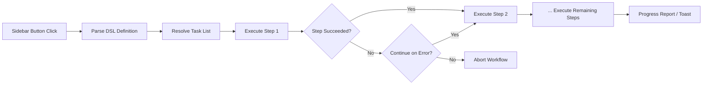

import TLDR from '@site/src/components/TLDR';

# Διεργασίες

<TLDR>
**Notemd Οι διεργασίες συνδέουν πολλές εργασίες σε μία μόνη ενέργεια μίας κλικ.** Ορίστε αλληλουχίες όπως `add-links > extract-concepts > research > diagram` χρησιμοποιώντας ένα απλό DSL. Οι διεργασίες εμφανίζονται ως κουμπιά στο πλάι-μπάρ που εκτελούν ολόκληρη την αλληλουχία στην τρέχουσα σημείωση ή φάκελο. Περιλαμβάνει προδιαγραφόμενες διεργασίες· δημιουργήστε προσαρμοσμένες στις ρυθμίσεις. Κάθε βήμα χρησιμοποιεί τη δική του διαμόρφωση μοντέλου ανά εργασία.

Αυτό αποτελεί μέρος του [Obsidian Οδηγού Διαχείρισης Γνώσης AI](/docs/pillar-ai-knowledge).
</TLDR>

## Επισκόπηση

Μία διεργασία εξαλείφει τη δυσκολία της εκτέλεσης εργασιών μία-μετά-μία. Αντί να κάνετε δεξί κλικ τέσσερις φορές για να προσθέσετε συνδέσμους, να εξαγάγετε έννοιες, να έρευνετε άγνωστους όρους και να δημιουργήσετε ένα διάγραμμα, πατάτε ένα κουμπί στο πλάι-μπάρ και η ολόκληρη αλληλουχία εκτελείται. Notemd διαχειρίζεται την αλληλουχία, τη μετάδοση σφαλμάτων και την αναφορά προόδου.

Οι διεργασίες ορίζονται σε ένα ελαφρύ DSL (γλώσσα ειδικής χρήσης). Βρίσκονται στις ρυθμίσεις, εμφανίζονται ως κάνιμα κουμπιά στο πλάι-μπάρ του Obsidian και μπορούν να εφαρμοστούν είτε στην τρέχουσα σημείωση είτε σε ολόκληρο φάκελο.

## Πώς λειτουργεί

### Παίπιδο εκτέλεσης διεργασιών



1. **Ανάλυση** -- Η συμβολοσειρά DSL διαιρείται με `>` (ή `>`) σε μία μεταταχθείσα λίστα αναγνωριστικών εργασιών.
2. **Ανάλυση** -- Κάθε αναγνωριστικό συνδέεται με ένα εσωτερικό πρότασμα (add-links, extract-concepts, research, translate, diagram κ.λπ.).
3. **Εκτέλεση** -- Τα βήματα εκτελούνται αλληλουχώς. Κάθε βήμα χρησιμοποιεί τον διαμορφωμένο πάροχο και μοντέλο ανά εργασία.
4. **Διαχείριση σφαλμάτων** -- Αν ένα βήμα αποτύχει, η διεργασία είτε διακόπτεται είτε συνεχίζει στο επόμενο βήμα, ανάλογα με την πολιτική σφαλμάτων σας.
5. **Τελείωση** -- Μία ειδοποίηση toast αναφέρει την επιτυχία ή λίσταζει τα αποτυχημένα βήματα.

### Μορφή DSL

Οι διεργασίες ορίζονται ως μία αλληλουχία αναγνωριστικών εργασιών χωρισμένη με `>`:

```
process-current-add-links>extract-concepts-current>research-and-summarize
```

**Διαθέσιμοι αναγνωριστικοί εργασιών:**

| Αναγνωριστικό | Δραστηριότητα |
|------------|--------|
| `process-current-add-links` | Προσθήκη συνδέσμων wiki στην ενεργή σημειώση |
| `extract-concepts-current` | Απόσυρση έννοιων από την ενεργή σημειώση |
| `research-and-summarize` | Έρευνα του επιλεγμένου κειμένου ή του τίτλου της σημειώσης |
| `process-current-translate` | Μετάφραση της ενεργής σημειώσης |
| `summarize-to-mermaid` | Δημιουργία διαγράμματος από την ενεργή σημειώση |
| `generate-from-title` | Δημιουργία περιεχομένου από τον τίτλο της σημειώσης |
| `extract-original-text` | Απόσυρση αρχικού κειμένου (για OCR / σκανημένο περιεχόμενο) |

**Μεταβλητές σε επίπεδο φάκελου** αντικαθιστούν το `current` με `folder` στο όνομα του αναγνωριστικού.

### Προκαθορισμένες έναντι προσαρμοσμένων ροδικών διαδικασιών

Το Notemd περιλαμβάνει έτοιμες ροδικές διαδικασίες για συνηθισμένα μοτίβα:

| Ροδική διαδικασία | Χειν | Χρήση |
|----------|-------|----------|
| **Μεταφορά με μία κλικ** | add-links > extract-concepts > research | Επεξεργασία ενός ερευνητικού άρθρου σε μία περιόδο |
| **Πλήρης σωλήνας** | ανάθεση-λινκών > εξαγωγή-μερωμάτων > έρευνα > διάγραμμα | Ολοκληρωμένη εξαγωγή γνώσεων με οπτικοποίηση |
| **Μετάφραση + Σύνδεση** | μετάφραση > ανάθεση-λινκών | Μετάφραση και σύνδεση μερωμάτων στην επιλεγμένη γλώσσα |

**Προσαρμοσμένα ροήματα εργασίας** δημιουργούνται στις ρυθμίσεις:

1. Ανοίξτε **Ρυθμίσεις** --> **Notemd** --> **Ροήματα εργασίας**
2. Κάντε κλικ στο **"Προσθήκη ροήματος εργασίας"**
3. Εισάγετε την αλυσίδα DSL (π.χ., `process-current-add-links>extract-concepts-current`)
4. Δώστε της έναν ονόματο εμφάνισης (π.χ., "Γρήγορη Σύνδεση + Εξαγωγή")
5. Το νέο κουμπί εμφανίζεται αμέσως στο πλάι-μενο

## Ρυθμίσεις

| Παράμετρος | Προεπιλογή | Επίδραση |
|---------|---------|--------|
| `workflows` | Προκαθορισμένο σύνολο | Μассив ορισμών ροήματος εργασίας (ονόματο + DSL) |
| `workflowContinueOnError` | `true` | Συνεχίστε στο επόμενο βήμα αν το τρέχον βήμα αποτύχει |
| `workflowShowProgress` | `true` | Εμφάνιση μήνυμα πρόοδου μετά από κάθε ολοκληρωμένο βήμα |

### Μοντέλα-προς-μиссию στα ροήματα εργασίας

Κάθε βήμα σε ένα ροδόληψη χρησιμοποιεί τη δική του διαμόρφωση μοντέλου ανά εργασία. Δεν χρειάζεται να καθορίσετε μοντέλα στο ίδιο DSL. Η τάξη επίλυσης είναι:

1. Μοντέλο παρόχου/μοντέλο ανά εργασία αν `useMultiModelSettings` υπάρχει
2. Γλωβάλιο `activeProvider` διαφορετικά

Αυτό σημαίνει ότι `add-links` μπορεί να εκτελεστεί στο DeepSeek ενώ το `research` εκτελείται στο GPT-4o -- όλα μέσα στο ίδιο κλικ του ροδόληψης.

## Παράδειγμα

Μόλις εισήγαγατε ένα PDF από ένα άρθρο μηχανικής μάθησης στο vault σας και θέλετε πλήρη εξαγωγή γνώσεων:

1. Ανοίξτε την εισαχθείσα σημείωση
2. Κάντε κλικ στο κουμπί πλευρικής γραμμής **"Full Pipeline"**
3. Notemd εκτελείται:
   - **Βήμα 1**: Προσθήκη συνδέσμων wiki -- `[[attention mechanism]]`, `[[transformer]]` κ.λπ.
   - **Βήμα 2**: Εξαγωγή έννοιων -- δημιουργεί σημειώσεις έννοιων στον φάκελο έννοιων σας
   - **Βήμα 3**: Έρευνα -- συνοπτίζει πηγές Διαδικτύου για βασικά όρους
   - **Βήμα 4**: Διάγραμμα -- δημιουργεί ένα Mermaid mindmap της δομής του άρθρου
4. Μετά από περίπου 30 δευτερόλεπτα, η σημείωσή σας έχει συνδέσμους, υπάρχουν σημειώσεις έννοιων, η έρευνα έχει προστεθεί και αποθηκεύεται ένα αρχείο διάγραμματος

Όλα αυτά με ένα μόνο κλικ.

## Συμβουλές

- **Ξεκινήστε με προκαθορισμένα ροδόληψη** -- καλύπτουν τα πιο συνηθισμένα πρότυπα. Προσαρμόστε μόνο όταν χρειάζεστε διαφορετική αλληλουχία.
- **Ενεργοποιήστε το `workflowContinueOnError`** -- μια αποτυχημένη φάση διάγραμματος δεν πρέπει να διακόψει ολόκληρο το pipeline.
- **Χρησιμοποίηστε ροδόλογια φακέλων** για μαζική επεξεργασία -- κάντε δεξί κλικ σε έναν φάκελο, επιλέξτε έναν ροδόλογο και κάθε σημείωμα θα επεξεργαστεί.
- **Ονομάστε τους ροδόλογους με σαφήνεια** -- ο χώρος στην πλευρική γραμμή είναι περιορισμένος. Χρησιμοποιήστε σύντομα, κατευθυνόμενα στην δράση ονόματα όπως "Γρήγορη Απόδοση" ή "Μετάφραση + Σύνδεσμος".

---

## Επόμενα βήματα

- [Research](./research) -- Κατανοήστε τι κάνει η φάση έρευνας πριν την προσθέσετε στους ροδόλογους
- [Wiki-Links](./wiki-links) -- Το βασικό χαρακτηριστικό σύνδεσης που χρησιμοποιείται στους περισσότερους ροδόλογους
- [Concept Notes](./concept-notes) -- Απόδοση έννοιων ως φάση ροδόλογου
- [Batch Processing](/docs/advanced/batch-processing) -- Συγχρονισμός και αναφορές προόδου για ροδόλογια φακέλων
