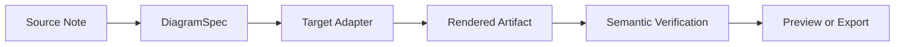
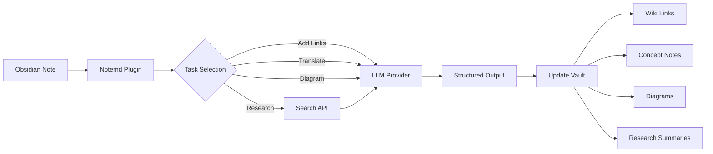

import TLDR from '@site/src/components/TLDR';

# Εισαγωγή στο Notemd

<TLDR>
**Notemd** (Note + EMD — Enhanced Markdown Documents) είναι ένα πλαγινό ανοιχτού κώδικα για το Obsidian που μετατρέπει την ανάγνωση με τη βοήθεια του LLM σε μόνιμες γνώσεις. Σε αντίθεση με την AI βασισμένη σε συνομιλίες όπου οι πληροφορίες εξαφανίζονται μετά τη συνεδρία, το Notemd γράφει τα αποτελέσματα **απευθείας στο vault σας** ως σύνδεσμους wiki, σημειώματα έννοιας, σύνοψεις έρευνας, μεταφράσεις, ροδόσχηματα και διαγράμματα. Είναι σχεδιασμένο για ερευνητές, φοιτητές και εργαζόμενους στον τομέα των γνώσεων που θέλουν την ανάγνωση, την έρευνα και τις οπτικές εξηγήσεις να συσσωρεύονται σε μία δομημένη, εξελισσόμενη γραφή γνώσεων.
</TLDR>

## Τι είναι το Notemd?

Το Notemd ενσωματώνει **περισσότερα από 30 μεγάλα μοντέλα γλώσσας** (OpenAI, Anthropic, Google, DeepSeek, Qwen, Ollama και άλλα) στο ροδόσχημα Obsidian του, για να αυτοματοποιήσει την εξάγωγη γνώσεων, την οργάνωση, τη μετάφραση, την έρευνα και τη δημιουργία διαγράμματος.

### Βασική διαφορά: Προσωρινές έναντι μόνιμων γνώσεων

| Ασπέκτος | AI βασισμένη σε συνομιλίες (ChatGPT κ.λπ.) | Notemd |
|--------|-------------------------------|--------|
| **Πού πηγαίνουν τα αποτελέσματα** | Ιστορικό συνομιλιών (εξαφανίζεται) | Το vault Obsidian σας (παραμένει) |
| **Μορφή** | Απαντήσεις σε απλό κείμενο | Δομημένα αρχεία: `[[wiki-links]]`, σημειώματα έννοιας, διαγράμματα |
| **Μακροπρόθεσμη αξία** | Πρέπει να ρωτήσετε ξανά κάθε φορά | Συσσωρεύεται σε μία γραφή γνώσεων |
| **Αποκλειστική πρόσβαση** | Απαιτεί ίντερνετ | Δουλεύει πλήρως αποκλειστικά χωρίς ίντερνετ με Ollama |

## Βασικές δυνατότητες

### 1. **Αυτόματη σύνδεση Wiki**
- LLM εντοπίζει τις βασικές έννοιες στις σημειώσεις σας
- Προσθέτει `[[wiki-links]]` σε κάθε εμφάνιση
- Προαιρετικά δημιουργεί σημειώσεις συνδεδεμένων έννοιων
- Απενεργοποίηση συνώνυμων για την αποφυγή διπλασιασμών

### 2. **Δημιουργία σημειώσεων έννοιας**
- Αντλεί βασικές έννοιες από εργασίες, άρθρα, σημειώσεις
- Δημιουργεί ειδικά αρχεία έννοιας με παλινδρόμους
- Προσαρμόσιμοι μοντέλα και δρόμοι εξόδου

### 3. **Ενσωμάτωση ιστοσελιδικής έρευνας**
- Ζητήστε Tavily ή DuckDuckGo από μέσα στο Obsidian
- LLM συνοψίζει τα αποτελέσματα με παραπομπές στην πηγή
- Προσθέτει τα αποτελέσματα έρευνας στην τρέχουσα σημείωση

### 4. **Μετάφραση πολλών γλωσσών**
- Μεταφράζει επιλογές ή ολόκληρες σημείωσεις
- Υποστηρίζει περισσότερες από 21 UI γλώσσες
- Ανεξάρτητη ρύθμιση γλώσσας εξόδου
- Υποστήριξη μαζικής μετάφρασης

### 5. **Δημιουργία διαγράμματων**
- **Mermaid**: Διαχαρτηματισμοί ροής, αλληλουχίας, κλάσεων, καταστάσεων, ER, Gantt
- **JSON Canvas**: Obsidian φυσικές διατάξεις
- **Vega-Lite**: Διαγράμματα δεδομένων, σειρές χρόνου, διαγράμματα διασποράς
- **HTML / Επεξεργασιμό HTML/SVG**: Αυτόνομα σχήματα με σημασιολογικές αναφορές
- **Draw.io / Drawnix όρια σχημάτων**: Μοντέλα εξαγωγής για τους συντηρητές από το ίδιο σημασιολογικό μοντέλο σχήματος
- **Δρόμος προώθησης διαγράμματων κυκλωμάτων**: Η υποστήριξη circuitikz/TikZJax σχεδιάζεται γύρω από χρυσές αναφορές, περιορισμένες εντολές, ανατροφοδότηση απόχυσης και επαλήθευση τοπολογίας/διατάξεων αντί για ακατέργαστο, ανεπιφύλακτο LLM TikZ
- **Διαγνώσεις προεπισκόπησης**: Τα σχήματα απόχυσης μπορούν να εμφανίσουν διαγνώσεις συνταξικής/απόχυσης κατασκευής, και οι μη ενσωματωμένες πηγές μπορούν να εξεταστούν χωρίς την ανάγκη για λειτουργία LaTeX στην πλευρά των πρόσθετων
- Αυτόματη διόρθωση σύνταξης για σφάλματα Mermaid

### 6. **Διαδικασίες εργασίας με μία κλικ**
- Συνδέστε πολλές ενέργειες σε κουμπία πλευρικής πανελίδας
- Ορισμός ροής δουλειών με βάση DSL
- Παράδειγμα: `add-links > extract-concepts > research > diagram`

## Ποιοι θα πρέπει να το χρησιμοποιήσουν Notemd;

✅ **Ερευνητές** που διαβάζουν άρθρα και δημιουργούν ανασκοπήσεις βιβλιογραφίας
✅ **Φοιτητές** που οργανώνουν σημειώσεις μελέτης και δημιουργούν χάρτες έννοιων
✅ **Εργαζόμενοι στον τομέα της γνώσης** που θέλουν τις αντιλήψεις από την ανάγνωση να διατηρηθούν
✅ **Διπλόγλωσσοι επαγγελματίες** που χρειάζονται μετάφραση + συνδέσμους wiki
✅ **Χρήστες που διαβάζουν την ιδιωτικότητα** που θέλουν την τοπική υποστήριξη LLM (Ollama)
✅ **Πανεμπορικοί χρήστες** που προσαρμόζουν προτάσεις και ροές δουλειών

## Γιατί Notemd + Obsidian;

**Obsidian** είναι μια βάση γνώσης που δίνει προτεραιότητα στο τοπικό, βασισμένη σε markdown. **Notemd** προσθέτει θερμαίες δυνάμεις της AI:
- Τα δεδομένα σας παραμένουν στο αποθετήριό σας (όχι σε υπηρεσία σύνδεσης)
- Δουλεύει εκτός σύνδεσης με τοπικά μοντέλα
- Δωρεάν και ανοιχτό κώδικα (лиценζία MIT)
- Ενσωματώνεται με υπάρχοντες πρόσθετους Obsidian
- Επεκτάνεται σε δεκάδες χιλιάδες σημεία

## Ξεκίνηση

1. **Εγκατάσταση**: Ρυθμίσεις → Community Plugins → Αναζήτηση → "Notemd"
2. **Ρύθμιση**: Προσθέστε τον προμηθευτή LLM και τον κλειδί API (ή χρησιμοποιήστε το τοπικό Ollama)
3. **Δοκιμάστε**: Ανοίξτε ένα σημείο → Κλικ δεξί → "Process file (add links)"
4. **Εξερεύνηση**: Ελέγξτε το πλάιβουρν για ροδόσχημα με μία κλικ

👉 [Οδηγός Εγκατάστασης](./getting-started/installation) | [Χρήσιμος Οδηγός Ξεκίνησης](./getting-started/quick-start)

## Κατεύθυνση Ικανοτήτων Διαγράμματος

Τα διαγράμματα του Notemd απομακρύνονται από τη μέθοδο "αίτηση στο μοντέλο να γράψει μία συνταγματική συμβολοσειρά" και προχωρούν προς ένα στρώματικο σύστημα:

Η τρέχουσα υλοποίηση υποστηρίζει ήδη Mermaid, JSON Canvas, Vega-Lite, HTML fallback, επεξεργασιμά HTML/SVG, Draw.io XML artifacts, ένα ελάχιστο σύνολο Drawnix JSON, προβολές διαγνώσεων/fallback μόνο πηγής, καθώς και ένα offline `CircuitSpec -> circuitikz` prototype για common-source και CMOS inverter golden templates. Τα κυκλικά διαγράμματα αποτελούν πιο δύσκολη κατηγορία: το circuitikz μπορεί να εκφράσει ακριβή ηλεκτρική τοπολογία, αλλά οι ανεξέλεγκτες LLM output συχνά παράγουν δυσαναγνώσιμες διαδρομές ή LaTeX που δεν εμφανίζεται. Η επόμενη κατεύθυνση είναι να παραμείνει το circuitikz περιορισμένο με golden-reference templates, κανόνες διάταξης node-grid, διαγνώσεις εμφάνισης και βρόχους ανατροφοδότησης με στιγμιότυπα οθόνης.

Διαβάστε τις λεπτομέρειες στο [Diagrams](./features/diagrams).

## Αρχιτεκτονική

## Notemd έναντι άλλων Obsidian AI Plugins

Οι περισσότερες Obsidian AI plugins είναι στρατηγικά βασισμένες σε συνομιλίες (αναρωτάτε, το AI απαντά, οι πληροφορίες παραμένουν στη συνομιλία). Το Notemd είναι **βασισμένο στη γραφή**: το AI επεξεργάζεται τα σημεία σας και γράφει δομημένα αποτελέσματα απευθείας στο vault σας.

| Ικανότητες | Notemd | Copilot | Smart Connections | Text Generator |
|-----------|--------|---------|-------------------|-----------------|
| Ενσωμάτωση αυτόματων συνδέσμων wiki | Ναι | Όχι | Όχι | Όχι |
| Δημιουργία σημειώσεων έννοιας | Ναι (με συνδέσμους πίσω + απομνημόνευση μοντέλων) | Όχι | Όχι | Όχι |
| Δημιουργία διαγράμματων | Ναι (Mermaid, Canvas, Vega-Lite, HTML, επεξεργασιμά αρтеφάκτα) | Όχι | Όχι | Όχι |
| Ενσωμάτωση έρευνας στο Διαδίκτυο | Ναι (Tavily + DuckDuckGo) | Όχι | Όχι | Όχι |
| Επεξεργασία φακέλων σε μαζική μορφή | Ναι | Μεγάλο περιορισμό | Όχι | Μεγάλο περιορισμό |
| Διαχείριση μοντέλων ανά εργασία | Ναι (7 εργασίες, ανεξάρτητα μοντέλα) | Όχι | Όχι | Όχι |
| Αλυσίδες ροής εργασιών με μία κλικ | Ναι (DSL) | Όχι | Όχι | Όχι |
| Μετάφραση (μαζικά) | Ναι | Όχι | Όχι | Όχι |
| Συνομιλία με το vault | Όχι | Ναι | Όχι | Όχι |
| Αναζήτηση σημασιολογικής ομοιότητας | Όχι | Όχι | Ναι | Όχι |
| Παραγωγή με βάση πρότυπα | Όχι | Όχι | Όχι | Ναι |
| πάροχοι LLM | 36 (cloud + gateway + local) | 3-5 | 2-3 | 3-5 |
| Πλήρως εκτός σύνδεσης | Ναι (Ollama) | Μερικός | Μερικός | Μερικός |

**Πότε να επιλέξετε το Notemd**: Θέλετε την Τεχνητή Νοημοσύνη να δημιουργήσει ένα μόνιμο γράφο γνώσεων — όχι απλώς να συζητήσει για τις σημειώσεις σας.

**Πότε να επιλέξετε το Copilot**: Θέλετε έναν βοηθό AI για συνομιλίες μέσα στο Obsidian.

**Πότε να επιλέξετε το Smart Connections**: Θέλετε να ανακαλύψετε τις υπάρχουσες σχέσεις μεταξύ σημειών μέσω σημασιολογικής αναζήτησης.

## Φιλοσοφία

**Notemd πιστεύει ότι η τεχνητή νοημοσύνη θα πρέπει να ενισχύσει την ανθρώπινη δουλειά στον τομέα της γνώσης, όχι να την αντικαταστήσει.** Το πρόσθετο:
- Σας δίνει έλεγχο (ανασκόπηση πριν εφαρμόσετε αλλαγές)
- Διατηρεί το πλαίσιο (όλα τα αποτελέσματα συνδέονται πίσω στην πηγή)
- Σέβεται την ιδιωτικότητα (τοπική υποστήριξη LLM, χωρίς τηλεμετρία)
- Παραμένει επέκτασιμο (ανοιχτά APIs, προσαρμοσμένα ρολόγια δουλειάς)

<!-- notemd-acknowledgments -->
## Ευχαριστίες και έργα αναφοράς

Το Notemd συντηρείται ανεξάρτητα. Ευχαριστούμε τα έργα και τις κοινότητες ανοιχτού κώδικα που επηρέασαν τεκμηριωμένες αποφάσεις σχεδιασμού ή παρέχουν βάσεις ενσωμάτωσης. Η αναφορά αναγνωρίζει μόνο επιρροή ή διαλειτουργικότητα· δεν υποδηλώνει έγκριση, συνεργασία, ενσωματωμένο κώδικα ή ισχυρισμό επαναχρησιμοποίησης κώδικα.

- **Έργα αναφοράς:** [cloudy-tech-diagrams-skill](https://github.com/cloudy-liu/cloudy-tech-diagrams-skill), [Drawnix](https://github.com/plait-board/drawnix), [diagrams.net / draw.io](https://www.diagrams.net/), [repo-saga](https://github.com/teee32/repo-saga).
- **Βάσεις ανοιχτού κώδικα:** [Mermaid](https://github.com/mermaid-js/mermaid), [Vega-Lite](https://vega.github.io/vega-lite/), [Slidev](https://github.com/slidevjs/slidev), [CircuitikZ](https://github.com/circuitikz/circuitikz), [Tectonic](https://github.com/tectonic-typesetting/tectonic), [Docusaurus](https://docusaurus.io).
- Κάθε έργο διατηρεί τη δική του άδεια και όρους· το Notemd διατίθεται με την [άδεια MIT](https://github.com/Jacobinwwey/obsidian-NotEMD/blob/main/LICENSE).

## Open Source

- **License**: MIT
- **Source**: [github.com/Jacobinwwey/obsidian-NotEMD](https://github.com/Jacobinwwey/obsidian-NotEMD)
- **Community**: [Discord](https://discord.gg/qnGgsQ9W) | [GitHub Discussions](https://github.com/Jacobinwwey/obsidian-NotEMD/discussions)
- **Contribute**: Οι PRs είναι δεδομένοι, δείτε [CONTRIBUTING.md](https://github.com/Jacobinwwey/obsidian-NotEMD/blob/main/CONTRIBUTING.md)

---

**Next**: [Installation →](./getting-started/installation)
