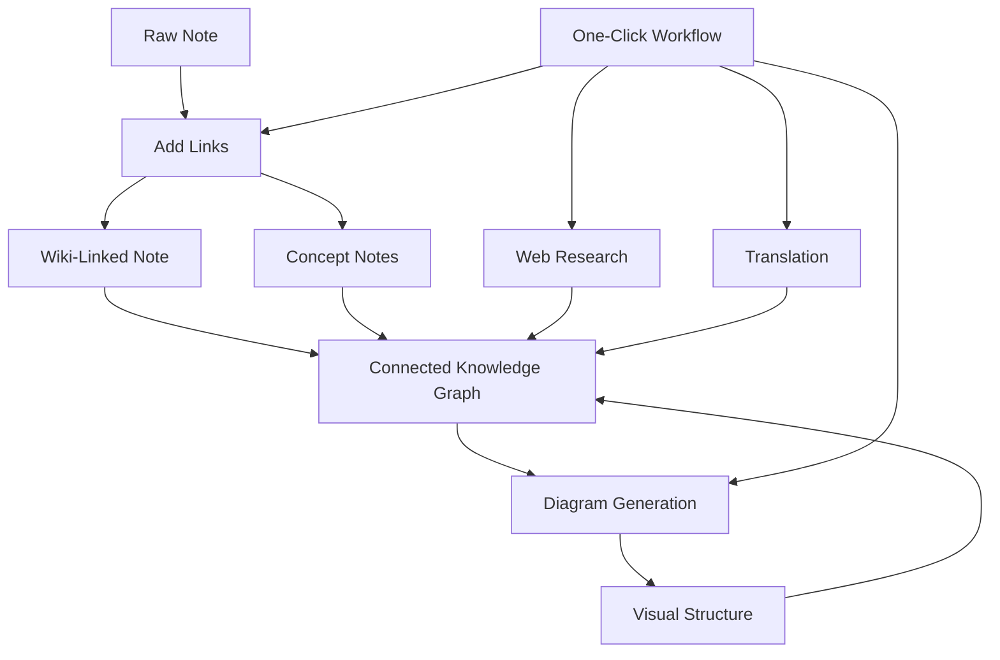

import TLDR from '@site/src/components/TLDR';

# Οδηγός Διαχείρισης Γνώσης με AI Obsidian

<TLDR>
**Notemd μετατρέπει την ανάγνωση που χρησιμοποιεί LLM σε διαρκή γνώση: οι σύνδεσμοι wiki συνδέουν τις έννοιες, οι σημειώσεις έννοιας δημιουργούν ένα ανακτήσιμο γράφο, η έρευνα φέρνει το Διαδίκτυο στο αποθετήριό σας, η μετάφραση διαλύει τα φραγμούς των γλωσσών, τα διαγράμματα καθιστούν ορατή τη δομή, και τα ροδόσχηματα συνδέουν τα πάντα με μία κλικ.** Αυτός ο οδηγός καλύπτει ολόκληρο το σύστημα — από ακατέργαστες σημειώσεις μέχρι μία συνδεδεμένη, οπτική, πολυγλωσσική βάση γνώσης.
</TLDR>

## Γιατί Διαχείριση Γνώσης με AI؟

Η παραδοσιακή σημειώσεωση δημιουργεί επίπεδα αρχεία. Ακόμη και με χειροκίνητους σύνδεσμους wiki, οι περισσότερες σημειώσεις παραμένουν ανακοπημένες. Notemd χρησιμοποιεί LLM για να αυτοματοποιήσει το στρώμα σύνδεσης:

- **LLM διαβάζουν το περιεχόμενό σας** και εντοπίζουν τι είναι σημαντικό — όρους, μέθοδους, άτομα, θεωρίες
- **Οι σύνδεσμοι εισάγονται αυτόματα** σε κάθε εμφάνιση έννοιας, όχι κρυμμένοι σε «δείτε επίσης»
- **Οι σημειώσεις έννοιας δημιουργούνται** ως ανεξάρτητα ανακτήσιμα αρχεία
- **Η έρευνα εμπλουτίζει τις σημειώσεις** με πληροφορίες από το Διαδίκτυο
- **Τα διαγράμματα καθιστούν ορατή τη δομή** — ψυχογραμμές, ροδόσχηματα, διαγράμματα δεδομένων από το ίδιο περιεχόμενο

Το αποτέλεσμα: ένας γράφος γνώσης που αυξάνεται με κάθε σημείωση που επεξεργάζεστε, όχι μόνο όταν θυμάστε να προσθέσετε σύνδεσμους.

## Ολόκληρο το Σύστημα



Κάθε βήμα είναι ανεξάρτητο. Χρησιμοποιήστε ένα ή όλα. Η πιο αποτελεσματική σειρά: **Προσθήκη Συνδέσμων → Σημειώσεις Έννοιας → Διαγράμματα**.

---

## 1. Σύνδεσμοι Wiki: Καθιστώντας τις Συνδέσεις Ευκρινείς

Οι σύνδεσμοι wiki είναι η ράχη ενός γράφου γνώσης. Notemd χρησιμοποιεί ένα LLM για να:

1. Διαβάστε το περιεχόμενο της σημείωσής σας (χωρισμός σε μέρη για μεγάλα έγγραφα)
2. Αναγνωρίστε τις βασικές έννοιες — δίνοντας προτεραιότητα συγκεκριμένων, τεχνικών όρων αντί για γενικά ουσιαστικά
3. Εισάγετε `[[wiki-links]]` σε κάθε εμφάνιση
4. Απενεργοποιήστε τους συνώνυμους ώστε τα "ML" και "Machine Learning" να μη δημιουργούν ξεχωριστά κόμβια

### Πότε να χρησιμοποιηθεί

- **Κάθε σημείωση >100 λέξεις** — οι πιο σύντομες σημείωσες παράγουν λίγες έννοιες
- **Έργα έρευνας, τεχνικά έγγραφα, σημειώσεις συναντήσεων** — πλούσια σε όρους ειδικού τομέα
- **Μετά το περιεχόμενο να γίνει σταθερό** — μην επεξεργάζεστε επανειλημμένα προσχέδια

### Βασικές ρυθμίσεις

| Παράμετρος | Συνιστώμενο | Γιατί |
|---------|-----------|-----|
| `addLinksProvider` | DeepSeek ή GPT-4o-mini | Καλή ακρίβεια σε χαμηλό κόστος |
| Απενεργοποίηση συνώνυμων | Έν | Προλαμβάνει διπλότυπα κόμβια |
| Παράθυρο πλαισίου | Παράγραφος | Ισορροπία μεταξύ ακρίβειας και κόστους |

→ [Εμβαθύς ανάλυση Wiki-Links](/docs/features/wiki-links)

---

## 2. Σημειώσεις Συνέπειας: Κόμβοι Γνώσης που μπορούν να ανακτηθούν

Οι Wiki-links συνδέουν ιδέες ενδοχρονικά, αλλά οι σημειώσεις συνέπειας καθιστούν κάθε ιδέα ανεξάρτητα ανακτήσιμη. Κάθε έννοια διαθέτει το δικό της `.md` αρχείο:

```markdown
# Machine Learning

## Linked From
- [[My Research Notes]]
- [[Neural Networks Explained]]
```

### Η Διαδικασία Ανάκτησης

Η εντολή LLM είναι πολύ δομημένη:
- Προσαρμόστε σε μορφή μονόσημου
- Προτιμήστε πολυλέξικες έννοιες αντί για μονόλεξικες ("Dielectric Relaxation" και όχι "Relaxation")
- Διαψάξτε τα σημεία αναφοράς/βιβλιογραφία
- Εξάγετε ως `CONCEPT:` γραμμές για διαπιστωσιμό παρασκευασμό

Οι έννοιες απομονώνονται μεταξύ των τμημάτων μέσω `Set<string>`. Τα LLM σφάλματα σε μεμονωμένα τμήματα δεν διακόπτουν τη λειτουργία.

### Αντίστροφες Σύνδεσεις

Όταν ενεργοποιηθούν, κάθε σημείωση συνέπειας παρακολουθεί ποιες πηγαίες σημειώσεις την αναφέρουν. Το εγγενές πάνελ αντίστροφων συνδέσεων του Obsidian δείχνει επίσης τις αντίστροφες σύνδεσεις.

### Διαγύριση διπλότυπων

Ο μηχανισμός απομονώσεων 4 βημάτων του Notemd πιάνει:
1. **Ακριβείς ισοφορίες** — σύγκριση ονομάτων αρχείων χωρίς να ληφθεί υπόψη η περιπτώση
2. **Πολυπληρωματικές μορφές** — "Models.md" έναντι "Model.md"
3. **Κανονικοποίηση συμβόλων** — "A-B.md" έναντι "A B.md"
4. **Περιέχομενο μονόλεξου** — "ML.md" σημειώνεται όταν υπάρχει "Machine Learning.md"

### Ρυθμίσεις κλειδιών

| Παράμετρος | Συνιστώμενο | Γιατί |
|---------|-----------|-----|
| `conceptNoteFolder` | `concepts/` ή `🧠 concepts/` | Διατηρεί το vault οργανωμένο |
| `extractConceptsAddBacklink` | Ένα | Επιτρέπει αντίστροφη αναζήτηση |
| `extractConceptsMinimalTemplate` | Απενεργό | Πλήρες πρότυπο με Linked From |
| Μοντέλο ανά εργασία | DeepSeek | Η εξαγωγή έννοιων δεν χρειάζεται ακριβά μοντέλα |
| Υποδυσμός συνώνυμων | Ένα | Η ίδια ρύθμιση επηρεάζει τόσο την προσδέση όσο και την εξαγωγή |

→ [Λεπτομερής εξέταση Concept Notes](/docs/features/concept-notes)

---

## 3. Έρευνα: Εισαγωγή του Web

Notemd ενσωματώνει αναζήτηση στο Web στο ρολόι καταγραφής σημειών σας:

1. **Δημιουργία ερωτήσεων** — το ονόματο ή η επιλογή της σημείωσής σας γίνεται ερώτηση αναζήτησης
2. **Αναζήτηση στο Web** — Tavily (συνιστώμενο, απαιτείται κλειδί API) ή DuckDuckGo (δωρεάν, χωρίς κλειδί)
3. **Συνοπτικοποίηση LLM** — τα αποτελέσματα αναζήτησης συνοψίζονται σε μία σχετική σύνοψη
4. **Προσθήκη στη σημείωση** — η σύνοψη προστίθεται στη θέση του κερσορίου ή ως νέα ενότητα

### Πότε να το χρησιμοποιήσετε

- Πριν επεξεργαστείτε ένα νέο θέμα — πάρτε πρώτα το πλαίσιο Web
- Όταν μία σημείωση concept χρειάζεται εμπλουτισμό — κάντε έρευνα και στη συνέχεια προσθέστε σύνδεσμους
- Για ανασκοπήσεις βιβλιογραφίας — κάντε μαζική έρευνα σε έναν φάκελο σημειών

### Βασικές ρυθμίσεις

| Παράμετρος | Συνιστώμενο | Γιατί |
|---------|-----------|-----|
| `researchProvider` | GPT-4o ή Claude | Η έρευνα χρειάζεται πιο αξιόπιστη συνοπτικοποίηση |
| Υπηρεσία αναζήτησης | Tavily | Καλύτερη σχετικότητα, ρυθμίσιμη βάθος |
| `maxResearchContentTokens` | 4000 | Ισορροπία μεταξύ βάθους και κόστους |

→ [Research deep dive](/docs/features/research)

---

## 4. Μετάφραση: Ανατροπή των γλωσσικών φραγμάτων

Notemd μεταφράζει σημειώσεις χρησιμοποιώντας το ρυθμισμένο LLM σας — όχι ένα ειδικό μηχάνημα μετάφρασης API. Αυτό σημαίνει:

- **Μετάφρασεις που λαμβάνουν υπόψη το πλαίσιο** — το LLM κατανοεί ολόκληρο το έγγραφο, όχι παρά πρόταση προς πρόταση
- **Διαχείριση τεχνικών όρων** — "gradient descent" παραμένει "梯度下降" και όχι "坡度向下"
- **Υποστήριξη σε ομάδες** — μεταφράστε ολόκληρο ένα φάκελο σημειώσεων σε μία επιχείρηση
- **Μοντέλο ανά εργασία** — χρησιμοποιήστε Gemini Flash για μετάφραση (γρήγορο, φθηνό, πολυγλωσσικό)

### Υποστήριξη γλωσσών

Το Notemd ίδιο υποστηρίζει 21 UI γλώσσες. Η γλώσσα προορισμού της μετάφρασης είναι ρυθμίσιμη ανά εργασία. Συνηθισμένες ζεύγη: EN↔ZH, EN↔JA, EN↔KO, EN↔DE, EN↔FR, EN↔ES.

→ [Translation deep dive](/docs/features/translation)

---

## 5. Διαγράμματα: Εμφάνιση της δομής

Ο πυλώνας διαγράμματος του Notemd βασίζεται πρώτα στις προδιαγραφές: το LLM παράγει ένα δομημένο `DiagramSpec` JSON, στη συνέχεια οι προσαρμογείς το μεταφράζουν στον στόχο του μορφάτο. Αυτό παράγει πιο αξιόπιστα αποτελέσματα σε σύγκριση με το να ζητήσετε από το LLM την ακατέργαστη Mermaid σύνταξη.

### Ανίχνευση προθέσεων

Το Notemd εξαγάγει τον καλύτερο τύπο διαγράμματος από το περιεχόμενο:

- **Πίνακες με αριθμούς** → διαγράμμα δεδομένων (Vega-Lite)
- **Λεξιλόγιο πελάτη/σερβιτού** → διάγραμμα αλληλουχίας (Mermaid)
- **Οντότητα/primαρική κλειδί** → διάγραμμα ER (Mermaid)
- **Βήμα/πορεία επεξεργασίας** → διάγραμμα ροής (Mermaid)
- **Λέξεις-κλειδιά για διάγραμμα έννοιας** → JSON Canvas (Obsidian native)
- **Προεπιλεγμένο** → διάγραμμα μυαλού (Mermaid)

### Rendering Chain

Primαρικό στόχος → fallback → fallback → HTML. Αν η σύνταξη Mermaid αποτύχει, επαναλαμβάνεται μία φορά με πληροφορίες σφάλματος στο LLM, και στη συνέχεια χρησιμοποιείται ένα ελάχιστο διάγραμμα.

### Key Settings

| Παράμετρος | Recommended | Γιατί |
|---------|-----------|-----|
| `enableExperimentalDiagramPipeline` | On | Καλύτερη ποιότητα μέσω συγκεκριμένων προδιαγραφών |
| `experimentalDiagramCompatibilityMode` | `best-fit` | Primαρικό στόχος ανά σκοπό |
| `summarizeToMermaidProvider` | GPT-4o ή Claude | Οι προδιαγραφές διαγράμματος απαιτούν χωρική λογική |
| `autoMermaidFixAfterGenerate` | On | Ανιχνεύει αυτόματα σφάλματα σύνταξης LLM |
| Ενίσχυση των τοπικών γνώσεων | Ένατο σε ειδικές περιοχές | Βελτιώνει την ακρίβεια με το πλαίσιο vault |

→ [Εμβαθύς ανάλυση διαγράμματων](/docs/features/diagrams)

---

## 6. Βήματα εργασίας: Αυτοματοποίηση με μία κλικ

Τα βήματα εργασίας συνδέουν πολλές εργασίες σε ένα μόνο κουμπί στην πλευρική γραμμή. Το μορφάτι DSL είναι:

```
task1 | task2 | task3
```

Παράδειγμα: `addLinks | extractConcepts | generateDiagram` — επεξεργάζεται μία σημείωση από ακατέργαστο κείμενο σε έναν πλήρως συνδεδεμένο, οπτικό κόμβο γνώσης με μία κλικ.

### Συνιστώμενα βήματα εργασίας

| Ροδική διαδικασία | Χειν | Χρήση |
|----------|-------|----------|
| Πλήρης διαδικασία | `addLinks \| extractConcepts \| generateDiagram` | Νέες σημειώσεις |
| Έρευνα πρώτα | `research \| addLinks` | Ανώνυμα θέματα |
| Πολυγλωσσικά | `translate \| addLinks` | Πολυγλωσσικές σημειώσεις |
| Διάγραμμα μόνο | `generateDiagram` | Γρήγορη οπτικοποίηση |

→ [Εμβαθύς ανάλυση Workflows](/docs/features/workflows)

---

## 7. LLM Παρόχοι: 36 επιλογές από Cloud σε Local

Notemd υποστηρίζει 36 παρόχους σε 4 τύπους μεταφοράς. Κύριες ομάδες:

- **Διεθνής cloud**: OpenAI, Anthropic, Google, Mistral, xAI
- **Cloud στην Κίνα**: DeepSeek, Qwen, Doubao, Moonshot, GLM, Baidu, SiliconFlow
- **Πύλες**: OpenRouter, GitHub Models, Hugging Face, Vercel
- **Local**: Ollama, LMStudio, OVMS — χωρίς κλειδί API, τα δεδομένα δεν φεύγουν από τον υπολογιστή σας

### Στρατηγική μοντέλου ανά εργασία

Η πιο οικονομικά αποδοτική ρύθμιση χρησιμοποιεί φθηνά μοντέλα για απλές εργασίες και ισχυρά μοντέλα για πολύπλοκες:

```
extractConcepts  → DeepSeek (fast, cheap, accurate enough)
addLinks          → DeepSeek or GPT-4o-mini
research          → GPT-4o or Claude (needs quality)
generateDiagram   → GPT-4o or Claude (needs spatial reasoning)
translate         → Gemini Flash (fast, multilingual)
```

→ [Επισκόπηση LLM Παρόχων](/docs/providers/overview)

---

## Κατάλογος ελέγχου για αρχή

1. **Εγκατάσταση Notemd** — [Community Plugins](/docs/getting-started/installation) (συνιστώμενο) ή χειροκίνητα
2. **Ρύθμιση παρόχου** — DeepSeek (πιο εύκολο), OpenAI, ή Ollama (δωρεάν)
3. **Επεξεργασία της πρώτης σας σημείωσης** — κλικ δεξί → "Επεξεργασία αρχείου (προσθήκη συνδέσμων)"
4. **Ρύθμιση φάκελου έννοιας** — Ρυθμίσεις → Notemd → Έξοδος → Φάκελος Έννοιας
5. **Απόσυρση έννοιών** — εκτελέστε "Απόσυρση έννοιών" στην ίδια σημείωση
6. **Δημιουργία διάγραμματος** — εκτελέστε "Δημιουργία διάγραμματος" για να οπτικοποιήσετε τις συνδέσεις
7. **Δημιουργία ροής εργασιών** — συνδέστε τα παραπάνω σε ένα κουμπί μίας κλικ

## Συνιστώμενες διαμόρφωσεις

### Student (Budget)

```
Provider: DeepSeek (free tier available)
Concept extraction: DeepSeek
Research: DuckDuckGo (free) + DeepSeek
Diagrams: Off (or legacy Mermaid)
Workflows: addLinks | extractConcepts
```

### Researcher (Quality)

```
Provider: GPT-4o (primary)
Concept extraction: DeepSeek (cost savings)
Research: GPT-4o + Tavily
Diagrams: best-fit mode, GPT-4o
Workflows: research | addLinks | extractConcepts | generateDiagram
```

### Privacy-First (Local Only)

```
Provider: Ollama (llama3 or qwen2.5:7b)
All tasks: Ollama
Research: DuckDuckGo (free, no API key)
Diagrams: legacy Mermaid mode
```

### Bilingual (ZH + EN)

```
Primary: DeepSeek (Chinese queries)
Translation: Google Gemini Flash
Research: Tavily + DeepSeek (Chinese search context)
Language output: per-task (extractConceptsLanguage: zh-CN)
```

---

## Common Patterns

### Pattern: Process a Research Paper

1. Import PDF content (or paste)
2. **Research** — προσδιορίστε τον ιστοτοπικό πλαίσιο για το θέμα
3. **Προσθήκη συνδέσμων** — εντοπίστε και συνδέστε βασικές έννοιες
4. **Απόσυρση έννοιών** — δημιουργήστε ανεξάρτητες σημείωσεις
5. **Δημιουργία διάγραμματος** — οπτικοποιήστε τη δομή του άρθρου

### Pattern: Daily Note Enrichment

1. Γράψτε καθημερινή σημείωση
2. **Προσθήκη Συνδέσμων** — συνδέει τις σημερινές ιδέες με υπάρχοντα έννοια
3. Οι σημειώσεις έννοιας ενημερώνονται αυτόματα με πίσω συνδέσμους

### Μοτίβο: Ανασκόπηση Βιβλιογραφίας

1. Δημιουργήστε φάκελο με άρθρα/σημειώσεις
2. **Προσθήκη Συνδέσμων σε Ομάδα** — επεξεργαστεί ολόκληρο τον φάκελο
3. **Απομονώσεις Έννοιες** — καθαρίζει τις σχεδόν παρόμοιες σημειώσεις
4. **Δημιουργία Διάγραμματος** — ψυχοχάρτης της ολόκληρης βιβλιογραφίας

---

*Notemd είναι ανοιχτού κώδικα (MIT) και λειτουργεί με Obsidian 0.15.0+ σε όλες τις πλατφόρμες. [Εγκαταστήστε τώρα](/docs/getting-started/installation) ή [δείτε στο GitHub](https://github.com/Jacobinwwey/obsidian-NotEMD).*
