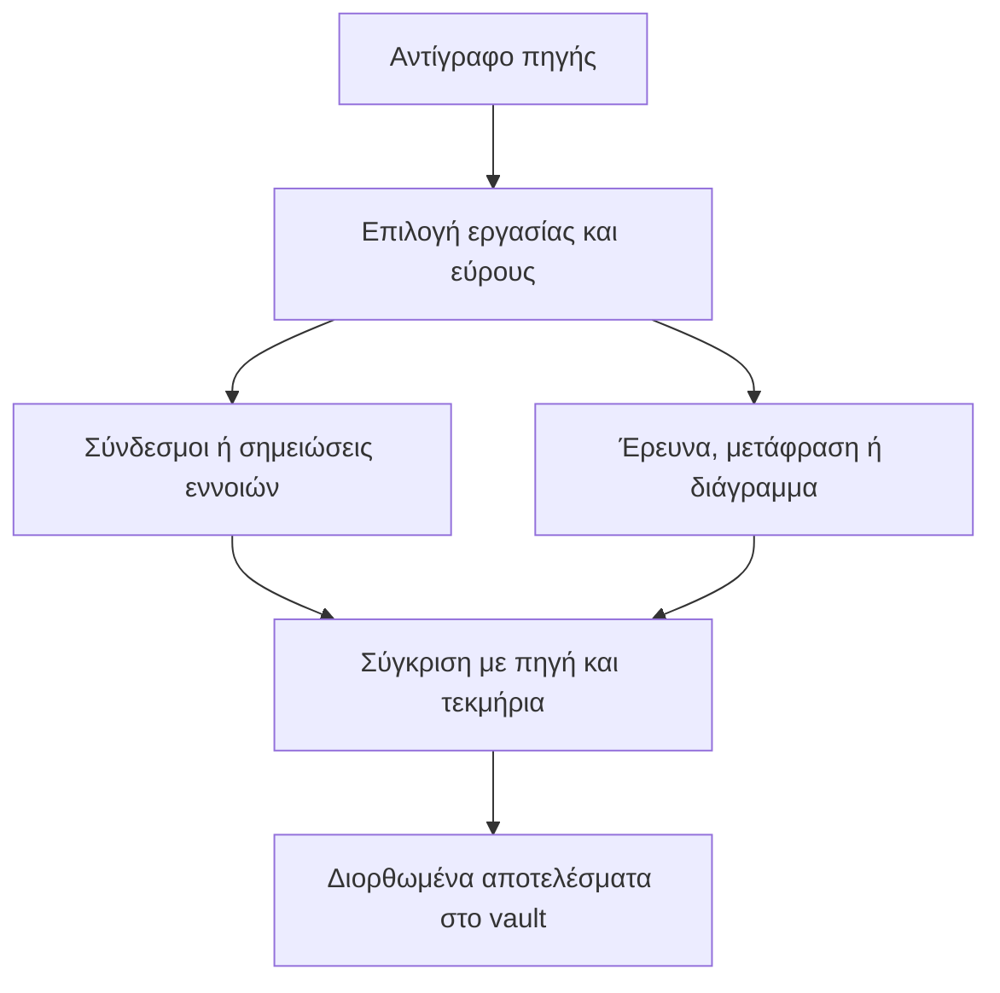

import TLDR from '@site/src/components/TLDR';

# Διαχείριση γνώσης με AI στο Obsidian

<TLDR>Μια χρήσιμη ροή γνώσης διακρίνει πηγές, παραγόμενο περιεχόμενο και δικές σας διορθώσεις. Το Notemd συνδέει, εξάγει έννοιες, ερευνά, μεταφράζει και δημιουργεί διαγράμματα ως ελέγξιμα αρχεία. Ξεκινήστε με μία πηγή και μετά αυτοματοποιήστε οριοθετημένο φάκελο.</TLDR>

## Ορίστε το επιθυμητό αποτέλεσμα

Επιλέξτε συνδεδεμένη σημείωση ανάγνωσης, έννοιες, τεκμηριωμένη έρευνα, μετάφραση ή διάγραμμα. Περισσότερα αρχεία και σύνδεσμοι δεν βελτιώνουν αυτόματα κατανόηση ή ανάκτηση. Αποφασίστε πώς θα ελέγχετε ορθότητα και θα βρίσκετε ξανά το υλικό.

## Η συνολική ροή


```mermaid
flowchart TD
    A[Αντίγραφο πηγής] --> B[Επιλογή εργασίας και εύρους]
    B --> C[Σύνδεσμοι ή σημειώσεις εννοιών]
    B --> D[Έρευνα, μετάφραση ή διάγραμμα]
    C --> E[Σύγκριση με πηγή και τεκμήρια]
    D --> E
    E --> F[Διορθωμένα αποτελέσματα στο vault]
```

Πρόκειται για διαθέσιμες εργασίες, όχι για όλα τα βήματα ενός προεπιλεγμένου κουμπιού. Διατηρήστε την πηγή και ελέγξτε τον προορισμό κάθε εργασίας πριν τις συνδυάσετε.

## 1. Σύνδεσμοι Wiki: ρητές συνδέσεις

Εκτελέστε **Process file (add links)** σε δοκιμαστική σημείωση. Ελέγξτε το γειτονικό `_processed.md`, τη χρησιμότητα των όρων και την πιστότητα παραθεμάτων, κώδικα και εξισώσεων.

Οι οδηγίες εστιασμένης μάθησης και συνωνύμων κατευθύνουν το μοντέλο χωρίς να επιβάλλουν ακριβή ισοδυναμία ή αριθμητικό όριο ομοιότητας. Για επαναλήψιμη αντιστοίχιση υπαρχόντων ονομάτων προτιμήστε ντετερμινιστική αντιστοίχιση τίτλων.

[Οδηγός συνδέσμων](./features/wiki-links)

## 2. Έννοιες: διαχωρισμός όρων και εξηγήσεων

Επιλέξτε φάκελο πριν από τον εντοπισμό. Η αυτόνομη εξαγωγή δημιουργεί μόνο τίτλους και δεν αλλάζει την πηγή. Για `Linked From` σε νέες αυτόνομες σημειώσεις ενεργοποιήστε συνδέσμους επιστροφής και απενεργοποιήστε το ελάχιστο πρότυπο.

Ο εντοπισμός και η παραγωγή εξήγησης είναι χωριστά. Το **Batch generate from titles** μπορεί να συμπληρώσει ήδη υπάρχουσες κατάλληλες σημειώσεις στον επιλεγμένο φάκελο. Χρησιμοποιήστε ξεχωριστό δοκιμαστικό φάκελο και ελέγξτε τις αναφερόμενες μετακινήσεις στο complete. Οι ευρετικές διπλοτύπων δεν αποδεικνύουν ίδια σημασία· επιβεβαιώστε πριν διαγράψετε.

[Οδηγός εννοιών](./features/concept-notes)

## 3. Έρευνα: διατήρηση τεκμηρίων

Επιλέξτε θέμα ή τον ενεργό τίτλο, ρυθμίστε Tavily ή DuckDuckGo και εκτελέστε **Research & summarize**. Κενό κλειδί Tavily δεν αλλάζει υπηρεσία. Ανοίξτε τις πηγές και ελέγξτε τους ισχυρισμούς της προστιθέμενης σύνοψης.

Η προαιρετική τοπική ανάκτηση προσθέτει αποσπάσματα εντός ορίων. Το ευρετήριο βασίζεται σε λέξεις και τα αποσπάσματα στέλνονται στο επιλεγμένο LLM. Δεν συνεπάγεται πλήρως τοπική ή εκτός δικτύου έρευνα.

[Οδηγός έρευνας](./features/research)

## 4. Μετάφραση: νόημα και δομή

Επιλέξτε γλώσσα και μεταφράστε το αρχείο. Το προεπιλεγμένο επίθημα είναι `_<language>.md`· υπάρχων στόχος μπορεί να αντικατασταθεί. Για ένα απόσπασμα, αντιγράψτε το πρώτα σε προσωρινή σημείωση.

Ελέγξτε όρους, αριθμούς, κώδικα, συνδέσμους και μαθηματική σημειογραφία. Ο χωρισμός μεγάλων αρχείων μπορεί να χάσει πλαίσιο. Οι 21 γλώσσες UI και 34 διαδρομές ιστοτόπου δεν τεκμηριώνουν ποιότητα κανενός ζεύγους μετάφρασης.

[Οδηγός μετάφρασης](./features/translation)

## 5. Διαγράμματα: επεξεργάσιμη πηγή

Επιλέξτε τύπο και συμβατή μορφή πηγής. Ελέγξτε προεπισκόπηση και αποθηκεύστε πηγή και τις απαιτούμενες υποστηριζόμενες SVG, PNG ή PDF εξαγωγές. Μια εικόνα δεν αποδεικνύει ότι άλλος επεξεργαστής διατηρεί κάθε σχέση.

Χρησιμοποιήστε τον υποστηριζόμενο κατάλογο. Το CircuitikZ έχει περιορισμένο πεδίο και ξεχωριστό έλεγχο μεταγλώττισης. Τα στατικά βέλη Drawnix μεταξύ κλάδων δεν εγγυώνται προσάρτηση μετά από μετακίνηση. Οι διορθώσεις πινάκων PowerPoint δεν καταργούν τη δυνατότητα εξαγωγής Mermaid/SVG ως εικόνας.

[Οδηγός διαγραμμάτων](./features/diagrams)

## 6. Ροές: αυτοματοποίηση ελεγμένων βημάτων

Η σύνταξη περιέχει όνομα, `::` και ID ενεργειών χωρισμένα με `>`. Προεπιλογή:

```text
One-Click Extract::process-current-add-links>batch-generate-from-titles>batch-mermaid-fix
```

Προσθέτει συνδέσμους, παράγει από τίτλους φακέλου και διορθώνει Mermaid. Δεν εισάγει γενική έρευνα ή παραγωγή διαγράμματος. Κάθε ενέργεια διατηρεί προϋποθέσεις και προορισμούς· δεν πρόκειται για αυθαίρετο αγωγό κειμένου.

Η προεπιλογή σταματά σε αναφερόμενο σφάλμα. Συνέχιση έχει νόημα μόνο αν τα επόμενα βήματα μπορούν να χρησιμοποιήσουν τις διαθέσιμες εισόδους. Η ακύρωση διατηρεί ολοκληρωμένα αρχεία και δεν είναι αναίρεση.

[Οδηγός ροών](./features/workflows)

## 7. Πάροχοι: πρωτόκολλο και φόρτος

Τα 36 προφίλ καλύπτουν πέντε οικογένειες πρωτοκόλλων. Συγκρίνετε endpoint, πρόσβαση μοντέλου, πολιτική δεδομένων και αποτελέσματα στην ίδια πηγή/οδηγία πριν μετρήσετε ταχύτητα ή κόστος.

Η δρομολόγηση ανά εργασία είναι αρχικά ανενεργή. Ενεργοποιήστε την όταν θέλετε διαφορετικά προφίλ και ελέγξτε κάθε εργασία πριν θεωρήσετε τη ροή τοπική.

[Επισκόπηση παρόχων](./providers/overview)

## Λίστα εκκίνησης

1. Εγκαταστήστε και κρατήστε αντίγραφο πηγών.
2. Ρυθμίστε και δοκιμάστε ακριβώς τον πάροχο/μοντέλο.
3. Επιλέξτε φάκελο εννοιών και διακριτούς προορισμούς.
4. Εκτελέστε μία εργασία σε αντίγραφο.
5. Συγκρίνετε και κρατήστε τις διορθώσεις.
6. Δοκιμάστε μικρό φάκελο και μερική ολοκλήρωση πριν συνθέσετε μεγαλύτερη ροή.

## Συνήθη σενάρια

### Ερευνητικό άρθρο

Μετατρέψτε σε Markdown με κατάλληλο εξωτερικό εργαλείο. Ελέγξτε πρώτα τύπους, πίνακες και εικόνες. Εντοπίστε έννοιες ή αποσπάσματα, ερευνήστε συγκεκριμένα ερωτήματα και δημιουργήστε διάγραμμα μόνο για επαληθεύσιμη σχέση. Κρατήστε αρχική δημοσίευση και διορθώσεις.

### Συλλογή εννοιών

Χρησιμοποιήστε αποκλειστικό φάκελο, ελέγξτε ορολογία και παράγετε εξηγήσεις για επιλεγμένο υποσύνολο. Κρατήστε αντίγραφο πριν από διπλότυπα. Περισσότερες έννοιες δεν αντικαθιστούν ακριβείς ορισμούς και χρήσιμη πλοήγηση.

### Ιδιωτικό υλικό

Ετοιμάστε τοπικό διακομιστή, μοντέλα και εξαρτήσεις, ελέγξτε ειδική δρομολόγηση και αποφύγετε έρευνα δικτύου όταν απαιτείται offline λειτουργία. Καθαρίστε διαγνωστικά πριν τα μοιραστείτε. Μια προεπιλεγμένη loopback διεύθυνση δεν εμποδίζει μεταγενέστερη απομακρυσμένη ρύθμιση.

### Διακοπείσα παρτίδα

Περιμένετε τον τερματισμό, διαβάστε αναφορά, εξετάστε ολοκληρωμένα και ανακτημένα αρχεία και συγκρούσεις. Επαναλάβετε μόνο την επιθυμητή εργασία. Ακυρωμένη κατάσταση δεν σημαίνει μηδενικό αποτέλεσμα· μη διαγράφετε συνοδευτικά αρχεία χωρίς έλεγχο αναφορών.

## Συνέχεια

- [Γρήγορη εκκίνηση](./getting-started/quick-start).
- [Παρτίδες](./advanced/batch-processing).
- [Προγραμματιστές](./developers/overview).
- [Agent](./agents/overview).
