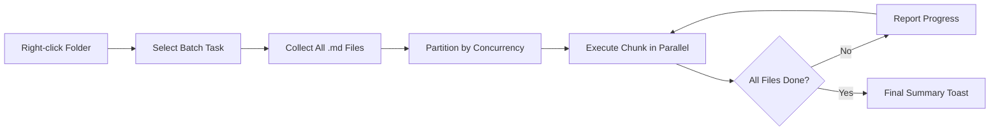

import TLDR from '@site/src/components/TLDR';

# Procesamiento por lotes

<TLDR>
**Notemd procesa carpetas completas en una sola acción, con concurrencia configurable y control de sobrescritura.** Haga clic con el botón derecho en una carpeta para agregar en lote enlaces wiki, extraer conceptos, realizar búsquedas o traducir todas las notas que contenga. Los límites de concurrencia evitan errores por límite de velocidad de API. Se informa el progreso por archivo. El comportamiento de sobrescritura es configurable: omitir los existentes, añadir al final o reemplazarlos. Los archivos fallidos se registran sin interrumpir el proceso en lote.

Esto forma parte de la [Obsidian Guía de Gestión del Conocimiento de IA](/docs/pillar-ai-knowledge).
</TLDR>

## Resumen general

El procesamiento por lotes convierte una carpeta de notas en una sola operación. En lugar de abrir cada nota y ejecutar comandos individualmente, se hace clic con el botón derecho en la carpeta y se selecciona la tarea. Notemd recorre cada archivo `.md`, aplica la acción elegida e informa sobre el progreso en tiempo real.

Esta función es esencial para la extracción de conocimiento en todo el sistema de bóvedas. Después de importar docenas de PDFs, por ejemplo, al usar primero batch-add-links y luego batch-extract-concepts, se puede construir el grafo de conocimiento en minutos en lugar de horas.

## Cómo funciona

### Modelo de Ejecución por Lotes

1. **Recopilación de archivos** -- Notemd escanea la carpeta de destino de forma recursiva (o solo en el nivel superior, según la configuración) y recopila todos los archivos `.md`.
2. **Particionamiento por concurrencia** -- Los archivos se dividen en trozos según la configuración `batchConcurrency`. Cada trozo se ejecuta en paralelo; los trozos se ejecutan de forma secuencial.
3. **Ejecución** -- Cada archivo se procesa utilizando la misma lógica que el comando para un solo archivo. Se respetan los ajustes del proveedor y del modelo por tarea.
4. **Informes de progreso** -- Una notificación tipo brindis se actualiza después de que cada archivo se complete, mostrando el progreso del `N / Total`.
5. **Manejo de errores** -- Si un archivo falla (error API, tiempo de espera de red, etc.), el error se registra y el lote continúa. El resumen final muestra los archivos que fallaron.
6. **Finalización** -- Un mensaje de resumen indica el total procesado, los éxitos y los fallos.

### Comportamiento de sobrescritura

Al procesar un archivo que ya contiene enlaces wiki, notas conceptuales o traducciones, el comportamiento de Notemd depende de la configuración de sobrescritura:

| Modo | Comportamiento |
|------|----------|
| **Saltar** | El contenido existente se deja sin cambios. Solo se procesan los archivos no modificados. |
| **Append** (predeterminado) | Se agrega nuevo contenido. Los enlaces de wiki, conceptos o traducciones existentes se conservan. |
| **Reemplazar** | El archivo se ha reprocesado por completo. Todas las modificaciones anteriores de Notemd se han sobrescrito. |

Para enlaces wiki en particular: si una nota ya contiene `[[wiki-links]]`, el modo **skip** la deja tal cual, mientras que **replace** vuelve a enviar toda la nota a LLM para insertar un enlace nuevo. Utilice **skip** para un procesamiento incremental y **replace** para volver a procesarla después de una actualización del modelo.

### Control de concurrencia

La configuración de `batchConcurrency` limita las llamadas paralelas a API. Esto evita errores de límite de velocidad (HTTP 429) al procesar carpetas grandes con proveedores que tienen cuotas estrictas.

| Concurrencia | Recomendado para | Impacto típico del límite de velocidad |
|-------------|----------------|---------------------------|
| `1` | Planes gratuitos, proveedores estrictos | Ninguno (serie) |
| `3` (predeterminado) | La mayoría de los proveedores de nube | Bajo |
| `5` | Ollama (local), niveles generosos | Ninguno / Bajo |
| `10` | Modelos locales con inferencia rápida | Ninguno |

Si encuentra errores 429 durante el procesamiento por lotes, reduzca la concurrencia a 1 o 2.

## Configuración

| Configuración | Predeterminado | Efecto |
|---------|---------|--------|
| `batchConcurrency` | `3` | Llamadas paralelas máximas de API durante las operaciones en carpetas |
| `batchOverwriteExisting` | `false` | Sobrescribir el contenido existente de Notemd. `false` = modo de anexión. |
| `batchSkipProcessed` | `false` | Omitir archivos que ya contengan marcadores Notemd (por ejemplo, enlaces de wiki). |
| `batchRecursive` | `true` | Incluir subdirectorios al escanear la carpeta |
| `enableStableApiCall` | `false` | Habilitar la lógica de reintentos (hasta 4 intentos) por archivo durante el procesamiento en lotes |

### Modelos por tarea en lote

Cada operación por lotes utiliza el modelo correspondiente a cada tarea. batch-add-links emplea `addLinksProvider`, batch-research utiliza `researchProvider`, y así sucesivamente. Esto significa que puede asignar modelos económicos para operaciones de gran volumen y reservar modelos costosos para tareas sensibles a la calidad.

## Ejemplo

Tienes una carpeta `papers/` que contiene 40 notas de investigación importadas. Quieres agregar enlaces wiki y extraer conceptos de todas ellas:

1. Haga clic con el botón derecho en la carpeta `papers/`
2. Seleccione **"Notemd: Procesar carpeta (agregar enlaces)"**
3. Notemd escanea la carpeta, encuentra 40 archivos `.md` y los procesa 3 a la vez (concurrency por defecto)
4. Una notificación de progreso muestra: `12/40 files processed...`
5. Después de ~3 minutos, un brindis de resumen informa: `39 succeeded, 1 failed (API timeout on paper-37.md)`
6. Repite con **"Notemd: Procesar carpeta (extraer conceptos)"** para crear notas de concepto para los 40 en total

El archivo que falló ha sido registrado. Puede volver a ejecutarlo solo en ese archivo más tarde.

## Consejos

- **Comience con baja concurrencia** -- Si no está seguro de los límites de velocidad de su proveedor, empiece con `1` e incremente gradualmente.
- **Utilice el modo de salto para actualizaciones incrementales** -- Después del primer lote completo, cambie a `batchSkipProcessed: true` para que solo se procesen las notas nuevas en ejecuciones posteriores.
- **Habilitar llamadas estables API** -- `enableStableApiCall: true` agrega una lógica de reintentos que se recupera de errores de red transitorios durante lotes largos.
- **Volver a ejecutar después de las actualizaciones del modelo** -- Si cambia a un modelo mejor, establezca `batchOverwriteExisting: true` y vuelva a ejecutarlo para obtener enlaces y conceptos mejorados.

---

## Próximos pasos

- [Flujos de trabajo](/docs/features/workflows) -- Conectar tareas por lotes en botones de la barra lateral de un solo clic
- [Custom Prompts](/docs/advanced/custom-prompts) -- Personalizar prompts para extracción por lotes
- [Solución de problemas](/docs/advanced/troubleshooting) -- Corregir errores de límite de velocidad y fallos de conexión durante ejecuciones en lote
- [LLM Proveedores](/docs/providers/overview) -- Referencia de configuración del modelo por tarea
