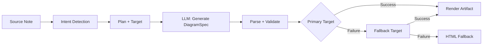
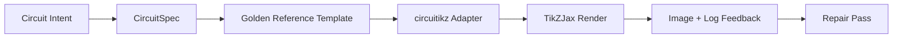

import TLDR from '@site/src/components/TLDR';

# Diagramas

<TLDR>
**Notemd genera diagramas a partir de tus notas a través de un proceso basado en especificaciones primero.** El LLM produce un JSON `DiagramSpec` independiente del renderizador, y luego adaptadores especializados lo convierten en salida en formato Mermaid, JSON Canvas, Vega-Lite, HTML, HTML/SVG editables, Draw.io, Drawnix o circuitikz restringido. Soporta 9 tipos de intención, cadenas de fallback automáticas, vista previa en tiempo real con exportación a SVG/PNG/PDF, verificación semántica y generación mejorada con conocimiento local.
</TLDR>

Esto forma parte de la [Obsidian Guía de Gestión del Conocimiento de IA](/docs/pillar-ai-knowledge).

## Arquitectura: Pipeline basado en especificaciones primero

Notemd nunca pide al LLM que genere directamente la sintaxis Mermaid/Vega/Canvas. En su lugar:



**¿Por qué priorizar la especificación?** Los LLM generan con frecuencia sintaxis inválida en el renderizador (Mermaid en particular). Un `DiagramSpec` estructurado puede validarse antes de la renderización, y la misma especificación puede utilizarse para varios renderizadores como alternativas.

## Tipos de diagramas compatibles

| Intentar | Renderizador principal | Soluciones de respaldo | Caso de uso |
|--------|-----------------|-----------|----------|
| `mindmap` | Mermaid | HTML | Desglose jerárquico de temas |
| `flowchart` | Mermaid | HTML | Flujos de proceso, árboles de decisión |
| `sequence` | Mermaid | HTML | Interacciones cliente-servidor, protocolos |
| `classDiagram` | Mermaid | HTML | Relaciones entre clases OOP |
| `erDiagram` | Mermaid | HTML | Esquemas de base de datos, relaciones entre entidades |
| `stateDiagram` | Mermaid | HTML | Máquinas de estado, modelos de ciclo de vida |
| `canvasMap` | JSON Canvas | Mermaid → HTML | Mapas conceptuales, grafos de conocimiento |
| `dataChart` | Vega-Lite | Mermaid → HTML | Barra, línea, área, dispersión, circular, tablas |
| `circuit` | circuitikz | none | Diagramas circuiticos restringidos a partir de cargas de datos `CircuitSpec` validadas |

## Detección de intención

Notemd infiere el mejor tipo de diagrama a partir del contenido de tu nota utilizando una puntuación basada en palabras clave:

| Intentar | Desencadenadores | Confianza |
|--------|----------|------------|
| `dataChart` | Tablas, celdas numéricas, palabras clave de métricas/tendencias, porcentajes | 0.88 |
| `sequence` | Vocabulario de solicitud/respuesta (4+ coincidencias) o marcadores `->`/`=>` | 0.82 |
| `erDiagram` | Clave primaria, clave foránea, entidad, esquema (2+ coincidencias) | 0.80 |
| `stateDiagram` | Estado, transición, pendiente, en ejecución, fallido (3+ coincidencias) | 0.76 |
| `flowchart` | Pasos numerados (2+) o vocabulario de if/then/else/flujo de trabajo | 0.74 |
| `canvasMap` | Mapa conceptual, grafo de conocimiento, espacial, clúster | 0.72 |
| `circuit` | circuitikz, TikZJax, circuit, schematic, CMOS, NMOS, PMOS, MOSFET, VDD/GND, `vin`/`vout` | 0.78 |
| `mindmap` | Solución de respaldo por defecto | 0.55 |

Sobrescribir con la configuración **Tipo de diagrama preferido**, el selector de barra lateral o una opción explícita de la paleta de comandos.

## Selección de destino de renderizado

El pipeline experimental basado en especificaciones ahora cuenta con dos controles independientes:

Establece **Preferred render target** en **Auto** como valor predeterminado del planificador, o elige explícitamente Mermaid, JSON Canvas, Vega-Lite, HTML, Editable HTML/SVG, Draw.io, Drawnix o Circuitikz. Esta opción solo se aplica a los comandos de artefacto y vista previa. El comando estándar **Summarise as Mermaid diagram** sigue orientado a la salida compatible con Mermaid para que los flujos de trabajo existentes basados en Markdown no cambien de formato de forma silenciosa.

Esta separación es importante porque ahora una intención `flowchart` puede renderizarse como Mermaid para notas en Markdown, como HTML como fallback fiable, como HTML/SVG editables para edición posterior, o como artefactos de origen Draw.io/Drawnix acompañados de imágenes SVG para revisión. Una intención `circuit` redirige a Circuitikz y requiere un `CircuitSpec` validado; no se trata de una solicitud de texto TikZ arbitrario.
## Uso

### Generar un diagrama

1. Abrir una nota
2. Ejecuta **"Notemd: Generar diagrama"** desde la paleta de comandos
3. Notemd detecta la intención, genera la especificación, renderiza y guarda el artefacto

**Archivos de salida por destino:**

| Objetivo | Extensión | Patrón de nombre de archivo |
|--------|-----------|------------------|
| Mermaid | `.md` | `{note}_summ.md` |
| JSON Canvas | `.canvas` | `{note}_diagram.canvas` |
| Vega-Lite | `.json` | `{note}_diagram.json` |
| HTML | `.html` | `{note}_diagram.html` |
| Editable HTML/SVG | `.html` | `{note}_diagram.html` |
| Draw.io | `.drawio` + `.drawio.svg` + `.drawio.md` | `{note}_diagram.drawio` junto con archivos complementarios de revisión |
| Drawnix | `.drawnix` + `.drawnix.svg` + `.drawnix.md` | `{note}_diagram.drawnix` junto con archivos complementarios de revisión |
| Circuitikz | `.tex` + `.tex.svg` + `.tex.md` | `{note}_diagram.tex` junto con archivos complementarios de revisión |

### Vista previa de un diagrama

1. Ejecuta **"Notemd: Vista previa del diagrama"**
2. Se abre un modal con el diagrama renderizado
3. Exporta como SVG, PNG o PDF utilizando los botones de la barra de herramientas

La opción **Auto-open preview** está disponible en la configuración: después de la generación, el modal de vista previa se abre automáticamente.

La exportación de vista previa en formato PNG y PDF utiliza el PPI de vista previa configurado. El valor predeterminado es 300 PPI, y los valores superiores a 600 PPI se limitan a 600. SVG mantiene su tamaño vectorial. Los artefactos de origen como `.drawio`, `.drawnix` y `.tex` pueden incluir un archivo complementario `previewSvg` para que Obsidian pueda mostrar y exportar imágenes revisables sin incrustar diagram.net, Drawnix, LaTeX ni TikZJax durante la ejecución del plugin.

El modal de vista previa también cuenta con un panel de diagnósticos de artefactos. Los generadores y las pruebas de funcionamiento pueden adjuntar `RenderArtifact.diagnostics`; el modal muestra un resumen de los diagnósticos con los conteos de errores/advertencias/informaciones, seguido de la gravedad, el tipo de diagnóstico, el mensaje y sugerencias para solucionarlo, todo junto a la vista previa. Ese mismo resumen se muestra en las entradas del historial que tienen soporte para diagnósticos, por lo que es posible comparar intentos repetidos de pruebas de funcionamiento con circuitikz sin tener que abrir cada entrada por separado. En el caso de los artefactos que cuentan con contenido de origen pero no pueden renderizarse de forma inline ni a través de la ruta del iframe HTML, el modal ahora recurre a una vista previa que muestra únicamente el contenido de origen en lugar de forzar el uso de un iframe vacío. Esto permite que las pruebas de compilación/renderizado de circuitikz, las verificaciones de tokens de texto SVG, las pruebas de captura de pantalla en blanco PNG, los informes de solapamiento de glifos basados únicamente en rutas y los futuros informes de solapamiento tengan una interfaz de usuario visible, sin convertir a TikZJax o LaTeX en una dependencia obligatoria en tiempo de ejecución ni hacer que se considere que el texto de origen ya es un renderizado visual verificado.

### Modo Legacy Mermaid

Cuando `enableExperimentalDiagramPipeline` está apagado, Notemd envía una solicitud directa Mermaid al LLM. Esto omite por completo el proceso de especificaciones. Si el proceso experimental falla, se vuelve a este modo.

## Backend de renderizado

### Mermaid

6 adaptadores (mapa mental, diagrama de flujo, secuencia, ER, clase, estado) traducen `DiagramSpec` a sintaxis Mermaid. Después de la generación, `mermaid.parse()` valida el resultado. Si la validación falla:

1. **LLM intento de repetición** — un intento con el mensaje de error Mermaid como contexto
2. **Solución de respaldo mínima**: un diagrama básico Mermaid basado en los IDs de nodos de la especificación

**Legacy Mermaid Fixer** repara automáticamente los errores de sintaxis comunes de LLM: normalización de directivas note, escape de etiquetas de pipe, reposicionamiento de puntos y coma, comillas inteligentes, flechas con doble guion, desajustes en formas, y mucho más.

### JSON Canvas

Produce formato Obsidian JSON Canvas con disposición espacial:
- Nodos posicionados por profundidad (x = profundidad × 420) e índice (y = índice × 170)
- Ancho estimado a partir de la longitud de la etiqueta
- Aristas con `fromSide: 'right'`, `toSide: 'left'`, `toEnd: 'arrow'`

### Vega-Lite

Crea especificaciones completas de Vega-Lite v5 JSON con codificación automática:
- **Gráficos cartesianos** (barras/líneas/área/puntos/dispersión): canales x + y + color para múltiples series
- **Pie**: theta = y (cuantitativo), color = x (nominal)
- **Tabla**: fila = x, texto = y + columna = serie

Los parches de temas oscuro y claro se fusionan profundamente antes de la compilación.

### HTML

Solución de respaldo universal. Documento autónomo HTML que incluye:
- Encabezados meta CSP
- Modo claro/oscuro a través de `prefers-color-scheme`
- Etiquetas UI localizadas para 20 ubicaciones.
- Secciones: héroe, estructura (árbol de nodos), relaciones, llamadas destacadas, tablas de series de datos

### Editable HTML/SVG

Objetivo de figura explícito para flujos de trabajo de exportación editables. Proyecta `DiagramSpec` en un `SemanticFigureModel` determinista y luego genera un documento autónomo HTML con grupos SVG incrustados que contienen anotaciones al estilo Draw.io:

- `data-drawio-type`, `data-drawio-id` y `data-drawio-role` en nodos semánticos
- `data-drawio-source` y `data-drawio-target` en bordes semánticos
- identificadores estables de nodo/borde después de la normalización de espacios en blanco y el manejo de colisiones
- sin scripts, sin fuentes externas y sin recursos remotos

Este destino aún no es intencionalmente la ruta predeterminada del planificador. Está disponible como destino de renderizado explícito mientras que la ruta del producto verifica el comportamiento de edición en herramientas reales.

### Límites de exportación de Draw.io y Drawnix

La implementación actual mantiene el soporte para editores de terceros en los límites del artefacto, al tiempo que sigue exponiendo destinos de renderizado explícitos:

| Objetivo | Contrato | Dependencia en tiempo de ejecución |
|--------|----------|--------------------|
| Draw.io | XML `mxfile` descomprimido y determinista proveniente de `SemanticFigureModel`, además de archivos de revisión en formatos SVG/PNG/PDF | No hay nada en el tiempo de ejecución del plugin ni en CI |
| Drawnix | Un subconjunto mínimo de JSON `.drawnix` que utiliza los elementos `geometry` y `arrow-line`, además de archivos de revisión en formatos SVG/PNG/PDF | No hay nada en el tiempo de ejecución del plugin ni en CI |

El compromiso es intencional: Notemd puede verificar etiquetas visibles, identificadores estables y cobertura de primitivas soportadas sin incluir en el complemento a Diagrams.net Desktop, Drawnix, Plait ni el estado del editor exclusivo para navegadores.

### Dirección circuitikz / TikZJax

Los diagramas de circuitos no representan el mismo problema que los diagramas de flujo genéricos. El objetivo sintáctico correcto para los circuitos eléctricos suele ser **circuitikz**, representado en Obsidian mediante plugins como TikZJax. TikZJax puede cargar paquetes como `circuitikz`, `pgfplots`, `tikz-cd` y `chemfig`, lo que lo hace atractivo para notas de física, circuitos, química y matemáticas.

El riesgo es que el TikZ generado en bruto por LLM sea frágil:

- la topología de un circuito complejo puede ser eléctricamente correcta pero visualmente ilegible;
- Los cables y etiquetas superpuestos pueden hacer que una lista de redes correcta sea inutilizable para las notas de estudio.
- La falta de preámbulos del paquete, anclajes incorrectos o nombres de componentes inválidos pueden impedir la renderización.
- La retroalimentación del renderizador suele ser a nivel de imagen, mientras que LLM genera geometría a nivel de texto.

La mejor arquitectura es tratar circuitikz como un destino de diagrama restringido, y no como una instrucción de formato libre:



El modelo de primera clase debe describir la topología del circuito y el diseño por separado:

| Capa | Responsabilidad | Ejemplo |
|-------|----------------|---------|
| Topología | nodos eléctricos y conexiones de componentes | `VDD -> RD -> drain(M1)`, `source(M1) -> GND` |
| Diseño | colocación en la cuadrícula, orientación, carriles de enrutamiento | `M1 at (3,2.2)`, entrada izquierda, salida derecha |
| Estilo | paquete, convención de voltaje, etiquetas, anclajes | `\begin{circuitikz}[american voltages]` |
| Validación | Registro de compilación, faltan anclajes, verificaciones de superposición/captura de pantalla | TikZJax/Diagnósticos de LaTeX más revisión visual |

### Prototipo actual circuitikz

Notemd ahora incluye el primer prototipo de repositorio restringido para esta dirección. Está intencionalmente fuera de línea y limitado por plantillas:

```bash
npm run diagram:export-circuitikz -- --input cmos-inverter.json --output cmos-inverter.tex
```

El prototipo añade un límite restringido por `CircuitSpec` y un exportador determinista para seis familias de referencia estándar:

En la pipeline experimental de diagramas, ahora también es posible acceder a esto mediante `intent: "circuit"` y el destino de renderizado `circuitikz`. El `DiagramSpec` generado solo puede incluir `circuitSpec` cuando el intento sea de tipo circuito. `CircuitikzRenderer` escribe la misma fuente `.tex` determinista y adjunta un archivo de vista previa en SVG derivado de esa topología de circuito validada, lo que permite la vista previa en Obsidian además de la exportación en formatos SVG/PNG/PDF. Dicho archivo de vista previa no es el resultado de una compilación con LaTeX/TikZJax; las pruebas reales del renderizador siguen correspondiendo a los comandos específicos de prueba que se indican a continuación.

Para las plantillas estándar compatibles, `layoutHints.inputSide` y `layoutHints.outputSide` siguen siendo controles exclusivamente para la presentación. Permiten mover la ubicación determinista de los puertos de entrada/salida, pero no modifican la firma de la topología ni permiten realizar una pasada de reparación para redirigir el circuito.

| Tipo de circuito | Referencia dorada | Garantía actual |
|--------------|------------------|-------------------|
| `common-source-amplifier` | `common-source-nmos-v1` | Valida `VDD -> R_D -> M1.D`, `vin -> M1.G`, `M1.S -> GND` y `M1.D -> vout` antes de escribir LaTeX |
| `cmos-inverter` | `cmos-inverter-v1` | Valida la topología PMOS sobre NMOS, entrada de puerta compartida, salida de drenaje compartida, `VDD -> MP.S`, y `MN.S -> GND` antes de escribir LaTeX |
| `cmos-buffer` | `cmos-buffer-v1` | Valida dos etapas en cascada de inversores, el nodo intermedio `vmid`, el estado restaurado `vout`, y las líneas compartidas VDD/GND antes de escribir LaTeX |
| `cmos-transmission-gate` | `cmos-transmission-gate-v1` | Valida los dispositivos de paso PMOS/NMOS en paralelo entre `vin` y `vout` con controles complementarios `phib` / `phi` antes de escribir LaTeX |
| `cmos-nand2` | `cmos-nand2-v1` | Valida el tirón ascendente en paralelo con PMOS, el tirón descendente en serie con NMOS, las entradas duales `va` / `vb` y `vout` antes de escribir LaTeX |
| `cmos-nor2` | `cmos-nor2-v1` | Valida la resistencia de elevación en serie PMOS, la resistencia de bajada en paralelo NMOS, las entradas duales `va` / `vb` y `vout` antes de escribir LaTeX |

Esto no es un generador general de TikZ. No acepta código TikZ arbitrario, no compila LaTeX, no llama a TikZJax, no inspecciona capturas de pantalla durante el tiempo de ejecución del plugin, ni ejecuta procesos automáticos de reparación basados en imágenes. Esas funcionalidades forman parte de etapas posteriores.

El comando Diagrama de vista previa puede volver a abrir los artefactos de código circuitikz guardados directamente cuando la extensión del archivo es `.tex` o `.tikz` y el código contiene `\usepackage{circuitikz}` o `\begin{circuitikz}`. Esa ruta es una vista previa exclusiva del código circuitikz: la ventana modal muestra el código fuente, los diagnósticos, los controles de copiar/guardar y los metadatos de historial, pero no compila LaTeX ni llama a TikZJax durante el tiempo de ejecución del complemento.

El mismo límite de vista previa solo de código fuente ahora abarca los artefactos guardados Draw.io y Drawnix. Los archivos `.drawio` se aceptan cuando se asemejan a Draw.io XML (`mxfile` o `mxGraphModel`), y los archivos `.drawnix` se aceptan cuando son Drawnix JSON con `type: "drawnix"` y un array `elements`. El plugin aún no incrusta diagrams.net ni el host de pizarra blanca Drawnix; estas vistas previas muestran el código fuente, los diagnósticos y el historial de artefactos sin incluir un editor visual dentro del plugin.

Para la reparación que preserva la topología, pase la especificación previa a la reparación como referencia antes de aceptar un candidato reparado:

```bash
npm run diagram:export-circuitikz -- --input repaired-cmos-inverter.json --topology-reference cmos-inverter.json --output cmos-inverter.tex
```

La protección de reparación utiliza `createCircuitTopologySignature` y `assertCircuitTopologyUnchanged` para comparar `circuitKind`, `goldenReferenceId`, redes, IDs/tipos/terminales de componentes y extremos de conexiones no dirigidas antes de generar la salida. Las etiquetas, el texto del título, las indicaciones de diseño, el orden de conexión y las etiquetas de conexión se ignoran intencionalmente. Un candidato que añada un componente corto o reconecte un terminal fallará con `Circuit topology drift detected` antes de que se escriba el archivo `.tex`.

El CLI ahora puede analizar un registro de compilación existente de LaTeX/TikZJax sin ejecutar un compilador:

```bash
npm run diagram:export-circuitikz -- --input cmos-inverter.json --output cmos-inverter.tex --compile-log cmos-inverter.log --diagnostics-output cmos-inverter.diagnostics.json
```

Este camino de diagnóstico informa sobre paquetes faltantes como `circuitikz.sty`, claves TikZ/circuitikz desconocidas, errores en la sintaxis de rutas de TikZ como la falta de puntos y coma, argumentos no procesados debido a llaves desequilibradas o etiquetas sin cerrar, secuencias de control no definidas, errores genéricos de LaTeX, paradas de emergencia y advertencias de sobrecarga en `\hbox`. Sigue basándose en registros: la ejecución local de LaTeX/TikZJax y las verificaciones de calidad similar a capturas de pantalla siguen siendo tareas futuras separadas.

Para las verificaciones de funcionamiento del mantenedor, el mismo CLI puede ejecutar opcionalmente un renderizador configurado explícitamente sin analizar comandos de shell:

```bash
npm run diagram:export-circuitikz -- --input cmos-inverter.json --output cmos-inverter.tex --compile-executable pdflatex --compile-arg -interaction=nonstopmode --compile-arg -halt-on-error --compile-arg -output-directory={outputDir} --compile-arg {tex} --expected-artifact {outputDir}/{jobName}.pdf
```

El ejecutor de compilación utiliza `shell: false`, expande los placeholders `{tex}`, `{outputDir}` y `{jobName}` en valores de array de argumentos, lee el `{jobName}.log` generado y devuelve `compileExecution` junto con `compileDiagnostics` en la salida CLI JSON. `--compile-executable` es únicamente la ruta del binario o del wrapper del renderizador; las opciones del renderizador deben incluirse en valores repetidos de `--compile-arg`. Los ejecutables vacíos fallan como `compile-executable-invalid`, los binarios faltantes fallan como `compile-executable-not-found`, y las cadenas de ejecutables en formato de comando de shell reciben indicaciones para dividir los argumentos de modo que Windows, Linux y macOS cumplan con el mismo contrato de ejecución directa. Con `--expected-artifact`, también informa sobre `compileExecution.renderSmoke` y falla en el CLI si el renderizador no crea un artefacto no vacío. Aún así, no incluye LaTeX, no convierte a TikZJax en una dependencia en tiempo de ejecución del plugin ni realiza reparaciones visuales a nivel de captura de pantalla.

Si el artefacto esperado es `.svg`, la verificación de funcionamiento básico profundiza un nivel más:

```bash
npm run diagram:export-circuitikz -- --input cmos-inverter.json --output cmos-inverter.tex --compile-executable dvisvgm --compile-arg ... --expected-artifact {outputDir}/{jobName}.svg --expected-svg-text v_{in} --expected-svg-text v_{out}
```

SVG smoke verifica la raíz `<svg>`, dimensiones positivas o `viewBox`, al menos un elemento de dibujo visible después de excluir elementos ocultos o transparentes, cualquier token de texto solicitado, elementos evidentes fuera de `viewBox`, etiquetas `<text>` / `<tspan>` posicionadas y superpuestas de forma evidente, y etiquetas de texto evidentes que se superponen a elementos de dibujo a través de `render-svg-label-overlap`. El texto esperado se busca en el texto visible y en metadatos de accesibilidad decodificados como `aria-label`, `<title>` y `<desc>`, de modo que los renderizadores que conservan etiquetas semánticas fuera de `<text>` aún pueden cumplir con la verificación de tokens de texto sin necesidad de OCR. La fase de geometría ahora utiliza geometría sensible a transformaciones para atributos comunes de grupos y elementos `transform`, por lo que se comprueban cajas SVG traducidas, escaladas, rotadas, sesgadas o transformadas mediante matrices después de la composición de las transformaciones. Cubre los límites exactos de arcos para extremos de arco A/a, los límites exactos de curvas Bezier para extremos de curvas C/S/Q/T, límites SVG sensibles al grosor del trazo y verificaciones de superposición de etiquetas, geometría de dibujo `polyline` / `polygon`, y también resuelve la colocación de glifos basados únicamente en rutas a partir de referencias `<use href="#...">`, de modo que las etiquetas convertidas en rutas de glifos reutilizables aún pueden fallar en las verificaciones de lienzo delimitado cuando la geometría del glifo supera los límites de `viewBox`. Varias etiquetas `tspan` posicionadas bajo un mismo padre `<text>` se comparan como cajas de etiqueta separadas, lo que permite detectar salidas de estilo LaTeX SVG que de otro modo combinarían etiquetas distintas en un único nodo de texto. Las cajas `text` y `tspan` posicionadas respetan los valores `start`, `middle` y `end`, por lo que las etiquetas centradas y alineadas a la derecha pueden activar diagnósticos de superposición de texto/texto y etiqueta-con-dibujo sin requerir un diseño de texto de nivel navegador. Las rutas de glifos solo de definición dentro de `<defs>` no se consideran elementos de dibujo visibles, pero sus propios atributos `transform` locales a la definición se aplican antes de la colocación `<use>`, de modo que las definiciones de glifos escaladas o reflejadas no se subestimen. La verificación etiqueta-con-dibujo utiliza una pequeña tolerancia para cajas de dibujo y los valores declarados `stroke-width`, por lo que cables delgados, cables gruesos y contornos de componentes poligonales pueden considerarse posibles fallos en la legibilidad de las etiquetas cuando su trazo visible llega hasta una etiqueta. Las etiquetas de glifos basadas únicamente en rutas resueltas a partir de `<use href="#...">` también se comparan con cajas de dibujo y fallan con `render-svg-path-glyph-overlap` cuando la geometría de glifos reutilizables superpone cables o componentes. Si un renderizador convierte etiquetas en glifos de ruta reutilizables en lugar de `<text>` buscables y no conserva metadatos de accesibilidad, el informe de smoke registra `pathOnlyGlyphUseCount` y falla en el token de texto solicitado a través de `render-svg-text-path-only` en lugar de fingir que la etiqueta simplemente está ausente. Otros fallos se reportan a través de `render-svg-invalid`, `render-svg-dimension-missing`, `render-svg-no-visible-elements`, `render-svg-text-missing`, `render-svg-out-of-bounds`, `render-svg-text-overlap`, `render-svg-label-overlap` o `render-svg-path-glyph-overlap`. Las verificaciones de tokens de texto y superposición solo deben considerarse pruebas estructurales para renderizadores que conservan etiquetas como texto SVG buscable o metadatos de accesibilidad; las salidas SVG basadas únicamente en rutas aún necesitan la siguiente prueba de captura de pantalla/OCR para demostrar la legibilidad visual de las etiquetas, y esta fase de smoke tampoco asegura una cobertura completa de SVG rutas.

Los grupos y elementos ocultos SVG se omiten de manera consistente durante el conteo de elementos visibles y la recopilación de geometría. Los atributos o estilos en línea `display:none`, `visibility:hidden`, `visibility:collapse`, y en general `opacity:0` no pueden hacer que un artefacto de renderizado que de otro modo estaría vacío pase las pruebas de salida visible.

Las definiciones de glifos solo con ruta pueden ser rutas directas o contenedores de grupos/símbolos dentro de `<defs>`. La fase de procesamiento de humo resuelve la geometría de las rutas hijos desde `<g id="...">` y `<symbol id="...">` antes del posicionamiento en `<use>`, de modo que la salida de los glifos envueltos sigue alimentando a `pathOnlyGlyphUseCount`, las verificaciones de lienzo delimitado y `render-svg-path-glyph-overlap`.

El analizador de rutas también registra el inicio de los subrutas y reinicia el punto actual en `Z/z`, de modo que los comandos relativos después de un subruta cerrada continúan desde el punto correcto SVG en lugar de generar diagnósticos falsos `render-svg-out-of-bounds`.

La misma pasada de geometría sigue la gramática SVG para decimales con punto decimal y signos más explícitos, por lo que las coordenadas compactas dvisvgm como `.5`, `-.5` o `+.5` permanecen fraccionarias durante las verificaciones de límites en lugar de convertirse en geometría fuera de límites falsa o ser ignoradas.

Si el renderizador emite `.png`, la misma ruta del artefacto esperado se convierte en la primera captura de pantalla para las pruebas: Notemd decodifica archivos PNG de color indexado de 1/2/4/8 bits sin entrelazado, archivos PNG en escala de grises de 1/2/4/8/16 bits, y archivos PNG en escala de grises con canal alfa/RGB/RGBA de 8/16 bits. Las imágenes en color indexado y en escala de grises subbyte soportan muestras compactadas; las imágenes en color indexado también admiten datos PLTE y tRNS opcionales; las imágenes en escala de grises/RGB soportan muestras transparentes tRNS. Las muestras directas de 16 bits se normalizan al mismo espacio de comparación RGBA de 8 bits utilizado por las pruebas. La prueba verifica que las dimensiones sean positivas, registra los límites del primer plano como `foregroundBounds`, registra la densidad del primer plano dentro de ese cuadro como `foregroundDensity`, falla con `render-png-blank` cuando cada píxel visible coincide con el color de fondo en la esquina superior izquierda, falla con `render-png-content-clipped` cuando el contenido del primer plano toca los bordes de la imagen, falla con `render-png-foreground-too-small` cuando una captura de pantalla grande tiene menos de cuatro píxeles en el primer plano, y falla con `render-png-foreground-dense` cuando los píxeles del primer plano son excepcionalmente densos dentro de un cuadro delimitador no trivial. Los formatos PNG no soportados causan fallo con `render-png-unsupported`, junto con indicaciones específicas para archivos PNG entrelazados Adam7 o profundidades de color indexado no soportadas. Esto permite detectar capturas de pantalla en blanco, recortes evidentes del lienzo, huellas del primer plano subrenderizadas, fallas por sobrepoblación a nivel de píxeles y configuraciones incorrectas de exportación de PNG del renderizador, sin necesidad de depender de herramientas específicas de cada plataforma. Aún no se trata de reconocimiento de etiquetas a nivel OCR, detección precisa de superposición de texto ni reparación de imágenes que preserve su topología.

Cuando los diagnósticos indican un compilación fallida o una ejecución de render-smoke fallida, el CLI también puede redactar un informe de reparación que preserve la topología:

```bash
npm run diagram:export-circuitikz -- --input cmos-inverter.json --topology-reference cmos-inverter.json --output cmos-inverter.tex --compile-log cmos-inverter.log --repair-brief-output cmos-inverter.repair-brief.json
```

El resumen de reparación utiliza el esquema `notemd.circuitikz.repair-brief.v1` e incluye la fuente `CircuitSpec`, la firma de topología, los diagnósticos de compilación/renderizado, las ediciones permitidas, las ediciones de topología prohibidas, los siguientes pasos de verificación y un `repairPrompt` estructurado. El rol del prompt es `topology-preserving-circuitikz-repair`; su lista `diagnosticFocus` se deriva de los diagnósticos de compilación/renderizado, y sus `acceptanceCriteria` requieren validación del candidato además de comprobaciones recientes de compilación y renderizado. Es el formato de transferencia para un bucle de reparación posterior, no una afirmación de que Notemd ya realice reparaciones visuales autónomas.

Después de que se genere un candidato de reparación, el mismo CLI puede validarlo contra el resumen antes de escribir el resultado:

```bash
npm run diagram:export-circuitikz -- --input repaired-cmos-inverter.json --repair-brief cmos-inverter.repair-brief.json --output repaired-cmos-inverter.tex
```

`--repair-brief` verifica la firma de la topología candidata según el resumen y es exclusivo de `--topology-reference`. Superar esta prueba solo demuestra la preservación de la topología; el candidato aún necesita diagnósticos de compilación y pruebas render-smoke.

El resultado de `--repair-brief` también incluye evidencia de `repairAcceptance` con el esquema `notemd.circuitikz.repair-acceptance.v1`. Indica que las puertas `topology-signature`, `compile-diagnostics` y `render-smoke` son de tipo `passed`, `failed` o `missing`; muestra `remainingChecks`; y mantiene `readyForVisualAcceptance` como falso hasta que la ejecución del candidato incluya toda la evidencia requerida.

Utilice `--repair-acceptance-output` con `--repair-brief` cuando la evidencia de CI o de lanzamiento necesite un archivo JSON duradero:

```bash
npm run diagram:export-circuitikz -- --input repaired-cmos-inverter.json --repair-brief cmos-inverter.repair-brief.json --output repaired-cmos-inverter.tex --repair-acceptance-output repaired-cmos-inverter.repair-acceptance.json
```

Para obtener pruebas de lanzamiento o de mantenimiento, ejecute cada familia dorada compatible a través del ejecutor de fixtures agregados:

```bash
npm run diagram:smoke-circuitikz -- --output-dir docs/export/circuitikz-smoke --compile-executable pdflatex --compile-arg -interaction=nonstopmode --compile-arg -halt-on-error --compile-arg -output-directory={outputDir} --compile-arg {tex} --expected-artifact {outputDir}/{jobName}.pdf
```

El ejecutor utiliza `docs/maintainer/fixtures/circuitikz/common-source-nmos-v1.json`, `docs/maintainer/fixtures/circuitikz/cmos-inverter-v1.json`, `docs/maintainer/fixtures/circuitikz/cmos-buffer-v1.json`, `docs/maintainer/fixtures/circuitikz/cmos-transmission-gate-v1.json`, `docs/maintainer/fixtures/circuitikz/cmos-nand2-v1.json` y `docs/maintainer/fixtures/circuitikz/cmos-nor2-v1.json`, llama al mismo camino del exportador sin shell para cada fixture, y devuelve un informe agregado JSON con los valores `compileExecution` y `compileDiagnostics` por fixture. Sigue siendo una orden de mantenimiento, no una dependencia en tiempo de ejecución de un plugin.

Cuando una máquina de mantenimiento aún no tiene un renderizador configurado, ejecute el mismo comando de fixture sin `--compile-executable` y mantenga explícitamente la puerta de entorno:

```bash
npm run diagram:smoke-circuitikz -- --output-dir docs/export/circuitikz-smoke --report-output docs/export/circuitikz-smoke/renderer-availability.json
```

Ese camino sigue escribiendo los artefactos de fixture determinístico `.tex`, pero devuelve `ok: false` con `rendererAvailability.status` establecido en `missing-configuration` y un diagnóstico `compile-executable-invalid`. Trátelo únicamente como evidencia de disponibilidad del renderizador; no constituye una prueba de compilación, render-smoke ni aceptación visual.

### Forma de prompt de referencia dorada

Para un uso a corto plazo, proporcione una referencia dorada renderizable antes de solicitar una variante del circuito. Un prompt restringido debe conservar el preámbulo, la escala de coordenadas, el estilo de anclaje y las convenciones de enrutamiento:

```latex
\usepackage{circuitikz}
\begin{document}
\begin{circuitikz}[american voltages]
\draw
  (3,5) node[vcc]{$V_{DD}$}
  to [R, l=$R_D$] (3,3)
  to [short, *-o] (5,3) node[right]{$v_{out}$}
  (3,3) to [short] (3,2.2)
  node[nmos, anchor=D] (M1) {$M_1$}
  (M1.S) to [short] (3,0.5)
  node[ground]{}
  (M1.G) to [short, -o] (0.8,2.2)
  node[left]{$v_{in}$};
\draw
  (3,0.5) node[below right]{$S$};
\end{circuitikz}
\end{document}
```

Para un inversor CMOS, la instrucción debe solicitar una topología explícita además de restricciones de diseño, y no solo “dibuje un inversor CMOS”.

- Mantener `VDD` en la parte superior, `GND` en la inferior, entrada a la izquierda y salida a la derecha;
- utiliza `pmos` por encima de `nmos`, con puertas compartidas y drenajes compartidos;
- mantenga el nodo de salida en la unión de drenaje y márquelo con `*-o`;
- Utilice anclajes nombrados (`PM1.G`, `NM1.G`, `PM1.D`, `NM1.D`) en lugar de coordenadas inferidas visualmente;
- Evite los cables diagonales o que se crucen, a menos que sea necesario desde el punto de vista eléctrico.

### Progreso actual y próximas fases

| Área | Estado actual | Próximo movimiento |
|------|----------------|-----------|
| Diagramas generales | Pipeline basado en especificaciones implementado para Mermaid, JSON Canvas, Vega-Lite, HTML | Seguir ampliando la cobertura de verificación semántica |
| Figuras editables | Se han implementado los límites de artefacto `editable-html-svg`, Draw.io XML y Drawnix JSON | Añada primitivas más avanzadas solo después de que las pruebas demuestren su editabilidad |
| Soporte CLI | `npm run diagram:export-artifact` exporta evidencias editables en HTML/SVG, Draw.io, Drawnix, Circuitikz, así como archivos SVG/PNG/PDF para revisión, a partir de un `DiagramSpec` validado | Se añaden pruebas básicas específicas para cada destino cuando se lanzan nuevos destinos |
| circuitikz | `DiagramSpec(intent: "circuit", circuitSpec) -> CircuitikzRenderer -> circuitikz` exporta plantillas estándar para fuentes comunes, inversores CMOS, `cmos-buffer` / `cmos-buffer-v1`, `cmos-transmission-gate` / `cmos-transmission-gate-v1`, `cmos-nand2` / `cmos-nand2-v1`, y `cmos-nor2` / `cmos-nor2-v1`; muestra las opciones de intención de la interfaz de usuario y de destino de renderizado, escribe código TeX junto con vistas previas en SVG/PNG/PDF, valida la topología antes de generar el resultado, analiza los registros de compilación, permite ejecutar renderizadores locales explícitos mediante `--expected-artifact`, y mantiene una opción de fallback basada únicamente en el código fuente además de diagnósticos de las vistas previas visibles a través de `RenderArtifact.diagnostics` y el modal de vista previa | Se añadirá reconocimiento de etiquetas al nivel de OCR para texto visual que solo contiene rutas, comprobaciones de superposición precisas a nivel de píxel, una cobertura más amplia de rutas SVG cuando sea necesario, instalación y detección automáticas de renderizadores solo si es posible mantenerlas como opcionales, y ejecución automática de reparaciones que preservan la topología |
| Integración de TikZJax | Seleccionar servidor de renderizado para la pantalla del lado Obsidian | Déjalo opcional; no haga que TikZJax sea una dependencia obligatoria en tiempo de ejecución del plugin |

## Configuración

| Configuración | Predeterminado | Efecto |
|---------|---------|--------|
| `enableExperimentalDiagramPipeline` | `false` | Alternar entre el enfoque basado en especificaciones y el enfoque heredado Mermaid |
| `experimentalDiagramCompatibilityMode` | `'legacy-mermaid'` | `'legacy-mermaid'` = Mermaid únicamente; `'best-fit'` = destinos nativos + alternativas |
| `preferredDiagramIntent` | `undefined` (automático) | Sobrescribir la detección automática de intención |
| `preferredDiagramRenderTarget` | `undefined` (automático) | Sobrescribir el renderizador de artefactos, incluyendo Draw.io, Drawnix y Circuitikz |
| `summarizeToMermaidLanguage` | `'en'` | Idioma de destino para las etiquetas del diagrama |
| `summarizeToMermaidProvider` / `Model` | DeepSeek | LLM por tarea para la generación de diagramas |
| `autoMermaidFixAfterGenerate` | (de constantes) | Ejecutar automáticamente el corrector heredado en la salida de Mermaid |
| `enableLocalKnowledgeForDiagramGeneration` | `false` | Aumentar el origen con conocimiento del bóveda local |

### Aumento de conocimiento local

Cuando está activado, Notemd obtiene fragmentos de contexto relevantes de la base de conocimientos local de tu bóveda (basada en MiniSearch) y los añade al principio del markdown de origen. La nota de ampliación indica: "solo como referencia adicional; mantén la estructura principal fiel a la nota original".

### Modos de compatibilidad

- **`legacy-mermaid`**: Todas las intenciones se redirigen a Mermaid. Las intenciones que no son Mermaid (canvasMap, dataChart) se envían forzadamente a `flowchart` o `mindmap`. No hay cadena de respaldo.
- **`best-fit`**: Cada intención se dirige a su destino nativo. Si el principal falla, se sigue la cadena de respaldo (por ejemplo, Vega-Lite → Mermaid → HTML).

## Vista previa y exportar

| Acción | Método |
|--------|--------|
| SVG exportar | Construtor para Canvas: `mermaid.render()` / `vega.View.toSVG()` / SVG |
| Exportación a PNG | SVG → Imagen → Canvas / rasterizador de vista previa a la resolución por pulgadas configurada → ArrayBuffer PNG |
| Exportación a PDF | SVG → imagen rasterizada a la resolución por pulgadas configurada → PDF de una sola página |
| Guardar fuente | Contenido del artefacto en bruto guardado con extensión específica del destino |
| Vista previa solo de origen | Artefactos no en línea con el contenido de origen mostrado como código además de diagnósticos, sin renderizado de iframe |
| Auditoría semántica | Se verifican Mermaid, JSON Canvas, Vega-Lite, HTML/SVG editables, Draw.io, Drawnix y circuitikz con restricciones mediante `scripts/diagram-semantic-verification.js` además de pruebas del renderizador y la CLI |

**Caché**: RenderCache utiliza una clave determinística JSON de `{spec, target, theme}`. La deduplicación en tiempo real evita renders duplicados.

## Consejos

- **Comience con el modo `best-fit`**: genera la mejor salida visual para cada tipo de intención
- **Utilice modelos potentes para diagramas complejos**: los diagramas de flujo y los diagramas ER se benefician de GPT-4o o Claude
- **Habilitar conocimiento local** para diagramas específicos del dominio: el contexto relevante del almacén mejora la precisión
- **Configurar `autoMermaidFixAfterGenerate`** — Los errores de sintaxis Mermaid son comunes sin él
- **El corrector heredado es completo**: si la vista previa de Mermaid falla, ejecutar manualmente el comando del corrector suele resolverlo

---

## Próximos pasos

- 🔗 [Enlaces de Wiki](./wiki-links) — Cómo se vinculan los conceptos de forma incrustada
- 📝 [Notas de concepto](./concept-notes) — Extraer conceptos para el material de origen del diagrama
- 🔍 [Investigación](./research) — Ampliar diagramas con datos de fuentes web
