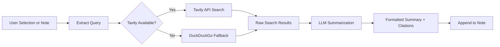

import TLDR from '@site/src/components/TLDR';

# Investigación y Búsqueda en la Web

<TLDR>
**Notemd consulta la web e inserta directamente en tus notas los resultados resumidos por LLM.** Tavily API es el backend de búsqueda principal; DuckDuckGo funciona como solución alternativa sin configuración. Los resultados se resumen con citas de fuentes y se añaden bajo un encabezado `## Research`. Permite la investigación en una sola nota, la investigación en carpetas por lotes y la selección de modelo por tarea para el paso de resumen.

Esto forma parte de la [Obsidian Guía de Gestión del Conocimiento de IA](/docs/pillar-ai-knowledge).
</TLDR>

## Resumen general

La función de investigación es una de las integraciones más potentes de Notemd: cierra el ciclo entre la lectura, la búsqueda y la escritura. En lugar de pasar a un navegador para buscar un término desconocido, basta con resaltarlo y dejar que Notemd realice la búsqueda, genere un resumen y añada los resultados, todo dentro de su bóveda segura.

El proceso es completamente configurable. Usted elige el proveedor de búsqueda, el LLM que escribe el resumen, y si los resultados se añaden a la nota activa o se escriben en archivos separados. El modo por lotes le permite investigar todas las notas de una carpeta con un solo clic.

## Cómo funciona

### Pipeline de Búsqueda y Resumen



1. **Extracción de consultas** -- Notemd extrae los términos de búsqueda de su selección o del título de la nota.
2. **Búsqueda en la web**: primero se intenta Tavily. Si no está configurada ninguna clave API, se utiliza automáticamente DuckDuckGo (no se requiere clave).
3. **LLM resumen** -- Los resultados de búsqueda en bruto se envían al LLM configurado, el cual genera un resumen conciso con citas de fuentes incrustadas.
4. **Append** -- El resumen formateado se agrega debajo de un encabezado `## Research` en la nota activa.

### Tavily contra DuckDuckGo

| Aspecto | Tavily | DuckDuckGo |
|--------|--------|------------|
| Clave API | Requerido (disponible la versión gratuita) | No es necesario |
| Calidad del resultado | Mayor (diseñado específicamente para IA) | Adecuado para consultas generales |
| Límites de tasa | Plan gratuito generoso | Sujeto a limitación de velocidad |
| Configuración | `tavilyApiKey` en la configuración | Configuración cero -- retroceso automático |

### Investigación de carpetas por lotes

Haga clic con el botón derecho en una carpeta y seleccione **"Notemd: Carpeta de investigación"**. Cada archivo `.md` en la carpeta se procesa secuencialmente (o en paralelo hasta el nivel de concurrencia configurado). Cada nota recibe su propio resumen de investigación.

## Configuración

| Configuración | Predeterminado | Efecto |
|---------|---------|--------|
| `tavilyApiKey` | `''` | Tavily API clave. Cuando está vacía, se utiliza exclusivamente DuckDuckGo. |
| `researchProvider` / `researchModel` | DeepSeek | LLM por tarea para resumir los resultados de búsqueda |
| `maxResearchContentTokens` | `4000` | Presupuesto de tokens para el contenido enviado a LLM. El exceso se trunca. |
| `researchAppendToNote` | `true` | Añadir resumen a la nota de origen. Si es falso, se crea un archivo separado. |
| `researchLanguage` | `'en'` | Idioma de salida para la investigación resumida |

### Recomendación de modelo por tarea

La investigación se beneficia de un modelo que maneja contenido multilingüe y genera prosa bien estructurada. Considere:

- **DeepSeek** -- predeterminado, económico, buena calidad
- **GPT-4o** -- resúmenes de mayor calidad, mayor costo
- **Gemini Flash** -- rápido y económico, adecuado para consultas sencillas

## Ejemplo

Estás leyendo un artículo sobre los *mecanismos de atención de transformer* y te encuentras con un término desconocido: *codificación posicional relativa*. En lugar de dejar Obsidian:

1. Resaltar **"codificación posicional relativa"**
2. Haz clic con el botón derecho --> **"Notemd: Investigar y resumir"**
3. Notemd busca en la web, resume los principales resultados y agrega:

```markdown
## Research

### Relative Positional Encoding

Relative positional encoding is a method used in transformer models
where positional information is expressed as relative distances between
tokens rather than absolute positions. Introduced by Shaw et al. (2018),
it improves generalization to unseen sequence lengths compared to
absolute encodings (Vaswani et al., 2017).

Sources:
- [Shaw et al., Self-Attention with Relative Position Representations (2018)](https://arxiv.org/abs/1803.02155)
- [Transformer Positional Encoding Overview](https://example.com/transformer-pos-enc)
```

El resumen ahora forma parte de su bóveda, es buscable, se puede enlazar y es accesible sin conexión.

## Consejos

- **Establezca una clave Tavily para obtener los mejores resultados**: incluso la versión gratuita ofrece una mayor relevancia que el DuckDuckGo en bruto.
- **Utilice un modelo de resumen capaz**; los modelos económicos pueden simplificar excesivamente contenido técnico detallado.
- **Investigación por lotes** después de una lectura inicial para llenar las lagunas en muchas notas a la vez.
- **Revisar los resúmenes añadidos** -- LLMs pueden generar detalles falsos de la fuente. Verifique las afirmaciones clave.

---

## Próximos pasos

- [Notas de concepto](./concept-notes) -- Extraer y conservar términos clave de los resultados de investigación
- [Wiki-Links](./wiki-links) -- Conecta conceptos derivados de investigaciones en todo tu almacén
- [Traducción](./translation) -- Traducir resúmenes de investigación a otro idioma
- [LLM Proveedores](/docs/providers/overview) -- Configurar el modelo utilizado para la resumen
