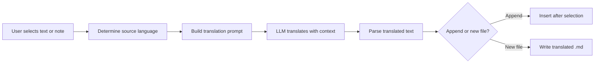

import TLDR from '@site/src/components/TLDR';

# Traducción

<TLDR>
**Notemd traduce texto entre más de 21 idiomas mediante la tecnología de traducción de LLM.** Permite la traducción de selección individual, la traducción de notas completas y la traducción de carpetas por lotes. Cada tarea de traducción puede utilizar un proveedor y modelo dedicados a través de las configuraciones específicas para esa tarea. El idioma de salida se puede configurar de forma independiente del idioma UI. Los resultados se añaden o se escriben en un archivo nuevo según sus preferencias.

Esto forma parte de la [Obsidian Guía de Gestión del Conocimiento de IA](/docs/pillar-ai-knowledge).
</TLDR>

## Resumen general

La traducción en Notemd no es una búsqueda en un diccionario; se trata de una traducción consciente del contexto, impulsada por LLM. El modelo analiza todo el párrafo o nota, preservando el tono, la terminología del área y la estructura de las oraciones. Esto genera resultados de mayor calidad que los servicios de traducción frase por frase, especialmente para textos técnicos, académicos y creativos.

La función admite tres ámbitos: selección, nota activa y toda la carpeta. Combinada con la selección de modelo por tarea, puedes utilizar un modelo rápido (Gemini Flash) para traducciones informales y un modelo potente (Claude Sonnet) para contenido sensible a las matices, sin tener que cambiar tu proveedor global.

## Cómo funciona

### El comando Translate



1. **Detección de origen** -- El LLM infiere el idioma de origen a partir del contenido. No es necesario especificarlo manualmente.
2. **Construcción de la solicitud** -- Notemd crea una solicitud que incluye el idioma objetivo, una sugerencia opcional de dominio y el contenido a traducir.
3. **Traducción de LLM** -- Los procesos configurados `translateProvider` / `translateModel` procesan la solicitud. El modelo mantiene el formato Markdown, los enlaces wiki y los bloques de código.
4. **Salida** -- El texto traducido se agrega debajo del original o se escribe en un archivo nuevo dentro del almacén.

### Pares de idiomas

Notemd admite cualquier par de idiomas que soporte el LLM subyacente. Los pares más comunes incluyen:

| Fuente | Objetivo | Calidad típica |
|--------|--------|----------------|
| Inglés | Chino (Simplificado) | Excelente |
| Chino | Inglés | Excelente |
| Inglés | Japonés | Muy bueno |
| Inglés | Alemán / Francés / Español | Muy bueno |
| Cualquiera compatible | Cualquiera compatible | Dependiente del modelo |

La configuración `translateLanguage` controla el **idioma de salida**. El idioma de origen se detecta automáticamente.

### Selección de modelo por tarea

La calidad de la traducción varía significativamente según el modelo. Notemd le permite asignar un modelo dedicado exclusivamente para la traducción:

| Modelo | Velocidad | Calidad | Precio | Mejor para |
|-------|-------|--------|------|----------|
| `gemini-2.0-flash-exp` | Rápido | Bien | Bajo | Casual, alto volumen |
| `gpt-4o-mini` | Rápido | Bien | Bajo | Búsquedas rápidas |
| `deepseek-chat` | Mediano | Bien | Muy bajo | Presupuesto multilingüe |
| `claude-3-5-sonnet` | Mediano | Excelente | Mediano | Técnico / académico |
| `gpt-4o` | Mediano | Excelente | Mediano | Prosa sensible a las matices |

### Traducción de carpetas por lotes

Haga clic con el botón derecho en una carpeta y seleccione **"Notemd: Traducir carpeta"** para traducir todas las notas de esa carpeta. Cada archivo se procesa de forma independiente. La configuración de concurrencia controla cuántos archivos se traducen en paralelo.

## Configuración

| Configuración | Predeterminado | Efecto |
|---------|---------|--------|
| `translateProvider` / `translateModel` | DeepSeek | Proveedor dedicado para tareas de traducción |
| `translateLanguage` | `'en'` | Idioma de salida objetivo |
| `translationAppendToNote` | `true` | Añadir el texto traducido debajo del original. Si es falso, crear un archivo nuevo. |
| `batchConcurrency` | `3` | Número de archivos procesados en paralelo durante la traducción por lotes |

## Ejemplo

Estás leyendo una nota de investigación en chino y deseas una versión en inglés:

1. Abre la nota
2. Haz clic con el botón derecho --> **"Notemd: Traducir archivo actual"**
3. Notemd detecta chino, lo traduce al idioma de destino configurado (inglés) y agrega:

```markdown
## Translation (English)

The experimental results show that the proposed method achieves
a 12% improvement in F1 score compared to the baseline, primarily
due to the enhanced feature extraction module described in Section 3.
```

El texto chino original permanece intacto por encima de la traducción. El encabezado `## Translation` mantiene ambas versiones en el mismo archivo para una referencia fácil.

## Consejos

- **Utilice Gemini Flash para trabajar con grandes volúmenes**: es la opción más rápida y económica para la traducción en lote de carpetas extensas.
- **Preservar enlaces wiki** -- La instrucción de Notemd ordena a LLM mantener `[[wiki-links]]` intacto en la traducción. Verifique después de la traducción, ya que algunos modelos ocasionalmente los desempaquetan.
- **Establecer el idioma de salida de forma explícita**: la detección automática funciona para el código fuente, pero siempre configure `translateLanguage` para evitar ambigüedades respecto al destino.
- **Traducir por lotes las notas de concepto** -- si su carpeta de conceptos está en un idioma y usted la necesita en otro, la traducción a nivel de carpeta lo hace en un solo paso.

---

## Próximos pasos

- [Investigación](./research) -- Buscar y resumir en cualquier idioma, luego traducir los resultados
- [Flujos de trabajo](./workflows) -- Traducción en cadena con enlaces a wikis o extracción de conceptos
- [Procesamiento por lotes](/docs/advanced/batch-processing) -- Concorriencia y comportamiento de sobrescritura para operaciones en carpetas
- [LLM Proveedores](/docs/providers/overview) -- Elija el mejor modelo para su par de idiomas
