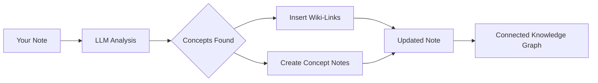

import TLDR from '@site/src/components/TLDR';

# Enlaces de wiki

<TLDR>
**Notemd agrega automáticamente `[[wiki-links]]` a los conceptos clave en tus notas.** El LLM lee tu contenido, identifica términos importantes en contexto e inserta enlaces wiki al estilo Obsidian en cada aparición. Opcionalmente crea archivos de notas de concepto con enlaces de retroceso. Soporta la supresión de sinónimos, la integridad de los enlaces al renombrar o eliminar y el modo de extracción pura (sin modificación de archivos). A diferencia de Auto Link, que solo coincide con títulos de notas existentes, Notemd utiliza inteligencia artificial para identificar nuevos conceptos y crear las notas correspondientes. Esto forma parte de la [Obsidian Guía de Gestión del Conocimiento con IA](/docs/pillar-ai-knowledge).
</TLDR>

## Resumen general

El enlazado a wikis es la función principal de Notemd. Convierte texto plano en un grafo de conocimiento interconectado mediante:

1. **Analizando tu nota** con un LLM
2. **Identificación de conceptos clave** (términos, personas, métodos, teorías)
3. **Insertar `[[wiki-links]]`** en cada aparición
4. **Crear notas de concepto** (opcional) con enlaces de retroceso

## Cómo funciona

### Procesar



### Ejemplo

**Antes:**
```markdown
Machine learning models use neural networks to learn patterns from data.
The transformer architecture revolutionized natural language processing.
```

**Después:**
```markdown
[[Machine learning]] models use [[neural networks]] to learn patterns from data.
The [[transformer architecture]] revolutionized [[natural language processing]].
```

## Uso

### Básico: Agregar enlaces a la nota actual

1. Abrir una nota
2. Hacer clic con el botón derecho en el editor → **"Procesar archivo (agregar enlaces)"**
3. Espera unos segundos.
4. ¡Los conceptos ahora están vinculados!

### Lote: Procesar múltiples notas

1. Haga clic con el botón derecho en una carpeta en el explorador de archivos
2. Seleccione **"Notemd: Procesar carpeta (agregar enlaces)"**
3. Configurar:
   - Concurrencia (cuántos archivos en paralelo)
   - Sobrescribir enlaces existentes (sí/no)
4. Haz clic en **Procesar**

### Seletivo: Enlazar texto específico

1. Resaltar el texto a procesar
2. Hacer clic con el botón derecho → **"Procesar selección (agregar enlaces)"**
3. Solo se analiza la porción resaltada.

## Notemd vs Enlace automático

Obsidian tiene dos enfoques para el enlace automático a wikis:

| | **Enlace automático** | **Notemd** |
|--|---------------|-------------|
| Fuente del enlace | Títulos de notas existentes en el vault | Conceptos identificados en el contenido LLM |
| Puede vincular nuevos conceptos | No: el título ya debe existir. | Sí: la IA identifica conceptos y crea notas |
| Manejo de sinónimos | No | Sí: supresión de sinónimos |
| Creación de nota conceptual | No | Sí: con enlaces de retroceso y eliminación de duplicados |
| Procesamiento por lotes | No (archivo único) | Sí (a nivel de carpeta) |
| Enrutamiento de modelos por tarea | No | Sí |

**Auto Link** realiza una coincidencia por título: si existe una nota llamada "Machine Learning", envuelve las apariciones en `[[Machine Learning]]`. Si la nota no existe, no ocurre nada.

**Notemd** está impulsado por inteligencia artificial: el LLM lee tu contenido, comprende el contexto, identifica los conceptos que *deberían* vincularse, incluso si aún no existe ninguna nota, y crea tanto el enlace como la nota del concepto.

## Características

### Supresión de sinónimos

**Problema:** "transformer", "transformers", "Arquitectura Transformer" → 3 conceptos separados

**Solución:** Notemd detecta duplicados cercanos y utiliza la forma canónica.

**Configuración:**
```
Settings → Advanced → Synonym Suppression
Threshold: 0.8 (0 = off, 1 = aggressive)
```

### Integridad del enlace

**Cuando renombra una nota conceptual:**
- Todos los enlaces de wiki se actualizan automáticamente (característica principal de Obsidian)
- Los backlinks permanecen intactos

**Cuando elimina una nota conceptual:**
- Los enlaces permanecen pero se muestran como “menciones no vinculadas”.
- Puedes recrearlo a partir de cualquier aparición.

### Modo de extracción pura

**Extraer conceptos sin modificar el original:**

1. Haz clic con el botón derecho → **"Extraer conceptos (sin enlaces)"**
2. Se crean las notas de concepto
3. El archivo original está intacto.

Caso de uso: Procesamiento de contenido de solo lectura o borradores finales.

## Generación de nota conceptual

### Creación automática

**Cuando está habilitado (por defecto), Notemd crea:**

```markdown
---
tags: [concept, auto-generated]
created: 2026-06-13
source: [[Original Note Name]]
---

# Machine Learning

A branch of artificial intelligence that enables computers
to learn from data without explicit programming.

## Occurrences in Your Vault

- [[Original Note Name#Section]]
- [[Another Note#Header]]

## Related Concepts

- [[Neural Networks]]
- [[Deep Learning]]
- [[Supervised Learning]]
```

### Configuración

**Carpeta de salida:**
```
Settings → Output → Concept Folder
Default: concepts/
```

**Estructura jerárquica:**
```
Settings → Output → Use Hierarchical Folders
If enabled:
  papers/my-paper.md → papers/concepts/Concept.md
If disabled:
  → concepts/Concept.md
```

**Plantilla:**
```
Settings → Output → Concept Template
Customize with variables:
  {{concept}} — Concept name
  {{description}} — LLM-generated description
  {{backlinks}} — List of source notes
  {{date}} — Creation date
```

## Opciones avanzadas

### Ventana de contexto

**Cuánto texto de contexto enviar:**

```
Settings → Linking → Context Window
Options: Sentence | Paragraph | Full Note
Default: Paragraph
```

Más grande = mayor precisión, mayor costo.

### Ocurrencias mínimas

**Solo enlaza los conceptos que aparecen múltiples veces:**

```
Settings → Linking → Min Occurrences
Default: 1 (link all)
```

Establezca en 2 o 3 para centrarse en temas recurrentes.

### Excluir patrones

**Omitir ciertas palabras:**

```
Settings → Linking → Exclude List
Example: note, idea, example, thing
```

Impide el enlace excesivo a términos genéricos.

### Promptes personalizados

**Sobrescribir instrucciones predeterminadas de LLM:**

```
Settings → Advanced → Custom Linking Prompt
Default:
  "Identify key concepts, theories, methods, and technical
   terms in the following text. Return as a list..."
```

Modifique para necesidades específicas del dominio (por ejemplo, "Enfóquese en la terminología médica").

## Consejos y buenas prácticas

### ✅ HECHO

- **Procesar notas con más de 100 palabras** — Las notas cortas contienen pocos conceptos
- **Utilice modelos potentes** para una mejor identificación de conceptos (GPT-4o, Claude)
- **Revisión antes de aceptar**: Verifique que los enlaces sugeridos tengan sentido
- **Construir de forma iterativa** — Procesar de 5 a 10 notas, revisar el grafo, ajustar la configuración

### ❌ NO HAGAS ESO

- **Over-link** — No todo sustantivo necesita un enlace
- **Procesar borradores repetidamente** — Los conceptos pueden cambiar, espere hasta que estén estables
- **Ignorar sinónimos**: Activa la supresión para evitar "ML" frente a "Machine Learning".

## Rendimiento

### Velocidad

| Tamaño de la nota | GPT-4o-mini | Claude Sonnet | Ollama (local) |
|-----------|-------------|---------------|----------------|
| 500 palabras | 2-3 segundos | 3-5 segundos | 5-10 segundos |
| 2000 palabras | 5-8 segundos | 10-15 segundos | 20-40 seg |
| Más de 5000 palabras | Por bloques (llamadas múltiples) | Por bloques | Por bloques |

### Estimación de costos

**Ejemplo: nota de 1000 palabras con GPT-4o-mini**
- Entrada: ~1500 tokens
- Salida: ~200 tokens
- Costo: ~

**Procesamiento por lotes de 100 notas:** ~

## Solución de problemas

### No se han añadido enlaces.

**Verificar:**
1. LLM La llamada tuvo éxito (Configuración → Diagnóstico)
2. La nota tiene suficiente contenido (>50 palabras).
3. Los conceptos son técnicos/específicos (no solo pronombres).

**Prueba:**
- Utilice un modelo más potente
- Aumentar la ventana de contexto
- Verificar la validez de la clave API

### Demasiados enlaces

**Soluciones:**
1. Aumentar las ocurrencias mínimas (2 o 3)
2. Añadir palabras comunes a la lista de exclusión
3. Utilice un modelo menos agresivo

### Conceptos incorrectos vinculados

**Soluciones:**
1. Utilice un prompt personalizado para la especificidad del dominio
2. Habilitar supresión de sinónimos
3. Revisar manualmente y desvincular

### Los enlaces se rompen después de renombrarlos

**Este es un comportamiento normal Obsidian.**

Para actualizar todos los enlaces:
1. Renombrar la nota conceptual
2. Obsidian actualiza automáticamente `[[old]]` → `[[new]]`

---

## Próximos pasos

- 📖 [Notas de concepto](./concept-notes) — Análisis en profundidad de la generación de notas de concepto
- 🔍 [Integración de investigación](./research) — Combinar enlaces con investigación en la web
- 🎨 [Diagramas](./diagrams) — Visualiza tu grafo de conocimiento
