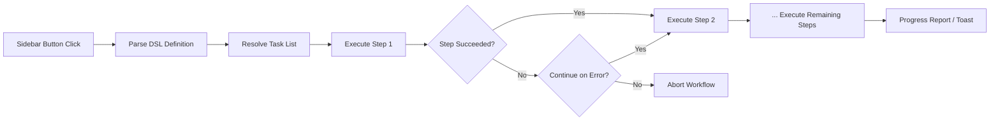

import TLDR from '@site/src/components/TLDR';

# Flujos de trabajo

<TLDR>
**Notemd Los flujos de trabajo combinan múltiples tareas en una sola acción con un clic.** Defina secuencias como `add-links > extract-concepts > research > diagram` utilizando un DSL sencillo. Los flujos de trabajo aparecen como botones en la barra lateral que ejecutan toda la cadena en la nota o carpeta actual. Viene con flujos de trabajo predefinidos; cree otros personalizados en la configuración. Cada paso utiliza su propia configuración de modelo por tarea.

Esto forma parte de la [Obsidian Guía de Gestión del Conocimiento de IA](/docs/pillar-ai-knowledge).
</TLDR>

## Resumen general

Un flujo de trabajo elimina la fricción que implica ejecutar tareas una por una. En lugar de hacer clic derecho cuatro veces para agregar enlaces, extraer conceptos, investigar términos desconocidos y generar un diagrama, basta con presionar un botón de la barra lateral y toda la secuencia se ejecuta. Notemd se encarga de la secuenciación, la propagación de errores y la generación de informes de progreso.

Los flujos de trabajo se definen en un DSL ligero (lenguaje específico del dominio). Se encuentran en la configuración, aparecen como botones clickeables en la barra lateral de Obsidian, y pueden aplicarse ya sea a la nota actual o a toda una carpeta.

## Cómo funciona

### Tubería de ejecución de flujos de trabajo



1. **Parse** -- La cadena del DSL se divide en `>` (o `>`) para obtener una lista ordenada de identificadores de tarea.
2. **Resolve** -- Cada identificador se asocia a un comando interno (add-links, extract-concepts, research, translate, diagram, etc.).
3. **Execute** -- Los pasos se ejecutan de forma secuencial. Cada paso utiliza su proveedor y modelo configurados por tarea.
4. **Manejo de errores** -- Si un paso falla, el flujo de trabajo se interrumpe o continúa al siguiente paso, según su política de errores.
5. **Listo** -- Una notificación tipo brindis informa sobre el éxito o enumera los pasos que fallaron.

### Formato DSL

Los flujos de trabajo se definen como una secuencia de identificadores de tareas separados por `>`:

```
process-current-add-links>extract-concepts-current>research-and-summarize
```

**Identificadores de tareas disponibles:**

| Identificador | Acción |
|------------|--------|
| `process-current-add-links` | Añadir enlaces wiki a la nota activa |
| `extract-concepts-current` | Extraer conceptos de la nota activa |
| `research-and-summarize` | Investiga el texto seleccionado o el título de la nota |
| `process-current-translate` | Traducir la nota activa |
| `summarize-to-mermaid` | Generar un diagrama a partir de la nota activa |
| `generate-from-title` | Generar contenido a partir del título de la nota |
| `extract-original-text` | Extraer texto original (para OCR / contenido escaneado) |

**Variantes a nivel de carpeta** reemplazan `current` por `folder` en el nombre del identificador.

### Flujos de trabajo predefinidos vs. personalizados

Notemd viene con flujos de trabajo listos para patrones comunes:

| Flujo de trabajo | Cadena | Caso de uso |
|----------|-------|----------|
| **Extracción con un clic** | add-links > extract-conceptos > investigación | Procesar un artículo de investigación en una sola pasada |
| **Pipeline completo** | add-links > extract-conceptos > investigación > diagrama | Extracción completa de conocimiento con visualización |
| **Traducir + Enlace** | Traducir > agregar-enlaces | Traduce luego los conceptos vinculados al idioma de destino |

Los **flujos de trabajo personalizados** se crean en la configuración:

1. Abre **Ajustes** --> **Notemd** --> **Flujos de trabajo**
2. Haz clic en **"Agregar flujo de trabajo"**
3. Ingresa la cadena DSL (p. ej., `process-current-add-links>extract-concepts-current`)
4. Asignale un nombre de visualización (por ejemplo, "Enlace Rápido + Extraer").
5. El nuevo botón aparece en la barra lateral de inmediato

## Configuración

| Configuración | Predeterminado | Efecto |
|---------|---------|--------|
| `workflows` | Conjunto predefinido | Array de definiciones de flujo de trabajo (nombre + DSL) |
| `workflowContinueOnError` | `true` | Continúe al siguiente paso si el paso actual falla |
| `workflowShowProgress` | `true` | Muestra una notificación de progreso después de que se complete cada paso |

### Modelos por tarea en flujos de trabajo

Cada paso en un flujo de trabajo utiliza su propia configuración de modelo por tarea. No es necesario especificar modelos en el propio DSL. El orden de resolución es:

1. Proveedor/modelo por tarea si `useMultiModelSettings` está activo
2. Global `activeProvider` de lo contrario

Esto significa que `add-links` puede ejecutarse en DeepSeek mientras que `research` se ejecuta en GPT-4o, todo dentro del mismo clic de flujo de trabajo.

## Ejemplo

Acabas de importar un PDF de un artículo de aprendizaje automático a tu bóveda y deseas una extracción completa de conocimiento:

1. Abre la nota importada
2. Haga clic en el botón de la barra lateral **"Full Pipeline"**
3. Notemd ejecuta:
   - **Paso 1**: Agregar enlaces wiki -- `[[attention mechanism]]`, `[[transformer]]`, etc.
   - **Paso 2**: Extraer conceptos: crea notas de concepto en tu carpeta de conceptos
   - **Paso 3**: Investigación: resume fuentes web para términos clave
   - **Paso 4**: Diagrama -- genera un mapa mental Mermaid de la estructura del artículo
4. Después de ~30 segundos, su nota tendrá enlaces, existirán notas conceptuales, se añadirá la investigación y se guardará un archivo de diagrama

Todo con un solo clic.

## Consejos

- **Comience con flujos de trabajo predefinidos**; cubren los patrones más comunes. Personalícelos solo cuando necesite una secuencia diferente.
- **Habilitar `workflowContinueOnError`** -- un paso fallido en el diagrama no debe interrumpir todo el pipeline.
- **Utilice flujos de trabajo de carpetas** para el procesamiento en masa: haga clic con el botón derecho en una carpeta, elija un flujo de trabajo y todas las notas se procesarán.
- **Asigne nombres claros a los flujos de trabajo**: el espacio en la barra lateral es limitado. Utilice nombres cortos y orientados a la acción como “Extraer rápido” o “Traducir + Enlazar”.

---

## Próximos pasos

- [Investigación](./research) -- Entienda qué hace el paso de investigación antes de agregarlo a los flujos de trabajo
- [Wiki-Links](./wiki-links) -- Función de enlace principal utilizada en la mayoría de los flujos de trabajo
- [Notas de concepto](./concept-notes) -- Extracción de conceptos como paso del flujo de trabajo
- [Procesamiento por lotes](/docs/advanced/batch-processing) -- Concurrencia e informes de progreso para flujos de trabajo de carpetas
