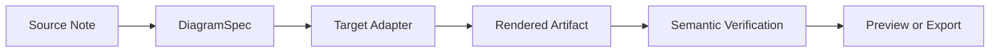
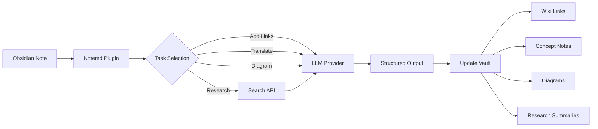

import TLDR from '@site/src/components/TLDR';

# Introducción a Notemd

<TLDR>
**Notemd** (Nota + EMD — Documentos de Markdown mejorados) es un plugin de código abierto Obsidian que convierte la lectura impulsada por LLM en conocimiento persistente. A diferencia de las inteligencias artificiales basadas en chat, donde los hallazgos desaparecen después de la sesión, Notemd guarda los resultados **directamente en su bóveda** en forma de enlaces wiki, notas conceptuales, resúmenes de investigación, traducciones, flujos de trabajo y diagramas. Está diseñado para investigadores, estudiantes y profesionales del conocimiento que desean que la lectura, la investigación y las explicaciones visuales se acumulen en un grafo de conocimiento estructurado y en constante evolución.
</TLDR>

## ¿Qué es Notemd?

Notemd integra **más de 30 modelos de lenguaje grande** (OpenAI, Anthropic, Google, DeepSeek, Qwen, Ollama y otros) en tu flujo de trabajo Obsidian para automatizar la extracción de conocimiento, la organización, la traducción, la investigación y la generación de diagramas.

### Diferencia clave: conocimiento efímero vs. conocimiento persistente

| Aspecto | IA basada en chat (ChatGPT, etc.) | Notemd |
|--------|-------------------------------|--------|
| **A dónde van los resultados** | Historial de chat (desaparece) | Su bóveda Obsidian (permanece). |
| **Formato** | Respuestas de texto plano | Archivos estructurados: `[[wiki-links]]`, notas conceptuales, diagramas |
| **Valor a largo plazo** | Debo preguntar de nuevo cada vez. | Se acumula en un grafo de conocimiento |
| **Acceso sin conexión** | Requiere conexión a Internet. | Funciona completamente sin conexión con Ollama |

## Capacidades principales

### 1. **Vinculación automática a wikis**
- LLM identifica los conceptos clave en tus notas
- Inserta `[[wiki-links]]` en cada ocurrencia
- Opcionalmente crea notas de concepto vinculadas
- Supresión de sinónimos para evitar duplicados

### 2. **Generación de nota conceptual**
- Extrae los conceptos clave de artículos, ensayos y notas
- Genera archivos de concepto dedicados con enlaces de retroceso
- Rutas y plantillas de salida personalizables

### 3. **Integración de investigación en la web**
- Consultar Tavily o DuckDuckGo desde dentro de Obsidian
- LLM resume los resultados con citas de fuentes
- Añade los resultados de la investigación a la nota actual

### 4. **Traducción multilingüe**
- Traduce selecciones o notas completas
- Soporta más de 21 idiomas UI.
- Configuración independiente del idioma de salida
- Soporte para traducción por lotes

### 5. **Generación de diagramas**
- **Mermaid**: Diagramas de flujo, secuencia, clase, estado, ER, Gantt
- **JSON Canvas**: diseños nativos de Obsidian
- **Vega-Lite**: Gráficos de datos, series temporales, gráficos de dispersión
- **HTML / Editable HTML/SVG**: Artefactos de figura autónomos con anotaciones semánticas
- **Draw.io / Drawnix límites de artefactos**: Rutas de exportación dirigidas a los mantenedores desde el mismo modelo de figura semántica
- **Hoja de ruta para diagramas de circuitos**: la compatibilidad con circuitikz/TikZJax se está diseñando en torno a referencias de oro, prompts restringidos, retroalimentación de renderizado y validación de topología/diseño, en lugar de LLM TikZ sin restricciones.
- **Diagnósticos de vista previa**: Los artefactos de renderizado pueden mostrar diagnósticos relacionados con errores de compilación o renderizado, y las fuentes no inline pueden inspeccionarse sin necesidad de un entorno de ejecución de LaTeX en el lado del plugin
- Corrección automática de sintaxis para errores de Mermaid

### 6. **Flujos de trabajo con un clic**
- Conectar múltiples acciones en botones de la barra lateral
- Definición de flujo de trabajo basado en DSL
- Ejemplo: `add-links > extract-concepts > research > diagram`

## ¿Quién debería usar Notemd?

✅ **Investigadores** que leen artículos y elaboran revisiones de la literatura
✅ **Estudiantes** organizando notas de estudio y creando mapas conceptuales
✅ **Trabajadores del conocimiento** que desean que las perspectivas de lectura persistan
✅ **Profesionales bilingües** que necesitan traducción + enlaces a wiki
✅ **Usuarios preocupados por la privacidad** que desean soporte local LLM (Ollama)
✅ **Usuarios avanzados** que personalizan los comandos y flujos de trabajo

## ¿Por qué Notemd + Obsidian?

**Obsidian** es una base de conocimientos centrada en lo local y basada en Markdown. **Notemd** agrega capacidades avanzadas de IA:
- Sus datos permanecen en su bóveda (no en un servicio en la nube).
- Funciona sin conexión con modelos locales
- Gratis y de código abierto (licencia MIT)
- Se integra con los complementos Obsidian existentes
- Se escala a decenas de miles de notas

## Introducción

1. **Instalar**: Ajustes → Plugins de la comunidad → Navegar → "Notemd"
2. **Configurar**: Agregue la clave API de su proveedor LLM (o utilice Ollama local).
3. **Pruébalo**: Abre una nota → Haz clic con el botón derecho → "Procesar archivo (agregar enlaces)"
4. **Explorar**: Consulte la barra lateral para ver flujos de trabajo con un clic

👉 [Guía de instalación](./getting-started/installation) | [Tutorial de inicio rápido](./getting-started/quick-start)

## Dirección de capacidad del diagrama

El trabajo de diagramación de Notemd está pasando de “pedirle al modelo que escriba una cadena de sintaxis” a un pipeline en capas:

La implementación actual ya soporta los mecanismos de fallback Mermaid, JSON Canvas, Vega-Lite, HTML, la edición de HTML/SVG, los artefactos Draw.io XML, un subconjunto mínimo de Drawnix JSON, diagnósticos de vista previa y fallback solo de código fuente, además de un prototipo offline `CircuitSpec -> circuitikz` para plantillas estándar de fuentes comunes e inversores CMOS. Los diagramas de circuitos son un caso más complicado: circuitikz puede representar con precisión la topología eléctrica, pero una salida sin restricciones de LLM suele generar enlaces de conexión ilegibles o código LaTeX que no se renderiza. La próxima dirección es mantener a circuitikz restringido mediante plantillas de referencia estándar, reglas de disposición en cuadrícula de nodos, diagnósticos de renderizado y bucles de retroalimentación mediante capturas de pantalla.

Lea los detalles en [Diagramas](./features/diagrams).

## Arquitectura

## Notemd frente a otros plugins de IA Obsidian

La mayoría de los complementos de IA de Obsidian están orientados a la conversación (tú preguntas, la IA responde y las conclusiones permanecen en el chat). Notemd, en cambio, está **orientado a la escritura**: la IA procesa tus notas y escribe resultados estructurados directamente en tu bóveda.

| Capacidad | Notemd | Copilot | Smart Connections | Text Generator |
|-----------|--------|---------|-------------------|-----------------|
| Inserción automática de enlaces wiki | Sí | No | No | No |
| Generación de nota conceptual | Sí (con enlaces de retroceso + deduplicación) | No | No | No |
| Generación de diagramas | Sí (Mermaid, Canvas, Vega-Lite, HTML, artefactos editables) | No | No | No |
| Integración de investigación en la web | Sí (Tavily + DuckDuckGo) | No | No | No |
| Procesamiento por lotes de carpetas | Sí | Limitado | No | Limitado |
| Enrutamiento de modelos por tarea | Sí (7 tareas, modelos independientes) | No | No | No |
| Cadenas de flujo de trabajo con un clic | Sí (DSL) | No | No | No |
| Traducción (lote) | Sí | No | No | No |
| Chatear con Vault | No | Sí | No | No |
| Búsqueda de similitud semántica | No | No | Sí | No |
| Generación basada en plantillas | No | No | No | Sí |
| Proveedores de LLM | 36 (nube + gateway + local) | 3-5 | 2-3 | 3-5 |
| Completamente sin conexión | Sí (Ollama) | Parcial | Parcial | Parcial |

**Cuándo elegir Notemd**: Si desea que la IA cree un grafo de conocimiento persistente, y no solo conversar sobre sus notas.

**Cuándo elegir Copilot**: Si desea contar con un asistente de IA conversacional dentro de Obsidian.

**Cuándo elegir Smart Connections**: Si desea descubrir relaciones existentes entre notas mediante búsqueda semántica.

## Filosofía

**Notemd** cree que la IA debería complementar el trabajo de conocimiento humano, no reemplazarlo. El plugin:
- Te mantiene bajo control (revisa antes de aplicar cambios)
- Mantiene el contexto (todos los resultados apuntan al origen)
- Respeta la privacidad (soporte local LLM, sin telemetría)
- Permanece extensible (APIs abiertas, flujos de trabajo personalizados)

## Código abierto

- **Licencia**: MIT
- **Fuente**: [github.com/Jacobinwwey/obsidian-NotEMD](https://github.com/Jacobinwwey/obsidian-NotEMD)
- **Comunidad**: [Discord](https://discord.gg/qnGgsQ9W) | [GitHub Discussions](https://github.com/Jacobinwwey/obsidian-NotEMD/discussions)
- **Contribuir**: Se aceptan PRs, consulte [CONTRIBUTING.md](https://github.com/Jacobinwwey/obsidian-NotEMD/blob/main/CONTRIBUTING.md)

---

**Siguiente**: [Instalación →](./getting-started/installation)
