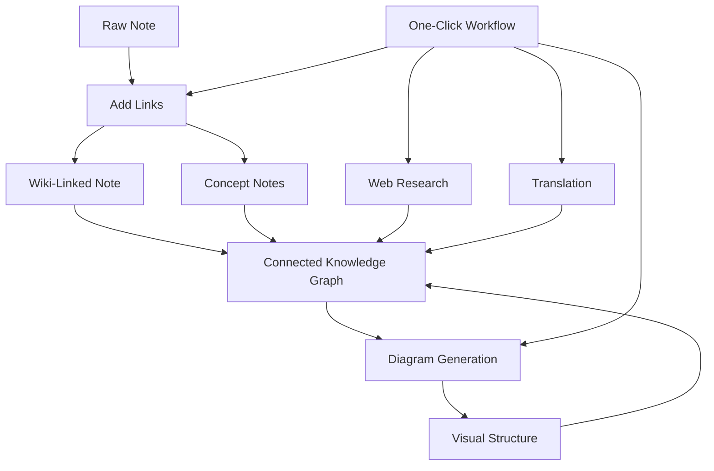

import TLDR from '@site/src/components/TLDR';

# Obsidian Guía de Gestión del Conocimiento con IA

<TLDR>
**Notemd convierte la lectura impulsada por LLM en conocimiento persistente: los enlaces wiki conectan conceptos, las notas de concepto crean un grafo recuperable, la investigación trae la web a su bóveda, la traducción rompe las barreras lingüísticas, los diagramas hacen visible la estructura, y los flujos de trabajo lo vinculan todo con un solo clic.** Esta guía abarca todo el proceso, desde notas en bruto hasta una base de conocimientos conectada, visual y multilingüe.
</TLDR>

## ¿Por qué la gestión del conocimiento con IA?

La toma de notas tradicional genera archivos planos. Incluso con enlaces wiki manuales, la mayoría de las notas permanecen desconectadas. Notemd utiliza LLMs para automatizar la capa de conexión:

- **LLMs leen tu contenido** e identifican lo que es importante: términos, métodos, personas, teorías
- **Los enlaces se insertan automáticamente** en cada aparición del concepto, no quedan ocultos en “véase también”.
- **Las notas de concepto se generan** como archivos independientes recuperables.
- **La investigación enriquece las notas** con contexto de fuentes web
- **Los diagramas hacen visible la estructura**: mapas mentales, diagramas de flujo y gráficos de datos a partir del mismo contenido

El resultado: un grafo de conocimiento que crece con cada nota que procesas, no solo cuando recuerdas agregar enlaces.

## El pipeline completo



Cada paso es independiente. Puedes usar uno o todos. La secuencia más efectiva es: **Agregar enlaces → Notas conceptuales → Diagramas**.

---

## 1. Enlaces de wiki: Hacer explícitas las conexiones

Los enlaces wiki son la columna vertebral de un grafo de conocimiento. Notemd utiliza un LLM para:

1. Lea el contenido de su nota (dividido en fragmentos para documentos largos)
2. Identificar conceptos clave, dando prioridad a términos técnicos específicos sobre sustantivos genéricos
3. Inserte `[[wiki-links]]` en cada aparición
4. Suprimir sinónimos para que "ML" y "Machine Learning" no creen nodos separados

### Cuándo usarlo

- **Cada nota >100 palabras**: las notas más cortas contienen pocos conceptos
- **Artículos de investigación, documentos técnicos, notas de reuniones**: ricos en términos específicos del dominio
- **Después de que el contenido esté establecido** — no procese repetidamente los borradores

### Configuración de claves

| Configuración | Recomendado | ¿Por qué? |
|---------|-----------|-----|
| `addLinksProvider` | DeepSeek o GPT-4o-mini | Buena precisión a bajo costo |
| Supresión de sinónimos | Encendido | Evita nodos duplicados |
| Ventana de contexto | Párrafo | Equilibrio entre precisión y costo |

→ [Análisis en profundidad de enlaces de Wiki](/docs/features/wiki-links)

---

## 2. Notas de concepto: Nodos de conocimiento recuperables

Los enlaces wiki conectan las ideas de forma incrustada, pero las notas de concepto permiten recuperar cada idea de manera independiente. Cada concepto cuenta con su propio archivo `.md`:

```markdown
# Machine Learning

## Linked From
- [[My Research Notes]]
- [[Neural Networks Explained]]
```

### El proceso de extracción

El comando LLM está altamente estructurado:
- Normalizar a forma singular
- Prefiero conceptos de varias palabras en lugar de palabras individuales (“Relajación dieléctrica” y no “Relajación”).
- Omitir las secciones de referencias/bibliografía
- Salida en líneas de `CONCEPT:` para un análisis determinista

Los conceptos se deduplican entre los fragmentos a través de `Set<string>`. Los errores LLM en fragmentos individuales no interrumpen la operación.

### Enlaces de retroceso

Cuando está activado, cada nota conceptual registra qué notas de origen la mencionan. El panel de enlaces inversos nativo de Obsidian también muestra las conexiones inversas.

### Deduplicación

El motor de eliminación de duplicados de 4 pasos de Notemd detecta:
1. **Coincidencias exactas** — comparación de nombres de archivo insensible a mayúsculas y minúsculas
2. **Formas plurales** — "Models.md" vs "Model.md"
3. **Normalización de símbolos** — "A-B.md" vs "A B.md"
4. **Contención de una sola palabra**: "ML.md" se marca cuando existe "Machine Learning.md"

### Configuración de claves

| Configuración | Recomendado | ¿Por qué? |
|---------|-----------|-----|
| `conceptNoteFolder` | `concepts/` o `🧠 concepts/` | Mantiene el bóveda organizado |
| `extractConceptsAddBacklink` | Encendido | Habilita la búsqueda inversa |
| `extractConceptsMinimalTemplate` | Apagado | Plantilla completa con Enlazado desde |
| Modelo por tarea | DeepSeek | La extracción de conceptos no necesita modelos costosos. |
| Supresión de sinónimos | Encendido | La misma configuración afecta tanto al enlazado como a la extracción |

→ [Análisis en profundidad de las notas conceptuales](/docs/features/concept-notes)

---

## 3. Investigación: Integrar la Web

Notemd integra la búsqueda en la web en tu flujo de trabajo de toma de notas:

1. **Construcción de consultas**: el título o la selección de tu nota se convierte en una consulta de búsqueda
2. **Búsqueda en la web** — Tavily (recomendado, se requiere la clave API) o DuckDuckGo (gratuito, sin clave)
3. **LLM resumen** — los resultados de búsqueda se condensan en un resumen relevante
4. **Añadir al nota** — se agrega un resumen en la posición del cursor o como una nueva sección

### Cuándo usarlo

- Antes de procesar un nuevo tema: obtenga primero el contexto web.
- Cuando una nota conceptual necesita enriquecimiento — investigación, luego añada enlaces
- Para revisiones de literatura: realice una investigación por lotes en una carpeta de notas

### Configuración de claves

| Configuración | Recomendado | ¿Por qué? |
|---------|-----------|-----|
| `researchProvider` | GPT-4o o Claude | La investigación necesita una resumen de mayor calidad. |
| Servicio de búsqueda | Tavily | Mejor relevancia, profundidad configurable |
| `maxResearchContentTokens` | 4000 | Equilibrio entre profundidad y costo |

→ [Análisis profundo de investigación](/docs/features/research)

---

## 4. Traducción: Rompiendo las barreras lingüísticas

Notemd traduce notas utilizando tu LLM configurado, no un API de traducción dedicado. Esto significa:

- **Traducciones conscientes del contexto**: el LLM comprende todo el documento, no frase por frase
- **Manejo de términos técnicos** — "gradient descent" se mantiene como "梯度下降" y no como "坡度向下"
- **Soporte por lotes**: traduce toda una carpeta de notas en una sola operación
- **Modelo por tarea**: utiliza Gemini Flash para la traducción (rápido, económico y multilingüe).

### Soporte de idiomas

Notemd en sí mismo admite 21 idiomas UI. El idioma de destino de la traducción se puede configurar por tarea. Pares comunes: EN↔ZH, EN↔JA, EN↔KO, EN↔DE, EN↔FR, EN↔ES.

→ [Análisis detallado de la traducción](/docs/features/translation)

---

## 5. Diagramas: Hacer visible la estructura

El pipeline de diagramas de Notemd sigue un enfoque basado en la especificación: el LLM genera un `DiagramSpec` JSON estructurado, y luego los adaptadores lo convierten al formato objetivo. Esto produce resultados más fiables que solicitar al LLM la sintaxis raw de Mermaid.

### Detección de intención

Notemd infiere el mejor tipo de diagrama a partir del contenido:

- **Tablas con números** → gráfico de datos (Vega-Lite)
- **Vocabulario cliente/servidor** → diagrama de secuencia (Mermaid)
- **Entidad/clave primaria** → Diagrama ER (Mermaid)
- **Flujo de pasos/proceso** → diagrama de flujo (Mermaid)
- **Palabras clave del mapa conceptual** → JSON Canvas (Obsidian nativo)
- **Predeterminado** → mapa mental (Mermaid)

### Cadena de renderizado

Objetivo principal → solución alternativa → solución alternativa → HTML. Si la sintaxis de Mermaid falla, se vuelve a intentar una vez con el contexto del error dirigido a LLM, y luego se recurre a un diagrama mínimo.

### Configuración de claves

| Configuración | Recomendado | ¿Por qué? |
|---------|-----------|-----|
| `enableExperimentalDiagramPipeline` | Encendido | Mejor calidad mediante un enfoque basado en especificaciones primero |
| `experimentalDiagramCompatibilityMode` | `best-fit` | Objetivo nativo por intención |
| `summarizeToMermaidProvider` | GPT-4o o Claude | Las especificaciones de diagramas requieren razonamiento espacial. |
| `autoMermaidFixAfterGenerate` | Encendido | Detecta automáticamente los errores de sintaxis de LLM |
| Aumento del conocimiento local | Activado para específico del dominio | Mejora la precisión con el contexto del vault |

→ [Análisis en profundidad de diagramas](/docs/features/diagrams)

---

## 6. Flujos de trabajo: Automatización con un clic

Los flujos de trabajo concatenan múltiples tareas en un único botón de la barra lateral. El formato DSL es:

```
task1 | task2 | task3
```

Ejemplo: `addLinks` | extraerConceptos | generateDiagram` — convierte una nota desde texto sin formato en un nodo de conocimiento visual completamente conectado con un solo clic.

### Flujos de trabajo recomendados

| Flujo de trabajo | Cadena | Caso de uso |
|----------|-------|----------|
| Proceso completo | `addLinks \| extractConcepts \| generateDiagram` | Nuevas notas |
| Investigar primero | `research \| addLinks` | Temas desconocidos |
| Políglota | `translate \| addLinks` | Notas multilingües |
| Solo diagrama | `generateDiagram` | Visualización rápida |

→ [Análisis en profundidad de flujos de trabajo](/docs/features/workflows)

---

## 7. LLM Proveedores: 36 opciones desde la nube hasta lo local

Notemd admite 36 proveedores en 4 tipos de transporte. Grupos clave:

- **Nube internacional**: OpenAI, Anthropic, Google, Mistral, xAI
- **Cloud de China**: DeepSeek, Qwen, Doubao, Moonshot, GLM, Baidu, SiliconFlow
- **Gateways**: OpenRouter, GitHub Models, Hugging Face, Vercel
- **Local**: Ollama, LMStudio, OVMS — sin clave API, los datos no salen de su máquina

### Estrategia de modelo por tarea

La configuración más económica utiliza modelos baratos para tareas simples y modelos potentes para las complejas:

```
extractConcepts  → DeepSeek (fast, cheap, accurate enough)
addLinks          → DeepSeek or GPT-4o-mini
research          → GPT-4o or Claude (needs quality)
generateDiagram   → GPT-4o or Claude (needs spatial reasoning)
translate         → Gemini Flash (fast, multilingual)
```

→ [Visión general de proveedores LLM](/docs/providers/overview)

---

## Lista de verificación para comenzar

1. **Instalar Notemd** — [Plugins de la comunidad](/docs/getting-started/installation) (recomendado) o de forma manual
2. **Configurar un proveedor** — DeepSeek (más fácil), OpenAI, o Ollama (gratuito)
3. **Procesa tu primera nota** — haz clic con el botón derecho → "Procesar archivo (agregar enlaces)"
4. **Configurar carpeta de conceptos** — Ajustes → Notemd → Salida → Carpeta de Conceptos
5. **Extraer conceptos** — ejecute "Extraer conceptos" en la misma nota
6. **Generar un diagrama** — ejecute “Generar diagrama” para visualizar las conexiones
7. **Crear un flujo de trabajo**: conecte lo anterior en un botón de un solo clic

## Configuraciones recomendadas

### Estudiante (Presupuesto)

```
Provider: DeepSeek (free tier available)
Concept extraction: DeepSeek
Research: DuckDuckGo (free) + DeepSeek
Diagrams: Off (or legacy Mermaid)
Workflows: addLinks | extractConcepts
```

### Investigador (Calidad)

```
Provider: GPT-4o (primary)
Concept extraction: DeepSeek (cost savings)
Research: GPT-4o + Tavily
Diagrams: best-fit mode, GPT-4o
Workflows: research | addLinks | extractConcepts | generateDiagram
```

### Privacidad en primer lugar (solo local)

```
Provider: Ollama (llama3 or qwen2.5:7b)
All tasks: Ollama
Research: DuckDuckGo (free, no API key)
Diagrams: legacy Mermaid mode
```

### Bilingüe (ZH + EN)

```
Primary: DeepSeek (Chinese queries)
Translation: Google Gemini Flash
Research: Tavily + DeepSeek (Chinese search context)
Language output: per-task (extractConceptsLanguage: zh-CN)
```

---

## Patrones comunes

### Patrón: Procesar un artículo de investigación

1. Importar contenido de PDF (o pegar)
2. **Investigación**: obtén contexto en la web sobre el tema
3. **Agregar enlaces** — identificar y vincular conceptos clave
4. **Extraer conceptos** — crear notas independientes
5. **Generar Diagrama** — visualizar la estructura del artículo

### Patrón: Enriquecimiento de notas diarias

1. Escribir nota diaria
2. **Agregar enlaces** — conecta las ideas de hoy con conceptos existentes
3. Las notas de concepto se actualizan automáticamente con enlaces de retroceso

### Patrón: Revisión de la literatura

1. Crear carpeta con papers/notas
2. **Agregar enlances por lotes** — procesar toda la carpeta
3. **Deduplicar conceptos**: limpiar notas casi duplicadas
4. **Generar Diagrama** — mapa mental de toda la literatura

---

*Notemd es de código abierto (MIT) y funciona con Obsidian 0.15.0+ en todas las plataformas. [Instalar ahora](/docs/getting-started/installation) o [ver en GitHub](https://github.com/Jacobinwwey/obsidian-NotEMD).*
