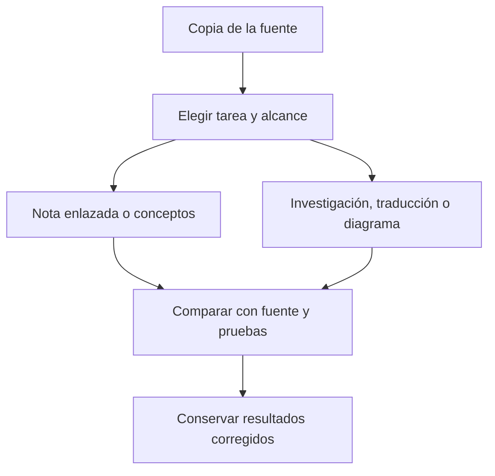

import TLDR from '@site/src/components/TLDR';

# Gestión del conocimiento con IA en Obsidian

<TLDR>
Un flujo útil distingue fuente, generación y correcciones propias. Notemd ofrece enlaces, extracción, investigación, traducción y diagramas como archivos revisables. Empieza con una fuente, verifica y luego automatiza una carpeta acotada.
</TLDR>

## Definir el resultado

Elige nota enlazada, conceptos, resumen con fuentes, traducción o diagrama. Más archivos y enlaces no garantizan comprensión ni recuperación. Decide cómo verificar y encontrar el contenido después.

## Recorrido completo


```mermaid
flowchart TD
    A[Copia de la fuente] --> B[Elegir tarea y alcance]
    B --> C[Nota enlazada o conceptos]
    B --> D[Investigación, traducción o diagrama]
    C --> E[Comparar con fuente y pruebas]
    D --> E
    E --> F[Conservar resultados corregidos]
```

Son tareas disponibles, no una promesa de que el botón predeterminado las ejecute todas. Conserva fuente y examina destinos antes de encadenar.

## 1. Enlaces: hacer explícitas las relaciones

Ejecuta **Procesar archivo (añadir enlaces)** y revisa `_processed.md`. Comprueba si los términos ayudan a navegar y si citas, código y fórmulas permanecen fieles.

Dominio y reducción de sinónimos orientan sin imponer equivalencia o umbral numérico. Usa coincidencia determinista si priorizas nombres existentes y reproducibilidad. [Enlaces](./features/wiki-links).

## 2. Conceptos: separar términos y explicaciones

Elige carpeta. La extracción independiente conserva la fuente y genera solo títulos. Para `Linked From` en notas nuevas, activa backlinks y desactiva plantilla mínima.

**Generación por lotes desde títulos** es independiente y puede completar notas previas aptas. Usa carpeta de ensayo y verifica traslado a complete. Revisa duplicados por nombre antes de borrarlos: pueden tener sentidos distintos. [Conceptos](./features/concept-notes).

## 3. Investigación: conservar evidencia

Elige tema/título y Tavily o DuckDuckGo, luego **Investigar y resumir**. Clave Tavily ausente no cambia el motor. Abre las fuentes y verifica lo importante.

Recuperación local opcional es léxica y envía fragmentos al modelo elegido. Indexar localmente no garantiza proceso offline ni limitado al dispositivo. [Investigación](./features/research).

## 4. Traducción: significado y estructura

Elige idioma y traduce el archivo. El sufijo estándar es `_<language>.md`; puede sobrescribir salidas existentes. Para un pasaje, crea una nota temporal.

Revisa términos, números, código, enlaces y matemáticas. Fragmentar puede perder contexto. Los 21 idiomas UI y 34 rutas web no acreditan calidad de una pareja lingüística. [Traducción](./features/translation).

## 5. Diagramas: elegir fuentes editables

Selecciona varios tipos de diagrama en una ejecución y varios formatos independientes por tipo. Al desmarcar un tipo se conservan sus formatos; sin tipos seleccionados se analiza el contenido automáticamente. La casilla incluye el tipo. Haz clic en su nombre para seleccionarlo y editar sus formatos. Al pasar el puntero o darle foco con el teclado cambia la vista previa sin guardar ajustes. Escape cierra el menú y devuelve el foco.

CircuitikZ es acotado y su compilación requiere comprobación propia. Flechas Drawnix entre ramas son estáticas. Las tablas PowerPoint mejoran, pero Mermaid/SVG pueden ser imágenes. [Diagramas](./features/diagrams).

## 6. Flujos: automatizar una secuencia validada

Nombre, `::` y acciones separadas por `>` definen la cadena:

```text
One-Click Extract::process-current-add-links>batch-generate-from-titles>batch-mermaid-fix
```

Incluye enlaces, títulos por carpeta y reparación Mermaid, no investigación o diagramas genéricos. Cada acción mantiene sus requisitos y salidas.

Por defecto se detiene ante errores comunicados. Continuar solo tiene sentido si las etapas siguientes aceptan las entradas restantes. Cancelar no revierte resultados terminados. [Flujos](./features/workflows).

## 7. Proveedores: protocolo y tarea

36 perfiles cubren cinco familias. Elige según endpoint, derechos, tratamiento de datos y resultados medidos. Compara velocidad/coste usando la misma fuente y prompt.

Las rutas por tarea están inicialmente apagadas. Actívalas si quieres separar perfiles y revisa todas antes de considerar un flujo local. [Proveedores](./providers/overview).

## Comprobaciones iniciales

1. Instalar y respaldar fuentes.
2. Configurar y probar modelo exacto.
3. Elegir carpeta conceptual y destinos distintos.
4. Probar una copia.
5. Comparar y guardar correcciones.
6. Ampliar a una carpeta pequeña y revisar parciales antes de cadenas largas.

## Casos habituales

### Trabajar con un artículo

Convierte a Markdown externamente y revisa tablas, fórmulas e imágenes. Extrae conceptos/pasajes, investiga preguntas concretas y dibuja solo relaciones verificables. Conserva enlaces al artículo y correcciones.

### Mantener conceptos

Carpeta dedicada, revisión terminológica y explicaciones para un subconjunto elegido. Respalda antes de limpiar. Cantidad no sustituye definiciones exactas y navegación útil.

### Material privado

Prepara servidor local, modelos y dependencias. Comprueba rutas y evita búsquedas de red si necesitas desconexión. Revisa diagnósticos antes de compartir. Un valor loopback inicial no impide configurar un endpoint remoto.

### Recuperar un lote

Espera al cierre de cancelación o fallo. Examina informe, salidas y recuperación, compara conflictos y repite solo lo previsto. Cancelado no significa vacío; no borres acompañantes sin revisar referencias.

## Siguientes pasos

- [Inicio rápido](./getting-started/quick-start).
- [Lotes](./advanced/batch-processing).
- [Desarrolladores](./developers/overview).
- [Agentes](./agents/overview).
