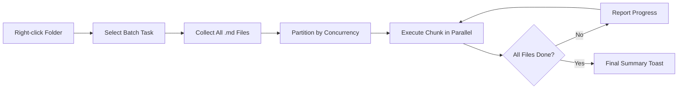

import TLDR from '@site/src/components/TLDR';

# پردازش دسته‌ای

<TLDR>
**Notemd تمام پوشه‌ها را در یک عمل با قابلیت تنظیم همزمانی و کنترل جایگزینی پردازش می‌کند.** با کلیک راست روی یک پوشه می‌توانید لینک‌های ویکی، مفاهیم، تحقیقات یا ترجمه تمام یادداشت‌های داخل آن را به‌صورت دسته‌ای اضافه کنید. محدودیت‌های همزمانی از بروز خطاهای API جلوگیری می‌کنند. پیشرفت پردازش برای هر فایل گزارش می‌شود. رفتار جایگزینی قابل تنظیم است: نادیده گرفتن فایل‌های موجود، افزودن به آن‌ها یا جایگزینی با آن‌ها. فایل‌هایی که پردازششان شکست خورد بدون متوقف کردن عملیات دسته‌ای ثبت می‌شوند.

این بخشی از [Obsidian راهنمای مدیریت دانش هوش مصنوعی](/docs/pillar-ai-knowledge) است.
</TLDR>

## مرور کلی

پردازش دسته‌ای یک پوشه حاوی یادداشت‌ها را به یک عمل واحد تبدیل می‌کند. به‌جای باز کردن هر یادداشت و اجرای دستورات به‌طور جداگانه، کافی است روی پوشه کلیک راست کرده و کار موردنظر را انتخاب کنید. Notemd بر روی هر فایل `.md` پیمایش کرده، عمل مورد انتخاب را اعمال کرده و پیشرفت را به‌صورت زمان واقعی گزارش می‌دهد.

این ویژگی برای استخراج دانش در سطح کل خزانه ضروری است. به‌عنوان مثال، پس از وارد کردن ده‌ها PDF، ابتدا افزودن لینک‌ها به‌صورت دسته‌ای و سپس استخراج مفاهیم به‌صورت دسته‌ای، گراف دانش شما را در عرض چند دقیقه و نه ساعت‌ها ایجاد می‌کند.

## نحوه کارکرد

### مدل اجرای دسته‌ای

1. **جمع‌آوری فایل‌ها** -- Notemd به‌طور بازگشتی پوشه هدف را بررسی می‌کند (یا فقط سطح بالا، بسته به تنظیمات) و تمام فایل‌های `.md` را جمع‌آوری می‌کند.
2. **تقسیم‌بندی همزمانی** -- فایل‌ها بر اساس تنظیمات `batchConcurrency` به گروه‌های کوچکتر تقسیم می‌شوند. هر گروه به‌طور موازی اجرا می‌شود؛ گروه‌های دیگر به‌صورت توالی اجرا می‌شوند.
3. **اجرا** -- هر فایل با همان منطقی که برای دستورات تک‌فایلی استفاده می‌شود، پردازش می‌گردد. تنظیمات ارائه‌دهنده و مدل مربوط به هر کار رعایت می‌شود.
4. **گزارش پیشرفت** -- یک اعلان نوتیفیکیشن پس از تکمیل هر فایل به‌روزرسانی می‌شود و پیشرفت `N / Total` را نشان می‌دهد.
5. **مدیریت خطا** -- اگر یک فایل شکست بخورد (خطای API، تایم‌آوت شبکه و غیره)، خطا ثبت شده و عملیات دسته‌ای ادامه می‌یابد. خلاصه نهایی فهرستی از فایل‌های شکست‌خورده را نشان می‌دهد.
6. **تکمیل** -- یک اعلان نوتیفیکیشن خلاصه، تعداد کل فایل‌های پردازش‌شده، موفقیت‌ها و شکست‌ها را گزارش می‌کند.

### رفتار جایگزینی

هنگام پردازش فایلی که قبلاً حاوی لینک‌های ویکی، یادداشت‌های مفهومی یا ترجمه‌هاست، رفتار Notemd بستگی به تنظیم جایگزینی دارد:

| حالت | رفتار |
|------|----------|
| **نادیده گرفتن** | محتوای موجود دست‌نخورده باقی می‌ماند. فقط فایل‌های تغییرنیافته پردازش می‌شوند. |
| **افزودن** (پیش‌فرض) | محتوای جدید اضافه می‌شود. لینک‌های ویکی، مفاهیم یا ترجمه‌های موجود حفظ می‌شوند. |
| **جایگزینی** | فایل به طور کامل دوباره پردازش می‌شود. تمام تغییرات قبلی Notemd جایگزین می‌شوند. |

برای لینک‌دهی ویکی به طور خاص: اگر یک یادداشت قبلاً حاوی `[[wiki-links]]` باشد، حالت **نادیده گرفتن** آن را دست‌نخورده می‌گذارد، در حالی که حالت **جایگزینی** کل یادداشت را برای ایجاد لینک‌های جدید به LLM ارسال می‌کند. برای پردازش تدریجی از **نادیده گرفتن** و برای دوباره پردازش پس از به‌روزرسانی مدل از **جایگزینی** استفاده کنید.

### کنترل همزمانی

تنظیم `batchConcurrency` تعداد فراخوانی‌های همزمان API را محدود می‌کند. این کار از بروز خطاهای محدودیت نرخ (HTTP 429) هنگام پردازش پوشه‌های بزرگ در برابر ارائه‌دهندگانی با سقف‌های مشخص جلوگیری می‌کند.

| همزمانی | مناسب برای | تأثیر معمولی بر محدودیت نرخ |
|-------------|----------------|---------------------------|
| `1` | سطوح رایگان، ارائه‌دهندگان سخت‌گیرانه | هیچ (سریالی) |
| `3` (پیش‌فرض) | اکثر ارائه‌دهندگان ابری | پایین |
| `5` | Ollama (محلی)، سطوح سخاوتمندانه | هیچ / پایین |
| `10` | مدل‌های محلی با استدلال سریع | هیچ |

اگر در حین پردازش دسته‌جمعی با خطاهای 429 مواجه شدید، همزمانی را به 1 یا 2 کاهش دهید.

## پیکربندی

| تنظیمات | پیش‌فرض | اثر |
|---------|---------|--------|
| `batchConcurrency` | `3` | حداکثر تعداد فراخوانی‌های موازی API در حین عملیات پوشه‌ها |
| `batchOverwriteExisting` | `false` | بازنویسی محتوای موجود Notemd. `false` به معنای حالت افزودن است. |
| `batchSkipProcessed` | `false` | نادیده گرفتن فایل‌هایی که قبلاً حاوی نشانگرهای Notemd هستند (مثلاً پیوندهای ویکی) |
| `batchRecursive` | `true` | در هنگام بررسی پوشه، زیرپوشه‌ها را نیز لحاظ کنید |
| `enableStableApiCall` | `false` | فعال‌سازی منطق تلاش مجدد (تا ۴ بار) برای هر فایل در حین پردازش دسته‌ای |

### مدل‌های ویژه برای هر وظیفه در پردازش دسته‌ای

هر عملیات دسته‌ای از مدل مربوط به آن وظیفه استفاده می‌کند. batch-add-links از `addLinksProvider`، batch-research از `researchProvider` و غیره استفاده می‌کند. این امر به شما امکان می‌دهد برای عملیات‌های با حجم زیاد از مدل‌های ارزان‌قیمت استفاده کرده و برای وظایفی که به کیفیت حساس هستند، از مدل‌های گران‌قیمت استفاده نمایید.

## مثال

شما یک پوشه `papers/` دارید که شامل ۴۰ یادداشت تحقیقاتی واردشده است. شما می‌خواهید پیوندهای ویکی را اضافه کرده و مفاهیم موجود در تمام آن‌ها را استخراج نمایید:

1. روی پوشه `papers/` کلیک راست کنید
2. گزینه **"Notemd: Process folder (add links)"** را انتخاب کنید
3. Notemd پوشه را بررسی می‌کند، ۴۰ فایل `.md` پیدا می‌کند و به صورت همزمان ۳ فایل را پردازش می‌کند (همزمانی پیش‌فرض)
4. یک پیام پیشرفت نمایش داده می‌شود: `12/40 files processed...`
5. پس از حدود ۳ دقیقه، یک پیام خلاصه گزارش می‌دهد: `39 succeeded, 1 failed (API timeout on paper-37.md)`
6. برای ایجاد یادداشت‌های مفهومی برای تمام ۴۰ فایل، این کار را با استفاده از **"Notemd: Process folder (extract concepts)"** تکرار کنید

فایلی که شکست خورده است ثبت می‌شود. می‌توانید بعداً فقط روی آن فایل دوباره اجرا کنید.

## نکات

- **ابتدا با همزمانی پایین شروع کنید** -- اگر از محدودیت‌های سرعت ارائه‌دهنده خود مطمئن نیستید، با `1` شروع کرده و به تدریج آن را افزایش دهید.
- **برای به‌روزرسانی‌های تدریجی از حالت صرف‌نظر استفاده کنید** -- پس از اولین دسته کامل، به `batchSkipProcessed: true` تغییر دهید تا فقط یادداشت‌های جدید در اجراهای بعدی پردازش شوند.
- **فراخوانی‌های پایدار API را فعال کنید** -- `enableStableApiCall: true` منطق تلاش مجددی اضافه می‌کند که در صورت بروز خطاهای گذرا شبکه در دسته‌های طولانی، باعث بهبود وضعیت می‌شود.
- **پس از به‌روزرسانی مدل دوباره اجرا کنید** -- اگر به مدل بهتری تغییر دادید، `batchOverwriteExisting: true` را تنظیم کرده و دوباره اجرا کنید تا لینک‌ها و مفاهیم بهتری به دست آید.

---

## گام‌های بعدی

- [Workflows](/docs/features/workflows) -- ایجاد دکمه‌های یک‌کلیک در نوار کناری برای پیوند دادن وظایف دسته‌ای
- [Custom Prompts](/docs/advanced/custom-prompts) -- سفارشی‌سازی پرامپت‌ها برای استخراج دسته‌ای
- [Troubleshooting](/docs/advanced/troubleshooting) -- رفع خطاهای محدودیت سرعت و مشکلات اتصال در حین اجرای دسته‌ای
- [ارائه‌دهندگان](/docs/providers/overview) -- مرجع پیکربندی مدل بر حسب وظیفه
