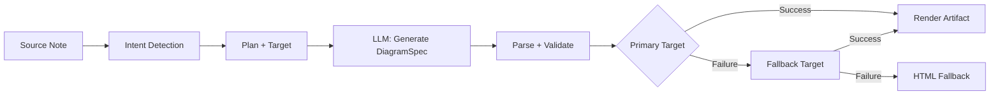
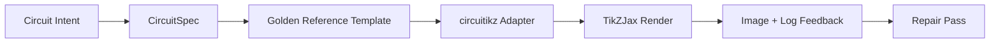

import TLDR from '@site/src/components/TLDR';

# نمودارها

<TLDR>
**Notemd از طریق یک فرآیند مبتنی بر مشخصات، نمودارها را از یادداشت‌های شما تولید می‌کند.** مدل LLM یک فایل JSON با نام `DiagramSpec` که مستقل از نرم‌افزار رندرر است، تولید می‌کند؛ سپس ابزارهای ویژه آن را به فرمت‌های Mermaid، JSON Canvas، Vega-Lite، HTML، HTML/SVG قابل ویرایش، Draw.io، Drawnix یا نمودارهای circuitikz محدود‌شده تبدیل می‌کنند. این سیستم از ۹ نوع هدف پشتیبانی می‌کند، زنجیره‌های جایگزینی خودکار دارد، امکان مشاهده زنده و صادرات به فرمت‌های SVG/PNG/PDF را فراهم می‌کند، بررسی معنایی را انجام می‌دهد و تولید محتوا را با استفاده از دانش محلی تقویت می‌کند.
</TLDR>

این بخشی از [Obsidian راهنمای مدیریت دانش هوش مصنوعی](/docs/pillar-ai-knowledge) است.

## معماری: خط تولید مبتنی بر مشخصات اولیه

Notemd هرگز از LLM نمی‌خواهد که مستقیماً سینتکس Mermaid/Vega/Canvas را تولید کند. در عوض:



**چرا مبتنی بر مشخصات اولیه؟** LLMها اغلب سینتکس نامعتبر رندرر تولید می‌کنند (به‌ویژه Mermaid). یک `DiagramSpec` ساختاریافته می‌تواند قبل از رندرینگ بررسی شود، و همان مشخصات می‌تواند به عنوان جایگزین برای چندین رندرر استفاده شود.

## انواع نمودارهای پشتیبانی‌شده

| قصد | رندرر اصلی | جایگزین‌ها | کاربرد |
|--------|-----------------|-----------|----------|
| `mindmap` | Mermaid | HTML | تجزیه موضوعات سلسله‌مراتبی |
| `flowchart` | Mermaid | HTML | جریان‌های فرآیندی، درخت‌های تصمیم‌گیری |
| `sequence` | Mermaid | HTML | تعاملات کلاینت-سرور، پروتکل‌ها |
| `classDiagram` | Mermaid | HTML | روابط کلاس‌های OOP |
| `erDiagram` | Mermaid | HTML | طرح‌های پایگاه داده، روابط موجودیت‌ها |
| `stateDiagram` | Mermaid | HTML | ماشین‌های حالت، مدل‌های چرخه عمر |
| `canvasMap` | JSON Canvas | Mermaid → HTML | نقشه‌های مفهومی، گراف‌های دانش |
| `dataChart` | Vega-Lite | Mermaid → HTML | نمودارهای میله‌ای، خطی، ناحیه‌ای، پراکنده، کیکی، جداول |
| `circuit` | circuitikz | none | نمودارهای مدار محدود‌شده از بارهای `CircuitSpec` تأییدشده |

## تشخیص قصد

Notemd با استفاده از امتیازدهی کلمات کلیدی، بهترین نوع نمودار را بر اساس محتوای یادداشت شما تخمین می‌زند:

| قصد | محرک‌ها | میزان اطمینان |
|--------|----------|------------|
| `dataChart` | جداول، سلول‌های عددی، کلمات کلیدی مربوط به معیار/روند، درصدها | 0.88 |
| `sequence` | واژگان درخواست/پاسخ (۴ مورد یا بیشتر) یا علائم `->`/`=>` | 0.82 |
| `erDiagram` | کلید اصلی، کلید خارجی، موجودیت، طرح (۲ مورد یا بیشتر) | 0.80 |
| `stateDiagram` | حالت، انتقال، در حال انتظار، در حال اجرا، شکست‌خورده (۳ مورد یا بیشتر) | 0.76 |
| `flowchart` | مراحل شماره‌گذاری‌شده (۲ مورد یا بیشتر) یا واژگان if/then/else/workflow | 0.74 |
| `canvasMap` | نقشه مفهومی، گراف دانش، فضایی، خوشه‌بندی | 0.72 |
| `circuit` | circuitikz, TikZJax, circuit, schematic, CMOS, NMOS, PMOS, MOSFET, VDD/GND, `vin`/`vout` | 0.78 |
| `mindmap` | پیش‌فرض جایگزین | 0.55 |

با تنظیم **نوع نمودار مورد علاقه**، انتخاب‌کننده سمت چپ یا گزینه صریح پالت دستورات، آن را بازنویسی کنید.

## انتخاب هدف رندر

پایپلاین تجربی مبتنی بر مشخصات اکنون دارای دو کنترل مستقل است:

| کنترل | تنظیمات | اثر |
|---------|---------|--------|
| نوع نمودار مورد علاقه | `preferredDiagramIntent` | شکل معنایی `DiagramSpec` تولید شده را هدایت می‌کند |
| هدف رندر مورد علاقه | `preferredDiagramRenderTarget` | رندرکننده آرتیفکت برای **تولید نمودار** و **پیش‌نمایش نمودار** را انتخاب می‌کند |

برای تنظیم پیش‌فرض برنامه برنامه‌ریز، مقدار **Preferred render target** را روی **Auto** در نظر بگیرید؛ یا به طور صریح از گزینه‌های Mermaid، JSON Canvas، Vega-Lite، HTML، Editable HTML/SVG، Draw.io، Drawnix یا Circuitikz استفاده کنید. این تغییرات تنها بر روی دستورات مربوط به آرتیفکت‌ها و نمایش زنده اعمال می‌شوند. دستور استاندارد **Summarise as Mermaid diagram** همچنان فقط برای خروجی‌های سازگار با Mermaid در نظر گرفته شده تا فرآیندهای Markdown موجود به طور پنهان فرمت را تغییر ندهند.

این تفکیک اهمیت زیادی دارد زیرا اکنون می‌توان یک هدف نوع `flowchart` را برای یادداشت‌های Markdown به صورت Mermaid، برای جایگزینی قوی‌تر به HTML، برای ویرایش بعدی به HTML/SVG قابل ویرایش، یا به عنوان آرتیفکت منبع Draw.io/Drawnix همراه با نسخه بررسی‌شده SVG رندر کرد. هدف نوع `circuit` به Circuitikz ارجاع داده می‌شود و نیازمند یک فایل `CircuitSpec` تأییدشده است؛ این درخواست، متن دلخواه TikZ نیست.
## کاربرد

### تولید یک نمودار

1. باز کردن یک یادداشت
2. از پالت دستورات، **"Notemd: تولید نمودار"** را اجرا کنید
3. Notemd قصد را تشخیص می‌دهد، مشخصات را تولید می‌کند، رندر می‌کند و آرتیفکت را ذخیره می‌کند

**فایل‌های خروجی بر حسب هدف:**

| هدف | پسوند | الگوی نام فایل |
|--------|-----------|------------------|
| Mermaid | `.md` | `{note}_summ.md` |
| JSON Canvas | `.canvas` | `{note}_diagram.canvas` |
| Vega-Lite | `.json` | `{note}_diagram.json` |
| HTML | `.html` | `{note}_diagram.html` |
| قابل ویرایش HTML/SVG | `.html` | `{note}_diagram.html` |
| Draw.io | `.drawio` + `.drawio.svg` + `.drawio.md` | `{note}_diagram.drawio` به همراه فایل‌های مربوط به بررسی |
| Drawnix | `.drawnix` + `.drawnix.svg` + `.drawnix.md` | `{note}_diagram.drawnix` به همراه فایل‌های مربوط به بررسی |
| Circuitikz | `.tex` + `.tex.svg` + `.tex.md` | `{note}_diagram.tex` به همراه فایل‌های مربوط به بررسی |

### مشاهده طرح

1. اجرای **"Notemd: مشاهده طرح"**
2. یک پنجره کشویی با طرح نمایش داده‌شده باز می‌شود
۳. از طریق دکمه‌های نوار ابزار، فایل را به صورت SVG، PNG یا PDF صادر کنید

گزینه **باز شدن خودکار مشاهده** در تنظیمات موجود است — پس از تولید، پنجره مشاهده به‌طور خودکار باز می‌شود.

صادرات نمایش پیش‌نمایش برای فرمت‌های PNG و PDF از PPI پیش‌نمایش تنظیم‌شده استفاده می‌کند. مقدار پیش‌فرض ۳۰۰ PPI است و مقادیر بالاتر از ۶۰۰ PPI به ۶۰۰ محدود می‌شوند. فرمت SVG همچنان با اندازه برداری باقی می‌ماند. فایل‌های منبع مانند `.drawio`، `.drawnix` و `.tex` می‌توانند یک فایل همراه به نام `previewSvg` ارائه دهند تا Obsidian بتواند تصاویر قابل بررسی را نمایش داده و صادر کند، بدون اینکه در زمان اجرای پلاگین، فایل‌های diagram.net، Drawnix، LaTeX یا TikZJax را درون آن قرار دهد.

پنجره پیش‌نمایش نیز دارای یک پنل تشخیص اشکال محصول است. ابزارهای رندرینگ و بررسی‌های مقدماتی می‌توانند مقدار `RenderArtifact.diagnostics` را اضافه کنند؛ این پنجره یک خلاصه تشخیصی نشان می‌دهد که شامل تعداد خطاها، هشدارها و اطلاعیه‌ها، سپس میزان شدت، نوع تشخیص، پیام و توصیه‌های اصلاحی در کنار پیش‌نمایش است. همین خلاصه در ثبت‌های تاریخچه که از قابلیت تشخیص اشکال پشتیبانی می‌کنند نیز نمایش داده می‌شود، بنابراین می‌توان تلاش‌های مکرر برای بررسی circuitikz را بدون باز کردن هر ثبت به تنهایی مقایسه کرد. برای اشکالی که دارای محتوای منبع هستند اما نمی‌توانند به صورت درون‌متنی یا از طریق مسیر iframe HTML رندر شوند، این پنجره اکنون به جای ایجاد یک iframe خالی، به یک پیش‌نمایش صرفاً مبتنی بر منبع روی می‌آورد. این کار به بررسی‌های کامپایل/رندر circuitikz، بررسی‌های توکن‌های متنی SVG، بررسی‌های سکرینشات خالی PNG، گزارش‌های همپوشانی گلیف‌ها فقط بر اساس مسیر، و گزارش‌های همپوشانی آینده، یک رابط کاربری قابل مشاهده می‌دهد، بدون اینکه نیاز به استفاده از TikZJax یا LaTeX به عنوان یک وابستگی زمان اجرا الزامی ایجاد شود یا اینکه متن منبع به عنوان یک رندر بصری تأیید‌شده در نظر گرفته شود.

### حالت Mermaid قدیمی

هنگامی که `enableExperimentalDiagramPipeline` غیرفعال است، Notemd یک درخواست مستقیم Mermaid را به LLM ارسال می‌کند. این کار کل خط لوله مشخصات را دور می‌زند. اگر خط لوله آزمایشی شکست بخورد، به این حالت بازمی‌گردد.

## پشته‌های رندرینگ

### Mermaid

۶ آداپتور (نقشه ذهنی، نمودار جریان، توالی، ER، کلاس، حالت) `DiagramSpec` را به سینتکس Mermaid تبدیل می‌کنند. پس از تولید، `mermaid.parse()` خروجی را بررسی می‌کند. اگر بررسی شکست بخورد:

1. **تلاش مجدد LLM** — یک تلاش با پیام خطای Mermaid به عنوان زمینه
2. **بازگشت حداقلی** — یک طرح Mermaid ساده از شناسه‌های گره مشخصات

**ترمیم‌کننده میراث Mermaid** به‌طور خودکار اشکال نحوی رایج LLM را تعمیر می‌کند: استانداردسازی دستورات note، فرار از علامت pipe-label، تغییر موقعیت علامت semicolon، نقل‌قول‌های هوشمند، پیکان‌های دو‌خطی، عدم تطابق اشکال و موارد دیگر.

### JSON Canvas

فرمت Obsidian JSON Canvas با چیدمان فضایی تولید می‌کند:
- گره‌ها بر اساس عمق (x = عمق × 420) و شماره (y = شماره × 170) قرار می‌گیرند
- عرض بر اساس طول برچسب تخمین زده می‌شود
- لبه‌ها دارای `fromSide: 'right'`، `toSide: 'left'`، `toEnd: 'arrow'` هستند

### Vega-Lite

مشخصات کامل Vega-Lite v5 JSON را با کدگذاری خودکار ایجاد می‌کند:
- **نمودارهای دکارتی** (میله‌ای/خطی/مساحتی/نقطه‌ای/پراکنده): کانال‌های x + y به همراه رنگ برای چند سری
- **نمودار پای**: theta = y (کمی)، رنگ = x (نامی)
- **جدول**: ردیف = x، متن = y + ستون = سری

پچ‌های تم تیره و روشن قبل از کامپایل به‌صورت عمیق ادغام می‌شوند.

### HTML

راه‌حل جهانی. سند خودکافی HTML شامل:
- هدرهای CSP meta
- حالت روشن/تیره از طریق `prefers-color-scheme`
- برچسب‌های UI تطبیق‌یافته برای ۲۰ منطقه زبانی
- بخش‌ها: هدر، ساختار (درخت گره‌ها)، روابط، توضیحات، جداول سری‌های داده

### HTML/SVG قابل ویرایش

هدف مشخص برای فرآیندهای صادرات قابل ویرایش. این روش `DiagramSpec` را به یک `SemanticFigureModel` تعیین‌شونده تبدیل می‌کند، سپس یک سند خودکافی HTML با گروه‌های درون‌متنی SVG ایجاد می‌کند که حاوی یادداشت‌های به سبک Draw.io هستند:

- `data-drawio-type`، `data-drawio-id` و `data-drawio-role` روی گره‌های معنایی
- `data-drawio-source` و `data-drawio-target` روی لبه‌های معنایی
- شناسه‌های پایدار گره/لبه پس از استانداردسازی فضاهای خالی و مدیریت برخوردها
- بدون اسکریپت، بدون فونت‌های خارجی و بدون منابع راه دور

این هدف عمداً هنوز مسیر پلانر پیش‌فرض نیست. این هدف به عنوان یک هدف نمایش مشخص در دسترس است تا رفتار ویرایشی در ابزارهای واقعی آزمایش شود.

### Draw.io و Drawnix مرزهای صادرات

پیاده‌سازی فعلی، حمایت از ویرایشگرهای شخص ثالث را در مرز آرتیفکت نگه می‌دارد و در عین حال اهداف رندر صریحی را در دسترس قرار می‌دهد:

| هدف | قرارداد | وابستگی زمان اجرا |
|--------|----------|--------------------|
| Draw.io | فایل XML `mxfile` بی‌فشرده و قطعی از `SemanticFigureModel`، همراه با فایل‌های بررسی SVG/PNG/PDF | هیچ چیزی در زمان اجرای پلاگین یا CI وجود ندارد |
| Drawnix | زیرمجموعه حداقلی JSON فرمت `.drawnix` که از عناصر `geometry` و `arrow-line` استفاده می‌کند، همراه با فایل‌های بررسی SVG/PNG/PDF | هیچ چیزی در زمان اجرای پلاگین یا CI وجود ندارد |

این تعادل عمدی است: Notemd می‌تواند برچسب‌های قابل مشاهده، شناسه‌های پایدار و پوشش ابتدایی‌های پشتیبانی‌شده را بدون گنجاندن Diagram.net Desktop، Drawnix، Plait یا حالت ویرایشگر فقط در مرورگر در پلاگین بررسی کند.

### circuitikz / TikZJax جهت‌گیری

نمودارهای مداری مشکل یکسانی با نمودارهای جریان عمومی ندارند. سینتکس صحیح برای مدارهای الکتریکی معمولاً **circuitikz** است که از طریق پلاگین‌هایی مانند TikZJax در Obsidian رندر می‌شود. TikZJax می‌تواند بسته‌هایی مانند `circuitikz`، `pgfplots`، `tikz-cd` و `chemfig` را بارگذاری کند که این امر آن را برای یادداشت‌های فیزیک، مدارها، شیمی و ریاضیات جذاب می‌سازد.

خطر این است که فایل‌های TikZ تولید شده توسط LLM خام بسیار حساس هستند:

- توپولوژی پیچیده مدار ممکن است از نظر الکتریکی صحیح باشد اما از نظر بصری خوانا نباشد؛
- تداخل سیم‌ها و برچسب‌ها می‌تواند یک لیست شبکه صحیح را برای یادداشت‌های مطالعاتی غیرقابل استفاده کند؛
- عدم وجود مقدمات بسته، آنکرهای نادرست یا نام‌های نامعتبر مؤلفه‌ها می‌تواند مانع رندر شدن شود؛
- بازخورد از رندرر معمولاً در سطح تصویر است، در حالی که LLM هندسه را در سطح متن تولید می‌کند.

معماری بهتر این است که circuitikz را به عنوان یک هدف نمودار محدود شده در نظر بگیریم، نه به عنوان یک دستور آزاد:



مدل درجه یک باید توپولوژی و چیدمان مدار را به طور جداگانه توصیف کند:

| لایه | مسئولیت | مثال |
|-------|----------------|---------|
| توپولوژی | گره‌های الکتریکی و اتصالات مؤلفه‌ها | `VDD -> RD -> drain(M1)`، `source(M1) -> GND` |
| چیدمان | قرارگیری در شبکه، جهت‌گیری، مسیرهای راه‌اندازی | `M1 at (3,2.2)`، ورودی سمت چپ، خروجی سمت راست |
| سبک | بسته، قرارداد ولتاژ، برچسب‌ها، آنکرها | `\begin{circuitikz}[american voltages]` |
| تأیید صحت | لگ فرآیند کامپایل، آنکرها گم شده‌اند، بررسی‌های همپوشانی/تصویر صفحه نمایش | TikZJax/تشخیص‌های LaTeX به همراه بررسی بصری |

### پروتوتایپ فعلی circuitikz

Notemd اکنون شامل اولین پروتوتایپ مخزن محدودشده برای این جهت می‌شود. این پروتوتایپ عمداً آفلاین و محدود به الگو است:

```bash
npm run diagram:export-circuitikz -- --input cmos-inverter.json --output cmos-inverter.tex
```

این پروتوتایپ، یک مرز محدودشده `CircuitSpec` و یک صادرکننده قطعی برای شش خانواده مرجع طلایی اضافه می‌کند:

در پایپ‌لاین نمودارهای تجربی، اکنون می‌توان به آن از طریق `intent: "circuit"` و هدف رندر `circuitikz` نیز دسترسی پیدا کرد. فایل `DiagramSpec` تولیدشده تنها برای قصد مربوط به مدار‌ها می‌تواند شامل `circuitSpec` باشد. `CircuitikzRenderer` همان منبع `.tex` قطعی را می‌نویسد و یک فایل نمایش SVG که از آن ساختار مدار تأییدشده استخراج شده، را ضمیمه می‌کند؛ این امر امکان نمایش در Obsidian و صادرات به فرمت‌های SVG/PNG/PDF را فراهم می‌سازد. این فایل همراه، نتیجه کامپایل LaTeX/TikZJax نیست؛ شواهد واقعی رندر همچنان مربوط به دستورات آزمایشی صریح ذکرشده در پایین است.

برای الگوهای مرجع پشتیبانی‌شده، `layoutHints.inputSide` و `layoutHints.outputSide` همچنان تنها کنترل‌های مربوط به نمایش هستند. آن‌ها می‌توانند محل قرارگیری پورت‌های ورودی/خروجی را به صورت قطعی جابجا کنند، اما امضای ساختاری مدار را تغییر نمی‌دهند و اجازه انجام یک مرحله تعمیر برای بازسازی مدار را نمی‌دهند.

| نوع مدار | مرجع طلایی | گارانتی فعلی |
|--------------|------------------|-------------------|
| `common-source-amplifier` | `common-source-nmos-v1` | قبل از نوشتن LaTeX، `VDD -> R_D -> M1.D`، `vin -> M1.G`، `M1.S -> GND` و `M1.D -> vout` را تأیید می‌کند |
| `cmos-inverter` | `cmos-inverter-v1` | قبل از نوشتن LaTeX، توپولوژی PMOS-over-NMOS، ورودی گیت مشترک، خروجی درین مشترک، `VDD -> MP.S`، و `MN.S -> GND` را بررسی می‌کند. |
| `cmos-buffer` | `cmos-buffer-v1` | قبل از نوشتن LaTeX، دو مرحله اینورتر متوالی، گره میانی `vmid`، حالت بازسازی شده `vout`، و ریل‌های مشترک VDD/GND را بررسی می‌کند. |
| `cmos-transmission-gate` | `cmos-transmission-gate-v1` | قبل از نوشتن LaTeX، دستگاه‌های مسیریابی موازی PMOS/NMOS بین `vin` و `vout` را با کنترل‌های مکمل `phib` / `phi` بررسی می‌کند. |
| `cmos-nand2` | `cmos-nand2-v1` | قبل از نوشتن LaTeX، پیکربندی‌های pull-up موازی PMOS، pull-down سری NMOS، ورودی‌های دوگانه `va` / `vb` و `vout` را بررسی می‌کند. |
| `cmos-nor2` | `cmos-nor2-v1` | قبل از نوشتن LaTeX، سری‌های PMOS برای کشیدن به بالا، NMOS برای کشیدن به پایین به صورت موازی، ورودی‌های دوگانه `va` / `vb` و `vout` را بررسی می‌کند. |

این یک تولیدکننده TikZ عمومی نیست. این ابزار TikZ دلخواه را قبول نمی‌کند، LaTeX را کامپایل نمی‌کند، TikZJax را فراخوانی نمی‌کند، تصاویر را در زمان اجرای پلاگین بررسی نمی‌کند و هیچ تعمیر خودکار مبتنی بر بازخورد تصویری انجام نمی‌دهد. این کارها همچنان در مراحل بعدی انجام خواهند شد.

دستور نمودار پیش‌نمایش می‌تواند به‌طور مستقیم آرتیفکت‌های منبع ذخیره‌شده circuitikz را دوباره باز کند، هنگامی که پسوند فایل `.tex` یا `.tikz` باشد و منبع حاوی `\usepackage{circuitikz}` یا `\begin{circuitikz}` باشد. این روش نوعی پیش‌نمایش صرفاً مبتنی بر منبع circuitikz است: پنجره نمایشی، منبع، اطلاعات تشخیصی، کنترل‌های کپی/ذخیره و اطلاعات فراداده‌های تاریخچه را نشان می‌دهد، اما لاتکس را کامپایل نمی‌کند و در زمان اجرای پلاگین از TikZJax استفاده نمی‌کند.

حالا مرز پیش‌نمایش تنها مبتنی بر منبع، آثار ذخیره‌شده Draw.io و Drawnix را نیز در بر می‌گیرد. فایل‌های `.drawio` زمانی پذیرفته می‌شوند که شبیه به Draw.io XML (`mxfile` یا `mxGraphModel`) باشند، و فایل‌های `.drawnix` زمانی پذیرفته می‌شوند که شامل Drawnix JSON همراه با `type: "drawnix"` و یک آرایه `elements` باشند. این افزونه همچنان diagrams.net یا میز سفید Drawnix را درون خود قرار نمی‌دهد؛ این پیش‌نمایش‌ها منبع، اطلاعات تشخیصی و تاریخچه آثار را بدون استفاده از یک ویرایشگر بصری درون افزونه، نمایش می‌دهند.

برای تعمیر حفظ‌کننده توپولوژی، پیش از پذیرش گزینه تعمیر‌شده، مشخصات قبل از تعمیر را به عنوان مرجع ارسال کنید:

```bash
npm run diagram:export-circuitikz -- --input repaired-cmos-inverter.json --topology-reference cmos-inverter.json --output cmos-inverter.tex
```

این نرم‌افزار تعمیراتی از `createCircuitTopologySignature` و `assertCircuitTopologyUnchanged` برای مقایسه `circuitKind`، `goldenReferenceId`، شبکه‌ها، شناسه‌ها/انواع/ترمینال‌های اجزا، و انتهای‌نقاط اتصالات بدون جهت قبل از خروجی استفاده می‌کند. برچسب‌ها، متن عنوان، راهنمایی‌های چیدمان، ترتیب اتصالات، و برچسب‌های اتصال به طور عمدی نادیده گرفته می‌شوند. هر کاندیدایی که یک ترمینال را کوتاه کند یا مسیر آن را تغییر دهد، پیش از نوشته شدن فایل `.tex` با خطا `Circuit topology drift detected` مواجه می‌شود.

CLI اکنون می‌تواند لاگ کامپایل LaTeX/TikZJax موجود را بدون اجرای کامپایلر تحلیل کند:

```bash
npm run diagram:export-circuitikz -- --input cmos-inverter.json --output cmos-inverter.tex --compile-log cmos-inverter.log --diagnostics-output cmos-inverter.diagnostics.json
```

این مسیر تشخیصی، برچسب‌های گمشده مانند `circuitikz.sty`، کلیدهای ناشناخته TikZ/circuitikz، خطاهای نحوی در مسیرهای TikZ مانند عدم وجود نقطه‌های ویرگولی، آرگومان‌های اضافی ناشی از پرانتزهای نامتعادل یا برچسب‌های بدون پایان، توالی‌های کنترلی نامشخص، خطاهای کلی LaTeX، توقف‌های اضطراری، و هشدارهای توصیه‌ای مربوط به پر بودن بیش از حد `\hbox` را گزارش می‌کند. این سیستم همچنان بر پایه لاگ‌ها کار می‌کند؛ اجرای محلی LaTeX/TikZJax و فیلترهای مربوط به کیفیت تصویر، هنوز کارهای آینده جداگانه‌ای محسوب می‌شوند.

برای بررسی‌های ساده نگهدارنده، همان CLI می‌تواند به صورت اختیاری یک رندرر که به طور صریح پیکربندی شده است را بدون تجزیه دستورات شل اجرا کند:

```bash
npm run diagram:export-circuitikz -- --input cmos-inverter.json --output cmos-inverter.tex --compile-executable pdflatex --compile-arg -interaction=nonstopmode --compile-arg -halt-on-error --compile-arg -output-directory={outputDir} --compile-arg {tex} --expected-artifact {outputDir}/{jobName}.pdf
```

این ابزار کامپایل‌کننده از `shell: false` استفاده می‌کند، جایگزین‌های `{tex}`، `{outputDir}` و `{jobName}` را به مقادیر آرایه‌ی آرگومان تبدیل می‌کند، `{jobName}.log` تولیدشده را می‌خواند و `compileExecution` به همراه `compileDiagnostics` را در خروجی CLI JSON برمی‌گرداند. `--compile-executable` تنها مسیر فایل باینری یا پوشش رندرر است؛ فلگ‌های رندرر باید در مقادیر تکرارشونده‌ی `--compile-arg` قرار گیرند. فایل‌های اجرایی خالی به عنوان `compile-executable-invalid` شکست می‌خورند، فایل‌های باینری ناقص به عنوان `compile-executable-not-found` شکست می‌خورند، و رشته‌های فایل اجرایی در قالب دستورات شل، هشدار دریافت می‌کنند تا آرگومان‌ها را تقسیم کنند تا ویندوز، لینوکس و مک‌اواس از یک قرارداد اجرای مستقیم یکسان پیروی کنند. با استفاده از `--expected-artifact`، این ابزار همچنین `compileExecution.renderSmoke` را گزارش می‌دهد و در صورتی که رندرر یک آرتیفکت غیرخالی ایجاد نکند، CLI را نیز شکست می‌دهد. این ابزار همچنان لاتکس را بسته‌بندی نمی‌کند، TikZJax را به عنوان یک وابستگی زمان اجرای پلاگین در نظر نمی‌گیرد، و تعمیرات بصری در سطح تصویر صفحه نمایش را انجام نمی‌دهد.

اگر آرتیفکت مورد انتظار `.svg` باشد، بررسی سموک یک لایه عمیق‌تر انجام می‌شود:

```bash
npm run diagram:export-circuitikz -- --input cmos-inverter.json --output cmos-inverter.tex --compile-executable dvisvgm --compile-arg ... --expected-artifact {outputDir}/{jobName}.svg --expected-svg-text v_{in} --expected-svg-text v_{out}
```

SVG ابزار smoke ریشه `<svg>`، ابعاد مثبت یا `viewBox`، حداقل یک عنصر ترسیمی قابل مشاهده پس از حذف عناصر پنهان/شفاف، تمام توکن‌های متنی درخواستی، عناصر آشکار خارج از `viewBox`، برچسب‌های `<text>` / `<tspan>` با قرارگیری همپوشانی آشکار، و برچسب‌های متنی آشکار که از طریق `render-svg-label-overlap` روی عناصر ترسیمی همپوشانی دارند، را بررسی می‌کند. متن مورد انتظار در متن‌های قابل مشاهده و همچنین در فراداده‌های دسترس‌پذیری مانند `aria-label`، `<title>` و `<desc>` جستجو شده و رمزگشایی می‌شود؛ بنابراین رندررهایی که برچسب‌های معنایی را خارج از `<text>` قابل مشاهده حفظ می‌کنند، می‌توانند بدون نیاز به OCR، آزمون توکن‌های متنی را پاس کنند. مرحله هندسی اکنون برای ویژگی‌های رایج گروه‌ها و عناصر `transform`، هندسه‌ای تحت تأثیر تبدیلات است؛ بنابراین جعبه‌های SVG که ترجمه شده، مقیاس‌داده، چرخانده، کج شده یا از طریق ماتریس تبدیل شده‌اند، پس از ترکیب تبدیلات بررسی می‌شوند. این مرحله محدوده‌های دقیق قوس‌های A/a، محدوده‌های دقیق منحنی‌های Bezier برای نقاط انتهایی C/S/Q/T، محدوده‌های مبتنی بر ضخامت خط SVG و بررسی‌های همپوشانی برچسب‌ها، هندسه ترسیمات `polyline` / `polygon`، و همچنین تعیین موقعیت گلیف‌های فقط مبتنی بر مسیر از طریق ارجاعات `<use href="#...">` را پوشش می‌دهد؛ بنابراین برچسب‌هایی که به مسیرهای گلیف قابل استفاده تبدیل شده‌اند، حتی در صورتی که هندسه آن‌ها از `viewBox` فراتر رود، ممکن است در بررسی‌های مربوط به محدوده کانواس شکست بخورند. چندین برچسب `tspan` در زیر یک والد `<text>` به عنوان جعبه‌های برچسب جداگانه مقایسه می‌شوند؛ این کار باعث شناسایی خروجی‌های سبک LaTeX SVG می‌شود که در غیر این صورت برچسب‌های متفاوت را در یک گره متنی تلف می‌کرد. جعبه‌های `text` و `tspan` با قرارگیری، از مقادیر `start`، `middle` و `end` پیروی می‌کنند؛ بنابراین برچسب‌های مرکزی و راست‌قرار گرفته می‌توانند باعث ایجاد تشخیص‌های همپوشانی متن/متن و برچسب-ترسیم شوند، بدون اینکه نیاز به چیدمان متن در سطح مرورگر باشد. مسیرهای گلیف فقط تعریفی درون `<defs>` به عنوان عناصر ترسیمی قابل مشاهده شمارش نمی‌شوند، اما ویژگی‌های محلی تعریف آن‌ها یعنی `transform`، پیش از قرارگیری در `<use>` اعمال می‌شوند؛ بنابراین تعریف‌های گلیف که مقیاس‌داده یا آینه‌شده‌اند، کمتر شمارش نمی‌شوند. بررسی برچسب-ترسیم از یک تحمل کوچک برای جعبه‌های ترسیمی و مقادیر اعلام شده `stroke-width` استفاده می‌کند؛ بنابراین سیم‌های نازک، سیم‌های ضخیم و خطوط محیطی اجزای چندضلعی، هنگامی که خطوط قابل مشاهده آن‌ها به برچسب می‌رسد، می‌توانند به عنوان عواملی منجر به نامشخص بودن خوانایی برچسب در نظر گرفته شوند. برچسب‌های گلیف فقط مبتنی بر مسیر که از `<use href="#...">` تعیین می‌شوند نیز با جعبه‌های ترسیمی مقایسه شده و در صورت همپوشانی با سیم‌ها یا اجزا، با استفاده از `render-svg-path-glyph-overlap` شکست می‌خورند. اگر رندرر برچسب‌ها را به گلیف‌های مسیر قابل استفاده تبدیل کند به جای متن‌های قابل جستجو `<text>` و فراداده‌های دسترس‌پذیری را حفظ نکند، گزارش smoke مقادیر `pathOnlyGlyphUseCount` را ثبت کرده و توکن‌های متنی درخواستی را از طریق `render-svg-text-path-only` شکست می‌دهد، به جای اینکه وانمود کند برچسب وجود ندارد. سایر شکست‌ها از طریق `render-svg-invalid`، `render-svg-dimension-missing`، `render-svg-no-visible-elements`، `render-svg-text-missing`، `render-svg-out-of-bounds`، `render-svg-text-overlap`، `render-svg-label-overlap` یا `render-svg-path-glyph-overlap` گزارش می‌شوند. بررسی‌های توکن‌های متنی و همپوشانی باید تنها به عنوان آزمون ساختاری برای رندررهایی در نظر گرفته شوند که برچسب‌ها را به عنوان متن قابل جستجو SVG یا فراداده‌های دسترس‌پذیری حفظ می‌کنند؛ خروجی‌های فقط مبتنی بر مسیر SVG همچنان نیاز به آزمون تصویر/OCR برای اثبات خوانایی بصری برچسب‌ها دارند، و این مرحله آزمون نیز پوشش کامل SVG مسیرها را ادعا نمی‌کند.

گروه‌ها و عناصر پنهان SVG به طور یکنواخت در حین شمارش عناصر قابل مشاهده و جمع‌آوری اطلاعات هندسی نادیده گرفته می‌شوند. ویژگی‌ها یا استایل‌های درون‌متنی `display:none`، `visibility:hidden`، `visibility:collapse` و کلیت `opacity:0` نمی‌توانند یک آرتیفکت رندر شده که در غیر این صورت خالی است، را برای آزمون خروجی قابل مشاهده پذیرفته شده کنند.

تعریف‌های گلیف فقط مبتنی بر مسیر می‌توانند مسیرهای مستقیم یا ظرف‌های گروهی/نمادین درون `<defs>` باشند. مرحله بررسی دود، هندسه مسیرهای فرزند را از `<g id="...">` و `<symbol id="...">` پیش از قرارگیری در `<use>` تعیین می‌کند؛ بنابراین خروجی گلیف‌های بسته‌بندی‌شده همچنان به `pathOnlyGlyphUseCount`، بررسی‌های کانواس محدود، و `render-svg-path-glyph-overlap` تزریق می‌شود.

پارسر مسیر همچنین شروع زیرمسیرها را ردیابی کرده و نقطه فعلی را در `Z/z` سرزنش می‌کند؛ بنابراین دستورات نسبی پس از یک زیرمسیر بسته، از نقطه صحیح SVG ادامه می‌یابند و باعث ایجاد تشخیص‌های نادرست `render-svg-out-of-bounds` نمی‌شوند.

همان پروسس هندسی از قاعده SVG برای اعداد اعشاری دارای نقطه اول و علامت‌های مثبت صریح پیروی می‌کند، بنابراین مختصات کوچک dvisvgm مانند `.5`، `-.5` یا `+.5` در زمان بررسی مرزها همچنان به صورت کسری باقی می‌مانند و به جای اینکه به هندسه خارج از محدوده نادرست تبدیل شوند یا نادیده گرفته شوند، این وضعیت حفظ می‌شود.

اگر رندرر `.png` را ارسال کند، مسیر همان محصول مورد انتظار به عنوان اولین تصویر سکرین‌شات دودی درمی‌آید: Notemd فایل‌های PNG با رنگ‌بندی شاخص ۱/۲/۴/۸ بیت غیر‌تداخلی، فایل‌های PNG خاکستری ۱/۲/۴/۸/۱۶ بیت، و فایل‌های PNG خاکستری‑آلفا/RGB/RGBA ۸/۱۶ بیت را دکوده می‌کند. تصاویر خاکستری با رنگ‌بندی شاخص و خاکستری زیر‑بایت از نمونه‌های بسته پشتیبانی می‌کنند؛ تصاویر رنگ‌بندی شاخص همچنین از PLTE و داده‌های tRNS اختیاری پشتیبانی می‌کنند؛ تصاویر خاکستری/RGB از نمونه‌های شفاف tRNS پشتیبانی می‌کنند. نمونه‌های مستقیم ۱۶ بیتی به همان فضای مقایسه ۸ بیتی RGBA که توسط بررسی‌های دودی استفاده می‌شود، نرمال‌سازی می‌شوند. بررسی دودی ابعاد مثبت را بررسی می‌کند، مرزهای پیش‌زمینه را به عنوان `foregroundBounds` ثبت می‌کند، تراکم پیش‌زمینه درون آن جعبه را به عنوان `foregroundDensity` ثبت می‌کند، وقتی هر پیکسل قابل مشاهده با رنگ پیش‌زمینه گوشه بالا‑چپ یکسان شود با `render-png-blank` شکست می‌خورد، وقتی محتوای پیش‌زمینه به مرز تصویر برسد با `render-png-content-clipped` شکست می‌خورد، وقتی یک سکرین‌شات بزرگ کمتر از چهار پیکسل پیش‌زمینه داشته باشد با `render-png-foreground-too-small` شکست می‌خورد، و وقتی پیکسل‌های پیش‌زمینه درون یک جعبه مرزی غیر‌ساده به طور غیرعادی متراکم باشند با `render-png-foreground-dense` شکست می‌خورد. فرمت‌های PNG غیرپشتیبانی‌شده با `render-png-unsupported` شکست می‌خورند و راهنمایی‌های خاص برای PNG‌های تداخلی Adam7 یا عمق بیت‌های رنگ‌بندی شاخص غیرپشتیبانی‌شده ارائه می‌شود. این روش سکرین‌شات‌های خالی، برش‌های واضح کانواس، ردپاهای پیش‌زمینه کم‌رنگ، شکست‌های اولیه مربوط به ازدحام در سطح پیکسل، و تنظیمات نادرست صادرات PNG توسط رندرر را بدون افزودن وابستگی شل به پلتفرم خاص، شناسایی می‌کند. این روش هنوز به سطح تشخیص برچسب با OCR، تشخیص دقیق همپوشانی متن، یا ترمیم تصویر با حفظ توپولوژی نرسیده است.

وقتی تشخیص‌ها نشان می‌دهند که کامپایل یا اجرای رندر‑دودی شکست خورده است، CLI می‌تواند یک گزارش ترمیم حافظه‌ی توپولوژی نیز بنویسد:

```bash
npm run diagram:export-circuitikz -- --input cmos-inverter.json --topology-reference cmos-inverter.json --output cmos-inverter.tex --compile-log cmos-inverter.log --repair-brief-output cmos-inverter.repair-brief.json
```

گزارش ترمیم از الگو `notemd.circuitikz.repair-brief.v1` استفاده می‌کند و منبع `CircuitSpec`، امضای توپولوژی، تشخیص‌های کامپایل/رندر، ویرایش‌های مجاز، ویرایش‌های ممنوعه توپولوژی، مراحل بررسی بعدی، و یک `repairPrompt` ساختاریافته را حمل می‌کند. نقش پرومپت `topology-preserving-circuitikz-repair` است؛ لیست `diagnosticFocus` آن از تشخیص‌های کامپایل/رندر گرفته می‌شود و نیازهای `acceptanceCriteria` شامل تأیید نامزد و بررسی‌های کامپایل و رندر‑دودی جدید است. این فرمت، فرمت انتقال برای یک حلقه ترمیم بعدی است، نه ادعای اینکه Notemd پیش‌تر ترمیم بصری خودکار انجام داده است.

پس از تولید یک نامزد ترمیم، همان CLI می‌تواند آن را قبل از نوشتن خروجی، در برابر گزارش بررسی کند:

```bash
npm run diagram:export-circuitikz -- --input repaired-cmos-inverter.json --repair-brief cmos-inverter.repair-brief.json --output repaired-cmos-inverter.tex
```

`--repair-brief` امضای توپولوژی نامزد را از گزارش بررسی می‌کند و این کار با `--topology-reference` متناقض است. عبور از این مرحله فقط حفظ توپولوژی را ثابت می‌کند؛ نامزد هنوز به تشخیص‌های کامپایل و بررسی‌های رندر‑دودی نیاز دارد.

نتیجه `--repair-brief` همچنین شامل شواهد `repairAcceptance` با الگو `notemd.circuitikz.repair-acceptance.v1` است. این نتیجه، دروازه‌های `topology-signature`، `compile-diagnostics` و `render-smoke` را به عنوان `passed`، `failed` یا `missing` گزارش می‌کند؛ `remainingChecks` را آشکار می‌سازد؛ و `readyForVisualAcceptance` را تا زمانی که اجرای نامزد تمام شواهد لازم را در بر بگیرد، به حالت نادرست نگه می‌دارد.

از `--repair-acceptance-output` همراه با `--repair-brief` زمانی استفاده کنید که شواهد CI یا انتشار به یک فایل JSON پایدار نیاز داشته باشند:

```bash
npm run diagram:export-circuitikz -- --input repaired-cmos-inverter.json --repair-brief cmos-inverter.repair-brief.json --output repaired-cmos-inverter.tex --repair-acceptance-output repaired-cmos-inverter.repair-acceptance.json
```

برای شواهد انتشار یا نگهدارنده، هر خانواده طلایی پشتیبانی‌شده را از طریق اجراکننده تست جمعی اجرا کنید:

```bash
npm run diagram:smoke-circuitikz -- --output-dir docs/export/circuitikz-smoke --compile-executable pdflatex --compile-arg -interaction=nonstopmode --compile-arg -halt-on-error --compile-arg -output-directory={outputDir} --compile-arg {tex} --expected-artifact {outputDir}/{jobName}.pdf
```

این اجراکننده از `docs/maintainer/fixtures/circuitikz/common-source-nmos-v1.json`، `docs/maintainer/fixtures/circuitikz/cmos-inverter-v1.json`، `docs/maintainer/fixtures/circuitikz/cmos-buffer-v1.json`، `docs/maintainer/fixtures/circuitikz/cmos-transmission-gate-v1.json`، `docs/maintainer/fixtures/circuitikz/cmos-nand2-v1.json` و `docs/maintainer/fixtures/circuitikz/cmos-nor2-v1.json` استفاده می‌کند، برای هر تست همان مسیر صادرکننده بدون شل را فراخوانی می‌کند، و یک گزارش جمعی JSON با `compileExecution` و `compileDiagnostics` برای هر تست برمی‌گرداند. این همچنان یک دستور نگهدارنده است، نه وابستگی زمان اجرای پلاگین.

وقتی رایانه نگهدارنده هنوز رندرری پیکربندی نشده داشته باشد، همان دستور تست را بدون `--compile-executable` اجرا کنید و دروازه محیطی را به طور صریح ذخیره کنید:

```bash
npm run diagram:smoke-circuitikz -- --output-dir docs/export/circuitikz-smoke --report-output docs/export/circuitikz-smoke/renderer-availability.json
```

آن مسیر همچنان آرتیفکت‌های تست قطعی `.tex` را می‌نویسد، اما `ok: false` را با `rendererAvailability.status` در حالت `missing-configuration` و یک تشخیص `compile-executable-invalid` برمی‌گرداند. آن را فقط به عنوان شواهد در دسترس بودن رندرر در نظر بگیرید؛ این شامل کامپایل، رندر‑دودی یا پذیرش بصری نمی‌شود.

### شکل پرومپت مرجع طلایی

برای استفاده کوتاه‌مدت، قبل از درخواست یک نسخه متفاوت مدار، یک مرجع قابل رندر کردن ارائه دهید. یک پرومپت محدود باید مقدمه، مقیاس مختصات، سبک آنکر و قوانین مسیریابی را حفظ کند:

```latex
\usepackage{circuitikz}
\begin{document}
\begin{circuitikz}[american voltages]
\draw
  (3,5) node[vcc]{$V_{DD}$}
  to [R, l=$R_D$] (3,3)
  to [short, *-o] (5,3) node[right]{$v_{out}$}
  (3,3) to [short] (3,2.2)
  node[nmos, anchor=D] (M1) {$M_1$}
  (M1.S) to [short] (3,0.5)
  node[ground]{}
  (M1.G) to [short, -o] (0.8,2.2)
  node[left]{$v_{in}$};
\draw
  (3,0.5) node[below right]{$S$};
\end{circuitikz}
\end{document}
```

برای یک اینورتر CMOS، پرومپت باید درخواستی صریح برای توپولوژی و محدودیت‌های طراحی داشته باشد، نه فقط «یک اینورتر CMOS رسم کنید»:

- `VDD` را در بالا، `GND` را در پایین، ورودی را در سمت چپ و خروجی را در سمت راست نگه دارید؛
- از `pmos` بالای `nmos` استفاده کنید، همراه با گیت‌های مشترک و درین‌های مشترک؛
- گره خروجی را در محل اتصال درین نگه دارید و آن را با `*-o` علامت‌گذاری کنید؛
- به جای مختصات استنباطی بصری، از آنکرهای نام‌دار (`PM1.G`, `NM1.G`, `PM1.D`, `NM1.D`) استفاده کنید؛
- مگر در مواردی که از نظر الکتریکی لازم باشد، از سیم‌های مورب یا تقاطعی خودداری کنید.

### پیشرفت فعلی و مراحل بعدی

| مساحت | وضعیت فعلی | حرکت بعدی |
|------|----------------|-----------|
| نمودارهای کلی | خط لوله مبتنی بر مشخصات برای Mermaid, JSON Canvas, Vega-Lite, HTML پیاده‌سازی شده است | پوشش بررسی معنایی را همچنان گسترش دهید |
| شکل‌های قابل ویرایش | مرزهای آرتیفکت `editable-html-svg`, Draw.io XML و Drawnix JSON پیاده‌سازی شده‌اند | تنها پس از اثبات قابلیت ویرایش توسط آزمون‌ها، ابتدا از اصول غنی‌تر استفاده کنید |
| پشتیبانی CLI | دستور `npm run diagram:export-artifact` شواهد قابل ویرایش HTML/SVG، Draw.io، Drawnix، Circuitikz و همچنین فایل‌های مرور SVG/PNG/PDF را بر اساس یک `DiagramSpec` تأیید‌شده صادر می‌کند | هنگام عرضه اهداف جدید، فیکست‌های smoke مخصوص آن اهداف را اضافه کنید |
| circuitikz | `DiagramSpec(intent: "circuit", circuitSpec) -> CircuitikzRenderer -> circuitikz` الگوهای طلایی مربوط به منابع مشترک، invertor CMOS، `cmos-buffer` / `cmos-buffer-v1`، `cmos-transmission-gate` / `cmos-transmission-gate-v1`، `cmos-nand2` / `cmos-nand2-v1` و `cmos-nor2` / `cmos-nor2-v1` را صادر می‌کند؛ گزینه‌های قصد کاربری/هدف نمایش را نمایش می‌دهد، فایل‌های TeX همراه با پیش‌نمایش SVG/PNG/PDF را می‌نویسد، قبل از خروجی ساختار شبکه را بررسی می‌کند، لاگ‌های کامپایل را تحلیل می‌کند، می‌تواند رندررهای محلی مشخص شده را به همراه پارامتر `--expected-artifact` اجرا کند و یک راه حل جایگزین فقط بر اساس منبع را حفظ کرده و تشخیصات مربوط به پیش‌نمایش را از طریق `RenderArtifact.diagnostics` و پنجره پیش‌نمایش نمایش می‌دهد | افزودن تشخیص برچسب‌ها در سطح OCR برای متن‌های تصویری فقط شامل مسیر، بررسی‌های دقیق همپوشانی در سطح پیکسل، پوشش گسترده‌تر مسیرهای SVG در صورت نیاز، نصب/یافتن خودکار رندررها تنها در صورتی که بتوان آن‌ها را اختیاری نگه داشت، و اجرای خودکار تعمیرات حفظ‌کننده ساختار شبکه |
| اینتگراسیون TikZJax | میزبان رندر کاندید برای نمایش در سمت Obsidian | آن را اختیاری نگه دارید؛ TikZJax را به یک وابستگی زمان اجرای پلاگین اجباری تبدیل نکنید |

## پیکربندی

| تنظیمات | پیش‌فرض | اثر |
|---------|---------|--------|
| `enableExperimentalDiagramPipeline` | `false` | تغییر بین الگوی اولویت‌دار و الگوی قدیمی Mermaid |
| `experimentalDiagramCompatibilityMode` | `'legacy-mermaid'` | `'legacy-mermaid'` فقط برابر با Mermaid است؛ `'best-fit'` برابر با هدف‌های بومی + راهکارهای جایگزین است |
| `preferredDiagramIntent` | `undefined` (خودکار) | بازنویسی خودکار تشخیص قصد |
| `preferredDiagramRenderTarget` | `undefined` (خودکار) | جایگزینی رندرر آرتیفکت، شامل Draw.io، Drawnix و Circuitikz |
| `summarizeToMermaidLanguage` | `'en'` | زبان هدف برای برچسب‌های نمودار |
| `summarizeToMermaidProvider` / `Model` | DeepSeek | LLM برای هر وظیفه برای تولید نمودار |
| `autoMermaidFixAfterGenerate` | (از ثابت‌ها) | اجرای خودکار ابزار تعمیر قدیمی بر روی خروجی Mermaid |
| `enableLocalKnowledgeForDiagramGeneration` | `false` | تقویت منبع با دانش خزانه محلی |

### تقویت دانش محلی

هنگام فعال‌سازی، Notemd قطعات مرتبط بازمی‌گیرد از پایگاه دانش محلی خزانه شما (مبتنی بر MiniSearch) و آن‌ها را در ابتدای مارکد منبع قرار می‌دهد. یادداشت تقویت‌کننده می‌گوید: "فقط به عنوان منبع کمکی؛ ساختار اصلی را وفادار به یادداشت منبع نگه دارید."

### حالت‌های سازگاری

- **`legacy-mermaid`**: تمام قصدها به Mermaid هدایت می‌شوند. قصدهای غیر-Mermaid (canvasMap، dataChart) مجبور به استفاده از `flowchart` یا `mindmap` می‌شوند. هیچ زنجیره جایگزینی وجود ندارد.
- **`best-fit`**: هر قصد به هدف بومی خود هدایت می‌شود. اگر هدف اصلی شکست بخورد، زنجیره جایگزینی را طی می‌کند (مثلاً Vega-Lite → Mermaid → HTML).

## پیش‌نمایش و صادرات

| عملیات | روش |
|--------|--------|
| صادرات با SVG | سازنده `mermaid.render()` / `vega.View.toSVG()` / SVG برای Canvas |
| صادرات به فرمت PNG | SVG → تصویر → Canvas / رسترایزر نمایشی با PPI تنظیم‌شده → آرایه داده‌های PNG |
| صادرات به فرمت PDF | SVG → تصویر رستری با PPI تنظیم‌شده → PDF تک‌صفحه‌ای |
| ذخیره منبع | محتوای آثار خام با پسوند مخصوص هدف ذخیره می‌شود |
| پیش‌نمایش فقط منبع | آثار غیر‑inline همراه با محتوای منبع به صورت کد و همراه با تشخیصات نمایش داده می‌شوند، بدون رندرینگ iframe |
| بازرسی معنایی | استفاده از Mermaid، JSON Canvas، Vega-Lite، HTML/SVG قابل ویرایش، Draw.io، Drawnix و circuitikz با محدودیت‌ها توسط فایل `scripts/diagram-semantic-verification.js` همراه با تست‌های رندرر/CLI بررسی می‌شوند |

**کش‌سازی**: RenderCache از کلید مشخص JSON مربوط به `{spec, target, theme}` استفاده می‌کند. حذف تکرار در حین پردازش، پردازش‌های مکرر را جلوگیری می‌کند.

## نکات

- **با حالت `best-fit` شروع کنید** — این حالت بهترین خروجی بصری را برای هر نوع قصد فراهم می‌کند
- **برای نمودارهای پیچیده از مدل‌های قدرتمند استفاده کنید** — نمودارهای جریان و نمودارهای ER از GPT-4o یا Claude سود می‌برند
- **دانش محلی را برای نمودارهای تخصصی فعال کنید** — زمینه مرتبط در vault دقت را بهبود می‌بخشد
- **`autoMermaidFixAfterGenerate` را تنظیم کنید** — بدون آن، خطاهای نحوی Mermaid رایج هستند
- **ابزار اصلاح سنتی جامع است** — اگر پیش‌نمایش Mermaid شکست بخورد، اجرای دستی دستور اصلاح اغلب مشکل را برطرف می‌کند

---

## گام‌های بعدی

- 🔗 [روابط ویکی](./wiki-links) — نحوه پیوند دادن مفاهیم به صورت درون‌متنی
- 📝 [یادداشت‌های مفهوم](./concept-notes) — استخراج مفاهیم برای مواد منبع نمودارها
- 🔍 [تحقیقات](./research) — تقویت نمودارها با داده‌های گرفته شده از وب
