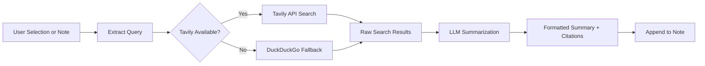

import TLDR from '@site/src/components/TLDR';

# تحقیق و جستجوی وب

<TLDR>
**Notemd جستجوی وب را انجام داده و نتایج خلاصه‌شده با LLM را مستقیماً در یادداشت‌های شما قرار می‌دهد.** Tavily API پشته جستجوی اصلی است؛ DuckDuckGo به عنوان گزینه جایگزین بدون پیکربندی عمل می‌کند. نتایج با منابع مرجع خلاصه شده و زیر یک عنوان `## Research` اضافه می‌شوند. این قابلیت حمایت از تحقیق در یک یادداشت، تحقیق در چندین پوشه به صورت دسته‌ای و انتخاب مدل برای مرحله خلاصه‌سازی بر حسب کار را فراهم می‌کند.

این بخشی از [Obsidian راهنمای مدیریت دانش هوش مصنوعی](/docs/pillar-ai-knowledge) است.
</TLDR>

## مرور کلی

تحقیق یکی از قدرتمندترین یکپارچه‌سازی‌های Notemd است: این ویژگی حلقه بین خواندن، جستجو و نوشتن را بسته می‌کند. به جای رفتن به مرورگر برای جستجوی یک اصطلاح ناآشنا، کافی است آن را برجسته کنید و اجازه دهید Notemd جستجو کرده، خلاصه‌سازی کند و یافته‌ها را – همگی درون صندوق امنیتی شما – اضافه کند.

این فرآیند کاملاً قابل پیکربندی است. شما می‌توانید ارائه‌دهنده جستجو، LLMی که خلاصه را می‌نویسد و اینکه آیا نتایج باید به یادداشت فعال اضافه شوند یا در فایل‌های جداگانه ذخیره شوند را انتخاب کنید. حالت دسته‌ای به شما امکان می‌دهد تا با یک کلیک بر روی تمام یادداشت‌های یک پوشه تحقیق کنید.

## نحوه کارکرد

### خط لوله جستجو سپس خلاصه‌سازی



1. **استخراج پرس‌وجو** -- Notemd عبارات جستجو را از انتخاب شما یا عنوان یادداشت استخراج می‌کند.
2. **جستجوی وب** -- ابتدا از Tavily استفاده می‌شود. اگر کلید API پیکربندی نشده باشد، DuckDuckGo به طور خودکار استفاده می‌شود (نیازی به کلید نیست).
3. **خلاصه‌سازی توسط LLM** -- نتایج خام جستجو به LLM پیکربندی‌شده ارسال شده و آن مقداری خلاصه مختصر با منابع مرجع درون‌متنی تولید می‌کند.
4. **اضافه کردن** -- خلاصه فرمت‌شده زیر یک عنوان `## Research` در یادداشت فعال اضافه می‌شود.

### Tavily در مقابل DuckDuckGo

| جنبه | Tavily | DuckDuckGo |
|--------|--------|------------|
| کلید API | ضروری (نسخه رایگان موجود است) | ضروری نیست |
| کیفیت نتیجه | بالاتر (ساخته‌شده به‌طور ویژه برای هوش مصنوعی) | مناسب برای پرس‌وجوهای عمومی |
| محدودیت‌های نرخ | سطح رایگان فراوان | تحت کنترل سرعت ارسال |
| پیکربندی | `tavilyApiKey` در تنظیمات | بدون پیکربندی – بازگشت خودکار |

### تحقیق در پوشه‌های دسته‌ای

روی یک پوشه راست‌کلیک کرده و **"Notemd: پوشه تحقیق"** را انتخاب کنید. هر فایل `.md` در آن پوشه به‌ترتیب (یا به‌صورت موازی تا حد همزمانی پیکربندی‌شده) پردازش می‌شود. هر یادداشت خلاصه تحقیق مخصوص به خود را دریافت می‌کند.

## پیکربندی

| تنظیمات | پیش‌فرض | اثر |
|---------|---------|--------|
| `tavilyApiKey` | `''` | کلید Tavily API. هنگامی که خالی باشد، فقط از DuckDuckGo استفاده می‌شود. |
| `researchProvider` / `researchModel` | DeepSeek | LLM برای هر وظیفه برای خلاصه‌سازی نتایج جستجو |
| `maxResearchContentTokens` | `4000` | بودجه توکن برای محتوای ارسالی به LLM. مقدار اضافی حذف می‌شود. |
| `researchAppendToNote` | `true` | خلاصه را به یادداشت منبع اضافه کنید. اگر مقدار آن false باشد، فایل جداگانه‌ای ایجاد می‌شود. |
| `researchLanguage` | `'en'` | زبان خروجی برای تحقیقات خلاصه‌شده |

### توصیه مدل برای هر وظیفه

تحقیقات از مدلی سود می‌برند که بتواند محتوای چندزبانه را پردازش کرده و متن‌های با ساختار مناسب تولید نماید. در نظر بگیرید:

- **DeepSeek** -- استاندارد، ارزان، کیفیت خوب
- **GPT-4o** -- خلاصه‌سازی با کیفیت بالاتر، هزینه بالاتر
- **Gemini Flash** -- سریع و ارزان، مناسب برای پرسش‌های ساده

## مثال

شما در حال مطالعه یک مقاله درباره *مکانیسم‌های توجه ترانسفورمر* هستید و با یک اصطلاح ناآشنا روبرو می‌شوید: *relative positional encoding*. به جای اینکه Obsidian را رها کنید:

1. **"relative positional encoding"** را برجسته کنید
2. راست‌کلیک کنید --> **"Notemd: تحقیق و خلاصه‌سازی"**
3. Notemd در اینترنت جستجو می‌کند، بهترین نتایج را خلاصه کرده و آن‌ها را اضافه می‌کند:

```markdown
## Research

### Relative Positional Encoding

Relative positional encoding is a method used in transformer models
where positional information is expressed as relative distances between
tokens rather than absolute positions. Introduced by Shaw et al. (2018),
it improves generalization to unseen sequence lengths compared to
absolute encodings (Vaswani et al., 2017).

Sources:
- [Shaw et al., Self-Attention with Relative Position Representations (2018)](https://arxiv.org/abs/1803.02155)
- [Transformer Positional Encoding Overview](https://example.com/transformer-pos-enc)
```

خلاصه اکنون بخشی از مخزن شماست، قابل جستجو، قابل لینک و در حالت آفلاین قابل دسترسی است.

## نکات

- **برای بهترین نتایج یک کلید Tavily تعیین کنید** -- حتی سطح رایگان نیز ربط بهتری نسبت به DuckDuckGo خام ارائه می‌دهد.
- **از یک مدل خلاصه‌سازی قوی استفاده کنید** -- مدل‌های ارزان ممکن است محتوای فنی ظریف را ساده کنند.
- **پس از مطالعه اولیه، تحقیقات را به صورت دسته‌ای انجام دهید** تا بتوانید همزمان شکاف‌های موجود در چندین یادداشت را پر کنید.
- **خلاصه‌های اضافه‌شده را بررسی کنید** -- LLMها ممکن است جزئیات منبع را تخیل کنند. ادعاهای کلیدی را بررسی نمایید.

---

## گام‌های بعدی

- [Concept Notes](./concept-notes) -- استخراج و ذخیره کردن اصطلاحات کلیدی از نتایج تحقیقات
- [Wiki-Links](./wiki-links) -- ایجاد لینک بین مفاهیم حاصل از تحقیقات در سراسر مخزن شما
- [Translation](./translation) -- ترجمه خلاصه‌های تحقیقات به زبان دیگر
- [ارائه‌دهندگان](/docs/providers/overview) -- پیکربندی مدل مورد استفاده برای خلاصه‌سازی
