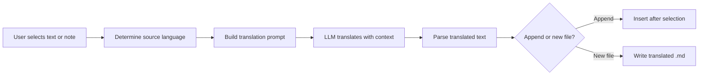

import TLDR from '@site/src/components/TLDR';

# ترجمه

<TLDR>
**Notemd متن را بین ۲۱ زبان و بیشتر با استفاده از ترجمه مبتنی بر LLM ترجمه می‌کند.** این ابزار از ترجمه بخش واحد، ترجمه کل یادداشت، و ترجمه پوشه‌های گروهی پشتیبانی می‌کند. هر کار ترجمه می‌تواند از طریق تنظیمات مربوط به خود، از یک ارائه‌دهنده و مدل مشخص استفاده کند. زبان خروجی را می‌توان مستقل از زبان UI تنظیم کرد. نتایج بسته به ترجیح شما یا در پایین متن اصلی اضافه می‌شوند یا در یک فایل جدید ذخیره می‌گردند.

این بخشی از [Obsidian راهنمای مدیریت دانش هوش مصنوعی](/docs/pillar-ai-knowledge) است.
</TLDR>

## مرور کلی

ترجمه در Notemd صرفاً جستجوی در فرهنگ لغت نیست – بلکه ترجمه‌ای مبتنی بر LLM و آگاه از زمینه است. مدل کل پاراگراف یا یادداشت را می‌بیند و لحن، اصطلاحات حوزه‌ای و ساختار جملات را حفظ می‌کند. این روش نتایج با کیفیت بالاتری نسبت به سرویس‌های ترجمه کلمه به کلمه، به‌ویژه برای متون فنی، آکادمیک و خلاقانه، ارائه می‌دهد.

این ویژگی سه حوزه را پشتیبانی می‌کند: بخش انتخاب‌شده، یادداشت فعال، و کل پوشه. با ترکیب انتخاب مدل برای هر کار، می‌توانید از یک مدل سریع (Gemini Flash) برای ترجمه‌های غیررسمی و یک مدل قدرتمند (Claude Sonnet) برای محتوای نیازمند ظرافت استفاده کنید – بدون اینکه ارائه‌دهنده کلی خود را تغییر دهید.

## نحوه کارکرد

### دستور ترجمه



1. **تشخیص منبع** -- LLM زبان منبع را از محتوا استنباط می‌کند. نیازی به مشخص کردن دستی آن نیست.
2. **ساخت پرامپت** -- Notemd پرامپتی را تهیه می‌کند که شامل زبان هدف، سرنخ اختیاری حوزه، و محتوایی است که باید ترجمه شود.
3. **ترجمه LLM** -- `translateProvider` / `translateModel` پیکربندی‌شده درخواست را پردازش می‌کند. مدل فرمت مارکداون، لینک‌های ویکی و بلوک‌های کد را حفظ می‌کند.
4. **خروجی** -- متن ترجمه‌شده یا در پایین متن اصلی اضافه می‌شود یا در یک فایل جدید در مخزن ذخیره می‌گردد.

### جفت‌های زبانی

Notemd از هر جفت زبانی که LLM پشتیبانی می‌کند، پشتیبانی می‌کند. جفت‌های رایج عبارتند از:

| منبع | هدف | کیفیت معمولی |
|--------|--------|----------------|
| انگلیسی | چینی (ساده) | عالی |
| چینی | انگلیسی | عالی |
| انگلیسی | ژاپنی | خیلی خوب |
| انگلیسی | آلمانی / فرانسوی / اسپانیایی | خیلی خوب |
| هر زبانی که پشتیبانی می‌شود | هر زبانی که پشتیبانی می‌شود | بسته به مدل |

تنظیم `translateLanguage` کنترل‌کننده **زبان خروجی** است. زبان منبع به‌طور خودکار تشخیص داده می‌شود.

### انتخاب مدل بر حسب وظیفه

کیفیت ترجمه بسته به مدل به‌طور قابل‌توجهی متفاوت است. Notemd به شما امکان می‌دهد مدل مخصوصی فقط برای ترجمه اختصاص دهید:

| مدل | سرعت | کیفیت | هزینه | مناسب برای |
|-------|-------|--------|------|----------|
| `gemini-2.0-flash-exp` | سریع | خوب | پایین | کاربرد غیرحرفه‌ای، حجم بالا |
| `gpt-4o-mini` | سریع | خوب | پایین | جستجوهای سریع |
| `deepseek-chat` | متوسط | خوب | بسیار پایین | برنامه‌های چندزبانه با بودجه کم |
| `claude-3-5-sonnet` | متوسط | عالی | متوسط | فنی / آکادمیک |
| `gpt-4o` | متوسط | عالی | متوسط | نثر حساس به ظرافت‌ها |

### ترجمه پوشه دسته‌ای

روی یک پوشه راست‌کلیک کرده و گزینه **"Notemd: Translate folder"** را انتخاب کنید تا تمام یادداشت‌های موجود در آن پوشه ترجمه شوند. هر فایل به‌طور مستقل پردازش می‌شود. تنظیم همزمانی کنترل می‌کند که چند فایل به‌طور همزمان ترجمه شوند.

## پیکربندی

| تنظیمات | پیش‌فرض | اثر |
|---------|---------|--------|
| `translateProvider` / `translateModel` | DeepSeek | ارائه‌دهنده ویژه برای وظایف ترجمه |
| `translateLanguage` | `'en'` | زبان خروجی مورد نظر |
| `translationAppendToNote` | `true` | متن ترجمه‌شده را در زیر متن اصلی اضافه کنید. اگر مقدار آن false باشد، فایل جدیدی ایجاد می‌شود. |
| `batchConcurrency` | `3` | تعداد فایل‌هایی که در حین ترجمه دسته‌ای به‌طور همزمان پردازش می‌شوند |

## مثال

شما در حال مطالعه یک یادداشت تحقیقاتی به زبان چینی هستید و می‌خواهید نسخه‌ای به زبان انگلیسی داشته باشید:

1. یادداشت را باز کنید
2. روی آن راست‌کلیک کرده و گزینه **"Notemd: Translate current file"** را انتخاب کنید
3. Notemd زبان چینی را تشخیص داده، آن را به زبان هدف تنظیم‌شده شما (انگلیسی) ترجمه کرده و متن ترجمه‌شده را اضافه می‌کند:

```markdown
## Translation (English)

The experimental results show that the proposed method achieves
a 12% improvement in F1 score compared to the baseline, primarily
due to the enhanced feature extraction module described in Section 3.
```

متن چینی اصلی بدون تغییر در بالای متن ترجمه قرار می‌گیرد. عنوان `## Translation` هر دو نسخه را در یک فایل نگه می‌دارد تا به‌راحتی قابل مراجعه باشند.

## نکات

- **برای ترجمه حجیم از Gemini Flash استفاده کنید** -- این گزینه سریع‌ترین و ارزان‌ترین روش برای ترجمه دسته‌ای پوشه‌های بزرگ است.
- **حفظ لینک‌های ویکی** -- دستور Notemd به LLM می‌گوید که `[[wiki-links]]` را در ترجمه دست‌نخورده نگه دارد. پس از ترجمه بررسی کنید، زیرا برخی مدل‌ها گاهی آن‌ها را باز می‌کنند.
- **زبان خروجی را به‌صورت صریح تنظیم کنید** -- تشخیص خودکار برای منبع کار می‌کند، اما همیشه `translateLanguage` را پیکربندی کنید تا درباره زبان هدف سردرگمی ایجاد نشود.
- **ترجمه دسته‌جمعی یادداشت‌های مفهومی** -- اگر پوشه مفاهیم شما به یک زبان است و نیاز به آن به زبان دیگری دارید، ترجمه در سطح پوشه آن را در یک مرحله انجام می‌دهد.

---

## گام‌های بعدی

- [تحقیق](./research) -- در هر زبانی جستجو و خلاصه‌سازی کنید، سپس نتایج را ترجمه کنید
- [فرآیندها](./workflows) -- ترجمه زنجیره‌ای همراه با لینک‌گذاری ویکی یا استخراج مفاهیم
- [پردازش دسته‌جمعی](/docs/advanced/batch-processing) -- رفتار همزمانی و پوشش فایل‌ها برای عملیات پوشه‌ها
- [LLM ارائه‌دهندگان](/docs/providers/overview) -- بهترین مدل را برای جفت زبان خود انتخاب کنید
