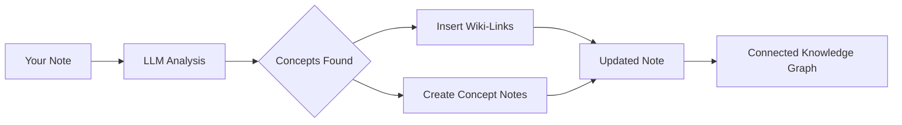

import TLDR from '@site/src/components/TLDR';

# وبلاگ-لینک‌ها

<TLDR>
**Notemd به‌طور خودکار `[[wiki-links]]` را به مفاهیم کلیدی در یادداشت‌های شما اضافه می‌کند.** LLM محتوای شما را می‌خواند، اصطلاحات مهم را در زمینه تشخیص می‌دهد و لینک‌های وبلاگ به سبک Obsidian را در هر بار ظهور آن‌ها قرار می‌دهد. به‌طور اختیاری فایل‌های یادداشت مفهومی با لینک‌های بازگشتی ایجاد می‌کند. از سرکوب مترادفات، حفظ یکپارچگی لینک‌ها در هنگام تغییر نام یا حذف، و حالت استخراج خالص (بدون تغییر فایل) پشتیبانی می‌کند. برخلاف Auto Link که فقط عناوین یادداشت‌های موجود را مطابقت می‌دهد، Notemd از هوش مصنوعی برای شناسایی مفاهیم جدید و ایجاد یادداشت‌های متناظر استفاده می‌کند. این بخشی از [Obsidian راهنمای مدیریت دانش هوش مصنوعی](/docs/pillar-ai-knowledge) است.
</TLDR>

## مرور کلی

لینک‌دهی وبلاگی ویژگی اصلی Notemd است. این ویژگی متن ساده را به یک گراف دانش متصل تبدیل می‌کند از طریق:

1. **تحلیل یادداشت شما** با استفاده از LLM
2. **شناسایی مفاهیم کلیدی** (اصطلاحات، افراد، روش‌ها، نظریه‌ها)
3. **قرار دادن `[[wiki-links]]`** در هر بار ظهور آن‌ها
4. **ایجاد یادداشت‌های مفهومی** (اختیاری) با لینک‌های بازگشتی

## نحوه کارکرد

### فرآیند



### مثال

**قبل از:**
```markdown
Machine learning models use neural networks to learn patterns from data.
The transformer architecture revolutionized natural language processing.
```

**پس از:**
```markdown
[[Machine learning]] models use [[neural networks]] to learn patterns from data.
The [[transformer architecture]] revolutionized [[natural language processing]].
```

## کاربرد

### ساده: افزودن لینک به یادداشت فعلی

1. باز کردن یک یادداشت
2. راست‌کلیک در ویرایشگر → **"فرآیند فایل (افزودن لینک)"**
3. چند ثانیه صبر کنید
4. مفاهیم اکنون به هم متصل شده‌اند!

### دسته‌بندی: پردازش چندین یادداشت

1. کلیک راست بر روی یک پوشه در File Explorer
2. گزینه **"Notemd: Process folder (add links)"** را انتخاب کنید
3. پیکربندی:
   - همزمانی (تعداد فایل‌های پاراللیل)
   - جایگزینی لینک‌های موجود (بله/خیر)
4. کلیک بر روی **پردازش**

### انتخابی: لینک کردن متن خاص

1. برجسته کردن متن برای پردازش
2. کلیک راست → **"پردازش انتخاب‌شده (افزودن لینک‌ها)"**
3. فقط بخش برجسته‌شده تحلیل می‌شود

## Notemd در مقایسه با Auto Link

Obsidian دو رویکرد برای لینک‌گذاری خودکار ویکی دارد:

| | **Auto Link** | **Notemd** |
|--|---------------|-------------|
| منبع لینک | عناوین یادداشت‌های موجود در Vault | مفاهیم شناسایی‌شده توسط LLM در محتوا |
| می‌توان مفاهیم جدید را پیوند داد | خیر — عنوان باید از قبل وجود داشته باشد | بله — هوش مصنوعی مفاهیم را شناسایی کرده و یادداشت‌ها را ایجاد می‌کند |
| مدیریت مترادفات | خیر | بله — سرکوب مترادفات |
| ایجاد یادداشت مفهوم | خیر | بله — همراه با پیوندهای معکوس و حذف تکرارها |
| پردازش دسته‌ای | خیر (فایل تکی) | بله (سطح پوشه) |
| مسیریابی مدل بر اساس هر وظیفه | خیر | بله |

**Auto Link** بر اساس مطابقت عنوان عمل می‌کند: اگر یادداشتی با نام "Machine Learning" وجود داشته باشد، ظهورهای آن را در `[[Machine Learning]]` قرار می‌دهد. اگر چنین یادداشتی وجود نداشته باشد، هیچ اتفاقی نمی‌افتد.

**Notemd** توسط هوش مصنوعی اداره می‌شود: LLM محتوای شما را می‌خواند، زمینه را درک می‌کند، مفاهیمی را که باید پیوند داده شوند شناسایی می‌کند — حتی اگر هنوز یادداشتی وجود نداشته باشد — و هم پیوند و هم یادداشت مفهوم را ایجاد می‌کند.

## ویژگی‌ها

### سرکوب مترادفات

**مشکل:** "transformer"، "transformers"، "Transformer architecture" → ۳ مفهوم جداگانه

**راه‌حل:** Notemd تکرارهای نزدیک را تشخیص داده و شکل استاندارد را استفاده می‌کند.

**پیکربندی:**
```
Settings → Advanced → Synonym Suppression
Threshold: 0.8 (0 = off, 1 = aggressive)
```

### صحت لینک‌ها

**هنگام تغییر نام یک یادداشت مفهومی:**
- تمام لینک‌های ویکی به‌طور خودکار به‌روزرسانی می‌شوند (Obsidian ویژگی اصلی)
- لینک‌های باز همانند قبل باقی می‌مانند

**هنگام حذف یک یادداشت مفهومی:**
- لینک‌ها باقی می‌مانند اما به‌عنوان "ارجاعات بدون لینک" نمایش داده می‌شوند
- می‌توانید آن را از هر جایی که وجود دارد دوباره ایجاد کنید

### حالت استخراج خالص

**استخراج مفاهیم بدون تغییر در فایل اصلی:**

1. کلیک راست → **"استخراج مفاهیم (بدون لینک‌سازی)"**
2. یادداشت‌های مفهومی ایجاد می‌شوند
3. فایل اصلی دست‌نخورده باقی می‌ماند

کاربرد: پردازش محتوای فقط خواندنی یا پیش‌نویس‌های نهایی.

## تولید یادداشت مفهومی

### ایجاد خودکار

**هنگام فعال بودن (پیش‌فرض)، Notemd ایجاد می‌کند:**

```markdown
---
tags: [concept, auto-generated]
created: 2026-06-13
source: [[Original Note Name]]
---

# Machine Learning

A branch of artificial intelligence that enables computers
to learn from data without explicit programming.

## Occurrences in Your Vault

- [[Original Note Name#Section]]
- [[Another Note#Header]]

## Related Concepts

- [[Neural Networks]]
- [[Deep Learning]]
- [[Supervised Learning]]
```

### پیکربندی

**پوشه خروجی:**
```
Settings → Output → Concept Folder
Default: concepts/
```

**ساختار سلسله‌مراتبی:**
```
Settings → Output → Use Hierarchical Folders
If enabled:
  papers/my-paper.md → papers/concepts/Concept.md
If disabled:
  → concepts/Concept.md
```

**الگو:**
```
Settings → Output → Concept Template
Customize with variables:
  {{concept}} — Concept name
  {{description}} — LLM-generated description
  {{backlinks}} — List of source notes
  {{date}} — Creation date
```

## گزینه‌های پیشرفته

### پنجره زمینه

**مقدار متن اطرافی که باید ارسال شود:**

```
Settings → Linking → Context Window
Options: Sentence | Paragraph | Full Note
Default: Paragraph
```

مقدار بیشتر = دقت بهتر، هزینه بالاتر.

### حداقل تکرارها

**فقط مفاهیمی را لینک کنید که چندین بار ظاهر می‌شوند:**

```
Settings → Linking → Min Occurrences
Default: 1 (link all)
```

به ۲ یا ۳ تنظیم کنید تا روی موضوعات تکراری تمرکز شود.

### الگوهای حذف شده

**کلمات خاصی را نادیده بگیرید:**

```
Settings → Linking → Exclude List
Example: note, idea, example, thing
```

جلوگیری از لینک کردن بیش از حد به اصطلاحات عمومی.

### پیشنهادهای سفارشی

**دستورالعمل‌های پیش‌فرض LLM را بازنویسی کنید:**

```
Settings → Advanced → Custom Linking Prompt
Default:
  "Identify key concepts, theories, methods, and technical
   terms in the following text. Return as a list..."
```

برای نیازهای خاص حوزه، تغییر دهید (مثلاً "روی اصطلاحات پزشکی تمرکز کنید").

## نکات و بهترین روش‌ها

### ✅ انجام دهید

- **یادداشت‌های فرآوری‌شده با بیش از ۱۰۰ کلمه** — یادداشت‌های کوتاه مفاهیم کمتری ارائه می‌دهند
- **از مدل‌های قدرتمند** برای شناسایی بهتر مفاهیم استفاده کنید (GPT-4o، Claude)
- **قبل از پذیرش بررسی کنید** — مطمئن شوید لینک‌های پیشنهادی منطقی هستند
- **به صورت تدریجی ساختار را توسعه دهید** — ۵ تا ۱۰ یادداشت را فرآوری کنید، نمودار را بررسی کرده و تنظیمات را اصلاح کنید

### ❌ انجام ندهید

- **لینک‌های زیاد ایجاد کنید** — هر اسم نیازی به لینک ندارد
- **پیش‌نویس‌ها را بارها فرآوری کنید** — مفاهیم ممکن است تغییر کنند، تا زمانی که پایدار شوند صبر کنید
- **سینونیم‌ها را نادیده بگیرید** — قابلیت سرکوب را فعال کنید تا از تفاوت «ML» و «Machine Learning» جلوگیری شود

## عملکرد

### سرعت

| اندازه یادداشت | GPT-4o-mini | Claude Sonnet | Ollama (محلی) |
|-----------|-------------|---------------|----------------|
| ۵۰۰ کلمه | ۲-۳ ثانیه | ۳-۵ ثانیه | ۵-۱۰ ثانیه |
| ۲۰۰۰ کلمه | ۵-۸ ثانیه | ۱۰-۱۵ ثانیه | ۲۰-۴۰ ثانیه |
| ۵۰۰۰+ کلمه | بلوکی (چندین فراخوانی) | بلوکی | بلوکی |

### تخمین هزینه

**مثال: یادداشت ۱۰۰۰ کلمه‌ای با GPT-4o-mini**
- ورودی: حدود ۱۵۰۰ توکن
- خروجی: حدود ۲۰۰ توکن
- هزینه: حدود ۰.۰۰۱ دلار

**پردازش دسته‌ای ۱۰۰ یادداشت:** حدود $0.10

## رفع اشکالات

### هیچ لینکی اضافه نشده است

**بررسی کنید:**
1. LLM فراخوانی موفقیت‌آمیز بود (تنظیمات → تشخیصات)
2. یادداشت حاوی محتوای کافی است (>50 کلمه)
3. مفاهیم فنی/خاص هستند (فقط ضمایر نیستند)

**امتحان کنید:**
- از یک مدل قدرتمندتر استفاده کنید
- پنجره زمینه را افزایش دهید
- صحت کلید API را بررسی کنید

### تعداد لینک‌ها بیش از حد است

**راه‌حل‌ها:**
1. تعداد حداقل تکرارها را افزایش دهید (۲ یا ۳)
2. کلمات رایج را به لیست مستثنی‌ها اضافه کنید
3. از یک مدل کمتر پرقدرت استفاده کنید

### مفاهیم اشتباهی به هم متصل شده‌اند

**رفع اشکالات:**
1. استفاده از پرامپت سفارشی برای تخصص دامنه
2. فعال‌سازی سرکوب مترادفات
3. بررسی دستی و جداسازی لینک‌ها

### شکستن لینک‌ها پس از تغییر نام

**این رفتار Obsidian، عادی است.**

برای به‌روزرسانی تمام لینک‌ها:
1. تغییر نام یادداشت مفهومی
2. Obsidian به‌طور خودکار `[[old]]` را به `[[new]]` به‌روزرسانی می‌کند

---

## گام‌های بعدی

- 📖 [یادداشت‌های مفهومی](./concept-notes) — بررسی عمیق درباره تولید یادداشت‌های مفهومی
- 🔍 [یکپارچه‌سازی تحقیقات](./research) — ترکیب لینک‌دهی با تحقیقات وب
- 🎨 [نمودارها](./diagrams) — نمایش گراف دانش خود
