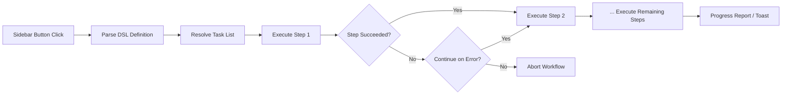

import TLDR from '@site/src/components/TLDR';

# فرآیندهای کاری

<TLDR>
**Notemd فرآیندهای کاری، چندین وظیفه را در یک عملیات یک‌کلیکی زنجیره‌ای می‌کنند.** می‌توانید توالی‌هایی مانند `add-links > extract-concepts > research > diagram` را با استفاده از یک DSL ساده تعریف کنید. فرآیندهای کاری به صورت دکمه‌هایی در نوار کناری ظاهر می‌شوند که کل زنجیره را بر روی یادداشت یا پوشه فعلی اجرا می‌کنند. این ابزار با فرآیندهای کاری از پیش تعریف‌شده ارائه می‌شود؛ شما می‌توانید فرآیندهای کاری سفارشی را در تنظیمات ایجاد کنید. هر مرحله از پیکربندی مدل مخصوص خود برای آن وظیفه استفاده می‌کند.

این بخشی از [Obsidian راهنمای مدیریت دانش هوش مصنوعی](/docs/pillar-ai-knowledge) است.
</TLDR>

## مرور کلی

یک فرآیند کاری، مشکلات ناشی از اجرای وظایف یکی پس از دیگری را از بین می‌برد. به جای کلیک راست چهار بار برای افزودن لینک، استخراج مفاهیم، جستجوی اصطلاحات ناآشنا و تولید نمودار، کافی است روی یک دکمه در نوار کناری کلیک کنید تا کل زنجیره اجرا شود. Notemd مسئولیت ترتیب‌بندی، انتقال خطاها و گزارش پیشرفت را بر عهده دارد.

فرآیندهای کاری در یک DSL سبک (زبان مخصوص حوزه) تعریف می‌شوند. آن‌ها در تنظیمات قرار دارند، به صورت دکمه‌های قابل کلیک در نوار کناری Obsidian ظاهر می‌شوند و می‌توان آن‌ها را هم بر روی یادداشت فعلی و هم بر روی یک پوشه کامل اعمال کرد.

## نحوه کارکرد

### خط لوله اجرای فرآیندهای کاری



1. **تجزیه** -- رشته DSL بر اساس `>` (یا `>`) به یک لیست مرتب از شناسه‌های وظایف تقسیم می‌شود.
2. **رفع** -- هر شناسه به یک دستور داخلی (add-links، extract-concepts، research، translate، diagram و غیره) متصل می‌شود.
3. **اجرا** -- مراحل به ترتیب اجرا می‌شوند. هر مرحله از ارائه‌دهنده و مدل مخصوص آن وظیفه استفاده می‌کند.
4. **مدیریت خطا** -- اگر یک مرحله شکست بخورد، فرآیند کاری یا متوقف می‌شود یا به مرحله بعدی ادامه می‌دهد، بسته به سیاست خطای شما.
5. **تمام شد** -- یک اعلان نوتیفیکیشن نمایش داده می‌شود که موفقیت را گزارش می‌کند یا لیستی از مراحل شکست‌خورده را نشان می‌دهد.

### فرمت DSL

فرآیندهای کاری به صورت توالی‌ای از شناسه‌های وظایف که با `>` از هم جدا شده‌اند، تعریف می‌شوند:

```
process-current-add-links>extract-concepts-current>research-and-summarize
```

**شناسه‌های وظیفه موجود:**

| شناسه | عملیات |
|------------|--------|
| `process-current-add-links` | افزودن لینک‌های ویکی به یادداشت فعال |
| `extract-concepts-current` | استخراج مفاهیم از یادداشت فعال |
| `research-and-summarize` | تحقیق درباره متن یا عنوان یادداشت انتخاب‌شده |
| `process-current-translate` | ترجمه یادداشت فعال |
| `summarize-to-mermaid` | تولید نمودار از یادداشت فعال |
| `generate-from-title` | تولید محتوا از عنوان یادداشت |
| `extract-original-text` | استخراج متن اصلی (برای OCR/محتوای اسکن‌شده) |

**گزینه‌های سطح پوشه**: `current` را در نام شناسه با `folder` جایگزین کنید.

### فرآیندهای کاری از پیش تعریف‌شده در مقابل فرآیندهای کاری سفارشی

Notemd همراه با فرآیندهای کاری آماده برای الگوهای رایج ارائه می‌شود:

| فرآیند کاری | زنجیره | کاربرد |
|----------|-------|----------|
| **استخراج یک‌کلیکی** | افزودن لینک‌ها > استخراج مفاهیم > تحقیق | پردازش یک مقاله تحقیقاتی در یک مرحله |
| **خط تولید کامل** | add-links > extract-concepts > research > diagram | استخراج کامل دانش همراه با نمایش گرافیکی |
| **ترجمه + لینک** | translate > add-links | ترجمه سپس ایجاد لینک برای مفاهیم به زبان هدف |

**فرآیندهای کاری سفارشی** در تنظیمات ایجاد می‌شوند:

1. باز کردن **Settings** --> **Notemd** --> **Workflows**
2. کلیک بر روی **"Add Workflow"**
3. وارد کردن زنجیره DSL (مثلاً `process-current-add-links>extract-concepts-current`)
4. تعیین نام نمایشی برای آن (مثلاً "Quick Link + Extract")
5. دکمه جدید بلافاصله در نوار کناری ظاهر می‌شود

## پیکربندی

| تنظیمات | پیش‌فرض | اثر |
|---------|---------|--------|
| `workflows` | مجموعه از پیش تعریف شده | مجموعه‌ای از تعریف‌های فرآیند کاری (نام + DSL) |
| `workflowContinueOnError` | `true` | در صورت شکست گام فعلی، به مرحله بعدی رفتن |
| `workflowShowProgress` | `true` | نمایش پیام پیشرفت پس از تکمیل هر مرحله |

### مدل‌های مخصوص هر وظیفه در فرآیندهای کاری

هر مرحله در یک فرآیند کاری از پیکربندی مدل ویژه خود برای هر وظیفه استفاده می‌کند. نیازی نیست مدل‌ها را مستقیماً در DSL مشخص کنید. ترتیب حل مسئله به این صورت است:

1. اگر `useMultiModelSettings` وجود داشته باشد، از ارائه‌دهنده/مدل مربوط به هر وظیفه استفاده می‌شود
2. در غیر این صورت، از `activeProvider` جهانی استفاده می‌گردد

این بدان معناست که `add-links` می‌تواند روی DeepSeek اجرا شود در حالی که `research` روی GPT-4o اجرا می‌شود – همه این‌ها در یک فرآیند کاری واحد انجام می‌گیرد.

## مثال

شما به تازگی یک PDF مربوط به مقاله یادگیری ماشین را وارد خزانه خود کرده‌اید و می‌خواهید استخراج کامل دانش انجام شود:

1. نوت وارد شده را باز کنید
2. روی دکمه سمتی **"Full Pipeline"** کلیک کنید
3. Notemd اجرا می‌شود:
   - **مرحله ۱**: افزودن لینک‌های ویکی – `[[attention mechanism]]`، `[[transformer]]` و غیره.
   - **مرحله ۲**: استخراج مفاهیم – ایجاد نوت‌های مفهومی در پوشه مفاهیم شما
   - **مرحله ۳**: تحقیق – خلاصه کردن منابع وب برای کلمات کلیدی
   - **مرحله ۴**: نمودارسازی – تولید یک نقشه ذهنی Mermaid از ساختار مقاله
4. پس از حدود ۳۰ ثانیه، نوت شما دارای لینک‌ها خواهد بود، نوت‌های مفهومی ایجاد شده‌اند، تحقیقات اضافه شده‌اند و یک فایل نمودار ذخیره می‌شود

همه این‌ها با یک کلیک انجام می‌گیرد.

## نکات

- **از فرآیندهای کاری از پیش تعریف‌شده شروع کنید** – آن‌ها رایج‌ترین الگوها را پوشش می‌دهند. تنها زمانی سفارشی‌سازی کنید که به ترتیب متفاوتی نیاز داشته باشید.
- **`workflowContinueOnError` را فعال کنید** – شکست در یک مرحله نمودارسازی نباید کل پایپ‌لاین را متوقف کند.
- **از فرآیندهای کاری پوشه‌ها** برای پردازش انبوه استفاده کنید -- روی یک پوشه کلیک راست کنید، یک فرآیند کاری انتخاب کنید و تمام یادداشت‌ها پردازش خواهند شد.
- **نام فرآیندهای کاری را واضح بگذارید** -- فضای نوار کناری محدود است. از نام‌های کوتاه و مبتنی بر عمل مانند "Quick Extract" یا "Translate + Link" استفاده کنید.

---

## گام‌های بعدی

- [Research](./research) -- قبل از افزودن آن به فرآیندهای کاری، نحوه عملکرد مرحله تحقیق را درک کنید
- [Wiki-Links](./wiki-links) -- ویژگی اصلی پیوند‌زنی که در اکثر فرآیندهای کاری استفاده می‌شود
- [Concept Notes](./concept-notes) -- استخراج مفاهیم به عنوان یک مرحله در فرآیند کاری
- [Batch Processing](/docs/advanced/batch-processing) -- همزمانی و گزارش پیشرفت برای فرآیندهای کاری پوشه‌ها
